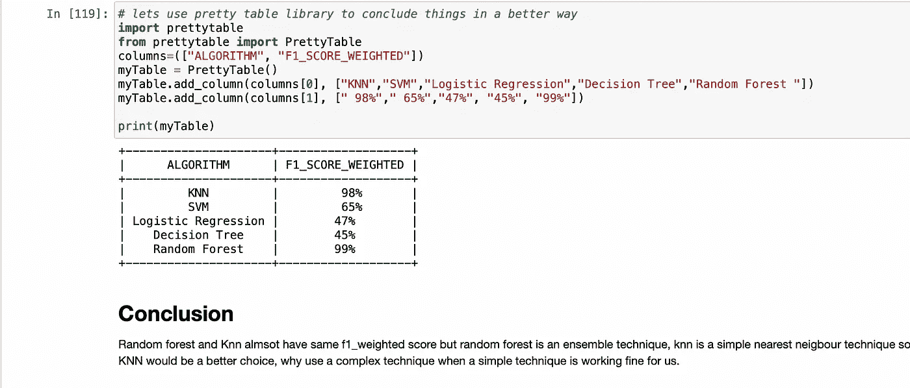

# 我做过的最好的机器学习案例研究(针对盲人和聋人)

> 原文：<https://medium.com/analytics-vidhya/hand-gesture-recognition-for-deaf-mute-people-using-leap-motion-sensor-1d4fda415d76?source=collection_archive---------3----------------------->

机器学习案例研究…

当我们无法与我们的同伴互动时，这是一个非常困难的世界。想象一下聋哑人的世界，他们在交流方面比我们面临更多的挑战，他们肯定会使用手语，但我们中有多少人对手语了如指掌。因此，我们认识到了这个问题，并想使交互变得更容易。我们正在使用 Leap Motion 控制器进行手势识别，为此我们创建了一个机器学习模型，它将检测手势，并进一步告诉那些不知道手语的人，从而使交互变得更容易。

随着计算机在日常生活中的应用越来越多，人机交互在当今世界中扮演着重要的角色。人机交互旨在使人机交互更自然，就像人与人之间的交互一样。手势能够使用手势识别系统能够识别的不同手形来表示想法和动作。

对于许多听力受损的人来说，手语是主要的交互方式，这些手势可以分为手动和非手动手势。手动手势是那些只考虑手部动作的手势，而非手动手势是那些包括面部表情和嘴唇运动等其他特征的手势。我们的模型中使用的手势是手动手势。

我们已经使用了手势识别的基本字母。这些字母被归类为手势。在 Leap 运动控制器的帮助下收集数据，然后分离用于训练和测试目的。然后将这些反馈给 ML 模型，以在测试中给出期望的输出。

Leap Motion 控制器是 Leap Motion 为手势交互开发的新设备。

该项目是为了帮助聋哑人，这项工作是通过在 python 中实现 LMC 和运行库开始的。然后，我们优化数据收集的代码，数据收集完成。数据采集后，进行数据处理和特征提取。然后，我们将这些特性用于我们的 ML 模型。模型的训练和进一步测试已经完成，然后与我们的应用模型集成。

## **文献调查**

这个项目工作有许多不同的方面，因为我在互联网上找到了手势识别的不同方式，我进一步研究了使用哪种传感器和算法。我查阅了不同的研究论文，发现 LMC 是最合适的。

Leap Motion 传感器或控制器是一种小型、有前途且高度精确的设备，可与 PC 或 mac 连接，使用户能够通过手部动作操纵数字对象。它还用于用户友好的手势识别服务。它与其他硬件配合使用，可以提供更准确、更稳定的结果。在此之前，几乎所有与计算机程序的交互都需要人手和数字环境之间的中间步骤(鼠标、键盘等)。Leap Motion 控制器是弥合这一差距的一大步，并允许人类以类似于操纵现实世界的方式操纵计算机程序。

Leap motion 传感器的一些应用是基于手势的计算，允许用户玩游戏，它可以用于创建设计。

LMC 使用红外扫描仪和传感器来绘制和跟踪人手，这些信息被用来实时创建一个可以操作数字对象的手的数字版本。LMC 只使用专门为它编写的程序。

LMC 是一种计算机硬件传感器设备，支持手和手指运动作为输入，如键盘或鼠标，不需要手接触或触摸。

这个项目的大部分工作受到了 B. P .帕拉德普·库马尔(印度贾因大学儿童早教系)和 M. B .曼朱那塔(印度技术研究院儿童早教系)的精彩研究论文的启发

[使用 Leap Motion Controller 进行手势识别…http://ipco-co . com PET _ Journal Acecs-2016](https://www.google.com/url?sa=t&rct=j&q=&esrc=s&source=web&cd=&cad=rja&uact=8&ved=2ahUKEwiw5ITXybzyAhWCwosBHaaCCaIQFnoECBAQAQ&url=http%3A%2F%2Fipco-co.com%2FPET_Journal%2FAcecs-2016%2F39.pdf&usg=AOvVaw1R_P-Ki1ltRTfkyhzjZnuq)

在这篇论文中，他们使用了各种算法，如 KNN(K 近邻)和 SVM(支持向量机)，决策树。

## 商业问题

商业问题很简单，

比方说，我拥有一家麦当劳店或多米诺店，一直很忙，现在有一天，一对沉默的夫妇来到我的商店，试图下单，但柜台的工作人员不懂他们的语言，请注意，商店很忙，人们在点餐时非常不耐烦。我的员工不能在一个顾客身上花太多时间，所以他/她让这对沉默的夫妇等一会儿。

现在对于周围的每个人来说，这不是一个大问题，但对于这对夫妇来说，这可能是非常尴尬的。作为一个店主，我不想给顾客不好的体验，所以我决定考虑这个问题。

一个解决办法是对每一个员工进行手语培训，这可能非常昂贵且不切实际。

另一个解决方案是增加自助点餐机，比如 ATM 机，任何人都可以通过机器简单地下单并拿走他们的食物，这可能是一个好的解决方案，但我作为一个业主想给这些顾客一个特殊的待遇。

另一个解决方案是给商店添加一个机器学习系统，它可以理解手语，并可以将手语翻译成英语/印地语给员工，这将给人们一个特殊的待遇，也可以给其他顾客带来乐趣，特别是孩子。

## 限制

1.低延迟(在几纳秒内实时地，模型应该将手语翻译成英语)

2.对于聋哑人来说，错误可能会更尴尬，这可能会影响品牌价值。

## 机器学习公式

这是一个非常简单的多类分类问题，我们有 26 个类(从 A 到 Z)

## 数据

Leap Motion 传感器为每个字母表手动生成数据，总共从传感器中提取了 26000 行，每五行代表一个字母表实例，因此每个字母表有 200 行。

## 绩效指标

现在，这是一个多类分类问题，我们需要高精度和高召回率，因此 F1 分数将是一个很好的指标，我们在数据中没有任何不平衡，因此 F1_weighted 将很好地工作。

另一个度量可以是多类对数损失。

## **数据收集**

LMC 连接到 python 来提取用于训练我们模型的值，为了将 LMC 与 python 连接起来，我们使用了 LEAP。LMC API 给出的 PY 文件。我们从 Leap 提供的文件夹中导入 Leap.py 文件。

leap.py 中的代码显示了使用的不同库，如圆圈手势、按键手势和滑动手势。我已经考虑到了手指的名字，每根手指上的骨头以及它们的起点和终点。在每一帧中，LMC 给我们每个手指的位置值，它是远端骨骼坐标，手掌宽度，手掌位置和手掌半径，如图所示。

我已经使用印度手语生成了图中所示的数据。

我收集了每手牌的以下数值:

1.  手掌位置
2.  球体位置
3.  手指位置
4.  每个手指的远端骨骼坐标。

下图显示了为字母“A”收集的数据。这些数据将在机器学习模型的后续步骤中形成。

## **数据预处理/特征提取**

现在，对于一个字母表，假设“A ”,我们在数据中有五行，我们必须将这五行转换为一行，因为这五行告诉我们一个事件，当 LEAP 为我们提供一个字母表(这里是 A)的 5 个手指的坐标时。对于每个手指，我们有不同的数值(参考上图)。我已经手动标记了数据。

在原始数据中，我们有 26000 个值，每 5 个值代表 1 个字母表，所以这意味着每个字母表总共有 200 个值。

Leap motion 返回一组相关的手部点和一些手部姿势特征。提取的关键点是来自输入手势的手指位置的坐标。这些点是，每只手的手掌中心(比如 A)，拇指尖(比如 B)，食指(比如 C)，中指(比如 D)，无名指(比如 E)，小指(比如 F)。每只手的坐标是 A(x1，y1，z1)，B(x2，y2，z2)，c(x3，y3，z3)，D(x4，y4，z4)，E(x5，y5，z5)，F(x6，y6，z6)。

提取的第一个特征是欧几里德距离，每个手势对应的特征点存储在数据库文件中。在测试期间，捕捉当前手势，并从该手势中提取关键点。在运行时，使用欧几里德距离公式从提取的特征点计算距离，如下所示:

di=(((xi-(xi+1)) +(伊-(伊+1)) +((子-(子+1)) )^(1/2)

其中，对于单手手势，i=1 到 8。

**从手掌到指尖的距离会形成一种特征**

d1(手掌中心到拇指尖的距离)

d2(手掌到食指尖端的距离)

d3(手掌到中指指尖的距离)

d4(无名指到中指的距离)

d5(中指到食指的距离)

**手指之间的距离会形成额外的特征**

d6(小指到无名指的距离)

d7(无名指到中指的距离)

d8(中指到食指的距离)

**提取的第三种特征是两个手指间的余弦角**

小指和无名指之间的余弦角

无名指和中指之间的余弦角

COSMI(中指和食指之间的余弦角)

COSIT(食指和拇指之间的余弦角)

我从原始数据中总共提取了 12 个特征(d1，d2，d3，d4，d5，d6，d7，d8，d9，cospr，cosrm，cosmi，cosit)。我用这 12 个特征做了一个新的数据框，叫做“BBV.csv”。

提取特征后的数据帧

## **数据分析**

数据分析是理解数据非常重要的一步，我做过单变量数据和双变量数据的数据分析。

很难把所有的东西都放在一个博客里，所以要看详细的数据分析请参考

 [## 手势识别/使用 Leap 运动传感器的手势识别。ipynb at main …

### 在 GitHub 上创建一个帐户，为 nishesh 2115/手势识别开发做出贡献。

github.com](https://github.com/Nishesh2115/Hand-Gesture-Recognition/blob/main/Hand%20Gesture%20Recognition%20Using%20Leap%20Motion%20Sensor.ipynb) 

## **不同特征之间的相关性**

正如我们所看到的，很少有功能是相互关联的，所以我们现在不必删除任何功能。

## 降维

这是非常重要的一步，因为我们在这里使用的是距离度量，我们知道维数灾难是这样的:

给定一个感兴趣的观察值，找到它的最近邻居(从某种意义上说，这些是与查询点距离最小的点)。但是在高维空间中，一个奇怪的现象出现了:最近点和最远点之间的比率接近 1，也就是说，这些点彼此之间的距离基本上是一致的。这种现象在各种距离度量中都可以观察到，但是欧几里得度量比曼哈顿距离度量更明显。最近邻搜索的前提是“更近”的点比“更远”的点更相关，但是如果所有点基本上是均匀分布的”

降维是在低维中可视化数据的一种非常好的技术。

在这个项目中，我主要会用到两种技术

1.  PCA(代表主成分分析)这个想法很简单，我们想找到方向 f '使得 xi 在 f '上的投影方差最大，这里 xi 的是数据点。
2.  T-sne 是一个复杂的想法，但直觉上它试图将高维点嵌入到低维中，这样就很容易将它们可视化。TSNE 代表 t 分布随机邻域嵌入。

## 主成分分析

有关代码，请参考:

 [## GitHub-nishesh 2115/手势识别

### 在 GitHub 上创建一个帐户，为 nishesh 2115/手势识别开发做出贡献。

github.com](https://github.com/Nishesh2115/Hand-Gesture-Recognition) 

# 主成分分析观察

1.  当我们有如此接近的手势时，给出 26 个不同的聚类不是很容易的。
2.  我们可以看到一些清晰的字母群，这意味着不同字母的手势很容易区分。

## TSNE

有关代码，请参考以下内容

 [## 手势识别/使用 Leap 运动传感器的手势识别。ipynb at main …

### 在 GitHub 上创建一个帐户，为 nishesh 2115/手势识别开发做出贡献。

github.com](https://github.com/Nishesh2115/Hand-Gesture-Recognition/blob/main/Hand%20Gesture%20Recognition%20Using%20Leap%20Motion%20Sensor.ipynb) 

# SNE 霸王龙的观察

1.想象 2D 的 26 个班级有点复杂和困难，但是 TSNE 做得很好，如果不是很棒的话。

2.我使用了不同困惑和不同的迭代次数，得出了上面的结论，因为在这之后它没有太大的变化。

3.现在我们没有一个清晰的图像，但我们可以看到一些集群，这是非常可理解的，因为一些手势真的很近。

## 模型训练、评估和超参数调整

我们已经尝试了各种算法，如 SVM、KNN、逻辑回归、随机森林，并选择了为我们提供最佳性能指标的算法进行部署。

 [## GitHub-nishesh 2115/手势识别

### 在 GitHub 上创建一个帐户，为 nishesh 2115/手势识别开发做出贡献。

github.com](https://github.com/Nishesh2115/Hand-Gesture-Recognition) 

请参考这个以获得更多的理解…

## 未来范围/结论

这个项目给了我一种帮助聋哑人的方法，并为他们提供帮助，项目工作由几个标题组成，如数据收集，其中我们收集了每个字母的数据集，给了我们大约 5 个不同的值，如手掌半径，手掌位置和每个手指的指尖位置。

然后对该数据集进行预处理和特征提取，下一步是训练和测试 ML 模型。

KNN 给了我们最好的 f1 分数，因此随机森林可以用于在任何硬件上部署。

该模型可进一步用于各种应用中。应用之一可以是在各种旅馆和餐馆中使用该模型。由于并非所有的服务员都熟悉聋哑人使用的手语，因此聋哑人可以帮助服务员理解他们的命令。

## 感谢阅读…

# 尼舍什·戈吉亚

*   ***如果你喜欢这个，*** [***跟我来这里***](/@nishesh.kumar) ***了解更多***
*   ***有兴趣合作吗？下面我们连线上***[***insta gram***](https://www.instagram.com/nishesh_gogia/)