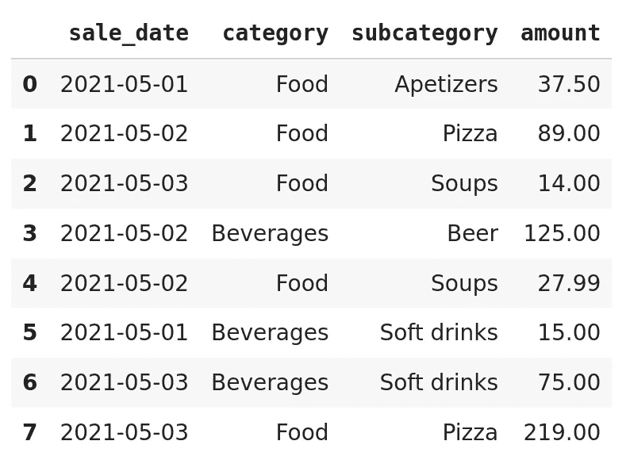
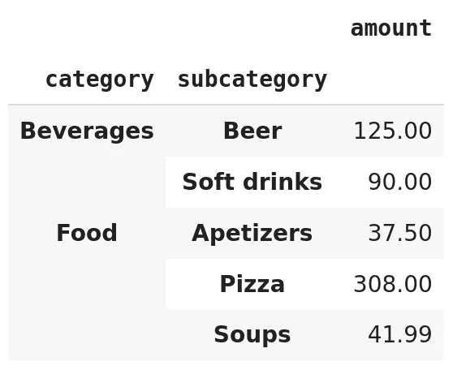
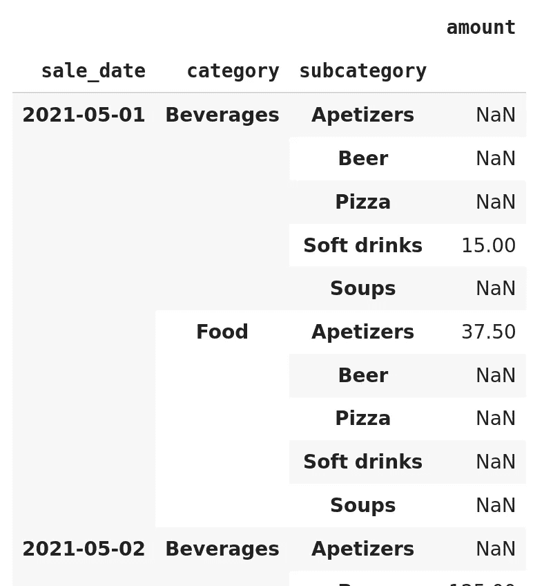
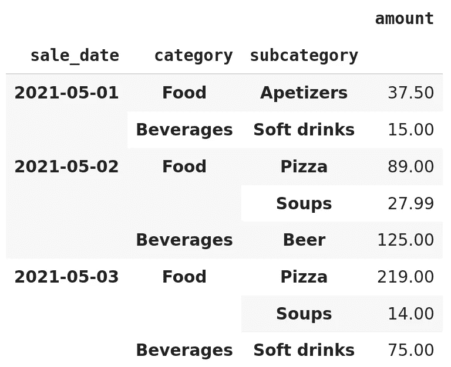

# 处理熊猫的类别

> 原文：<https://medium.com/analytics-vidhya/handling-categories-with-pandas-bfe7d28b2f91?source=collection_archive---------8----------------------->

在处理 pandas 数据帧时，迟早会遇到默认类型处理的问题。当然，通过*加载所有数据非常方便。read_csv* 方法，然后毫不费力地实现分析数据集所需的所有逻辑。不幸的是，这很少那么容易。如果您使用太大的数据类型，例如每个整数都使用 int64，即使这些值来自一个非常窄的值范围，您的数据框也可能增长到不再适合您的内存的大小。信不信由你，一开始你可能会为处理如此大的数据而自豪，但你需要执行的转换越多，就会越痛苦。


[摄](https://unsplash.com/@idonothingbutlove?utm_source=medium&utm_medium=referral) [Unsplash](https://unsplash.com?utm_source=medium&utm_medium=referral) 上的我除了爱什么都不做

当然，我们的大多数特征可能是文本的或数字的——int 或 float-like，但是在一些特定的领域中，分类数据扮演着最重要的角色。想象一下在电子商务世界工作。你卖的每个产品都属于一个类别，甚至是几个类别。如果你卖衣服，你可以用尺码(XS-XXL)、颜色或面料来描述它们。这种特征可能有特定的顺序，比如大小，但不一定。数学运算，如减法和比较对他们来说没有任何意义。将这些值保存为字符串并不是最好的主意，因为这会产生巨大的内存开销。在内部，分类值存储为整数，在数字和相应的文本表示之间有一个额外的映射，这使得它们处理起来非常强大和有效。

Pandas 允许使用*轻松地将选定的列转换成类别。在数据帧上调用了 astype* 方法。然而，分类变量的使用也有一些不同，在开始使用它们之前你最好了解一下。让我们坚持电子商务，考虑一个非常简单的例子。

# 餐馆销售

假设我们有一个很短的餐馆销售历史。它提供食物和饮料，并想总结不同类别的每日销售额。

```
import pandas as pd
import numpy as np
```

一旦我们加载了所有的库，我们就可以尝试加载数据集，看看里面有什么。

```
sales = pd.read_csv("sales.csv")
sales
```



sales.csv 文件的内容

每个表格中只有几行汇总了销售额:

*   日期
*   主要类别
*   次要类别

这是一个非常简单的结构，但允许分析几个有趣的统计数据，如每个主要类别的总销售额:

```
sales.groupby(["category"]).sum()
```


每个主要类别的总销售额

如果我们想要的是总销售额，但是是在第二个类别级别上呢？这也很简单。

```
sales.groupby(["category", "subcategory"]).sum()
```



子类别级别的总销售额

我们可以更进一步，分别汇总每个日期、主要类别和次要类别的销售额。

```
sales.groupby(["sale_date", "category", "subcategory"]).sum()
```


每个日期的总销售额，主要和次要类别

我们做到了！我们有一个二级分类级别的每日销售汇总。这并不复杂，但我们的数据框中只有几行。如果我们有数百万笔交易，事情可能会变得更加困难。当您考虑进行一些优化来节省内存和时间时，这通常是一个转折点。

## 熊猫的分类数据

将数据类型转换为分类数据就像调用一个方法一样简单。我们将把列:**类别**和**子类别**转换为类别类型，并将新的数据框赋给另一个变量。

```
cat_sales = sales.astype({"category": "category",
                          "subcategory": "category"})
cat_sales
```


相同的数据框架，但是使用了分类变量

似乎转换并没有改变我们的数据框架。它仍然以和以前完全一样的方式显示。然而，在幕后，数据以不同的方式存储，随着数据集规模的增长，我们将从中受益。那么，让我们在次级类别级别上计算每日销售额，这样我们就可以确保没有任何真正的变化。

```
cat_sales.groupby(["sale_date", "category", "subcategory"]).sum()
```



包含分类变量的每日销售额计算的一部分

刚刚到底发生了什么？我们只是将变量转换成类别，但是代码似乎以完全不同的方式工作。甚至为不存在的组计算统计数据。主要类别*的饮料*和次要类别*的披萨没有任何销售。老实说，这没有多大意义，因为披萨不应该作为饮料出售(除非你用它来做奶昔，但这种情况很少见)。令人惊讶的是，我们的报告开始显示这样一个值设置为 *NaN* 的行。事实证明，pandas 以不同的方式处理类别，我们需要稍微修改我们的代码，以实现与以前相同的结果。*

```
cat_sales \
    .groupby(["sale_date", "category", "subcategory"],
             **observed=True**) \
    .sum()
```



中使用 observed=True 的影响。groupby 方法调用

以与文本属性相同的方式处理分类属性，需要在*中将*观察到的*参数明确设置为**真**。groupby* 方法调用。否则，pandas 将生成用于分组的所有可用分类变量的叉积。这意味着，如果我们有 3 个不同类型的变量，每个变量有 10 个不同的值，那么每个输出组可能会有 10 行。你可能喜欢或不喜欢这种行为，但请注意这种情况可能会发生。特别是，如果你在分组时遇到意外的*内存错误*。你确定你已经很久没有使用类别了，而是在不知不觉中？

使用类别当然是有益的，但是为了确保你得到你想要的，你可以考虑在*的每个调用中设置 *observed=True* 。groupby* 方法。对于其他数据类型来说，它不会改变任何东西，所以您总是会获得预期的结果。然而，如果你真的想有你的类别的叉积，你仍然可以这样做。但是请明确一点！你的同事和未来的你会非常感激的！