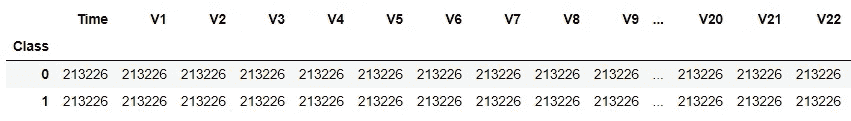
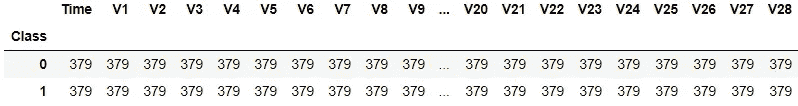
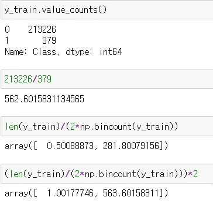
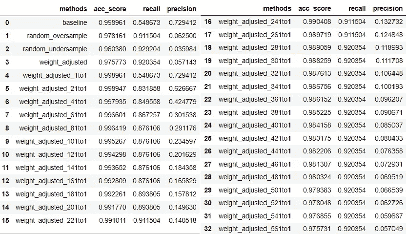
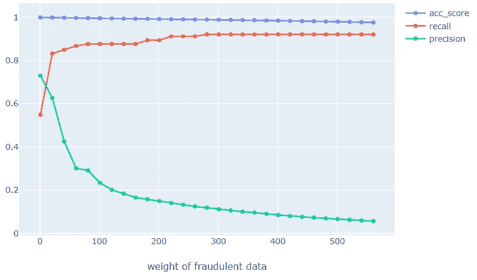

# 机器学习分类器中不平衡类的处理

> 原文：<https://medium.com/analytics-vidhya/handling-imbalanced-class-in-machine-learning-classifiers-1b5c528f427f?source=collection_archive---------4----------------------->

照片由[阿齐兹·阿查基](https://unsplash.com/@acharki95?utm_source=unsplash&utm_medium=referral&utm_content=creditCopyText)在 [Unsplash](/s/photos/balance?utm_source=unsplash&utm_medium=referral&utm_content=creditCopyText) 上拍摄

很多人可能已经了解到，当类别不平衡时，他们需要使用性能指标，如召回率、精确度、f1 分数或标准准确度度量的 ROC 曲线。

我不确定是否只是我，但是我不知道不平衡数据的 know 训练会影响模型性能。在研究来自 [YouTube](https://www.youtube.com/watch?v=mUueSPmcOBc) (@4:10)的深度学习概念时，它告诉我，不平衡的类标签会影响模型的训练方式，最好的方法是对较少的类进行过采样。

这让我想到“机器学习算法呢？为什么我从来没有尝试平衡阶级标签？”

经过一些研究，我发现不平衡的类标签也会影响 ML 模型，有多种技术可以解决这个问题。今天我将解释和实验，看看在训练时处理不平衡的类标签是否真的改善了我们的 ML 模型。

以下是我们今天要讨论的一些不同的技术:

1.  过采样
2.  欠采样
3.  调整类别权重

我们将使用 Kaggle 提供的[信用卡欺诈检测](https://www.kaggle.com/mlg-ulb/creditcardfraud/home)数据。

让我们加载依赖项和数据，然后将数据分成训练集和测试集。

我们的数据集高度不平衡，包括

*   284315 正常交易(类= 0)
*   492 宗欺诈交易(类别= 1)

大约是 577:1 的比例。

现在我们将创建`result_df`来存储和跟踪不同技术的性能，稍后将用于比较。

还将创建两个函数:

1.  使用给定的 X_train，y_train 训练逻辑回归并在新看到的 X_test 数据上输出预测标签的函数
2.  用于过采样、欠采样

使用上述函数，我们将使用基线逻辑回归模型，随机过采样数据和随机欠采样数据进行预测。所有的表演都将存储在`result_df`中。

接下来，我们将随机对数据进行过采样，因此正常交易和欺诈交易的比例为 1:1。

**过采样**是指从少数类中随机选择数据进行替换，直到少数类的数量与多数类的数量相同。

下面，我们可以确认正常交易和欺诈交易确实有相同数量的数据。

使用上述过采样数据集，我们将使用逻辑回归对交易进行分类，并将其性能存储在`result_df`中。

**欠采样**是指从多数类中随机选取 len(minority_class)。

我们可以看到比率为 1:1，但是这次我们截断了正常交易数据的数量。

使用上述欠采样数据集，让我们使用逻辑回归进行预测，并存储其性能。

sklearn 为其分类器算法提供了`class_weight`参数，而不是编写多行代码来进行过采样或欠采样。

你可以通过一个字典来显示每一个等级的权重，或者通过使用`n_sample / (n_classes * np.bincount(y)`来自动调整权重。

它的默认值是`None`，表示每个类的权重为 1。在我们的例子中，它假设正常交易和欺诈交易的比例为 1:1。

在我们继续之前，我只想检查一下传入“balanced”是否真的很好地调整了权重。

在我们的训练数据集中，正常数据与欺诈数据的比率为 231226:379，大约为 562.6 : 1。

使用`n_sample/(n_classes*np.bincount(y)`我们得到 0.5:281，大约是 1:563，因此我们现在可以信任 sklearn。

怀疑够了，让我们将欺诈数据的权重增加 20，直到它达到 562，这样我们就可以看到当类别不平衡得到调整时性能会发生什么变化。

是时候看看我们储存在`result_df`中的所有东西了。

请注意`baseline = weight_adjusted_1to1`和`weight_adjusted = weight_adjusted_563to1`(在我们的例子中是 561，但你得到了要点)。

现在，让我们想象一下，当不平衡的训练数据达到平衡时，逻辑回归模型会发生什么。

随着不平衡的数据变得平衡，我们可以看到以下三种情况:

1.  **召回增加**
2.  **精度下降**
3.  **精度下降**

总之，在训练前调整不平衡似乎不是所有问题的最终答案，但是通过查看我们的结果，我们可以看到，如果我们的目标是提高**回忆，平衡不平衡的数据将是有益的。**

理解为什么调整不平衡的数据会提高召回率但降低精确度是很重要的，我需要做更多的研究并在我写之前自己测试它，我很快就会写了(希望如此)。现在你可以看看这里的，这是一个高层次的解释。

还有其他调整不平衡数据集的技术，一种非常流行的技术是 **SMOTE(合成少数过采样技术)**，这是一种过采样技术，但是它通过从少数类创建新的、看不见的数据来进行过采样。

感谢阅读，如有误传，请评论:)

参考资料:

*   https://www.youtube.com/watch?v=mUueSPmcOBc@ 4:10
*   [卷积神经网络中类不平衡问题的系统研究](https://arxiv.org/abs/1710.05381)
*   [机器学习中处理不平衡数据的技术](https://www.kdnuggets.com/2017/06/7-techniques-handle-imbalanced-data.html)
*   [https://towards data science . com/methods-for-handling-unbalanced-data-5b 761 be 45 a 18](https://towardsdatascience.com/methods-for-dealing-with-imbalanced-data-5b761be45a18)
*   [https://machine learning mastery . com/smote-over sampling-for-unbalanced-class ification/](https://machinelearningmastery.com/smote-oversampling-for-imbalanced-classification/)
*   [https://data science . stack exchange . com/questions/90659/adjusting-unbalancy-in-class ification-problem-reduce-precision-accuracy-but-Inc/90666 # 90666](https://datascience.stackexchange.com/questions/90659/adjusting-imbalance-in-classification-problem-reduce-precision-accuracy-but-inc/90666#90666)