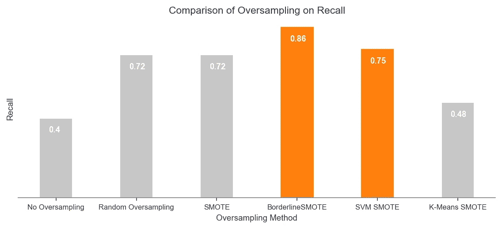

# 利用 SMOTE 及其变体通过过采样处理不平衡数据

> 原文：<https://medium.com/analytics-vidhya/handling-imbalanced-data-by-oversampling-with-smote-and-its-variants-23a4bf188eaf?source=collection_archive---------2----------------------->

> 在这篇文章中，我将解释使用 SMOTE，SVM SMOTE，BorderlineSMOTE，K-Means SMOTE 和 SMOTE-NC 的过采样/上采样。我将用一个实际的例子来解释，在这个例子中，我们应用这些方法来解决一个不平衡的机器学习问题，以查看它们的影响。


[廷杰伤害律师事务所](https://unsplash.com/@tingeyinjurylawfirm?utm_source=medium&utm_medium=referral)在 [Unsplash](https://unsplash.com?utm_source=medium&utm_medium=referral) 上的照片

# 介绍

当处理机器学习问题时，我首先检查的事情之一是目标类在我的数据中的分布。这种分布告知我如何着手解决问题的某些方面。我经常看到数据中存在某种不平衡，有时这种不平衡并不明显(为了简单起见，假设二进制分类任务的比例为 60:40)，而有时却很明显(比如 98:2)。现在当这种不平衡不显著的时候，我的生活就轻松多了；但是，我已经学会接受事实并非总是如此。对于那些使用过此类数据集的人(例如，流失建模、倾向建模等)。)，您就会知道模型在正确识别少数类样本方面的性能有多差。这就是理解如何处理这类问题以获得最佳结果的关键所在。

有几种方法可以解决这个问题，今天我们将讨论 ***过采样*** *(也称为上采样)*。简而言之，过采样增加了少数类样本的数量。然而，这不仅仅是复制少数类的样本(这有时会很有效！)而是使用一些更复杂的方法。这些复杂的方法包括流行的 SMOTE 和从它派生出来的几个有用的变体(我觉得没有怎么谈过)。

我将首先解释这些方法是如何工作的，然后我们将介绍一个应用这些方法的小实例，看看它们的表现如何。那我们开始吧！

# 方法

## 合成少数过采样技术

SMOTE [1]遵循一种非常简单的方法:


重击

1.  选择一个样本，姑且称之为 ***O*** (为起源)，从少数民族阶层中随机抽取
2.  找出属于同一类的 O 的 K 个最近邻
3.  用直线将 O 连接到每个邻居
4.  在[0，1]范围内随机选择一个比例因子' ***z'***
5.  对于每个新的连接，在直线上放置一个新点(z*100)%，远离 o。这些将是我们的合成样本。
6.  重复这一过程，直到你得到所需数量的合成样本

虽然通过复制原始样本来生成新的合成样本的想法是一个进步，但 SMOTE 有一个主要弱点。如果在步骤 1 或 2 中选择的点位于由多数类样本支配的区域中，则合成点可能会在多数类区域内生成(这可能会使分类变得困难！).为了了解更多信息，萨塔尔西·戈斯瓦米博士和 T2·阿列克谢·比洛古尔博士为这一现象提供了丰富的解释。

## 边境地带

borderline mote[2]的工作方式类似于传统的 SMOTE，但有一些注意事项。为了克服 SMOTE 的缺点，它识别了两组点——**噪声**和**边界**。你问的这些奇特点是什么？如果一个点的所有最近邻居都属于不同的类(即多数)，则称该点为 ***【噪声】*** 。另一方面，*"****Border "****点是那些混合了多数类点和少数类点作为其最近邻居的点。*

*当采样完成时(SMOTE -> Step 1)，仅使用 ***边界*** 点。之后，当寻找最近的邻居时，仅选择属于同一类的点的标准被放宽到包括属于任何类的点。这有助于选择有分类错误风险的点和更接近边界的新点。其他都一样。*

*但这种解决方案并不是灵丹妙药。限制仅从边界点采样和放宽邻域选择标准并不需要在所有情况下都有效。然而，那是另一天的话题。*

## *K-Means SMOTE*

*这是一种相当新的方法[3]，旨在减少其他过采样方法产生的噪声合成点。它的工作方式相当简单:*

1.  *Do K-Means 对数据进行聚类。([什么是 K-Means 聚类？](https://www.analyticsvidhya.com/blog/2020/10/a-simple-explanation-of-k-means-clustering/))*
2.  *选择少数类样本比例较高(> 50%或用户定义)的聚类。*
3.  *将常规平滑应用于这些选定的簇。每个聚类将被分配新的合成点。这些生成点的数量将取决于聚类中少数类的稀疏性；越稀疏，新点越多。*

**

*K-Means SMOTE*

*本质上，这种方法有助于创建少数民族类的集群(这些集群不会受到其他类的很大影响)。这最终可以使 ML 模型受益。然而，它继承了 K-Means 算法的弱点——例如找到正确的 ***K、*** 等等。*

*我猜现在是对一个采样模因窃笑的好时机(看完上面的方法应该就有道理了)。*

**

*使用 imgflip 生成的图像*

## *SVM 罢工了*

*SVM·斯莫特[4]关注于增加决策边界上的少数点。这背后的论点是，该边界周围的实例对于估计最佳决策边界至关重要(这与我们之前看到的 K-Means 方法形成对比，但与边界变量一致)。*

*这就是这个方法的工作原理:*

1.  *根据您的数据训练 SVM。这将为您提供支持向量(我们重点关注少数类支持向量)。([什么是 SVM？](https://www.kdnuggets.com/2016/07/support-vector-machines-simple-explanation.html))*
2.  *然后，我们使用这些支持向量来生成新的样本。对于每个支持向量，我们找到它的 K 个最近邻，并使用内插法或外推法沿着连接支持向量和最近邻的线创建样本。*
3.  *如果不到一半的最近邻属于多数类，那么我们做外推。这有助于将少数民族地区向多数民族地区扩展。如果没有，我们做插值。这里的想法是，由于大多数的邻居属于多数阶级，我们反而会巩固少数阶级的当前区域。*

> *如果你觉得很难理解第三点，试着在脑海中想象它，或者在一张纸上画出来，这样你就能看到它看起来会是什么样子。这应该会让事情变得更加明显。看看这篇文章末尾列出的研究论文[4]，验证你的理解。*
> 
> *注意:当寻找最近的邻居时，我们考虑所有的类，但是当连接少数支持向量到这些邻居时，我们只考虑少数的。*
> 
> *当类之间的重叠程度较低时，这种方法很有效。*

## *SMOTE-NC*

*如果您想知道上述方法是如何处理分类变量的(无需进行某种形式的编码),那么您就对了。以上所有方法都只适用于数值数据。虽然这个世界上有许多问题没有答案，但处理分类数据不是其中之一。*

*SMOTE-NC ***(N 代表名义值，C 代表连续值)***【1】当我们混合了数值型和分类型(N)数据时可以使用。为了理解这种方法是如何工作的，我将回答两个问题。暂停一会儿，想想它们会是什么。*

> *问题 1:假设我们有分类变量，在寻找最近的邻居时，我们如何计算距离？*
> 
> *答案 1:我们计算一个常数 **M** (把这个当做惩罚项)它是少数样本的数值特征的标准差的中位数。请参见下图:*

**

*SMOTE-NC:计算距离*

> *问题 2:我们如何给新的合成点分配类别？*
> 
> *回答 2:为了获得新合成样本的数字特征，我们使用传统的 SMOTE。然而，为了获得分类特征，我们指定出现在 K 个最近邻的大多数中的值(全部属于少数类)。*

*所以现在我们知道如何找到最近的邻居(SMOTE 的步骤 2)并分配类别。剩下的基本就是 SMOTE 算法了。*

> ***注意:**如果你的数据只有分类特征，那么你可以使用 [SMOTE-N](https://imbalanced-learn.org/stable/references/generated/imblearn.over_sampling.SMOTEN.html) 。然而，这种情况应该很少发生。*

# *实际例子*

*实现这些方法相对简单(尽管您需要查看本文末尾列出的研究论文中的一些更详细的信息)。有一个很棒的包叫做[不平衡学习](https://imbalanced-learn.org/stable/index.html)，它已经实现了所有这些方法，而且非常容易使用。但是，如果你有时间，为什么不做你的实现，看看它如何与软件包进行比较。*

*来看这个例子。我们将使用一个[电信客户流失数据集](https://www.kaggle.com/blastchar/telco-customer-churn)，因为它本来就不平衡。这是一个二元分类问题，客户要么离开(即流失)，要么留下。*

*我们将比较以下策略的分类器性能:*

1.  *无过采样*
2.  *随机过采样*
3.  *重击*
4.  *边境地带*
5.  *SVM 出击了*
6.  *K-Means SMOTE*

*由于这是一个不平衡的问题，分类器精度不是比较的最佳度量。相反，我要把重点放在 ***回忆*** 上的小众阶层(流失)。回忆让我们了解分类器在正确识别流失客户方面有多好。我们也可以关注精度和 F1，但这取决于业务需求和关注点(最大限度地减少假阴性和/或假阳性)。阅读这篇[帖子](https://machinelearningmastery.com/precision-recall-and-f-measure-for-imbalanced-classification/)以了解更多关于这些指标的信息，并获得何时选择什么的基本直觉。*

*整个笔记本可以在[这里](https://github.com/anshbordia/Beat-The-Imbalace)找到。下面我只展示与过采样相关的代码。*

```
*#Imports
from imblearn.over_sampling import RandomOverSampler 
from imblearn.over_sampling import SMOTE
from imblearn.over_sampling import BorderlineSMOTE
from imblearn.over_sampling import SVMSMOTE 
from imblearn.over_sampling import KMeansSMOTE#Random Oversampling
random_os = RandomOverSampler(random_state = 42)
X_random, y_random = random_os.fit_resample(X_train, y_train)#SMOTE
smote_os = SMOTE(random_state = 42)
X_smote, y_smote = smote_os.fit_resample(X_train, y_train)#BorderlineSMOTE
smote_border = BorderlineSMOTE(random_state = 42, kind = 'borderline-2')
X_smoteborder, y_smoteborder = smote_border.fit_resample(X_train, y_train)#SVM SMOTE
smote_svm = SVMSMOTE(random_state = 42)
X_smotesvm, y_smotesvm = smote_svm.fit_resample(X_train, y_train)#K-Means SMOTE
smote_kmeans = KMeansSMOTE(random_state = 42)
X_smotekmeans, y_smotekmeans = smote_kmeans.fit_resample(X_train, y_train)*
```

> ***给读者的练习:***
> 
> *我所做的过采样使流失和非流失之间的比率达到 1。但是，我们可以改变这一点，以及许多其他的东西，按照要求使用采样器的超参数([参考这些文件](https://imbalanced-learn.org/stable/introduction.html))。您可以摆弄这些超参数，看看它们如何改变结果样本。*

*完成后，我得到了以下结果:*

**

*召回率过采样的比较*

***结论:***

> *1.对于这个问题，某种形式的过采样比没有过采样要好。*
> 
> *2.BorderlineSMOTE 以较大优势击败其他方法，而 SMOTE、SVM SMOTE 和随机过采样相对相同。正如我之前所说，随机过采样有时会产生有利的结果。*
> 
> *3.K-Means SMOTE 给出了所有过采样方法中最差的结果。但是，您不应该放弃这种方法以供将来使用。根据问题类型和数据分布，任何方法都可能优于其他方法。也许，在这种情况下，我们选择的数据不适合 K-Means。*
> 
> ****注意:*** *在笔记本中，我已经绘制了每种比较方法的结果数据分布。看一下那个，试着形成一个视觉上的直觉来解释我们为什么会得到这些结果(特别是对于 BorderlineSMOTE 和 K-Means SMOTE)。**

*我希望这篇文章能帮助你理解一些基本的和高级的过采样方法，以及如何使用它们更好地处理不平衡数据。需要注意的是，有许多方法可以处理不平衡的数据，例如，[欠采样](https://imbalanced-learn.org/stable/under_sampling.html) *(也称为下采样)*和类权重。良好的 ML 实践，如 EDA、特征选择&工程、模型调整等。对解决这些问题也大有帮助。*

*正如我之前所说，这种不平衡问题没有灵丹妙药。如果您了解解决问题的各种方法，您将能够就您能做什么、您应该做什么做出更明智的决策，并节省时间以获得更好的执行模型。*

*伙计们，就这样吧，让我们用一个很好的范例迷因(和教训)来结束这篇文章。*

**

*使用 imgflip 生成的图像*

*关于本文的任何相关问题或讨论，请在 LinkedIn 上联系我。*

## *确认*

*本文代表 Intellify Australia 撰写，我在该公司担任数据科学家。*

**

*在 Intellify，我们使用数据、分析和机器学习来帮助
解决客户最具挑战性的业务问题。请访问我们的[网站](https://intellify.com.au/)了解更多信息。*

## *参考*

*[1] N. V. Chawla，K. W .鲍耶，L. O.Hall，W. P. Kegelmeyer，“SMOTE:合成少数过采样技术”，人工智能研究杂志，321–357，2002 年。*

*[2]韩，王文元，王炳焕，“非平衡数据集学习中的一种新的过采样方法”，智能计算进展，878–887，2005 .*

*[3]费利克斯·拉斯特、圣乔治·杜扎斯、费尔南多·巴考，“基于 K 均值和 SMOTE 的不平衡学习的过采样”*

*[4] H. M. Nguyen，E. W. Cooper，K. Kamei，“不平衡数据分类的临界过采样”，知识工程和软数据范例国际期刊，3(1)，第 4–21 页，2009 年。*