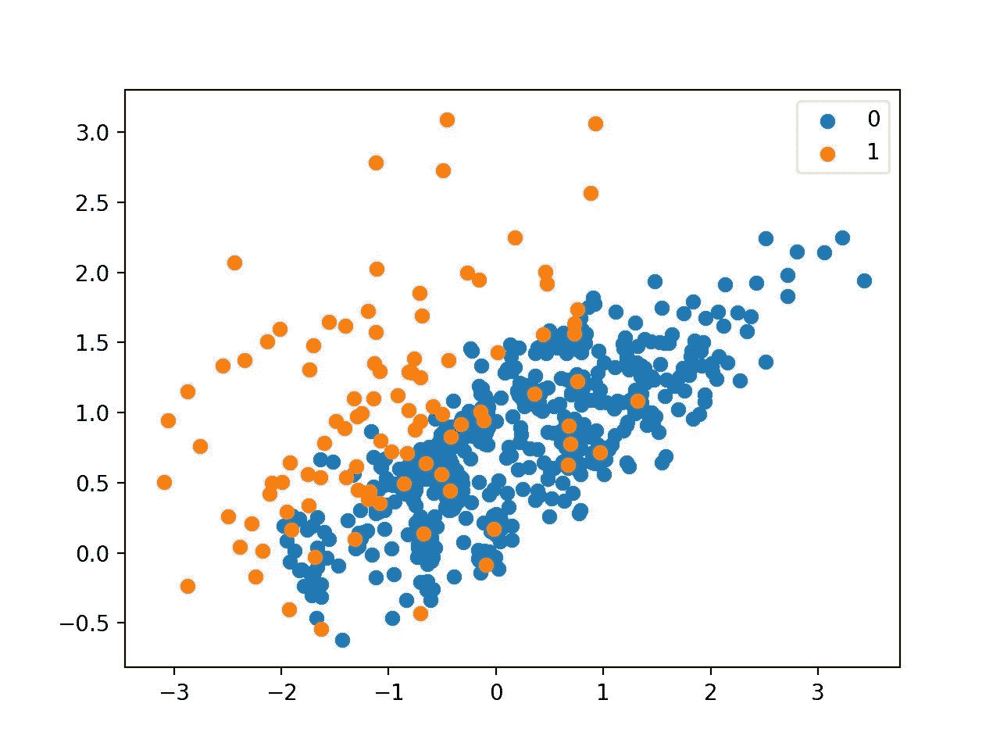

# 用欠采样技术处理不平衡数据集。它的利弊！

> 原文：<https://medium.com/analytics-vidhya/handling-imbalanced-dataset-with-undersamplingtechnique-its-pros-and-cons-2c634e763a9e?source=collection_archive---------2----------------------->

欠采样是指一组旨在平衡具有偏斜类分布的分类数据集的类分布的技术。

不均衡的类分布将有一个或多个实例很少的类(少数类)和一个或多个实例很多的类(多数类)。最好在二元(两类)分类问题的上下文中理解，其中类 0 是多数类，类 1 是少数类。了解更多关于[不平衡数据](https://akalbir.medium.com/what-is-an-imbalanced-data-how-to-handle-imbalanced-data-in-python-e6067792950f)的信息。

欠采样技术从训练数据集中移除属于多数类的样本，以更好地平衡类分布，例如将偏斜从 1:100 减少到 1:10、1:2 或者甚至 1:1 的类分布。这不同于过采样，过采样涉及向少数类添加示例以减少类分布中的偏斜。在本文中，我们将讨论不同的欠采样技术。

1.  选择要保留的示例的方法

*   接近欠采样

2.选择要删除的示例的方法

*   欠采样的 Tomek 链接

3.保留和删除方法的组合

*   欠采样的单侧选择

# 选择要保留的示例的方法

在这一节中，我们将仔细研究两种方法，这两种方法从多数类中选择要保留的示例，即接近失败的方法族。

## 接近欠采样

接近失误指的是基于多数类样本到少数类样本的距离来选择样本的欠采样方法的集合。

这些方法是由张建平和因德吉特·马尼在他们 2003 年发表的题为“ [KNN 不平衡数据分布方法:涉及信息提取的案例研究](https://www.site.uottawa.ca/~nat/Workshop2003/jzhang.pdf)”的论文中提出的

该技术有三个版本，分别命名为 NearMiss-1、NearMiss-2 和 NearMiss-3。这里，在特征空间中使用欧几里德距离或类似距离来确定距离。

*   **NearMiss-1** :与三个最近的少数类样本平均距离最小的多数类样本。
*   **NearMiss-2** :与三个最远的少数类样本具有最小平均距离的多数类样本。
*   **NearMiss-3** :与每个少数类样本具有最小距离的多数类样本。

下面提到了用 imblearn 实现 NearMiss-1 的代码，供大家参考。

运行该示例会对多数类进行欠采样，并创建转换数据集的散点图。

我们可以看到，正如预期的那样，只有那些与重叠区域中的少数类实例最接近的多数类实例被保留下来。

使用 NearMiss-1 欠采样的不平衡数据集的散点图

现在，类似地，我们可以通过更改版本来执行未遂事件 2 和 3。

# 选择要删除的示例的方法

这一节将详细介绍从多数类中选择要删除的示例的方法，即。流行的托梅克链接方法。

## 欠采样的 Tomek 链接

Tomek 链接是由 Tomek (1976)开发的压缩最近邻(CNN，不要与卷积神经网络混淆)欠采样技术的修改之一。与 CNN 方法不同，其仅从想要移除的多数类中随机选择具有 k 个最近邻的样本，Tomek Links 方法使用规则来选择满足这些属性的观测值对(例如， **a** 和 **b** ):

1.  观测值 **a** 的最近邻居是 **b** 。
2.  观测值 **b** 的最近邻居是 **a** 。
3.  观察值 **a** 和 **b** 属于不同的类别。即 **a** 和 **b** 分别属于少数派和多数派阶级(或者*反之*)。

下面提到了 Tomek 与 imblearn 链接的代码。

Tomek 链接欠采样

计数器({0: 9900，1: 100})
计数器({0: 9874，1: 100})

变换数据集的散点图不会使对多数类的次要编辑变得明显。

这突出表明，尽管在类边界上找到不明确的例子是有用的，但它本身并不是一种很好的欠采样技术。在实践中，托梅克链接程序经常与其他方法结合使用，如压缩最近邻规则。

用托梅克链接法欠采样的不平衡数据集散点图

# 保留和删除方法的组合

这一节将更仔细地研究一些技术，这些技术结合了我们已经研究过的从多数类中保留和删除示例的技术，例如单侧选择和邻域清理规则。

## 欠采样的单侧选择

单边选择，简称 OSS，是一种欠采样技术，结合了 Tomek 链接和压缩最近邻(CNN)规则。

具体来说，Tomek 链接是类边界上的模糊点，并且在多数类中被识别和移除。然后使用 CNN 方法从远离决策边界的多数类中移除冗余样本。

欠采样程序的单侧选择概述
摘自解决不平衡训练集的诅咒:单侧选择。

我们可以通过[单边选择不平衡学习类](https://imbalanced-learn.org/stable/generated/imblearn.under_sampling.OneSidedSelection.html)实现 OSS 欠采样策略。

种子示例的数量可以用 *n_seeds_S* 设置，默认为 1，KNN 的 *k* 可以通过 *n_neighbors* 参数设置，默认为 1。

假设 CNN 过程发生在一个块中，那么具有更大的多数类种子样本以有效地移除冗余的例子会更有用。在这种情况下，我们将使用值 200。

该数据集的比率现在约为 1:10。，低于 1:100。

计数器({0: 9900，1: 100})
计数器({0: 940，1: 100})

创建了变换数据集的散点图，该散点图显示大部分剩余的多数类样本位于类边界周围，而重叠的样本来自少数类。

单边选择欠采样的不平衡数据集散点图

# 赞成的意见

*   当训练数据集很大时，它可以通过减少训练数据样本的数量来帮助改善运行时间和存储问题。

# 面向连接的网络服务(Connection Oriented Network Service)

*   它可能会丢弃可能对构建规则分类器很重要的潜在有用信息。
*   随机欠采样选择的样本可能有偏差。这也不是人口的准确代表。从而导致实际测试数据集的结果不准确。