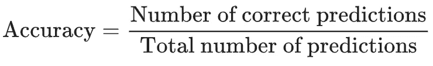
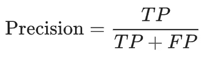
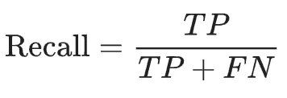
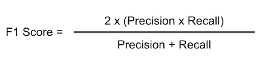

# 模拟性能指标和处理不平衡数据集

> 原文：<https://medium.com/analytics-vidhya/handling-imbalanced-datasets-dccaded84045?source=collection_archive---------0----------------------->

信用:123 法郎

**简介:**

*第一个场景:AZ 是一名机器学习工程师，他的任务是提出一种算法，可以预测咳嗽死亡的可能性。他可以获得一个数据集，该数据集包括较多的阴性病例和较少的阳性病例，即实际上死于咳嗽的人的病例。他设计了一种算法，当根据可用数据进行训练时，训练的准确率为 98%，但当暴露于包括 100 名患者中有 10 名死亡患者的现实生活数据时，该算法的性能似乎非常差，它错误地将那些后来死亡的人归类为幸存的人。这意味着，如果这些病人接受了更适当的治疗，他们可能会活下来。另一方面，如果模型已经预测到死去的人会活下来，医院就会把稀缺的资源用在错误的病人身上。他需要在假阳性和假阴性之间选择一个平衡点。*

*第二个场景:TD 在一家贷款机构担任机器学习工程师。他的任务是设计一个模型，根据客户的交易历史预测他们接受贷款和还款的能力。他提出了不同的模型，这些模型似乎都具有超过 90%的优秀训练准确性，但是当部署到商业用途时，银行发现该模型批准贷款的许多人后来都违约了，并且在调查和检查他们的交易历史时，很明显该模型不应该批准贷款，但是该模型在训练期间显示出非常好的准确性。他需要找到一种方法来减少模型的误报，以节省不良贷款中的银行成本。*

T 用于机器学习模型的数据集的质量极大地影响其在现实生活中的有用性，并且很多时候，模型的*准确性*通常被视为所述算法性能的有效度量。然而，在大多数情况下，单独使用模型训练准确性作为性能的度量可能非常具有欺骗性，正如我们在上面的场景中看到的那样。

*机器学习算法的精度*是表示预测总数中正确预测的比例的值。

机器学习模型的准确性

一个好的机器学习模型已经看到了特定类别的足够数据，应该能够准确地*并且在许多情况下*预测所述类别的概率。因此，观察上述公式背后的逻辑，应该预期如果算法在具有 85%的 A 类和 15%的 B 类的数据上被训练了良好数量的时期*(时期是在数据集上迭代的次数)*，那么它应该对 A 类的概率具有高精度，并且因此机器学习模型将被判定具有高精度，但不仅仅如此， 因为模型*看到了*更多的 85%类，所以它通常最终预测*所有的*类为 A 类，所以当模型报告 85%的准确率时，它预测 A 类的准确率为 100%,而预测 B 类的准确率为 0%,这是一个大问题，特别是当错误分类 B 类的成本非常高时。

为了应对这一挑战，通常使用新的模型性能指标:精确度、召回率、f1 值。

精度是在给定机器学习模型的*总正面预测*的情况下，对*实际正面*案例的概率的度量。 ***简单来说就是，如果一个给定了 10 个数据样本的模型对所有 10 个实例的预测都是肯定的，那么这些肯定预测中有多少比例是真实肯定的*** 。

另一方面，回忆是从大量真实的肯定中预测出肯定的概率的度量。 ***简单来说，这就是说，如果数据集中有 100 个地面实况阳性，那么模型预测其中有多少个是阳性的*** 。

F1 分数试图在两者之间提供一个平衡，因为大多数时候，很难决定是追求高精度还是高召回率。

精准。回忆一下。f1-分数

由于精度和召回背后的逻辑本质，他们对算法的性能做出比仅仅使用精度更好的估计。然而，在高召回/低精度或低召回/高精度之间做出选择仍然是一个挑战，通常这取决于项目的最终目标和两者的成本影响。

让我们用本笔记开头描述的场景做一个例子:一个模型预测 3 个咳嗽患者将死亡，而实际上有 6 个死亡(回忆:0.5)，与一个模型准确预测 6 个病例中的 5 个(回忆:0.83)相比，这个模型表现很差。做前者的模型将意味着对剩余的 3 名患者的护理不充分，因此他们最终死亡——这对所有病例都是不好的。

另一方面，如果模型预测 6 个患者中有 4 个会死亡，而只有 2 个会死亡(精度:0.5)，而另一个模型预测 6 个患者中有 1 个会死亡，而最终 6 个患者都会死亡(精度:1)。做前者的模型意味着医院将在 2 个额外的病人身上花费资源，这基本上意味着浪费，而做后者的模型将意味着它错过了预测病人的健康状态——非常差。

这提出了在高召回率/低精度或低召回率/高精度之间选择的挑战，通常这取决于最终目标是什么。在健康环境中，人们永远不能选择一个来支持另一个，所以我们满足于 f1 分数，它试图平衡两者。f1 分数好的是 1，差的是 0，平均值是 0.5，所以模型越接近 1 越好。

许多因素会影响算法的性能测量，除了上面定义的概念，我们将深入研究模型欠拟合和过拟合的概念以及数据不平衡的概念，并以某种方式将这三者联系起来。

*模型的过度拟合*是一个术语，用于描述这样一种情况，即模型对数据集的了解远远超过了它应该了解的程度，以至于在了解了数据集中必要的相关性和依赖性之后，它开始制造新的相关性，有时是在数据集的不相关特征之间。这基本上导致模型在训练集上表现优异，但是当暴露于与训练集不同的新数据集时，它开始应用错误的相互依赖性和特征关系，从而导致较差的性能。你可以在这里了解更多[。](https://machinelearningmastery.com/overfitting-and-underfitting-with-machine-learning-algorithms/)

*模型的*欠拟合是指模型从训练数据集学习较差的情况，与过拟合不同，它甚至没有学习到足够多的训练数据集的特征之间的有意义的交互。因此，在训练集上的性能很差，当暴露于新的数据集时，它的性能非常差。这里可以了解更多[。](https://machinelearningmastery.com/overfitting-and-underfitting-with-machine-learning-algorithms/)

与拟合不足相关的是数据不平衡的概念。在这种情况下，由 2 个或更多类别组成的数据集包含数据集中不成比例数量的各个类别。这意味着，如果模型在包含 90%的类 X 和 10%的类 Y 的数据集上训练，它学习更多关于类 X 的特征，并且因为类 X 具有更高的比例，当评估准确度时，模型显示相当高的训练准确度，但是当暴露于新数据并且类 Y 的准确度是最重要的时，模型表现很差，因为在训练期间，尽管具有 90%的准确度， 它在 X 类上的准确率为 100%,在 y 类上的准确率为 0%。我们将在后续的副标题中进一步探讨如何应对这一挑战。

**处理不平衡数据集的技术:**

已经提出了许多技术来解决数据集不平衡的挑战，其中包括:

1.  过采样:顾名思义，这只是对少数数据集进行过采样，以平衡多数类的数量。在这种情况下，假设 1000 个实例的数据集有 100 个正实例和 900 个负实例，给出 90:10 的比率，正实例被过采样，目的是添加额外的 900 个实例，以便在操作结束时，数据集中的正实例和负实例的比率为 50:50。
2.  欠采样:这包括对多数类的数量进行欠采样，以平衡少数类的数量。使用过采样技术中的示例，这涉及将多数类的数量从 900 个实例减少到 100 个实例，使得正负类的最终比率为 50∶50。
3.  使用 SMOTE 等技术生成少数类或多数类的合成实例。

但是仅仅对数据集进行过采样或欠采样是一个挑战。很多时候，当一个人观察现实世界的情况时，在一个随机的、无偏见的数据样本中，包括积极和消极的类别，在积极和消极的类别之间几乎没有平衡。使用本文第一段中描述的场景，期望每 10 个患咳嗽的人中有相当多的人会死亡或 50%会死亡是非常不合逻辑的——这很少发生(对疫情来说是安全的)。因此，很难获得超过 20%的实例死于咳嗽的数据集。

因此，它应该推断出，当数据集呈现出实际上代表现实生活场景的相当低比例的阳性病例时，任何过采样/欠采样的尝试都只会导致数据集出现偏差。考虑到机器学习模型不仅学习数据集特征之间的相互作用，它们还学习数据集中类的比例，因此，如果模型在不代表真实数据的*平衡*数据集上训练，它将学习数据集中类的错误比例，因此，当呈现新数据集时，它可能表现糟糕，可能比在不平衡数据集上训练时表现更差。**总之，改变这种数据集的类比例通常会导致数据集偏差，改变数据集的真实性，进而迫使模型学习数据集中错误的类比例**。在这种情况下，如果在不平衡数据集上充分训练的模型在少数类上具有较差的准确性，那么这只是一种实际情况，我们可以做的是专注于提高模型相对于少数类的精确度和/或召回率。

**另一种方式:**

也许我们真的想获得多数类和少数类的高精度，了解仅通过欠采样/过采样和生成合成数据所面临的挑战，我们需要找到一种方法，让模型不仅能很好地学习多数类，还能很好地学习少数类。

***类权重和代价惩罚的思想:***

这涉及到利用对做出错误预测的成本的理解。让我们这样来看:

使用本文开头描述的场景，让:

1.  Xo(死)代表少数阶级而，
2.  Xi(活着)代表了大多数阶级。

让；

1.  当地面实况为 Xo 时，预测 Xi 的成本/误差由 C**表示，
2.  当 Xi 用 C*表示时，预测 Xo 的成本/误差。

很多时候，我们假设两个成本/误差之间是对称的，但并不总是这样，在不对称的情况下，机器被投入生产，并且预测一个患有咳嗽的人在最终死亡时仍然活着的实际意义高于相反的情况，那么 C** >> C*，在这种情况下，为了让机器更准确地预测，我们需要考虑到这一新信息来处理各个类别的权重。

**这里是类权重，类权重的想法是给予考虑到 C**和 C*的少数类更多的权重，以便当模型呈现一个人咳嗽并确实死亡的情况时，它可以如此准确地预测。通过这样做，每个类别的输出概率考虑了各自的成本/误差信息。**

为了使用类权重实现这种过采样/欠采样，分类机器学习算法总是有调整类权重的余量，这通常由***class _ weight****关键字参数来表示，每当您调用相应算法的 *fit* 方法时。*

***总之；***

1.  *仅仅准确度是不足以用来评估机器学习模型的性能的度量。*
2.  *精度、召回率、F1_Score 是判断机器学习模型性能的较好指标。*
3.  *设计模型时，需要理解模型的目标，以便在高精度/低召回之间进行选择，反之亦然。*
4.  *数据集平衡和/或其他因素对模型的学习非常重要。重要的是，要考虑到现实世界中随机、无偏和不平衡数据的可能性，以确保平衡数据集不会在扩展平衡数据集和向模型提供不良数据时给数据集带来一些偏差，模型会学习到错误的类间比例，并在现实生活数据中表现不佳。*
5.  *不同类别预测之间的误差成本并不总是对称的，因此，在将数据输入模型时，将这一因素考虑在内非常重要。这涉及到对算法在现实世界中的有用性的理解，大多数时候，还涉及到领域专业知识。*

*感谢您的阅读！你可以在 LinkedIn 上找到我，我的一些作品也可以在 Github 上找到，别忘了留下一些掌声和评论。*