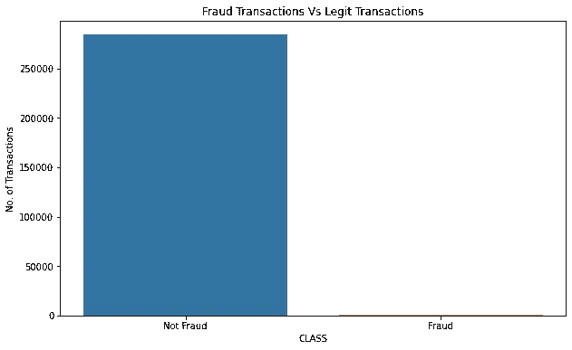
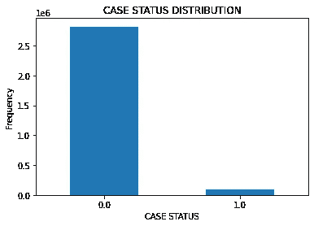

# 用过采样技术处理不平衡数据集。有利有弊。

> 原文：<https://medium.com/analytics-vidhya/handling-imbalanced-datasets-with-oversampling-techniques-its-pros-cons-ba9f36ac5b71?source=collection_archive---------0----------------------->

在本文中，我们将讨论可用于克服不平衡数据的过采样技术。要了解有关数据不平衡的更多信息，请参考:[https://akalbir . medium . com/what-a-an-unbalanced-data-how-to-handle-unbalanced-data-in-python-e 6067792950 f](https://akalbir.medium.com/what-is-an-imbalanced-data-how-to-handle-imbalanced-data-in-python-e6067792950f)。

简而言之，我将过采样定义为欠采样的反义词，因为在过采样中，我们通过将新的点插入少数类来平衡类，而不是将它们从多数类中移除。你现在可能会想，既然我们没有更多的数据，我们怎么能在少数类中插入新的点呢？为了回答这个问题，我会说，我们通过随机生成或数学计算来为少数群体生成分数。


有不同类型的过采样技术，比如随机过采样和 SMOTE 等。我们来详细讨论一下。

# 过采样技术的类型

## 随机过采样

顾名思义，这是一种从少数类中选择随机点并复制它们以增加少数类中数据点数量的技术。但是被认为是最健壮的。这种方法被认为是最基本的过采样技术。由于点的选择是随机的，这人为地减少了数据集的方差。在我的案例中，我对欺诈交易数据集使用了随机过采样。这被证明比 SMOTE 过采样执行得更好。让我们看一下过采样之前的分布和代码片段，以了解它的实现。



现在，应用此方法后，我们得到如下输出:

```
Counter({0: 284315,
         1: 284315})
```

这就是在不平衡数据集上实现随机过采样的方法。

## SMOTE 过采样

SMOTE 代表合成少数过采样技术。该技术通过在原始数据集的观测值之间插入一个点来生成新的观测值。它利用了 K-最近邻策略。SMOTE 过采样有近 85 种变体。要了解更多，请查看:【https://github.com/analyticalmindsltd/smote_variants】T2

对于给定的观测值 xi，通过在 k 个最近邻之一 xzi 之间进行插值来生成新的(合成)观测值。

xnew = Xi+λ(xzi Xi)xnew = Xi+λ(xzi Xi)

其中λ是在[0，1][0，1]范围内的随机数。这个插值将在 xi 和 xzi 之间的线上创建一个样本。我在我的 H1 B 签证预测中使用了这种技术。让我们通过代码更好地理解它。



击打前

从上图可以看出，H1-B 签证是高度不平衡的，所以我们用 SMOTE 处理了这种不平衡。产出如下:

```
Counter({0:2818282           1:2818282})
```

因此，这是另一种平衡数据集的技术。

## 阿达辛

最后但并非最不重要的是自适应合成采样方法。这种方法基于 SMOTE 的方法论，但是它不是从附近的点生成点，而是使用离群点，即“更难学习的点”来生成新点。但是这样做的缺点是，由于它的适应性，它的精度会受到影响。同样，对于分散的少数样本，每个邻域可能只包含 1 个少数样本。

# 利弊

优点:

(1)这种方法不会导致信息损失。

(2)运行良好并给出良好的准确性。

缺点:

(1)增加学习时间

(2)使过度拟合更有可能。

# 结论

总结这篇文章，我想说的是，在分享我的经历的同时，我也学到了很多。这就是处理不平衡数据系列的结束。我希望你喜欢这篇文章，如果你有任何建议，请随时与我联系。快乐阅读伙计们！继续学习！