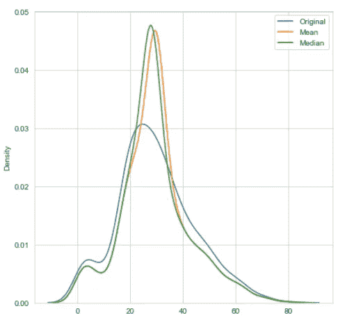
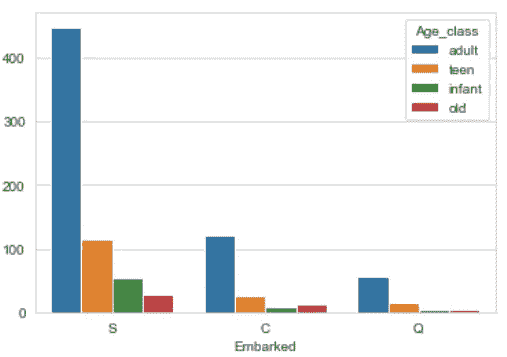
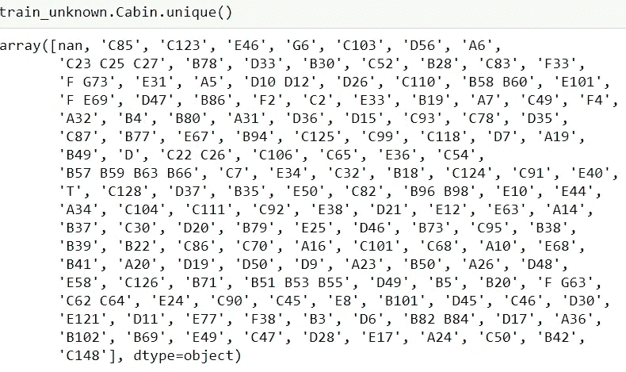
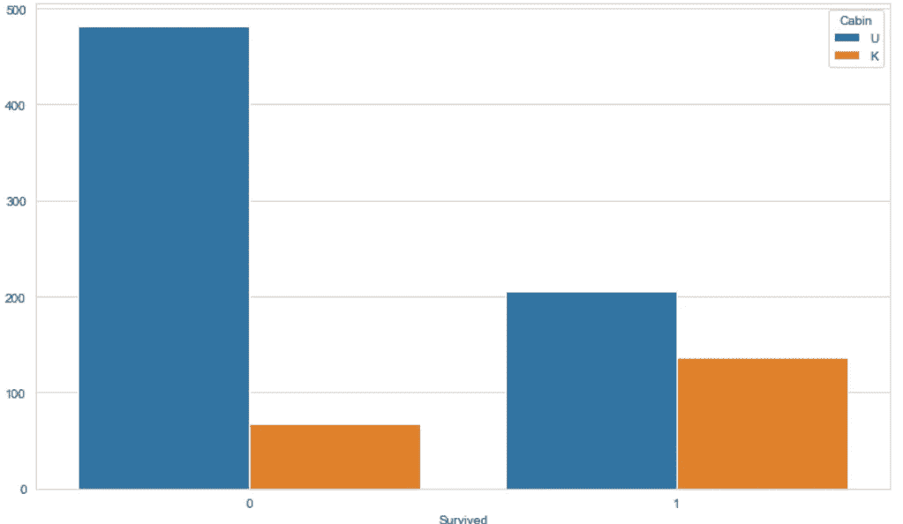
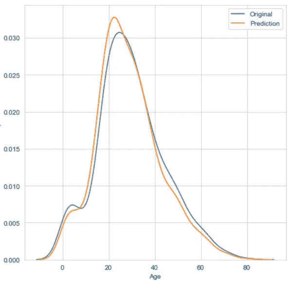
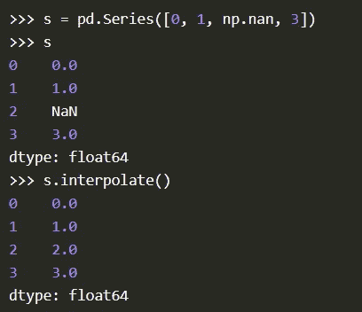

# 处理缺失值—数据科学

> 原文：<https://medium.com/analytics-vidhya/handling-missing-values-data-science-d4202c7b953d?source=collection_archive---------5----------------------->

可怕的 NaN 值，当我开始我的数据科学之旅时，我曾经讨厌处理缺失值。但是一旦你开始在处理 NaN 的各种方法背后建立直觉，你就开始理解选择正确方法的重要性。在这篇博文中，我将讨论处理数据中缺失值的各种方法。我将讨论的方法有:

> 1.删除列或行
> 
> 2.均值/中位数插补
> 
> 3.最常见的归罪
> 
> 4.未知值插补
> 
> 5.缺失值的预测
> 
> 6.使用对缺失值稳健的算法
> 
> 7.杂项方式

首先，让我们使用真实世界的情况，用简单的术语来理解上述缺失值的原因。假设你正在进行一项调查，从你的客户那里收集数据，你问了四个问题——名、姓、工资和年龄。有些客户可能没有姓氏，有些人可能不愿意透露薪水等敏感信息，还有一些人不愿意透露自己的年龄。

我不会在这篇博客中讨论实现这些方法的代码，如果你想了解这些方法的实现，请查看我的知识库[这里](https://github.com/Data-csc/missing_values)。

# 1.删除列或行

> data.dropna(axis=1，in place = True)#删除列
> 
> data.dropna(axis=0，inplace=True) #drop row

啊！！这种简单的方法，我的意思是你会爱上它！！如果我们可以在所有数据集上使用这种方法，生活就会变得如此简单。这种方法导致了一个准确和稳健的模型，这是因为我们没有使用任何插补技术来“猜测”缺失值。我不建议在您的项目中使用这种方法，因为它们会导致“有价值”数据的丢失。下面介绍了几种可以考虑使用这种方法的情况:

a.当有一列或一行没有相关信息时。

b.当你有几十亿行的时候，删除几行不会有太大的不同。

c.当有一列缺少大部分数据时。

# 2.均值/中位数插补

这种方法很容易计算，广泛用于替换数据集中缺失的值。当数据完全随机缺失(MCAR)时，即任何观测值缺失的概率相等时，最好使用这种方法。中位数插补对于异常值是稳健的，然而，平均数插补却不是。在下图中，您可以看到当我们用平均值或中值替换缺失值时，KDE 图中的差异。

优点:易于实现，适用于小数据集。

缺点:原始方差的改变，这种方法增加了偏差和方差，只对数值型数据有效。

# 3.最常见的归罪

这种方法用于填充分类列中缺失的值。实际上很简单，只需用一列中最频繁出现的值替换缺失的值。这种方法与均值/中值插补具有相同的优点和缺点。

根据上面的计数图，已装载列中的任何缺失值都可以用“S”类别替换。

# 4.未知值插补

在这种方法中，我们用一个独特的类别填充缺失值，让我们用“U”表示未知。这种方法在有限的情况下效果很好。让我们假设你在泰坦尼克号沉没后从不同的受害者那里收集数据，你想要分析——是否有任何特殊的原因导致这些乘客幸存。您的数据集中有一列会告诉您冰山撞击时船上乘客的位置。不幸的是，您无法收集所有未能幸免于难的乘客的数据。在这种情况下，创建一个独特的类别可能有助于深入了解数据。也许在位置“U”的乘客生还的机会很小。

然而，在大多数情况下，在我们执行一次性编码后，我们的数据集中会有一个新的特征，这可能会导致我们的模型精度下降。当数据由于完全随机的原因而在数据集中丢失时，就会出现这种情况。

在上面的照片中，你可以看到客舱列有许多独特的价值，也南。从最初的分析中，我们知道客舱列有 **687** 缺失值。

将已知值替换为“K”并将未知值替换为“U”后，我们可以看到，更多未能幸存的人拥有未知的客舱类型。

# 5.缺失值的预测

注意:在回归的情况下，确保没有多重共线性，在继续此方法之前检查 VIF(方差膨胀因子)和容差。

在这种方法中，我们预测缺失值。以下步骤对此进行了说明:

a) X 训练数据=除了自变量(我们希望避免数据泄漏)之外的所有列，这些列的行为 nan

b) y 定型数据=要预测其缺失值的列，只有不含 nan 的行

c) X 预测数据=要预测其缺失值的列，其中只有带有 nan 的行

d)在 X_train 和 y_train 上训练模型

e)对 X_pred 进行预测

f)用步骤-(e)替换原始数据集中所有具有 nan 的行(仅针对您正在输入其缺失值的列)

这是原始数据和用预测值替换缺失值后的数据的年龄柱的 KDE 图。

# 6.使用对缺失值稳健的算法

有许多算法可以自己处理缺失值，其中一些算法(如 RandomForest 和 K 近邻算法)是众所周知的，而其他算法(如 CatBoost 算法)则不太为人所知。我建议浏览一下 CatBoost 的文档:[https://catboost.ai/.](https://catboost.ai/.)

# 7.杂项方式

## - Datawig 库

这是 [DataWig](https://github.com/awslabs/datawig) 的文档，这是一个学习模型的框架，用于估算表中的缺失值。

## -上次意见结转(LOCF)

在这种方法中，最后一个已知值被带入缺失值，并且可以使用 pandas 轻松实现。

> data.fillna(method='ffill ')

其他可用的方法有:“回填”、“b 填充”、“填充”、“f 填充”

填充/填充:将最后一个有效观测向前传播到下一个有效观测，回填/填充:使用下一个有效观测来填充间隙。

## -插值

插值是一种数学方法，它根据数据调整函数，并使用该函数来外推缺失的数据。最简单的插值类型是线性插值，即在丢失数据之前的值和丢失数据之后的值之间取平均值。

# 结论

你不可能事先真正知道处理缺失数据的正确方法，你需要实现其中的一些方法，并比较它们的结果。对数据和问题陈述有一些了解可以给你一些提示，告诉你哪种方法可能更合适。我希望这篇博客是有用的，我会推荐在泰坦尼克号数据集上练习这些方法[这里](https://www.kaggle.com/c/titanic/overview)。