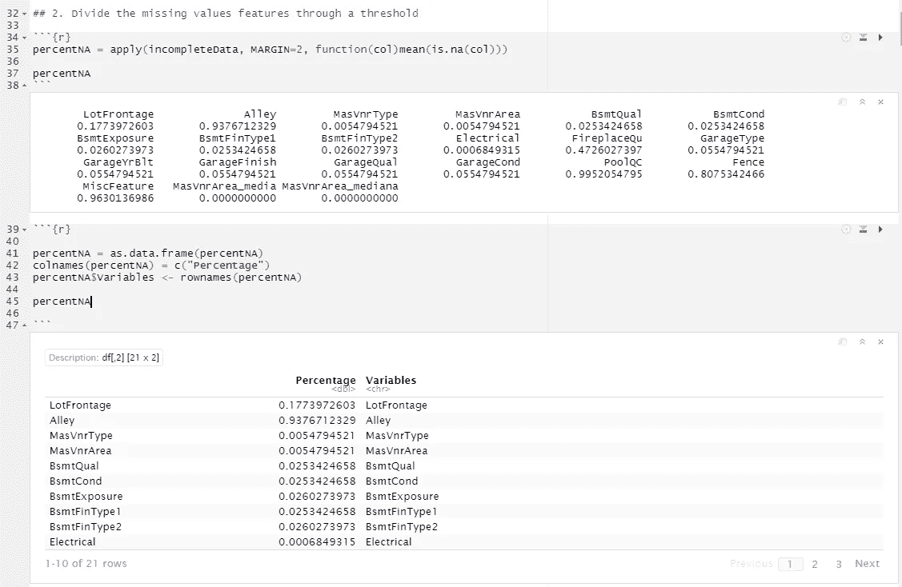

# 用 R 中的均值和中值插补处理缺失值

> 原文：<https://medium.com/analytics-vidhya/handling-missing-values-with-mean-median-imputation-in-r-d3389399a21e?source=collection_archive---------7----------------------->

费利克斯·伯杰在 [Unsplash](https://unsplash.com?utm_source=medium&utm_medium=referral) 上拍摄的照片

想象一下，你必须穿过那条河。你会游过去吗？或者你会走桥吗？我给你 1 分钟时间选择。

好了，时间到了！

如果你不是像我一样的专业游泳运动员，我们都同意到达我们命运的最好方式是通过这座桥。但是你可能注意到了，有一些漏洞威胁着我们的安全。

这就是机器学习算法的工作方式。就像一座桥，它们把你从 A 点(观察)带到 B 点(预测)。然而，当有**缺失值**时，它们类似于你前进道路上的缺口，不允许你前进。

前面的比喻不仅仅是比喻，它是真实的！算法内部工作的方式是通过向量。就像一部老电影中的银行金库，当没有存储任何值时，就会出现严重的问题…

# 缺失值为什么存在？

这个问题有很多原因。但是，它们可以分为三种类型:

**完全随机失踪(MCAR)**

顾名思义，任何要素的缺失值概率都是一样的。换句话说，第 35 行第 A 列的缺失值和第 11 列第 1，385 行的缺失值之间没有关系。他们是**独立**。

一些例子是 API 的错误，由于不良样品而丢失的实验室值，没有投票的公民的随机子集，等等。

**随机失踪(3 月)**

与前面的不同，缺失值与数据集中的某些要素之间存在联系。

例如，在一项调查中，一些女性可能更喜欢跳过关于她体重的问题(特征)。

**非随机缺失(MNAR)**

最后，当任何因素导致数据缺失时，就会出现这种分类。例如，对于一项社会经济学研究，低收入和高收入人群很可能不会填写调查。

既然你已经熟悉了这个话题，你认为哪一个适用于我们想要跨越的可怕的桥？

# 理论够了。我们如何处理它们？

答案很简单。**插补**。

Zach Lezniewicz 在 [Unsplash](https://unsplash.com?utm_source=medium&utm_medium=referral) 上拍摄的照片

我知道。这座桥不一样了。但逻辑是！

正如这个人所做的，我们可以**使用对我们有利的类似价值观**来实现我们的目标。对于我们假设的情况，我们可以**重用任何以前的桌子**来“填补空白”并达到我们的目的。在机器学习中，我们可以通过**进行一些统计测量**来复制这个动作，你可能知道并填充缺失的值。

以下是一些最常用的方法:

*   平均
*   中位数
*   方式
*   最小值或最大值
*   KNN
*   回归

在这篇介绍性文章中，我们将讨论均值和中值方法。

# 让我们看一个代码示例

在下面的例子中，我们将使用 Kaggle 竞赛中的[房价](https://www.kaggle.com/c/house-prices-advanced-regression-techniques/overview)数据集。

首先，我们导入 dplyr 和 ggplot2 库，分别用于数据分析和可视化。此外，我们导入数据集。对于这个例子，我们将使用 train_HP 数据帧。

图 1:导入库和数据集。

我们的第一步将是**识别带有缺失值的特性**。为此，我们用 *complete.cases* 函数创建了 colsNa 向量。注意感叹号颠倒了它的主要用途。根据结果，有 19 个特征符合该条件。

这将有助于我们创建仅包含缺失值要素的不完整数据数据框。

图 2:识别具有缺失值的要素。

我们的第二步将是**通过一个阈值划分我们的缺失值。**为了给每个特性分配一个值，我们通过应用功能计算了**平均值**。请注意，参数是每列中缺失值的数量(is.na 函数)。

下一步是用它创建一个数据框。

图 3:为每个特征设置缺失值的比例。

如您所见，有些变量缺失值的比例很高。在移除这些变量之前，您应该始终确保它们不会对模型产生影响。在这种情况下，我们将把它们排除在外。

是时候设定我们的门槛了。通常将其设置为 5%,但是您可以使用适合您需求的值。由此产生的数据框架是我们应该进行插补的值。

图 4:设置 5%的阈值和最终数据帧。

在这个条目中，我们将只使用一个变量。这将是非常正面的。所以我们用均值(第一条语句)、中值(第二条语句)代替所有缺失值，并进行比较。

图 5:均值和中值插补的比较。

你看到结果了吗？平均值是 70.04996，而中位数是 69。让我们用图表来检查一下。

图 6:平均值和中位数插补的折线图。

好吧，很难区分。但是这个想法是，这两种估算方法帮助我们填补了开始时的空白。

请注意，以前似乎是“正态分布”的情况，现在已经不是了。因此，您应该选择好工作方法，以便尽可能保持数据正常。

# 利弊

**优点**

*   使用简单快捷

**缺点**

*   扭曲了分布

# 最后

万岁！我们通过裂缝桥过河:)

总结一下:机器学习是把你从 A 点带到 b 点的桥梁。然而，有时这些桥梁充满了缺口。或者用我们的行话来说，缺失的价值观。

为了“填补这些空白”,你应该利用你所知道的数据。怎么会？通过我们都知道的统计工具，比如均值、中位数、众数、回归、KNN 等。

在这篇博文中，我们使用了均值和中位数插补方法。正如我们注意到的，它实现起来非常快速和容易，但有时它会扭曲我们的数据分布。所以一定要小心行事。

**朋友的建议:**尽可能多的尝试方法。这就像用木头、金属、树叶、藤蔓等来填补这些空隙。最终你会找到最适合你要过桥的方法。