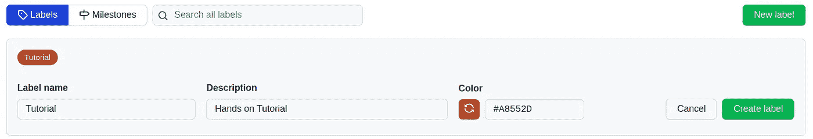

# 为您的 GitHub 项目创建和管理 Azure DevOps 风格故事板的实践教程

> 原文：<https://medium.com/analytics-vidhya/hands-on-tutorial-to-create-and-manage-an-azure-devops-style-story-board-for-your-github-project-14c101db4cc1?source=collection_archive---------0----------------------->

Azure DevOps 风格项目故事板(图片由作者提供)

# 概观

你是否曾经在追踪你的 GitHub 项目的进展时遇到过挑战，并且觉得需要有一个故事板？这里有一个快速的教程来为你的 GitHub 项目创建和管理一个 Azure DevOps 风格的故事板

在本实践教程中，我们将:

1.  创建项目板(故事板)
2.  创建和管理工作项
3.  创建我们的里程碑和标签
4.  向工作项添加元数据

> 这个指南不仅对那些维护有大量合作者的项目的人有帮助，而且对那些不熟悉 Sprint 规划和协作概念的人也有帮助。

# 1.创建项目板(故事板)

**项目板有三种类型:**

1.  **用户拥有的项目板:**用于与任何个人存储库相关的工作项目。可以包含与多个存储库相关的工作项。
2.  **组织范围的项目板:**用于与属于一个组织的任何存储库相关的工作项目。
3.  **存储库项目板:**用于与单个存储库相关的工作项目。

> GitHub 构建了项目板来跟踪问题和请求，但是在本教程中，我们将使用项目板来跟踪我们的全部工作！

**要创建项目板，请遵循以下步骤:**

**a .创建新的项目板:**要创建新的项目板，请导航到 GitHub 的主页，单击“项目”选项卡，然后单击“新建项目”按钮。这将为您提供一个创建普通项目板或项目板测试版的选项，如下图所示。

图 1.1:项目板创建(图片由作者提供)

**b .选择新项目(看板风格的项目板):**你会被提示到如下所示的屏幕。填写所有细节，如板名、描述、模板(对于本教程选择无，因为我们将复制 Azure DevOps Sprint 板，但您可以稍后探索其他选项)、可见性(根据您的需求选择选项)和链接的存储库(您想要链接的存储库)。您可以将多个存储库链接到您的项目板)

图 1.2:创建新项目屏幕(作者图片)

**c .添加列:**单击创建项目按钮后，将创建一个没有列的空项目板。对于本教程，由于我们试图复制 Azure DevOps 板，我们将添加 Azure DevOps 板中存在的列，如 **New、Active、Resolved** 和 **Closed。**

图 1.3:添加列(作者图片)

一旦我们添加了四列，我们的板应该看起来像这样。

图 1.4:项目板(图片由作者提供)

**项目板测试版:**在测试版中，可以添加多个视图，改变布局结构，如图 1.5 所示。

图 1.5。更改视图名称和布局(图片由作者提供)

这就是我们如何创建我们的第一个故事板！现在让我们看看如何添加我们的工作项。

# 2.创建和管理工作项

**a. Story Board(非测试版):**只需点击列名旁边的加号(+)，添加您的工作项，如下图所示。

图 2.1:在非测试版故事板中添加工作项(图片由作者提供)

**b .故事板(测试版):**对于测试版，点击栏目底部的*添加项目*按钮。将会出现一个文本框，您可以在其中输入工作项的标题，然后按 enter 键。

图 2.2:在故事板的测试版中添加工作项(图片由作者提供)

一旦您按下回车键，您的工作项的草稿将被创建，如图 2.3 所示。

图 2.3:工作项草案(作者提供的图片)

您可以点击工作项目旁边的 3 个点，然后选择“*转换为问题*”。它将提示您将工作项与任务相关的存储库链接起来。选择存储库，一旦成功创建，您的工作项将看起来像这样！

图 2.4:将草稿转换为实际的工作项目(作者提供的图片)

这就是我们如何创建我们的第一个工作项！现在让我们看看如何为我们的项目创建我们自己的里程碑和标签。

# 3.创建我们的里程碑和标签

**a .里程碑:**这些是日历上的点，有一个明确定义的交付件，我们计划在规定的时间内推出。GitHub 允许我们在存储库级别创建里程碑。

*   为此，我们需要转到我们想要为其创建里程碑的存储库，并导航到存储库的 Issues 部分，如图 3.1 所示
*   导航后，您将能够看到“新问题”按钮旁边的标签和里程碑。

图 3.1:导航到“问题”选项卡(作者图片)

*   单击里程碑按钮创建您自己的里程碑，如图 3.2 所示

图 3.2:创建你自己的里程碑(图片由作者提供)

*   成功创建后，您将能够看到您的里程碑，如图 3.3 所示

图 3.3:存储库下的所有里程碑(图片由作者提供)

**b .标签:**标签用于对工作项目、问题、拉式请求和讨论进行分类。标签只能在创建标签的存储库中应用。

*   单击中的标签按钮，创建您自己的标签，如图 3.1 所示
*   一旦你点击它，你将能够看到如图 3.4 所示的默认标签

图 3.4:存储库下的默认标签(作者图片)

*   您可以创建自己的标签，方法是选择新标签选项，并为其指定您自己的名称、描述和颜色，如图 3.5 所示

图 3.5:新标签的创建(作者图片)

*   成功创建后，您将能够看到您的标签，如图 3.6 所示

图 3.6:新标签与其他标签一起添加到存储库下(图片由作者提供)

这就是我们如何创建自己的里程碑和标签！现在让我们看看如何将这些里程碑和标签作为元数据添加到我们的工作项中。

# 4.向工作项添加元数据

为了使我们的工作项有意义，并且即使在开发的后期阶段也易于跟踪，我们需要向它添加元数据，例如描述、任务接受者(任务被分配给谁)、相关标签、里程碑、拉请求等。

为此，我们需要返回到我们的故事板(测试版),然后选择我们想要添加元数据的工作项。

选择后，您将进入下图所示的屏幕，您可以在其中添加元数据。

图 4.1:向工作项添加元数据。(图片由作者提供)

从上图可以看出，我已经将任务分配给了自己，添加了*教程*标签，并将*阶段 1* 里程碑分配给了该任务。

现在你的 Azure DevOps 风格的故事板应该看起来像这样。

> 您可以添加自己的任务、问题、错误等。也可以随意探索其他模板和特性！

查看本教程 [**中创建的**故事板**这里**](https://github.com/users/arsalananwar11/projects/4/views/1) ！

# 摘要

通过本实践教程，我们学会了创建和管理我们的故事板，并学到了以下内容:

1.  创建我们自己的项目板(故事板)
2.  为我们的项目创建和管理工作项
3.  来创造我们的里程碑
4.  向我们的工作项添加元数据。

# 资源

 [## 关于问题- GitHub 文档

### 问题可以让你跟踪你在 GitHub 上的工作，在那里进行开发。当您在另一期杂志中提及一个问题或拉动…

docs.github.com](https://docs.github.com/en/issues/tracking-your-work-with-issues/about-issues) 

# 反馈/建议:

如有任何反馈或建议，请在下面发表评论或发邮件至**arsalan.anwar.7777@gmail.com**或通过 LinkedIn 联系我[**www.linkedin.com/in/arsalananwar1998**](http://www.linkedin.com/in/arsalananwar1998)