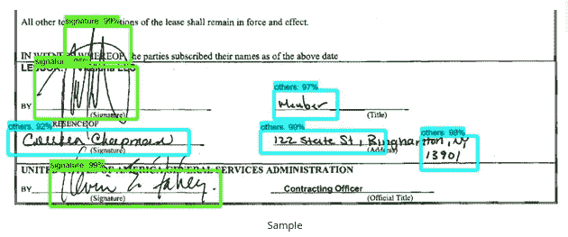

# 使用图像处理和机器学习对银行、金融和保险领域的手写和打印文档进行分类

> 原文：<https://medium.com/analytics-vidhya/handwritten-and-printed-document-classification-using-image-processing-machine-learning-for-f3d85b61c9a?source=collection_archive---------1----------------------->

手写和部分手写文档是 ocr 从银行、金融和保险行业的各种扫描 pdf 格式的申请表格中提取实体的挑战领域之一。

这种从扫描的 pdf 中检测不到文本的特殊情况，稍后会中止通过用于文档分类和实体提取(文本/签名/复选框/单选按钮等)的各种机器学习和深度学习算法对文档的正确预测。)而这又降低了生产环境中机器学习模型的整体准确性。

# **基于深度学习的方法&挑战**

简单的卷积神经网络(CNN)可以被设计用于检测手写和印刷文档，只需通过使用 3×3 核过滤器将它们标记为手写和非手写文档。

> **以下是基于 CNN 模式的挑战:**
> 
> 1.一张 A4 大小的纸通常由 2500×2500 个像素组成，它为要训练的模型生成 6，25，000 个数据点。现在，如果我们取最少 10，000 页，那么这些数据点将会增加，模型将需要几个小时或几天来运行。
> 
> 2.内核过滤器大小必须尽可能小(3×3 ),以识别文档中最小的手写补丁，这再次增加了模型训练时间。
> 
> 3.在只有一个或两个实体是手写的情况下，部分手写文档检测是非常困难的。例如，日期、签名或复选框。
> 
> 4.需要复杂的硬件基础设施来处理具有可测量的召回和精度值的如此巨大的数据。在这种情况下，GPU 将是最适合模型训练的基础设施，但在许多情况下，它不具有成本效益。

# **基于机器学习的方法**

该方法包括图像处理、特征提取和最大似然建模。与基于 CNN 的模型相比，所生成的模型在内存占用和时间复杂度方面将更加优化。

架构和管道

## 图像处理

图像处理是模型流水线中最重要的步骤之一。必须对数据进行处理，以提高分辨率、像素密度、大小、偏斜度、对齐度等。后来，图像分割将有更好的特征工程和提取质量补丁。

1.  **扫描的 pdf 转换**为 JPEG/PNG/PPM/TIFF 图像。Poppler 是一个基于 Python 的 API，它将文档转换成图像格式。为了优化内存使用和计算，请尝试将文件转换为 JPEG 格式，尤其是避免 TIFF 格式。这是我在 stackoverflow [上给的 Poppler](https://stackoverflow.com/questions/18381713/how-to-install-poppler-on-windows/63774687#63774687)[https://pypi.org/project/python-poppler/](https://pypi.org/project/python-poppler/)的链接和安装方法 https://stack overflow . com/questions/18381713/how-to-install-Poppler-on-windows/63774687 # 63774687
2.  **灰度转换**将图像转换为灰度。为此，我们需要调用 cvtColor 函数，它允许将图像从一个颜色空间转换到另一个颜色空间。

`gray **=**` `cv2.cvtColor(image, cv2.COLOR_BGR2GRAY)`

作为第一个输入，这个函数接收原始图像。作为第二个输入，它接收色彩空间转换代码。由于我们想要将原始图像从 **BGR** 色彩空间转换到**灰色**，我们使用代码 **COLOR_BGR2GRAY** 。

**3。分辨率提升**这是最常用的虚化方法。我们可以用这个过滤器来消除图像中的噪声。我们需要非常小心地选择核的**大小，并且应该小心地选择 x 和 y 方向上高斯分布的**标准偏差**。**

**4。OTSU 阈值处理**在全局阈值处理中，我们使用任意选择的值作为阈值。相比之下，Otsu 的方法避免了必须选择一个值，而是自动确定它。

考虑一个只有两个不同图像值的图像(*双峰图像*)，其中直方图只包括两个峰值。一个好的阈值应该在这两个值的中间。类似地，Otsu 的方法从图像直方图中确定最佳全局阈值。

为了做到这一点，使用了[**【cv . threshold()】**](https://docs.opencv.org/master/d7/d1b/group__imgproc__misc.html#gae8a4a146d1ca78c626a53577199e9c57)函数，其中 [**cv。THRESH_OTSU**](https://docs.opencv.org/master/d7/d1b/group__imgproc__misc.html#ggaa9e58d2860d4afa658ef70a9b1115576a95251923e8e22f368ffa86ba8bce87ff) 作为额外标志传递。阈值可以任意选择。然后，该算法找到作为第一个输出返回的最佳阈值。

**5。形态学操作**是一组基于形状处理图像的操作。它们将结构化元素应用于输入图像并生成输出图像。
最基本的形态学操作有两种:**腐蚀和膨胀**

**侵蚀:**

*   侵蚀前景对象的边界
*   用于缩小图像的特征。

**我们使用的腐蚀用法案例:**

> 核(奇数大小(3，5，7)的矩阵)与图像进行卷积。但是对于我们的具体情况，我将生成图像片段的内核大小设为(5，100)。
> 
> 只有当内核下的所有像素都是 1 时，原始图像中的像素(1 或 0)才会被视为 1，否则它会被侵蚀(变为零)。
> 
> 因此，根据内核的大小，所有靠近边界的像素都将被丢弃。
> 
> 因此前景物体的厚度或尺寸减小，或者图像中的简单白色区域减小。

**扩张:**

*   增加对象区域
*   用于强调特征

**我们用例中膨胀的用法:**

> 核(奇数大小(3，5，7)的矩阵)与图像进行卷积
> 
> 如果内核下至少有一个像素为“1”，则原始图像中的像素元素为“1”。
> 
> 它增加了图像中的白色区域或者增加了前景物体的尺寸

**6。轮廓&分割**将根据定义为 5x100 的内核大小将文档图像分割成多个图像片段。这些图像补片稍后可用于数据的特征工程。

## **特征工程&特征提取**

图像处理步骤将在分辨率、像素密度、黑电平改善、白电平改善等方面改善和优化图像质量。现在，分段修补后的图像可用于特征工程和特征提取。

1.  **高度** **:** 该特征生成每个图像片段或片的高度。
2.  **宽度**
3.  **宽高比** **比** **:** 它是一个数字，表示每个图像片段或图像块的宽高比。(AR =宽/高)
4.  **黑色像素密度:**这代表前景白色平面上一个补丁中可用的黑色像素的密度。
5.  **白色像素密度:**这表示前景黑色平面上的补丁中可用的白色像素的密度。

模型的可提取特征

特征提取片段

## **机器学习模型**

从分割图像中提取的特征也称为碎片，现在可以用于模型训练目的。目标变量包含手写和数字两类。

各种分类器的最终结果如下所示:

使用随机森林模型可以获得最佳结果。这些结果是根据下述假设和数据得出的:

> 手写样本总数:1000
> 
> 数字样本总数:1500

通过将样本数量增加到 10，000 以及调整随机森林模型的超参数，可以改善上述结果。

## 结论

这种基于特征工程和分类的分割的主要优点在于，在给定的页面或文档中，基于被分类为手写的小块的总数，可以用于判定文档是手写的、部分手写的还是数字的。

基于机器学习的方法相对来说不需要太多的内存和时间。与需要密集计算和 GPU 的深度学习模型相比，这在基础设施方面的计算支出最少。

***以上片段可进一步用于根据各种距离算法(如 Levenshtien、Jarowinkler 等)创建您自己的 OCR。***

这些模型可以避免质量差的手写文档的 ocr 阶段，从而节省了资源，避免了 ocr 准确性差的人工分析。