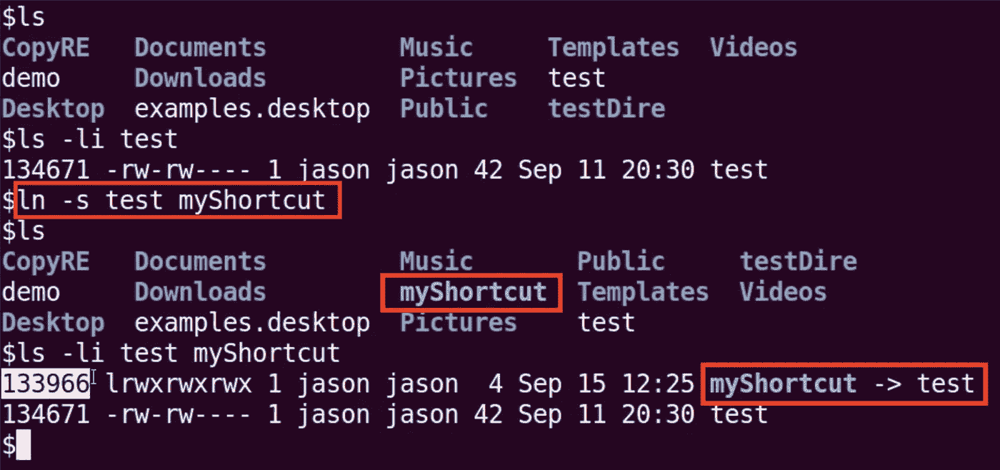

# Linux 中的硬链接和软链接

> 原文：<https://medium.com/analytics-vidhya/hard-links-and-soft-links-in-linux-e05a3297e381?source=collection_archive---------22----------------------->

Linux 是基于存储的**操作系统** (OS)，这意味着它的所有功能都是通过文件和文件夹的交互来管理的。当你给你的计算机下命令时，它会搜索与该命令相关的文件，并通过一个函数返回给你。这些文件保存在硬盘驱动器的特定部分，因此我们可以将操作系统视为能够管理硬件和软件之间通信的系统。

硬盘是一种物理对象，我们可以看到它，触摸它，并且能够存储系统拥有的所有信息。但是我们如何获取这些信息呢？我们不能手动打开硬盘看文件，虽然它们是以虚拟的方式存在的。这是操作系统参与的地方。首先，我们需要知道文件的实际位置，这样我们才能找到它。假设我们正在文件柜中搜索一个特定的文件。如果我们没有一个号码，文件夹的名称或某种识别，这将是令人难以置信的乏味，很难找到文件的实际位置。因此，为了进行有效的搜索，我们需要了解一些关于我们正在寻找的信息。


我们的 Linux 就是这样对待文件的。当我们存储一个文件时，它的所有信息都是和它一起创建的。硬盘上的位置、大小、所有者、文件类型、访问权限，以及我们如何才能毫不犹豫地找到它。在 Linux 上，这被称为**索引节点**(索引节点)，它存储了我们需要知道的关于文件及其 id(标识号)的所有信息，除了内容及其名称。

# 硬链接

所以现在我们知道了 Linux 在硬盘上存储文件的方式，但是现在我们不知道如何访问它们。不像文件归档程序，当我们找到我们要找的文件时，我们不能读取整个文件，因为它会从系统中被破坏。我们需要读取它们的副本，这样系统就不会忘记文件的存在。这被称为**硬链接**，是一种不直接操作文件内容的有效方法。

它被命名为“链接”，因为它不是实际的文件，它是一个指向文件在硬盘上的实际位置的指针，所以我们可以很容易地访问它。除了它的名字，正如我们之前提到的，在 Linux 上所有的东西都是一个文件，我们可以删除它。可以想象，删除硬链接会使硬盘上的文件不可访问(除非我们有另一个相关的硬链接)，因为我们将不再有任何安全的方法来访问它。此外，这个硬链接包含来自实际文件的相同的 **inode** 号，因为它处理与原始文件相同的信息。

# 创建一些硬链接

我们可以主要通过**图形用户界面** (GUI)来管理操作系统，但有时如果我们想改变操作系统的工作方式，我们需要使用**命令行界面** (CLI)。第一个对用户更友好，因为我们可以通过菜单、窗口、滚动条、按钮等与系统交互。另一方面，CLI 通过系统解释为直接命令的命令来运行。

作为用户，我们有能力控制我们的操作系统，所以了解操作系统的两种方式会让我们更有能力让我们的系统做我们想做的事情。在这种情况下，如果我们想要创建一个硬链接，我们需要在 CLI 上给出特定的命令，让系统创建一个硬链接。

```
ln sourcefile hardlink
```

首先，我们需要运行命令“ln”(代表“link”)来创建一个链接。然后，我们需要指定我们要链接的文件是什么“源文件”以及链接文件的名称是什么“硬链接”。如果您运行这个命令，您将会成功地创建一个硬链接。


正如我们在这个终端上看到的，创建了一个**硬链接**，它被附加到实际的文件信息中。如果您仔细查看文件信息行，您会发现在创建链接后，第一个数字是相同的。这是 **inode** 的编号，正如我们所看到的，它与我们创建的硬链接是同一个编号。这一行中的另一个数字已经更新，这个数字代表该文件拥有的**硬链接**的数量。权力越大，责任越大，所以请记住，链接也是一个文件，因为每个文件你都可以删除，所以要小心。

# 软链接

但是硬链接并不是 Linux 上链接文件的唯一方式。我们还得到了**符号链接**，俗称**软链接**。如果你熟悉 Windows 操作系统，这类似于快捷方式。这些链接是不包含内容或名称文件的文件。但是它们包含它的地址，所以我们可以找到文件的原始文件内容，而不需要费心去搜索它。与**硬链接**不同，**软链接**不具有与原始文件相同的 **inode** ，这意味着它们不在硬盘的同一位置。但是，原始文件的 **inode** 包含链接所在位置的信息。你可以假设删除这类文件不会对原始文件产生任何影响，你可以想要多少就有多少。

它们被称为**软链接**是有原因的。它与原始文件的联系并不重要，您可以根据需要创建任意多的文件并删除它，而不会破坏原始文件。这并不意味着它们不重要。实际上，作为一个用户，如果你想把一个文件放在手边，这真的很有用。用一个简单的命令或一个简单的 clic 打开它总是比搜索文件的存储位置要好，节省一些时间总是很重要的。

# 我们如何创建一个软链接？

所以现在我们已经知道如何创建一个硬链接，这将是很容易理解如何创建其中之一。过程非常相似，我们打开终端并移动到我们想要创建它的文件夹。然后我们运行这个命令:

```
ln -s sourcefile linkfile
```

**硬链接**是系统创建的标准链接类型，所以我们需要向命令指定我们想要的链接类型。我们可以在命令中添加一个标记。在命令“ln”之后，我们添加了代表符号的“-s”。之后是和之前描述的相同的过程，添加我们想要链接的文件和链接的名称。



正如我们在终端示例中看到的(为了更清楚起见，链接文件被命名为“myShortcut ”),运行命令后，链接看起来与硬链接有点不同。不仅显示为一个不同的文件，它还被突出显示，以使它是另一种类型的文件。此外，当我们列出文件的信息时，我们可以看到一个指示它指向哪里的箭头。

请记住，我们可以在与原始文件不同的位置创建该文件，但是为了做到这一点，我们需要附加我们要链接的文件(源文件)的路径(文件夹)。


如果您一直学习到这里，您会对什么是链接以及 Linux 文件系统如何工作有一个很好的了解。如你所见，这个文件柜有点复杂。然而，了解这些概念会让你对操作系统更有信心，让你更有能力让系统按照你想要的那样工作。文件是操作系统效用的重要组成部分，它赋予我们存储大量信息的能力，并使访问这些信息变得容易，因此知道如何有效地管理这些信息会使我们在工作领域成为更好的专业人员。