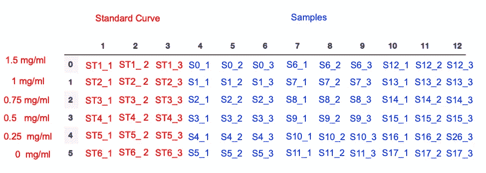
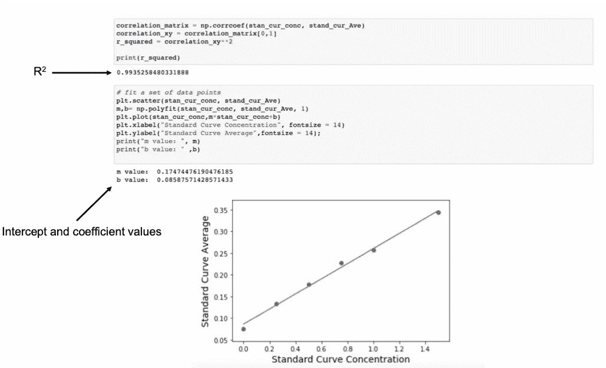
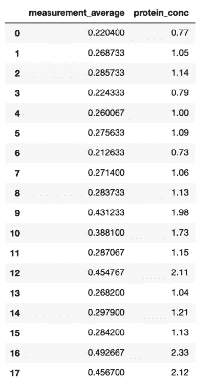

# 利用数据科学简化生物医学研究

> 原文：<https://medium.com/analytics-vidhya/harnessing-data-science-to-streamline-biomedical-research-c8164a6ab769?source=collection_archive---------35----------------------->

科学是最重要的知识渠道之一，科学进步是现代发达世界的基石。这一点现在再清楚不过了。新冠肺炎疫情奖和为新冠肺炎开发有效疫苗和/或治疗方法的探索让生物医学研究崭露头角。然而，外行人仍然对生物医学研究的内容知之甚少。在我得到一份生物医学研究实验室的工作之前，我对生物医学研究在实践中的作用也有一个非常扭曲的想法。可能是受我们在电影和电视上看到的影响，我认为在实验室工作和做生物医学研究意味着一切都由尖端技术驱动。然而，在开始工作后不久，我就意识到，尽管科学家拓展了我们知识的边界，但他们处理日常数据分析的方式相当“老派”。不要误会，生物医学研究是由尖端技术和高水平的数据分析推动的。这在人类基因组计划中显而易见，该计划旨在破译人类 DNA 序列，并使医学发生了转变，从而允许更精确的诊断和个性化的医学。然而，生物医学实验室的日常工作在很大程度上依赖于非自动化的非常基本的数据分析工具(例如 Microsoft Excel 电子表格)。

我不确定这是为什么。也许生物医学科学家太忙于思考生物学问题和做实验，以至于没有时间创造新的数据分析工具，而他们总是很容易做到这一点。也许他们只是不知道如何自动化它。我发现最有趣的是，程序员可以很容易地帮助构建一些基本的自动化工具，用于实验室的日常数据分析，这反过来可以节省大量的时间来进行实验。这个问题的部分原因是，实验室研究和编码是非常不同的领域，数据科学家不知道在实验室进行基础研究的生物医学科学家需要什么工具，科学家也不知道数据科学家可以帮助他们建立工具。为了充分理解这个问题，以及数据科学家如何让实验室科学家的工作更加高效，我们真的需要更深入地了解一名基础科学家在实验室中的日常工作。我在实验室工作的时间让我有机会看到这两个不同的世界，并思考科学发现背后的实际问题。

使用数据科学工具支持日常实验室研究的一个很好的例子是基本蛋白质定量，世界各地生物/生物医学实验室的每个人每天都在使用它。蛋白质定量方法基于化学反应，其中样品中的蛋白质与化学物质反应并产生颜色。颜色的强度与样本中的蛋白质含量成正比，研究人员使用一种叫做分光光度计的特定设备来测量蛋白质含量(分光光度计能够测量颜色强度的差异——不同的颜色强度导致不同的吸光度，由分光光度计测量)。该方法的原理在于使用具有已知蛋白质的已知浓度的多个浓度点的标准曲线，然后使用该标准曲线以数学方式估计未知样品的浓度。当我看到我的实验室同事从分光光度计数据到蛋白质浓度需要多长时间时，我意识到如果他们有一个简单的工具，只需输入分光光度计的吸光度值，就可以立即获得样品的浓度，他们将节省多少时间。因此，我决定构建一个基本的 python 模块，根据分光光度法测得的吸光度值自动确定蛋白质的定量。这里我描述了如何使用这个模块:

1-准备包含吸光度水平的 Excel 文件，以导入 python 蛋白质定量模块，如下所示:

**备注:**

> -该 python 蛋白质定量模块假设每个样品(或标准品)读取三份(如上所示，每个副本的吸光度位于不同的列中)。
> 
> -您可以直接导入您的 excel 文件并修改我的代码，通过删除不必要的列/行(如我所做的)来使表格符合分析所需的格式，或者如果您不习惯使用 python，可以在导入数据之前在 excel 上完成。

2-将包含吸光度水平的 Excel 文件导入 python 蛋白质定量模块。为此，只需在 python 模块中更改文件名，如下所示:

*数据现在看起来像这样:*

这就是模块如何看到表上每个值的标识:

3-现在数据已导入模块，模块做的第一件事是计算每个三份的平均值，以便在下游分析中使用单个吸光度值。然后生成包含标准曲线数据的散点图，并进行回归分析以确定蛋白质浓度和吸光度测量值之间的关系。置信度由回归的 R2 显示，并且允许估计样品中蛋白质浓度的截距和系数值被自动确定并显示如下:

4-有了这些信息，模块可以自动地直接估计每个样品中的蛋白质浓度。这是通过使用循环迭代数据集中存在的所有样品来完成的，该代码使用标准曲线产生的回归模型来预测每个样品中的蛋白质浓度(其遵循 y=mx+b 方程，其中 y 是吸光度，x 是待预测的样品)。这将给出每个样品中的预测浓度，单位为 mg/ml，如下所示:

我们完了。您可以在下面的 URL 中找到并使用我在本文中描述的 python 模块:[蛋白质定量](https://github.com/dendar/Protein-quantification)