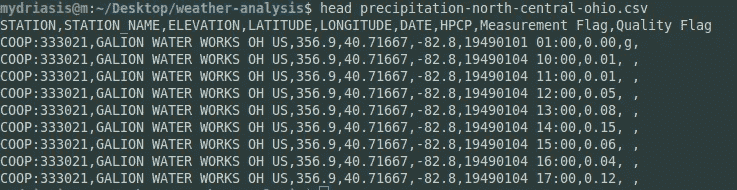
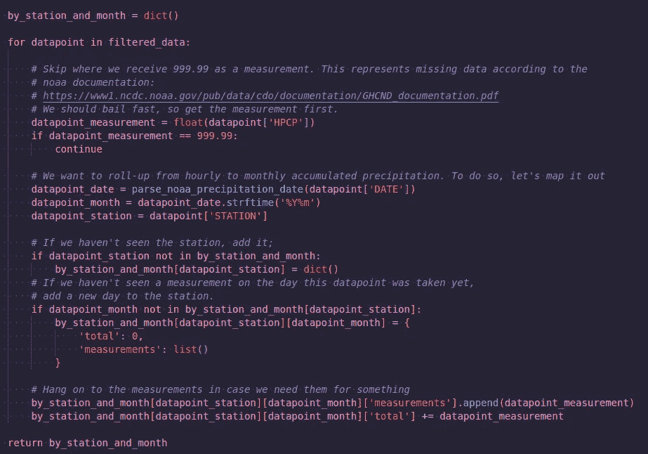
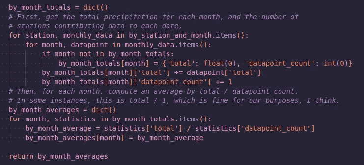
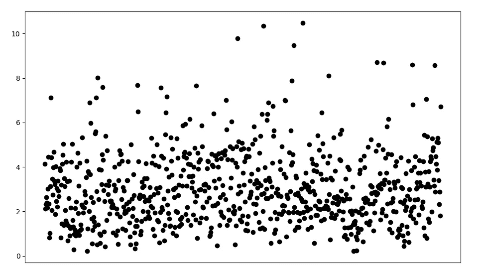
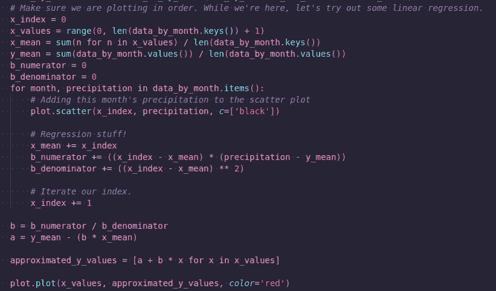
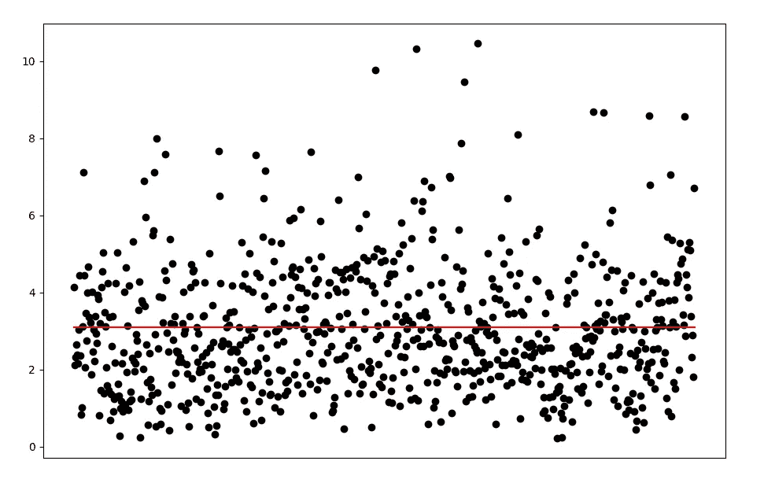

# 仓促建立的降水分析

> 原文：<https://medium.com/analytics-vidhya/hastily-constructed-precipitation-analysis-32e132dc1933?source=collection_archive---------12----------------------->

我最近搬到了俄亥俄州的一个偏僻的地方，因为我的公司搬到了偏远的地方，我想要一些旧的“混凝土丛林”所不能提供的更好的风景。我搬到的这个地区值得注意的一点是，它的降雨量比城市里多得多。以至于某个不是我的人问了这样一个问题，“这是这个地区正常的降雨量吗？还是？”

所以！像一个优秀的小程序员一样，我有权工作。*这是正常的降雨量吗？如果不是，有多不正常？*事实证明，寻找答案是一场完美的午后冒险。

首先，我需要弄清楚，确切地说，我应该从哪里获得这类信息。在谷歌搜索了大约 7 分钟后，我设法找到了去美国国家海洋和大气管理局的路。他们有各种像这样的可以追溯到很久以前的数据集。事实证明，获得感兴趣地区的数据集非常容易——您只需使用他们出色的地图工具来选择您想要查看数据的站点！我决定尝试获取我所在区域的[法线数据集](https://gis.ncdc.noaa.gov/maps/ncei/normals)是个好主意。这是个错误。我下载了数据，并注意到它没有一年，只有一个月。我花了*比应该花的时间长得多的时间*才明白我已经下载了错误的数据。

好吧好吧好吧。我决定再次狩猎，直到我发现，很像正常人，你可以专门下载降水数据。我决定为我新家周围精心挑选的区域获取[降水数据集](https://gis.ncdc.noaa.gov/maps/ncei/cdo/hourly?layers=001)。令人惊讶的是，你可以…在你想要的东西周围拖一个盒子。

所选的天气区域，或多或少。

然后，获取数据就相当简单了。你选择你想要的数据集，然后“将它们添加到你的购物车”，用你想要的数据构建一个小的顺序。这需要一点时间，但很快，您就会收到一封包含数据链接的电子邮件。而且数据很酷！

一些样本降水数据

它没有满足我所有的需求或愿望，但它足以让我进行快速而粗略的分析。在这次分析中，我真正关心的字段是 HPCP ( [以英寸为单位的每小时降雨量](https://www.battelleecology.org/da-viz-coop-precip-data-R#:~:text=HPCP%3A%20The%20total%20precipitation%20given,value%20999.99%20indicates%20missing%20data.)和日期。几行 CSV 解析代码，我就可以开始了。

最大的障碍是将数据提升到月度水平。由于数据集包含小时级别的测量值，我需要按站进行汇总，然后进一步汇总到每个月各站的平均值。嗯，我想我没有走那条路。只是看起来不错，万一我以后要用站级数据，就不多了。这部分的代码相当简单:

按电台和月份累计

我先在车站装了一本字典，然后按月装。我保存了任何给定月份的累计降水量，但也保存了单独的测量值，*以防万一*。

在这一点上，我注意到一些测量结果是 999.99。根据 NOAA 文件，这意味着这些数据点丢失或没有足够的数据。像一个优秀的统计学家一样，我把这些扔进了垃圾桶，希望没人看见。

在接下来的部分，我需要得到每个月的降雨量。这糟透了，因为我有很多电台。我大胆猜测了一下，心想，“好吧，我们就每个月计算一下所有站点的平均降雨量吧。”我…认为我做得对。对吗？这似乎是合法的。代码…效率不高。但它在紧要关头完成了任务。

构建“按月”平均值

现在我已经准备好开始策划了。现在，我不是 matplotlib 向导。我永远不会自称是。这并不是说你在外面，你在做大事，你在顶层公寓区。我…只是还没有提高我的那部分技能。

但是！我*可以*很快做出一个丑陋的散点图。现在，你会记得我已经把日期都安排好了。我真的，真的想要剧情里的那些人。但他们至少有 100 人，所以我决定抛弃他们。如果你知道怎么做才不会很烂，请随时留下评论。这是从另一边出来的情节！

嗯，是的，这里的数据是由数据组成的

所以是的，这些地方有大量降水。但是，有增加的趋势吗？递减？一点都没有！？

为了找到答案，我刷掉了我尘封已久的线性代数知识，编写了一个快速线性回归程序。有这方面的图书馆吗？当然可以。但是这有什么意思呢？反正我也不知道怎么用 numpy。

线性回归代码

我把分子和分母分开，因为…嗯，因为嗯…

从弹出的情节，没有进一步的分析(因为，当然，没有必要。代码是 100%完美的，很好。别看了。也不看数据。)我们可以得出这样的结论:尽管这里可能下了很多雨，但这里似乎……总是下很多雨。这是一个非常无趣的结果，但是，嘿，这也是一个结果。

产生的回归线

拟合优度？你在说什么？“使用正确的工具？”走开，好吗？一个星期天的下午，我很无聊。

感谢你的阅读！你可以在这个 [github gist](https://gist.github.com/svidovich/14ccdd51bd7f9cbfbf9f1821968a0f0b) 里找到代码。如果你在代码/分析中看到任何明显的问题，请评论！我会学到新的东西。

引文

资料来源:用户参与和服务处。DOC/NOAA/NESDIS/NCDC >国家气候数据中心，NESDIS，NOAA，美国商务部。