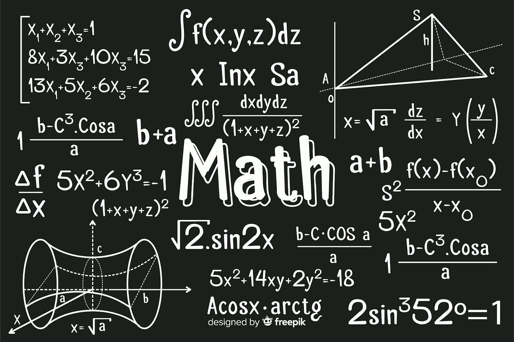

# 不确定性:熵

> 原文：<https://medium.com/analytics-vidhya/have-you-ever-think-about-how-certain-you-are-about-the-occurring-events-or-decisions-you-make-e625c7353e55?source=collection_archive---------16----------------------->

你有没有想过你对正在发生的事情或你做出的决定有多确定？如果有，那就更详细的说吧。

首先，让我们从“什么是不确定性”开始。“不确定性是指涉及不完善或未知信息的认知情况。它适用于对未来事件的预测，适用于已经进行的物理测量，或者适用于未知事物”。这是维基百科的定义。

基本上，它是衡量你对某事有多确定的标准。例如，如果你知道盒子里有三个红色的球，如果有人让你不看着球就选一个球并说出它的颜色。你对说出球的颜色有多少把握？100%确定的答案是红色的。意味着你的不确定性水平在这个状态下是最小的，因为你对盒子有足够的了解。那么，如果有 2 个红色的球和 2 个绿色的球，问同样的问题，你会确定你的答案和上一个一样吗？绝对不是，有同样可能的两种结果，在这种情况下，你完全不确定结果。这就是不确定性所在。

在统计信息论中，有一个终端叫做“香农熵”，它衡量的是我们所说的不确定性。让我们再回忆一下之前的场景，从数学上思考一下。

我们可以看到，较高的熵意味着我们对某些东西更不确定，我们可以确定熵是否低。

或者我们可以通过问是/否问题的平均数来定义熵，以最聪明的方式找到随机结果的答案。例如，在第一个场景中，你需要问多少个问题才能找到球的颜色？零。因为你知道那是红色的，熵是零。

在第二个场景中，如果有人捡了一个球，你需要问一个问题来找出球的颜色。例如，你可以问“它是红色的吗？”，如果是，则为红色，否则为绿色。如果有 2 个红色的球和 1 个绿色的球，还有 1 个蓝色的球呢？你可以问“它是红色的吗？如果是，它是红色的，否则它是绿色的，如果是绿色的，否则它是蓝色的。所以你会问 1 到 2 个问题，平均(1+2)/2 = 1.5。这里熵将是 1.5。让我们用公式来检查一下:

假设我们有一枚公平的硬币，有正面和反面两种可能的结果。我们有一个盒子，里面有三个红色的球，一个绿色的，一个蓝色的和一个黄色的球。所以正面或反面的概率是 0.5，选择红球的概率也是 0.5。看起来，如果他们有相同的概率，所以我们同样肯定尾巴和红球，因为他们有一半的机会发生。但是如果看看两种情况下的熵，

它表明，无论概率如何相同，我们都不能在同一水平上确定选项是否更多。因为硬币的熵比盒子的小，所以我们对硬币的结果更有把握。

熵是机器学习中广泛使用的度量，特别是在决策树这样的分类算法中，我想对“不确定性”及其度量“熵”做一个简单易懂的解释。

感谢阅读！！！