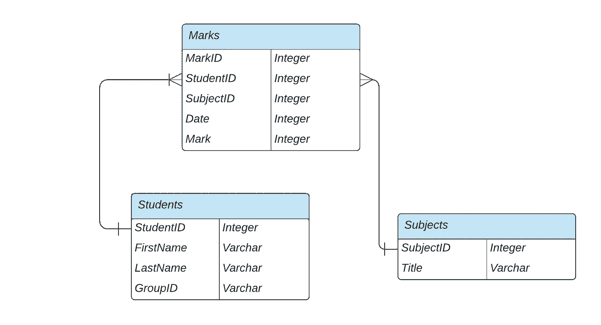
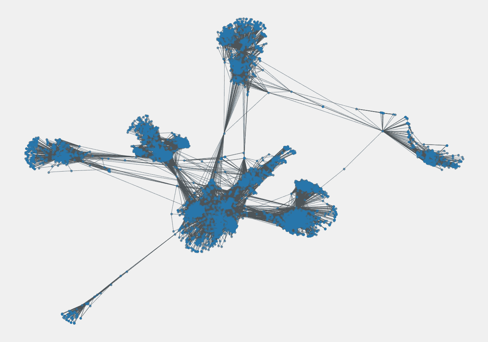
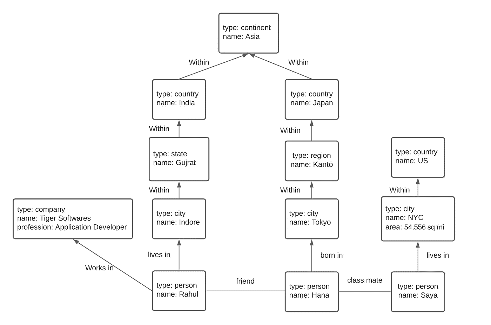
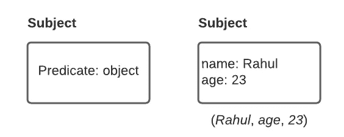
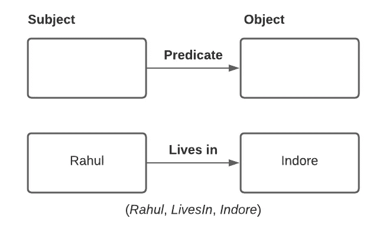

# 你听说过图形数据模型吗？

> 原文：<https://medium.com/analytics-vidhya/have-you-heard-of-graph-data-models-84e502b40647?source=collection_archive---------13----------------------->

## SQL，NoSQL，接下来呢？

照片由[在](https://unsplash.com/@comparefibre?utm_source=unsplash&utm_medium=referral&utm_content=creditCopyText) [Unsplash](https://unsplash.com/s/photos/patterns-light-in-dark?utm_source=unsplash&utm_medium=referral&utm_content=creditCopyText) 上对比纤维

我们都熟悉关系和文档数据模型以及依赖这些模型为数据提供逻辑结构数据库。

但是很少有其他数据模型值得思考。

类似图形的数据模型在大众中并不流行，但却为许多数据系统(如推荐系统)提供了动力，并且是数据科学、分析和人工智能等新兴领域对可扩展解决方案的迫切需要。

# 需要…

任何使用过关系数据库的人都知道，数据是以所谓的*关系*来组织的，其中每个关系都是一个无序的*元组*集合。

一个简单的数据库 ER 图。

关系数据模型适用于大多数用例，尤其适用于数据具有某种规则结构且很少有多对一或一对多关系的情况。

当应用程序主要具有一对多关系(树结构/类似文档的结构，通常需要一次加载整个树)或记录之间没有关系时，文档模型成为选择。像 MongoDB 这样的名字开始发挥作用。

当我们的数据有太多的多对多关系时，它就开始崩溃。

关系数据模型中的连接操作会使查询变得非常困难，也难怪强制实施模式会有其他限制。文档模型完全缺乏对连接的支持，而是关注于*位置*。

具有许多多对多关系的图形数据。

一个图由两种对象组成:顶点(*节点*或*实体*和*边* ( *关系*或*弧线*)。通常建模为图形的数据来自社交网络、网页网络等等。

图形结构化数据的示例(方框表示顶点，箭头表示边)

有几种不同的方法来构造和查询图形数据。我们将看两个通常由图数据库实现图模型。

1.  *属性图*模型
2.  *三店*模式

# 属性图模型

在属性图模型中，每个顶点包括

*   唯一的标识符
*   一组向外的边
*   一组引入边
*   属性(键值对)的集合

每个边缘包括:

*   唯一的标识符
*   边开始的顶点(尾部顶点*)*
*   边缘结束的顶点(头部顶点)
*   描述两个顶点之间关系的标签
*   属性(键值对)的集合

试图在关系模型中表示这个模型很容易，但是您不必在实际的数据库中这样做。

用关系模式表示属性图模型

这为我们提供了某些有用的功能，例如:

*   任何顶点都可以有一条边将它与任何其他顶点连接起来。
*   给定一个顶点，我们可以容易而有效地找到它的引入边和引出边。
*   通过对不同类型的关系使用不同的标签，我们可以存储几种不同类型的信息。
*   足够灵活，可以存储大量相似的信息(注意上面的图表；哈娜住在*地区*坎特，拉胡尔住在*邦*古吉拉特。Rahul 的职业是应用开发者)。

实现这个数据模型的数据库有 [Neo4j](https://neo4j.com/) 、Titan 和 InfiniteGraph。

## 密码查询语言

Cypher 是一种图形查询语言，开发该语言是为了查询最初打算与图形数据库 Neo4j 一起使用的属性图。

每个顶点都有一个符号名，如用方括号`()`表示的`Indore`或`NYC`，查询的其他部分可以使用这些名称来创建顶点之间的边，使用带有方括号`[:<relationship>]`的箭头符号来表示关系(参考上面的图结构数据):

`(Indore) -[:WITHIN]-> (Gujrat) -[:WITHIN]-> (India)`

我们可以这样写 cypher query 中的数据:

上图中用 Cypher query 编写的数据的子集。

从这个图中查询数据也很容易，我们在一个`MATCH`子句中使用相同的箭头符号来查找图中的模式。

让我们*找到所有居住在古吉拉特邦、在 Tiger Softwares 工作的人*(假设我们已经添加了所有数据)。

该查询可以解释如下:

找出满足以下两个条件*的任意顶点(称之为`person`):*

1.  `person`有一个到类型`Company`的某个顶点(称之为`TS`)的输出`WORKS_IN`边，其`name`属性设置为“Tiger Softwares”。
2.  同一个`person`也有到某个顶点的外向`LIVES_IN`边，沿着从那个顶点到外向`WITHIN`边的链，到达类型为`Location`的顶点，其`name`属性已经被设置为“Gujrat”。

对于每个这样的人，返回其`name`属性。

# 三重存储或 RDF 存储

三重存储模型是另一个与属性图模型非常相似的图模型，但是具有更简单的思想。

在三重存储中，信息以非常简单的三部分语句的形式存储:(*主语*，*谓语*，*宾语*)。比如三联( *I* 、 *want* 、 *apple* )、 *I* 是主语、 *want* 是谓语(动词)、 *apple* 是宾语。

三元组的主语相当于图中的一个顶点。

该对象是以下两种情况之一:

*   原始数据类型中的值。在这种情况下，谓词和对象形成了主题顶点上属性的键值对。

*   图中的另一个顶点。在这种情况下，谓词是一个边标签，头顶点是宾语，尾顶点成为主语。

图形数据可以写成 [Turtle](https://en.wikipedia.org/wiki/Turtle_(syntax)) triples，Tutle 代表 **Terse RDF Triple Language，**是[**资源描述格式**](https://en.wikipedia.org/wiki/Resource_Description_Framework) **中表示数据的语法和文件格式。**

顶点表示为`_:someName`。这个名字的存在只是为了知道哪个三元组指的是同一个顶点。然后谓词以跟在对象后面的`:`开始。

以 Turtle triple 格式编写的图形数据的相同子集。

当谓词是一个属性时，宾语是一个字符串文字，如`:name "India"`

当谓语是边时，宾语是顶点，如`:worksIn _:ts`所示。

这个模型是由 Datomic、AllergoGraph 和其他人实现的。

## SPARQL 查询语言

SPARQL(读作“sparkle”)代表 *SPARQL 协议，RDF 查询语言*是一种使用 RDF 数据模型的三重存储查询语言。

与之前相同的查询— *查找居住在古吉拉特邦、在 Tiger Softwares 工作的人*—可以用 SPARQL 写成如下形式:

需要注意的关键是 SPARQL 中的变量以问号开头。

今天到此为止。我希望你学到了新东西。

***保持学习……***

来自 anuragdhadse.com[的广播](http://anuragdhadse.com)