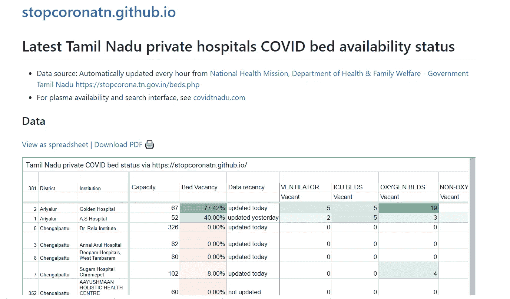

# 卫生基础设施分析第 2 部分:泰米尔纳德邦

> 原文：<https://medium.com/analytics-vidhya/health-infrastructure-analysis-part-2-tamil-nadu-b98f2daf9f39?source=collection_archive---------18----------------------->


在我们的 [**上篇**](/analytics-vidhya/indian-healthcare-analysis-part-1-how-prepared-were-we-for-the-epidemic-8c2459fdd9c1) 中，我们分析了印度的卫生基础设施。泰米尔纳德邦是印度表现最好的邦，医院病床数量最多。所以今天我决定分析泰米尔纳德邦是如何应对第二次浪潮的，以及他们是如何为高峰期做准备的。

## 活动案例

泰米尔纳德邦目前活跃的病例总数超过 10 万，而超过 90 万已经痊愈。


# 泰米尔纳德邦医疗基础设施

我已经从 [**Github**](https://stopcoronatn.github.io/) **，**下载了 CSV 文件，他们是从 state [**网站**](https://stopcorona.tn.gov.in/beds.php) **刮来的数据。**

> **从 Github 下载的步骤**
> 
> 点击 Github 链接。点击“以电子表格形式查看”。点击文件并下载你想要的格式。



数据每隔几个小时就会更新一次，这是我们将分析的最新数据(4 月 25 日)。启动您的笔记本并导入 CSV 文件，我们将尝试获取文件中所有列的信息。

```
import pyforest 
import plotly.express as px
tamil=pd.read_csv("Tamil_Nadu.csv")
tamil.info()
```


我们需要从文件中删除所有的“**NA”**值，并分配一个索引。

```
tamil.fillna(0, axis=0, inplace=True)
tamil.head(397).reset_index()
tamil.tail()
```


> 我已经使用 excel 公式(=SUM(RANGE1:RANGE LAST))在 excel 中手动添加了最后一列“总计”

提取这一行的值将得到所有数据的总和。

```
total_details=tamil.loc[396,['Bed Vacancy','COVID BEDS Total','COVID BEDS Occupied', 'COVID BEDS Vacant', 'OXYGEN SUPPORTED BEDS Total', 'OXYGEN SUPPORTED BEDS Occupied','OXYGEN BEDS Vacant','NON-OXYGEN SUPPORTED BEDS Vacant','ICU BEDS Total','ICU BEDS Vacant','VENTILATOR Total','VENTILATOR Vacant']]total_details
```


最重要的事实是，泰米尔纳德邦有 30%的床位空缺，这是一个令人鼓舞的迹象。氧气病床空缺为 2598 张，这也是一个不错的数字，但应该增加。

# 区域明智分析

既然使用了最后一行，我们可以删除它以便进一步分析。

```
tamil.drop([396], inplace=True)
```

删除最后一行后，我们可以可视化所有重要参数的分区数据。每个地区都有多家医院，它们的数据将显示在条形图中由白色竖线分隔的单个地区下。

## 通风机被占用

```
fig = px.bar(tamil.sort_values(by="VENTILATOR Occupied", ascending=True,inplace=True), 
             x=tamil['VENTILATOR Occupied'], 
             y=tamil['District'], 
             orientation='h')
fig.update_layout(uniformtext_minsize=2, uniformtext_mode='hide', autosize=False,
    xaxis_title="VENTILATOR Occupied",
    yaxis_title="District",
    width=500,
    height=700,
    title_text = 'Total VENTILATOR Occupied in Tamil Nadu ')
fig.show()
```


观察结果:钦奈和哥印拜陀这两个较大的城市拥有最高的职业。韦洛勒也受到日冕的影响。

## 泰米尔纳德邦总通风机空置

```
fig = px.bar(tamil.sort_values(by="VENTILATOR Vacant", ascending=True,inplace=True), 
             x=tamil['VENTILATOR Vacant'], 
             y=tamil['District'], 
             orientation='h')
fig.update_layout(uniformtext_minsize=4, uniformtext_mode='hide', autosize=False,
    xaxis_title="VENTILATOR Vacant",
    yaxis_title="District",
    width=500,
    height=700,
    title_text = 'Total VENTILATOR Vacant in Tamil Nadu ')
fig.show()
```


观察结果:钦奈是最富有的城市，空置的通风设备最多。马杜赖和塞勒姆也做得很好。

## 泰米尔纳德邦 ICU 床位总数

```
fig = px.bar(tamil.sort_values(by="ICU BEDS Vacant", ascending=True,inplace=True), 
             x=tamil['ICU BEDS Vacant'], 
             y=tamil['District'], 
             orientation='h')
fig.update_layout(uniformtext_minsize=4, uniformtext_mode='hide', autosize=False,
    xaxis_title="ICU BEDS Vacant",
    yaxis_title="District",
    width=500,
    height=700,
    title_text = 'Total ICU BEDS Vacant in Tamil Nadu ')
fig.show()
```


**观察**:看到塞勒姆目前的 ICU 床位空闲率是最高的，令人鼓舞。钦奈的床位不足 100 张，这是一个令人担忧的迹象。

## 泰米尔纳德邦的氧气病床总数

这是最关键的参数，因为印度目前正面临严重的氧气短缺。

```
fig = px.bar(tamil.sort_values(by="OXYGEN SUPPORTED BEDS Occupied", ascending=True,inplace=True), 
             x=tamil['OXYGEN SUPPORTED BEDS Occupied'], 
             y=tamil['District'], 
             orientation='h')
fig.update_layout(uniformtext_minsize=4, uniformtext_mode='hide', autosize=False,
    xaxis_title="OXYGEN SUPPORTED BEDS Occupied",
    yaxis_title="District",
    width=500,
    height=700,
    title_text = 'Total OXYGEN SUPPORTED BEDS Occupied in Tamil Nadu ')
fig.show()
```


观察:钦奈和哥印拜陀有很多床位。

## 泰米尔纳德邦的氧气床位总数

```
fig = px.bar(tamil.sort_values(by="OXYGEN BEDS Vacant", ascending=True,inplace=True), 
             x=tamil['OXYGEN BEDS Vacant'], 
             y=tamil['District'], 
             orientation='h')
fig.update_layout(uniformtext_minsize=4, uniformtext_mode='hide', autosize=False,
    xaxis_title="OXYGEN BEDS Vacant",
    yaxis_title="District",
    width=500,
    height=700,
    title_text = 'Total OXYGEN BEDS Vacant in Tamil Nadu ')
fig.show()
```


**观察**:钦奈和塞勒姆的空床位数量最多，但利润空间很小。800 个床位不足以容纳电晕的下一个高峰。

## 泰米尔纳德邦空置的 COVID 床位总数

```
fig = px.bar(tamil.sort_values(by="COVID BEDS Vacant", ascending=True,inplace=True), 
             x=tamil['COVID BEDS Vacant'], 
             y=tamil['District'], 
             orientation='h')
fig.update_layout(uniformtext_minsize=4, uniformtext_mode='hide', autosize=False,
    xaxis_title="COVID BEDS Vacant",
    yaxis_title="District",
    width=500,
    height=700,
    title_text = 'Total COVID BEDS Vacant in Tamil Nadu ')
fig.show()
```


观察:钦奈和塞勒姆有很多空的 covid 床位，然而，政府应该利用缓冲时间加快速度，以避免以后发生任何悲剧。他们应该从德里吸取教训，不要浪费任何时间。

# 结论

统计数据告诉我，泰米尔纳德邦目前做得很好，但他们没有达到顶峰，他们的一些数字是微不足道的，因此他们应该利用这个缓冲时间，缓冲他们的库存。让我们从错误中吸取教训，不要在印度任何地方出现另一个德里。