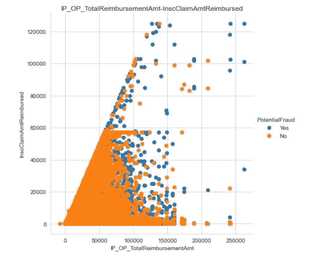

# 使用机器学习的医疗保健提供商欺诈检测分析

> 原文：<https://medium.com/analytics-vidhya/healthcare-provider-fraud-detection-analysis-using-machine-learning-81ebf09ed955?source=collection_archive---------0----------------------->

## 基于提供商提交的索赔以及住院患者数据、门诊患者数据和受益人详细信息构建二元分类模型，以预测医疗保健提供商欺诈。

**目录:** 1。简介
2。医疗保健提供商欺诈的类型
3。商务问题
4。ML 配方
5。业务约束
6。数据集列分析
7。绩效指标
8。探索性数据分析
9。我的车型中的现有方法和改进
10。数据预处理
11。机器学习模型
12。最终数据管线
13。未来工作
14。LinkedIn 和 GitHub 资源库
15。参考

# 1.简介:

**什么是医疗欺诈？**医疗欺诈是欺诈的一种。在这里，我们将分析和检测“医疗保健提供者欺诈”，其中提供者填写所有细节并代表受益人提出索赔。提供商欺诈是医疗保险目前面临的最大问题之一。医疗保健欺诈是一种有组织的犯罪，涉及提供商、医生、受益人的同行共同行动，提出欺诈索赔。根据美国法律，保险公司应在 30 天内支付合法的医疗索赔。因此，很少有时间来对此进行适当的调查。保险公司是最容易受到这些不良行为影响的机构。根据政府的说法，由于医疗保险索赔中的欺诈行为，医疗保险总支出呈指数增长。

# 2.医疗保健提供商欺诈的类型:

医疗欺诈和滥用有多种形式。提供商最常见的欺诈类型有:
**a)** 对未提供的服务收费。
**b)** 对同一服务重复提交索赔。
**c)** 歪曲所提供的服务。
**【d】**对比实际提供的更复杂或更昂贵的服务收费。
**e)** 当实际提供的服务不在承保范围内时，对承保服务进行计费。

# 3.业务问题:

统计数据显示，医疗保险总支出的 15%是由欺诈索赔引起的。保险公司是最容易受到这些不良行为影响的机构。由于这种不良做法，保险费也日益增加。
我们的目标是预测某个提供商是否存在潜在的欺诈行为或该提供商欺诈行为的概率得分，并找出其背后的原因，以防止经济损失。
根据概率得分和欺诈原因，保险公司可以接受或拒绝索赔或对该提供商进行调查。
找出潜在欺诈提供商背后的重要特征。例如，如果风险评分低的患者的索赔金额较高，则这是可疑的。
不仅经济损失是一个大问题，保护医疗保健系统也是一个大问题，这样他们才能为合法患者提供优质安全的护理。

# 4.毫升配方:

基于提供商提交的索赔以及住院患者数据、门诊患者数据和受益人详细信息，构建一个二元分类模型，以预测提供商是否存在潜在欺诈。

# 5.业务限制:

**a)** 误分类的成本非常高。假阴性和假阳性要尽可能低。如果欺诈性的提供者被预测为非欺诈性的(假阴性)，这对于保险公司来说是一个巨大的财务损失，如果合法的提供者被预测为欺诈性的(假阳性)，这将花费调查的费用，而且这也是一个机构的声誉问题。

**b)** 模型的可解释性非常重要，因为代理机构或保险公司应该证明欺诈活动是正当的，并且可能需要进行人工调查。它不应该是黑盒类型的预测。

**c)** 对于合法索赔，保险人应在 30 天内向提供方支付索赔金额。因此，没有这样严格的延迟限制，但它不应超过一天，因为根据模型的输出，机构可能需要建立一个调查。

# 6.数据集列分析:

**数据来源:**数据集在 Kaggle 的网站上给出。请找到下面的链接。

 [## 医疗保健提供商欺诈检测分析

### 医疗保健提供商欺诈检测分析

医疗保健提供商欺诈检测 ANALYSISwww.kaggle.com](https://www.kaggle.com/rohitrox/healthcare-provider-fraud-detection-analysis) 

**Train-1542865627584 . CSV:
Provider ID 是该表中的主键。**

**Test-1542969243754 . CSV**
它只包含提供商编号。我们需要预测这些提供商是否是潜在的欺诈者。

**门诊数据(训练和测试):** 它包含未入院的患者的索赔详细信息，这些患者仅在医院就诊。下面解释了重要的列。

**BeneID:** 包含每个受益人即患者的唯一 ID。
**ClaimID:** 它包含提供者提交的索赔的唯一 ID。
**ClaimStartDt:** 包含索赔开始的日期，格式为 yyyy-mm-dd。
**claimendt:**包含索赔结束的日期，格式为 yyyy-mm-dd。
**供应商:**包含供应商的唯一标识。
**InscClaimAmtReimbursed:**它包含该特定索赔的报销金额。
**主治医师:**它包含了给病人看病的医师的 id。
**手术医生:**包含给病人做手术的医生的 id。
**其他医师:**包含治疗患者的主治医师和手术医师以外的医师的 id。
**ClmDiagnosisCode:** 包含提供者对该索赔的患者进行诊断的代码。

**自付金额:**由患者支付的金额组成。等于 Total _ claim _ amount-repaired _ amount。

## 住院数据(培训和测试):

它包括入院病人的索赔细节。因此，它由 3 个额外的列组成:入院日期、出院日期和诊断组代码。

**入院日期:**包含患者入院的日期，格式为 yyyy-mm-dd。
**出院日期:**包含患者出院的日期，格式为 yyyy-mm-dd。
**诊断分组代码:**包含对患者所做诊断的分组代码。

**受益人数据(培训和测试):**该数据包含受益人 KYC 的详细信息，如出生日期、出生部门、性别、种族、健康状况(如有慢性病)、州、他们所属的国家等。该数据集的列解释如下。

**BeneID:** 包含收款人的唯一标识。
**DOB:** 包含受益人的出生日期。
**DOD:** 如果受益人 id 为交易，则包含受益人的死亡日期，否则为空。
**性别、种族、州、国家:**包含受益人的性别、种族、州、国家。
**肾脏疾病指标:**包含患者是否存在肾脏疾病。
**【ChronicCond_ *:**以“chronic cond _”开头的列表示患者是否患有该特定疾病。其还指示该患者的风险分数。
**IPAnnualReimbursementAmt:**由每年住院最高报销金额组成。
**ipanualdecudibleamt:**由患者每年住院支付的保费组成。
**OPAnnualReimbursementAmt:**由每年门诊最高报销金额组成。
**opanualdecudibleamt:**由患者每年门诊就诊支付的保费组成。

# 7.绩效指标:

由于医疗欺诈中的数据集高度不平衡(欺诈案例非常少)，“准确性”将不是合适的衡量标准。重要的第一步是绘制混淆矩阵。然后我们需要检查错误分类，即 FP 和 FN。FN 表示模型预测的案例是合法的，但实际上是欺诈性的。FP 表示模型检测到的案例是欺诈性的，但实际上是合法的。

因此，性能指标是:
**a)混淆矩阵:**这是将绘制 TP、FP、TN、FN 计数的表格。从这个表中，我们可以看到模型的性能。

**b) F1 得分:**是精度和召回率的调和平均值。 ***F1 得分= 2(精度*召回)/(精度+召回)*** 其中**精度= TP/(TP+FP)****召回= TP/(TP+FN)** 。因为 F1 分数由精确度和召回率组成，所以它将是这个问题的正确度量。

**c) AUC 评分:** AUC 代表 ROC(受试者操作特征)曲线下面积。ROC 绘制了不同阈值的 TPR。曲线下的面积取决于预测概率得分的排名，而不是绝对值。

**d) FPR 和 FNR:** 由于误分类的成本非常高，我们需要分别检查 FPR 和 FNR，应该尽量低。

# 8.探索性数据分析:

## **分类标签(提供者数据)的分配:**

**观察:**

这是一个高度不平衡的数据集。有 10%的欺诈性提供商和 90%的非欺诈性提供商。

## **性别分布(受益者数据):**

**观察:**

受益人数据中的性别比例为性别 _0:性别 _1 = 57% : 43%。

## **国家分布(受益人数据):**

**观察:**

1.  上图显示了受益人数最多的 20 个州。
2.  代码为 5、10、45、33 和 39 的州是前 5 个州。
3.  8.7%的受益人属于第 5 州。

## **国家分布(受益人数据):**

**观察:**

1.  上图显示了受益人数最多的 20 个国家。
2.  代码为 200、10、20、60 和 0 的国家是排名前 5 位的国家。
3.  2.85%的受益人属于国家代码 200。

## 种族分布(受益者数据):

**观察:**

1.  就受益人数而言，第一场比赛最多。
2.  85%的受益人属于第一种族。
3.  数据集中没有种族 4。

## **患者风险评分分布(受益者数据):**

**观察:**

1.  患者风险评分的分布是右尾的。
2.  大多数患者的风险评分为 2、3、4、5。
3.  很少有风险评分为 9，10，11，12 的患者

## **年度报销金额(住院和门诊):**

**年报销金额—住院**(左)****门诊**(右)**

****观察:****

1.  **住院总年报销金额 507162970，门诊 179876080。住院报销金额是门诊金额的 2.81 倍。**
2.  **住院病人和门诊病人都有一些异常值，因为这两个分布的尾部都是高值的平尾。**

## ****年度自付额(住院和门诊):****

********

****年度自付额—住院**(左)和**门诊**(右)**

****观察:****

1.  **住院患者的年度总自付额为 55401242，门诊患者为 52335131。**
2.  **在这两个数据集中，都存在一些高值的异常值。**

## **主治医师(住院和门诊):**

********

****主治医师——住院**(左)和**门诊**(右)**

****观察:****

1.  **PHY422134、PHY341560、PHY315112、PHY411541、PHY431177 是住院患者就诊人数最多的 5 位主治医师，PHY422134、PHY341560、PHY315112、PHY411541、PHY431177 是门诊患者就诊人数最多的 5 位主治医师。**
2.  **医生 PHY422134 治疗了 1%的住院病人，医生 PHY330576 治疗了 0.5%的门诊病人。**

## ****手术医师(住院和门诊):****

********

****手术医师——住院**(左)****门诊**(右)****

******观察:******

1.  ****PHY429430、PHY341560、PHY411541、PHY352941、PHY314410 是住院手术医师人数最多的 5 位，PHY330576、PHY424897、PHY314027、PHY423534、PHY357120 是门诊手术医师人数最多的 5 位。****
2.  ****医生 PHY429430 负责所有住院病人的 0.56%，医生 PHY330576 负责所有门诊病人的 0.08%。****

## ******其他医师(住院和门诊):******

****************

******其他医师——住院**(左)和**门诊**(右)****

******观察:******

1.  ****PHY416093、PHY333406、PHY429929、PHY423728、PHY361563 是住院患者就诊人数最多的 5 名主治医师，PHY412132、PHY341578、PHY338032、PHY337425、PHY347064 是门诊患者就诊人数最多的 5 名其他医师。****

## ****程序代码(住院和门诊):****

****************

******程序代码——住院**(左)和**门诊**(右)****

******观察:******

1.  ****就诊断数量而言，4019、9904、2714、8154、66 是住院患者的前 5 项程序，9904、3722、4516、2744、66 是门诊患者的前 5 项程序。****
2.  ****4019 程序占住院患者程序总数的 6.5%，9904 程序占门诊患者程序总数的 7.35%。****

## ****诊断代码(住院和门诊):****

****************

******诊断代码—住院**(左)和**门诊**(右)****

******观察:******

1.  ****4019、2724、25000、41401、4280 是住院患者的前 5 位诊断代码，44019、25000、2724、V5869、4011 是门诊患者的前 5 位诊断代码。****
2.  ****程序 4019 试验在住院病人和门诊病人中分别占总诊断的 4.3%和 4.65%。****

## ******最终数据集中住院门诊患者的分布******

********

******观察:******

1.  ****与门诊患者数据相比，住院患者数据的索赔数量较少。****
2.  ****尽管住院数据中的索赔较少，但欺诈活动的百分比在住院数据中较多(57.8%)，而在门诊数据中为 36.5%。这是因为住院患者的每次报销金额比门诊患者的每次报销金额高得多(之前计算了 35 倍)。****

## ****最终数据中报销的保险索赔金额:****

************

**直方图(左)和箱线图(右)****** 

******观察:******

1.  ****第 25、50 百分位的报销金额非常少。****
2.  ****保险索赔金额的第 75 百分位欺诈索赔的赔偿金额高于合法索赔。****

## ****双变量分析:****

## ****患者年龄与索赔期的散点图:****

********

******观察:******

1.  ****从散点图我们可以看出，当患者的年龄<60 years and claim period more than 20 years, the probability of the transaction is fraudulent is high.****

## ****Scatter Plot of Patient Age vs InscClaimAmtReimbursed:****

********

******观察:******

1.  ****从患者年龄与 InscClaimAmtReimbursed 的散点图中，我可以观察到，如果患者的年龄为 60000，则可能是欺诈交易。****
2.  ****如果患者年龄大于 88 岁，索赔金额大于 60000 英镑，欺诈的可能性很高。****

## ****IP _ OP _ TotalReimbursementAmt 与 InscClaimAmtReimbursed 的散点图:****

********

******观察:******

1.  ****如果 InscClaimAmtReimbursed>10000，而 IP _ OP _ totalreferencementamt > 120000，则欺诈交易的可能性很高。****

## ****IP _ OP _ AnnualDeductibleAmt 与 InscClaimAmtReimbursed 的散点图:****

********

******观察:******

1.  ****如果 IP _ OP _ AnnualDeductibleAmt<5000 and InscClaimAmtReimbursed>600000，则欺诈交易的可能性很高。****

# ****9.我的模型中的现有方法和改进:****

****在现有的方法中，主要使用来自 scikitlearn 的内置模型，并且没有针对数据不平衡采取适当的策略。在我的解决方案中，我使用 SMOTE 引入了随机过采样来处理数据不平衡。随着第一次削减模型，我已经使用定制的集合模型，以获得更好的性能。****

# ****10.数据预处理:****

****首先，在单个数据集中创建一些要素。****

****根据 DOD 计算患者的年龄，如果 DOD 不可用，则根据数据中可用的最大日期计算年龄。****

****创建一个单独的列，说明病人是否已经死亡。****

****计算索赔持续时间和住院持续时间:****

****如果要求住院治疗的天数多于住院天数，则可疑。所以，我增加了这个专栏。****

******合并所有数据集:**我们有 4 个不同的数据集，它们通过外键相互连接。我需要使用外键来合并它们，以获得一个整体数据集。下面是数据集的简要概述。****

********

******数据集的整体表示******

1.  ****基于公共列合并住院病人和门诊病人数据:****

****2.将受益人详细信息与 BeneID 上的住院和门诊数据合并。
3。将提供程序详细信息与 ProviderID 上以前合并的数据合并。****

****合并完成后，基于合并的数据创建新要素。****

****为住院和门诊创建一个新功能**“总报销额”**。****

****使用“分组”并采用平均值或聚合值来创建新要素。****

****当提供商填写并提交索赔时，他们主要与欺诈活动有关。所以，我会按供应商分组，采取报销、扣款等方式。如果提供商的平均索赔金额或索赔期限很高，这就很可疑。****

****受益人也与欺诈活动有关联。因此，按受益人 Id 的数据框分组并取平均值。如果受益人的平均索赔额很高，那么这是可疑的。****

****医生也与欺诈活动有关联。所以，按主治医师，手术医师和其他医师分组，取平均值。对医生来说高剂量是可疑的。****

****我需要按所有诊断代码分组，以合并执行相同测试的患者，并计算平均成本等。****

****我需要按所有程序代码分组，以合并经历相同程序的患者，计算平均费用等。****

****有时提供者连同医生、受益人，有时诊断和程序也是相关的。因此，以另一个具有提供者 id 和分组依据的特性为例。之后再数数。****

****删除不再需要的列。****

****将性别和种族类型转换为分类类型，然后进行一次性编码。****

****我们的目标是预测医疗保健提供商欺诈。因此，按提供者分组并求和，以创建对应于每个提供者的要素。****

****现在使用 StandardScaler 标准化数据。****

# ****11.机器学习模型****

****现在我们的数据集准备好了。我们需要尝试不同的模型，首先沿着集合模型切割模型，并验证每个模型的性能。根据验证数据的性能，我们需要选择最佳的数据进行部署。****

****首先，定义一些函数来验证每个模型，绘制 ROC 曲线和混淆矩阵。****

****以下是我们将在本案例研究中采用的不同方法。****

******方法 1:**
a .将数据拆分为训练和验证(80:20)
b .使用 **SMOTE** (多数:少数)对数据进行过采样，使之达到 80:20、75:25、65:35 和 50:50。对所有这 4 个过采样数据集使用逻辑回归、决策树、支持向量分类器和朴素贝叶斯。根据性能得分选择最佳型号。****

********

****在评估所有过采样数据的上述模型后，发现逻辑回归在过采样率为 80:20 时表现最佳，AUC 得分为 0.9508****

********

******具有所有特征的 LR 的 AUC 和混淆矩阵******

******方法 2:** 在该方法中，我们将使用随机森林模型来计算特征重要性。当选择一个变量来分割一个节点时，基于基尼杂质的减少，计算特征重要性。下面是查找特性重要性的代码片段。****

********

******20 大重要特性******

********

******20 个最不重要的特性******

****取特征重要性大于 0.001 的特征。我找到了 161 个这样的特征。现在我将只使用这些特征来训练 ML 模型。使用重要特征训练逻辑回归和随机森林。以下是观察结果。****

********

******模型与所有特征和重要特征的比较。******

****重要特征的 LR 模型的 AUC 和混淆矩阵:****

********

******具有重要特征的 LR 的 AUC 和混淆矩阵******

******观察:
1。** *逻辑回归 vs 具有所有特征的随机森林*
使用 RF，F1 分数从 LR 模型增加，而 AUC 几乎没有减少。显然，可以说 RF 模型比 LR 模型表现得更好。但是如果我看一下混淆矩阵，假阴性(预测不是欺诈，但实际上是欺诈)计数在 RF 中更多，这在我们的情况下非常危险。看了所有的分数后，可以说 LR 比 RF 表现得更好。
2。在过滤了重要特征之后，对于 LR 和 RF，模型性能都没有这样的改善。F1 分数增加了，即使假阴性也增加了。在我们的情况下，减少假阴性比减少假阳性更重要。因此，我可以说，该模型在所有功能上都比只使用最重要的功能表现得更好。
3。在考虑 AUC、F1 分数、FNR 之后，可以说逻辑回归模型是医疗保健提供商欺诈检测问题中的最佳模型。****

******方法 3:** 用基本模型和元模型构建一个定制的集成模型，看看我们是否能达到更高的精度。****

******要遵循的步骤:
a.** 将整个数据分割成训练和验证(80–20)。
**b.** 现在，在 80%的列车组中，将列车组拆分为 D1 和 D2。(50–50).
**c.** 来自 d1，做替换取样，生成 D1，d2，d3…dk(k 个样本)。
**d.** 现在创建“k”个模型(DT、LR、SVC、NB、RF、XGBClassifier 的组合)，即具有低偏差和高方差的基础学习器，并用这 k 个样本中的每一个来训练这些模型中的每一个。
**e.** 现在，将 D2 集合传递给这 k 个模型中的每一个。现在，我将从这些模型中得到对 D2 的 k 个预测。
**f.** 现在，使用这 k 个预测，创建一个新的数据集。这个新数据集的相应目标值是已知的。使用这个新数据集训练元模型。
**g.** 现在使用 20%验证数据评估模型。将验证集传递给每个基础模型，并获得“k”个预测。使用这些预测创建一个新的数据集，并将其传递给元模型以获得最终的预测。使用预测标签和原始标签计算模型的性能分数。
**h.** 一旦最终模型准备就绪，就可以部署了。****

********

******定制集成 ML 模型******

******自定义集合模型的代码示例:******

****定义从 D1 数据集中随机采样数据的函数:****

****创建“k”采样数据集的函数:****

****创建“k”基础学习者的功能:****

****针对不同“K”值训练 ML 集成模型，并找到最佳“K”****

******观察:******

********

******元模型的模型性能比较******

****随机森林作为元模型使用 50 种不同的基础学习者组合效果最好。测试 AUC = 0.9631****

********

******将 RF 作为元模型的集合模型的性能******

******方法 4:** 从 mlextend 堆叠分类器****

****由于在之前的模型中没有对基础学习器进行超参数调整，因此可以使用“mlxtend”中的 StackingCVClassifier 来调整基础模型和元模型。然后用最佳参数训练 StackingCVClassifier，找到最终的预测。下面是代码示例。****

********

****由于 StackingCvClassifier 的性能并不比自定义集成模型更好，所以我不会将它用作最终模型。****

# ****12.最终数据管道:****

****正如我们看到的那样，将 RF 作为元模型的定制集成模型最适合于医疗保健提供商欺诈检测问题，我们将在最终的模型管道中使用它。请查找完整管道的代码片段。****

******最终数据管道******

****从管道接收的最终预测。****

********

******最终预测连同原始标签******

# ****13.未来工作:****

****这个问题可以使用深度学习技术来解决。使用深多层，我们可以使用不同种类的激活函数(Relu，Leaky relu)和漏失来防止过拟合。由于这是一个二元分类问题，我们可以在最后一层使用 sigmoid 或 softmax。****

# ****14.LinkedIn 和 GitHub 存储库:****

*****LinkedIn:*[https://www.linkedin.com/in/anik-manik-aa1594a4/](https://www.linkedin.com/in/anik-manik-aa1594a4/)
GitHub:[https://GitHub . com/anikmanik 04/health care-provider-fraud-detection](https://github.com/anikmanik04/healthcare-provider-fraud-detection)****

# ****15.参考资料:****

1.  *****医疗欺诈检测统计方法调查* [https://CP b-us-w2 . wpmucdn . com/sites . gatech . edu/dist/4/216/files/2015/09/p70-Statistical-Methods-for-Health-Care-Fraud-detection . pdf](https://cpb-us-w2.wpmucdn.com/sites.gatech.edu/dist/4/216/files/2015/09/p70-Statistical-Methods-for-Health-Care-Fraud-Detection.pdf)****
2.  *****使用排除提供商标签的机器学习方法检测医疗保险欺诈* [https://www . aaai . org/OCS/index . PHP/FLAIRS/FLAIRS 18/paper/download/17617/16814](https://www.aaai.org/ocs/index.php/FLAIRS/FLAIRS18/paper/download/17617/16814)****
3.  *****机器智能&医疗欺诈检测中的数据挖掘* [https://www . roselladb . com/health care-Fraud-Detection . htm #:~:text = health care % 20 Fraud % 20 Detection % 20 contains % 20 account，可行性% 20 by % 20 any % 20 practical % 20 means](https://www.roselladb.com/healthcare-fraud-detection.htm#:~:text=Healthcare%20fraud%20detection%20involves%20account,feasible%20by%20any%20practical%20means)。****
4.  *****预测医疗补助中的医疗保健欺诈:欺诈检测的多维数据模型和分析技术* [https://www . science direct . com/science/article/pii/s 2212017313002946](https://www.sciencedirect.com/science/article/pii/S2212017313002946)****
5.  ****www.appliedaicourse.com****