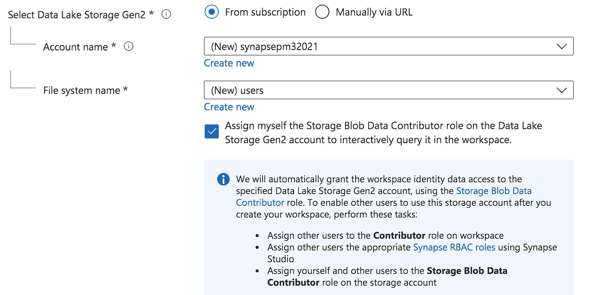
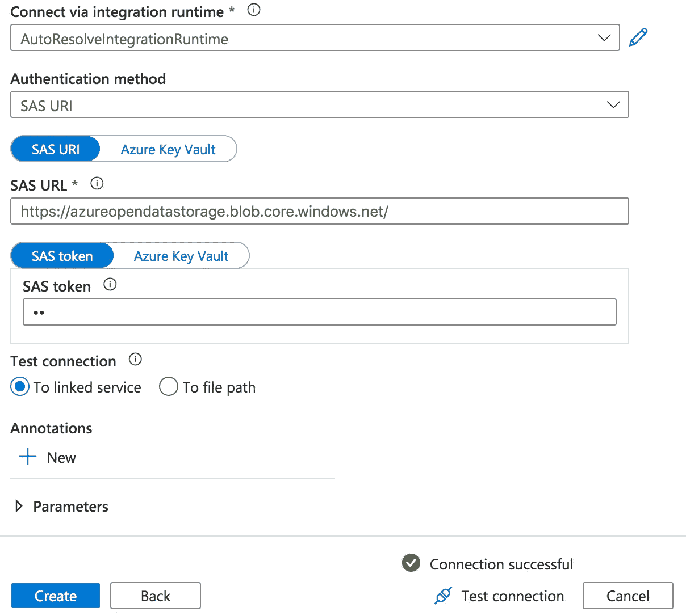

# hello World to Data lake house with Azure Synapse Analytics

> 原文：<https://medium.com/analytics-vidhya/hello-world-to-data-lakehouse-with-azure-synapse-analytics-dbd7a753195c?source=collection_archive---------7----------------------->

Data Lakehouse 是一种新的数据架构范例，结合了数据仓库(事务支持、模式实施、BI 支持)和数据湖(存储与计算分离、数据类型多样、工作负载多样、流)的优势，并提供了额外的优势(无需 ETL/ELT 即可直接查询原始数据)。这里有一些关于 data lakehouse 的好文章。

[](https://databricks.com/blog/2020/01/30/what-is-a-data-lakehouse.html) [## 什么是湖边小屋？-数据砖博客

### 在过去的几年里，我们在 Databricks 看到了一种新的数据管理架构，它独立地出现在…

databricks.com](https://databricks.com/blog/2020/01/30/what-is-a-data-lakehouse.html) [](/adfolks/data-lakehouse-paradigm-of-decade-caa286f5b7a1) [## 数据仓库——十年典范

### 结合了数据湖和数据仓库优点的现代数据平台范例。

medium.com](/adfolks/data-lakehouse-paradigm-of-decade-caa286f5b7a1) 

Azure 和 AWS 现在都在说 data lakehouse。Azure 有 Azure data lake，Azure Databricks 和以前的 Azure SQL DW，但微软试图用 Azure Synapse Analytics 提供更多的集成体验。

[](/microsoftazure/data-lake-or-data-warehouse-or-a-combination-of-both-choices-in-azure-and-azure-synapse-6b99cd072f99) [## 数据湖或数据仓库或两者的组合—Azure 和 Azure Synapse 中的选择

medium.com](/microsoftazure/data-lake-or-data-warehouse-or-a-combination-of-both-choices-in-azure-and-azure-synapse-6b99cd072f99) [](https://aws.amazon.com/blogs/big-data/build-a-lake-house-architecture-on-aws/) [## 在 AWS | Amazon Web Services 上构建湖边小屋架构

### 当组织汇集所有结构的所有相关数据时，他们可以获得更深入、更丰富的洞察力…

aws.amazon.com](https://aws.amazon.com/blogs/big-data/build-a-lake-house-architecture-on-aws/) 

在这篇文章中，我将使用 Azure Synapse Analytics 体验数据湖屋，尤其是在

*   无服务器 SQL
*   Synapse 管道
*   火花池

# 创建 Azure Synapse 工作区

[](https://docs.microsoft.com/en-us/azure/synapse-analytics/quickstart-create-workspace) [## 快速入门:创建 Synapse 工作区- Azure Synapse Analytics

### 该快速入门介绍了使用 Azure 门户创建 Azure Synapse 工作区的步骤。打开蔚蓝…

docs.microsoft.com](https://docs.microsoft.com/en-us/azure/synapse-analytics/quickstart-create-workspace) 

*   在 Azure 门户中，搜索 Azure Synapse。在搜索结果中的服务下，选择 Azure Synapse Analytics。
*   选择添加以创建新的工作区。
*   在“基本”选项卡中，为工作区指定一个唯一的名称。在“基本”标签中创建新的 ADLS Gen2 帐户。在“选择 Data Lake Storage Gen2”下，单击“新建”并为帐户选择一个名称。在选择 Data Lake Storage Gen2 下，单击文件系统并将其命名为 users。



提供资源后，转到 Synapse workspace，将有一个 URL 供您访问 workspace(类似 web . azure syncapse . net)。点按它(或打开 Synapse Studio)并鉴定。

## 常规用户界面


主页:主屏幕

数据:管理数据库、数据集等。

开发:创建 SQL 脚本、笔记本、数据流

集成:管理管道，访问复制数据工具

监视器:管道、SQL 请求、spark 应用程序

管理:管理分析池(SQL、spark)、外部连接、访问控制等。

# 使用 Azure Synapse Analytics 进行无代码 ETL

[](https://docs.microsoft.com/en-us/azure/data-factory/load-azure-sql-data-warehouse) [## 将数据加载到 Azure Synapse Analytics - Azure 数据工厂

### 适用于:Azure 数据工厂 Azure Synapse Analytics Azure Synapse Analytics 是一个基于云的横向扩展数据库…

docs.microsoft.com](https://docs.microsoft.com/en-us/azure/data-factory/load-azure-sql-data-warehouse) 

让我们从 [Azure 开放数据集](https://azure.microsoft.com/en-us/services/open-datasets/)复制到我们的数据湖存储。

*   通过转到管理中心，单击链接服务，然后单击+新建，设置新的链接服务。在搜索框中键入 Azure Blob Storage，然后选择服务。
*   命名您链接的服务，将“认证方法”更改为“SAS URI”，将“SAS URL”更改为[https://azureopendatastorage.blob.core.windows.net/](https://azureopendatastorage.blob.core.windows.net/)，对于“SAS 令牌”，输入任意字符，例如“aa”。点击“测试连接”，你应该看到“连接成功”。单击创建。



*   在集成中心创建一个新管道，并添加一个复制数据活动。将源数据集指向上面步骤 2 中设置的 Azure Open 数据集。选择 Azure Blob Storage 作为数据源，选择 Parquet 作为格式。在屏幕截图中设置数据源属性。


*   将数据接收器指向数据湖存储帐户。选择 Azure Data Lake Storage 作为数据接收器，并选择 Parquet 作为格式。填写类似于屏幕截图中所示的数据接收器属性


*   选择“通配符文件路径”


*   立即发布管道和触发器


*   您可以转到“监控|管道运行”来检查管道进度


*   管道完成后，您可以转到数据中心|链接|您的存储帐户，使用无服务器 SQL 进行查询


我把无服务器 SQL 视为[亚马逊雅典娜](https://aws.amazon.com/athena)查询即服务。然而，到目前为止，创建带有分区外部表似乎并不简单直观。这里是支持的“创建外部表”与分区文件夹。

```
CREATE EXTERNAL TABLE Taxi (
     vendor_id VARCHAR(100) COLLATE Latin1_General_BIN2, 
     pickup_datetime DATETIME2, 
     dropoff_datetime DATETIME2,
     passenger_count INT,
     trip_distance FLOAT,
     fare_amount FLOAT,
     tip_amount FLOAT,
     tolls_amount FLOAT,
     total_amount FLOAT
) WITH (
         LOCATION = 'yellow/puYear=*/puMonth=*/*.parquet',
         DATA_SOURCE = nyctlc,
         FILE_FORMAT = ParquetFormat
);
```

您不能利用分区消除。分区视图可以支持，但是语法感觉不直观。

```
CREATE VIEW TaxiView
AS SELECT *, nyc.filepath(1) AS [year], nyc.filepath(2) AS [month]
FROM
    OPENROWSET(
        BULK 'parquet/taxi/year=*/month=*/*.parquet',
        DATA_SOURCE = 'sqlondemanddemo',
        FORMAT='PARQUET'
    ) AS nyc
```

相比亚马逊 Athena 支持的 HiveQL，下面的感觉更自然。

```
CREATE EXTERNAL TABLE users (
first string,
last string,
username string
)
PARTITIONED BY (id string)
STORED AS parquet
LOCATION 's3://bucket/folder/'
```

[](https://docs.microsoft.com/en-us/azure/synapse-analytics/sql/create-use-external-tables) [## 在 Synapse SQL 池中创建和使用外部表- Azure Synapse Analytics

### 在本节中，您将学习如何在 Synapse SQL 池中创建和使用本机外部表。本机外部表…

docs.microsoft.com](https://docs.microsoft.com/en-us/azure/synapse-analytics/sql/create-use-external-tables) [](https://docs.microsoft.com/en-us/azure/synapse-analytics/sql/create-use-views#partitioned-views) [## 在无服务器 SQL 池中创建和使用视图- Azure Synapse Analytics

### 在本节中，您将学习如何创建和使用视图来包装无服务器 SQL 池查询。视图将允许您…

docs.microsoft.com](https://docs.microsoft.com/en-us/azure/synapse-analytics/sql/create-use-views#partitioned-views) 

与三角洲湖的融合是一大优势。Delta lake 是开源存储层，为 data lake 带来了 ACID 功能。

 [## 论事务数据湖

### 随着大数据技术的成熟，大数据处理正在成为一种常态。数据湖已经被许多…

billtcheng2013.medium.com](https://billtcheng2013.medium.com/on-transactional-data-lake-cdda17d9c0d) [](https://docs.microsoft.com/en-us/azure/synapse-analytics/sql/query-delta-lake-format) [## 使用无服务器 SQL 池查询三角洲湖格式(预览)- Azure Synapse Analytics

### 在本文中，您将了解如何使用无服务器 Synapse SQL 池编写查询来读取 Apache Delta Lake 文件…

docs.microsoft.com](https://docs.microsoft.com/en-us/azure/synapse-analytics/sql/query-delta-lake-format) 

# 用火花笔记本分析

*   创建火花池，给火花池命名，选择节点大小之间的小，中，大，xlarge，xxlarge，选择“自动缩放”，节点数量。选择“自动暂停”，火花版本

[](https://docs.microsoft.com/en-us/azure/synapse-analytics/quickstart-create-apache-spark-pool-studio) [## 快速入门:使用 Synapse Studio-Azure Synapse Analytics 创建一个无服务器 Apache Spark pool

### Azure Synapse Analytics 提供各种分析引擎来帮助您获取、转换、建模、分析和服务您的…

docs.microsoft.com](https://docs.microsoft.com/en-us/azure/synapse-analytics/quickstart-create-apache-spark-pool-studio) 

*   选择数据，选择“新笔记本”，“加载到数据框”


*   Synapse 生成启动代码(手动删除黄色后的路径/以访问所有数据)，选择 spark pool 并执行代码。


开放数据集包括 1571671152 条记录

## 从笔记本直接访问 Azure open dataset


# 。净火花

。NET spark 是迎合 Csharp 开发者的。主要的例子如下

[](https://github.com/dotnet/spark/blob/main/examples/Microsoft.Spark.CSharp.Examples/Sql/Batch/Basic.cs) [## 点网/火花

### NET for Apache Spark 使 Apache Spark 很容易被。NET 开发人员。-点网/火花

github.com](https://github.com/dotnet/spark/blob/main/examples/Microsoft.Spark.CSharp.Examples/Sql/Batch/Basic.cs) 

```
%%csharp
var df = spark.Read().Parquet("abfss://nyctlc@<adls account>.dfs.core.windows.net/yellow/puYear=2001/puMonth=1/");
df.Show();
```

输出相当原始

```
+--------+--------+------+------+----------+---------------+-----------+----------+-----+------+--------------------+---------+-----------+-----------+ |       2|2001-01-01 22:55:43|2001-01-02 00:05:43|             1|        4.67|         234|         162|    null|    null|  null|  null|         1|              N|          2|      31.5|  0.0|   0.5|                 0.3|      0.0|        0.0|       32.3| |       2|2001-01-06 06:03:30|2001-01-06 14:08:58|             1|         0.0|         193|         193|    null|    null|  null|  null|         1|              N|          2|       2.5|  0.0|   0.5|                 0.3|      0.0|        0.0|        3.3|
```

转换

```
var newDF = df.SelectExpr("replace(left(tpepPickupDateTime,7), \"-\",\"_\") as yearMonth", $"tipAmount/totalAmount as tipPct");
newDF.Show();
```

# Spark UI 监控


完成后停止会话(设置按钮左侧)

本文基于微软提供的 Azure Synapse 分析工具包。

[](https://azure.microsoft.com/en-us/resources/azure-synapse-analytics-toolkit/) [## Azure Synapse 分析工具包

### 在几分钟内获得开始使用 Azure Synapse Analytics 所需的一切，并开始获得有价值的…

azure.microsoft.com](https://azure.microsoft.com/en-us/resources/azure-synapse-analytics-toolkit/) 

# 参考架构

[](https://docs.microsoft.com/en-us/azure/architecture/example-scenario/dataplate2e/data-platform-end-to-end) [## 使用 Azure Synapse 进行端到端分析- Azure 示例场景

### 这个示例场景演示了如何使用 Azure 数据服务的大家族来构建一个现代数据…

docs.microsoft.com](https://docs.microsoft.com/en-us/azure/architecture/example-scenario/dataplate2e/data-platform-end-to-end)