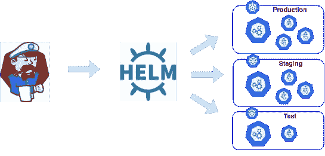
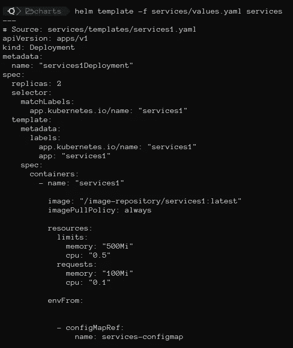

# 掌舵技巧和快速入门指南

> 原文：<https://medium.com/analytics-vidhya/helm-tips-and-quick-start-guide-26b0bbae299b?source=collection_archive---------1----------------------->

来源:[https://boxsboat . com/2018/09/19/helm-and-kubernetes-deployments/](https://boxboat.com/2018/09/19/helm-and-kubernetes-deployments/)

Helm 是 Kubernetes 的包装经理。使用 Helm，您可以部署图表。是组织成特定目录结构的 YAML 模板文件的集合。官方网站:【https://helm.sh/ 

使用您的图表，您可以控制您的 Kubernetes 部署，而无需配置任何设置。

来源:[https://www . digital ocean . com/community/tutorials/an-introduction-to-helm-the-package-manager-for-kubernetes-es](https://www.digitalocean.com/community/tutorials/an-introduction-to-helm-the-package-manager-for-kubernetes-es)

最重要的文件是:

**Charts /** :手工管理的图表依赖关系可以放在这个目录中。
**【templates/**—此目录包含与配置设置(来自 values.yaml)组合并在 Kubernetes 清单中呈现的模板文件。
**Chart.yaml** :包含图表元数据(图表名称、版本等)的 yaml 文件。
**Values.yaml:** YAML 文件，带有图表的默认配置值。

这里有一个非常简单的例子来说明 **Helm** 如何帮助我们在服务器上部署 Kubernetes 环境:

首先是图表:

values.yaml 定义了要在集群中部署的 1 个服务:

在 templates/中，我们有一个要在集群上部署的服务:

你可以看到我们使用了某些语法，如 IF、RANGE 等。

如果您想添加另一个服务，只需将其添加到 values.yaml 中的标记“services”内，如下所示:

下一步是在我们的本地环境中测试图表。为此，我们启动以下命令:

> helm 模板-f 服务/values.yaml 服务

我们可以看到应用该命令的结果。部署他们的豆荚。