# 这里是逻辑回归统计🤨

> 原文：<https://medium.com/analytics-vidhya/here-for-logistic-regression-stats-6f74069cde41?source=collection_archive---------22----------------------->

是与否之间的选择

因此，在逻辑回归中，我们对某一类或事件的概率进行建模，例如通过/失败，在简单的是/否型问题中赢/输。

## 我们能从基础开始吗？🧐

逻辑回归是一种模拟事件概率的方法。

就像线性回归一样，我们可以在两个独立变量(考虑 y)和非独立变量(考虑 x)之间建立关系。仅仅独立是二进制的，即 0 和 1

考虑到血糖水平和糖尿病之间的关系

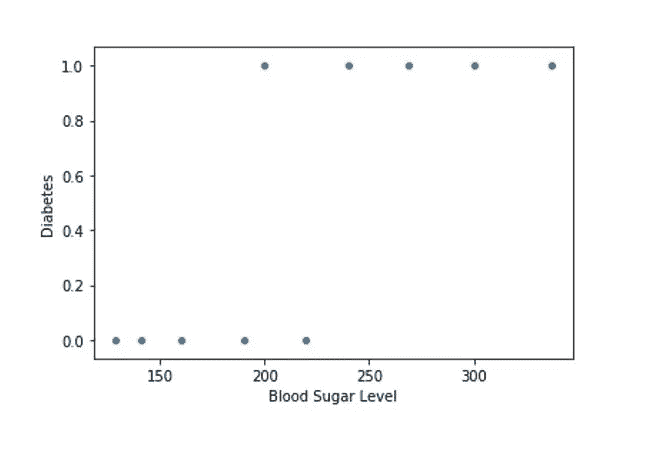

在这里，我们可以清楚地看到 0 & 1 之间的点数分布。我们必须决定从血糖水平的哪一点开始，我们将放置一个分离边界或线。

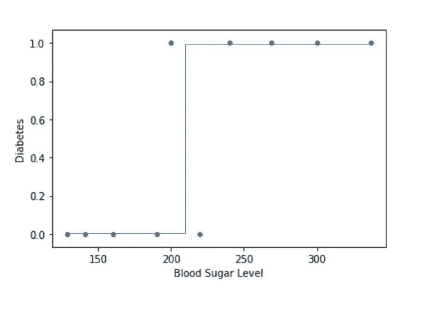

放线后，我们在看一些点分类错误的问题。

从逻辑回归的定义中，我们知道我们必须使用一个事件的概率来进行二元分类。

从 210 mg/dL 的血糖水平来分类，高于它是糖尿病，低于它是无糖尿病。

如果你是说为什么用上面的边界线而不是下面的？

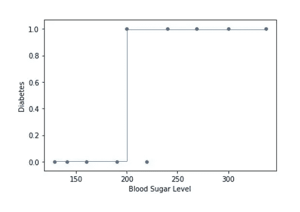

好吧，我们仍然有一个错误的分类。

我们的要求是低于 210 mg/dL 的低概率和高于 210mg/dL 的高概率。意味着我们可以把一条曲线具体化为一条 Sigmoid 曲线。

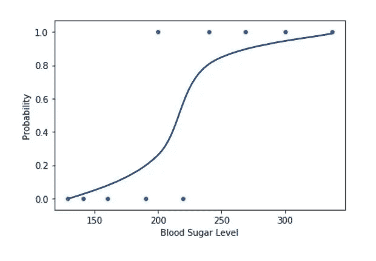

借助于 s 形曲线，我们可以预测糖尿病患者的血糖水平。

首先，我们正在考虑就像线性回归一样，我们将考虑放置预测线。为什么我们不能在这里画一条直线呢？

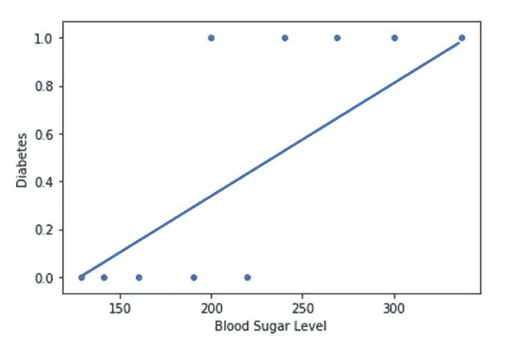

直线的主要问题是不够陡。在 sigmoid 曲线中，你可以看到，很多点都有低值，然后值突然上升，之后有很多高值。然而，在一条直线上，这些值从低到高非常均匀地上升，因此，不存在“边界”区域，即概率从高到低过渡的区域。

## 什么时候我们说最适合的 Sigmoid 曲线？

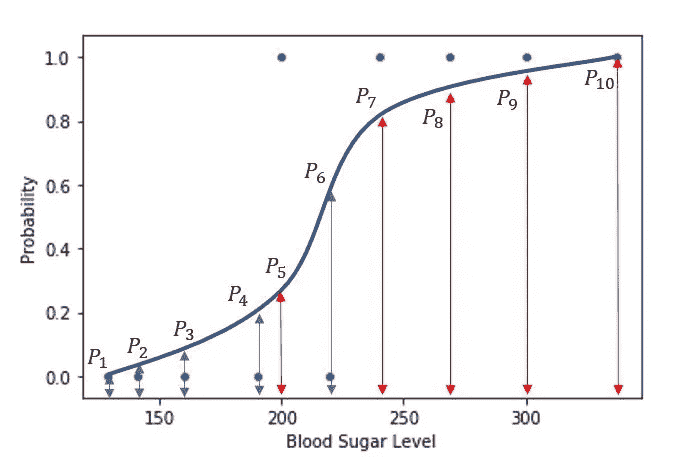

因此，最佳拟合的 Sigmoid 曲线将给出非糖尿病人的低概率值和糖尿病人的高概率值。P1 到 P10 是点 1 到 10 的概率。

我们需要 min(P1，P2，P3，P4，P6)和 max(P5，P7，P8，P9，P10)来得到分类 0 到 1。

我们可以说我们需要 max((1-P1)，(1-P2)，(1-P3)，(1-P4)，(1-P6))

因此，β0 和β1 的最佳组合将使产品最大化:

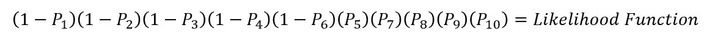

## Sigmoid 曲线的方程式如下:

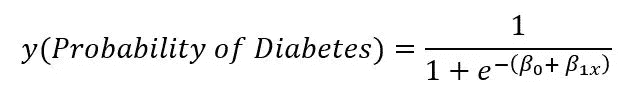

通过尝试β0 和β1 的不同值，我们可以操纵 sigmoid 曲线的形状。在β0 和β1 的某种组合下,“可能性”将最大化。

所以，我相信你已经看到了这个奇怪的函数，

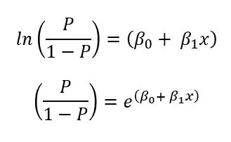

让我们做一些数学工作，

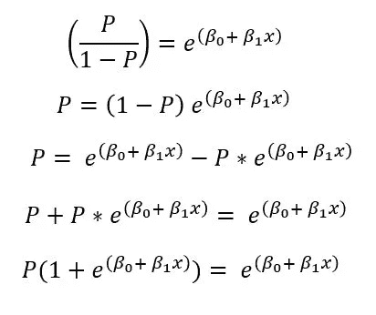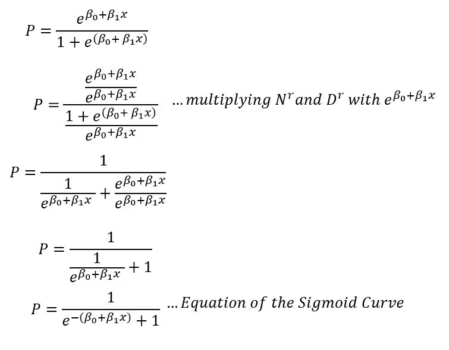

还没完呢！！

## 因此，我们有一个关于 sigmoid 曲线的函数:

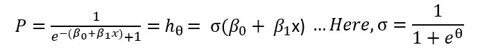

## 让我们推导逻辑回归的成本函数:

我们有一个最大似然估计(MLE)如下:

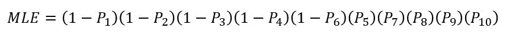

将对数应用到两边，我们得到，

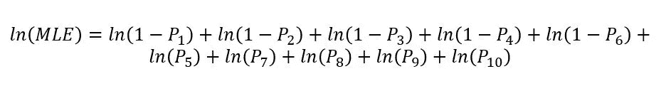

## 通过推广我们得到的等式，

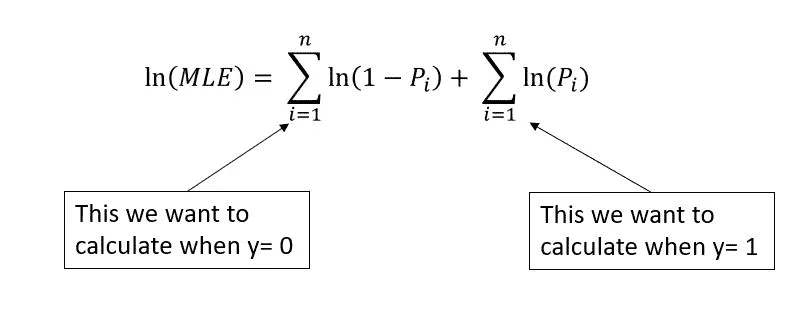

如果我们将目标变量 y 乘以上述等式，我们就能满足我们的要求。

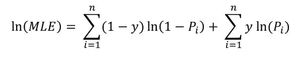

将 hθ代入上面的等式，我们得到，

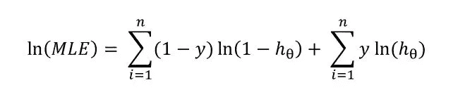

我们将为函数的最小化添加一个负号，因此我们得到成本函数为:

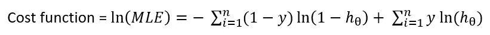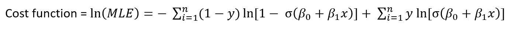

嗯，成本函数！！

## 总结:

因此，在这里，我们只看到了逻辑回归如何在这些方程和值背后工作，下次，我们将看看它的评估和动手 python 笔记本。

**请随时提出改进建议**😊

## 参考资料:

 [## 最大似然估计-维基百科

### 在统计学中，最大似然估计(MLE)是一种估计概率分布参数的方法

en.wikipedia.org](https://en.wikipedia.org/wiki/Maximum_likelihood_estimation) 

另外，看看这篇精彩的博客:

[https://www . analyticsvidhya . com/blog/2020/11/binary-cross-entropy-aka-log-loss-the-cost-function-used-in-logistic-regression/](https://www.analyticsvidhya.com/blog/2020/11/binary-cross-entropy-aka-log-loss-the-cost-function-used-in-logistic-regression/)