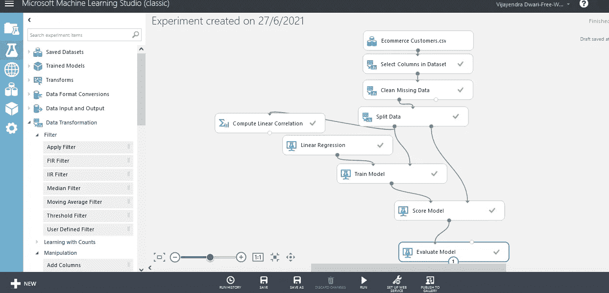

# 下面是我如何使用 Azure ML studio 通过电子商务数据集构建回归模型

> 原文：<https://medium.com/analytics-vidhya/heres-how-i-used-azure-ml-studio-to-build-a-regression-model-using-an-e-commerce-dataset-c8ad1b2807ba?source=collection_archive---------5----------------------->

在下面的例子中，我使用一个电子商务数据集来建立一个回归模型。这里我们使用 Azure ML studio 堆栈来创建和测试我们的模型。它节省了大量时间，并创造了一些伟大的机器学习。

线性回归可能是预测分析领域中使用的最基本的机器学习算法之一，如下图所示。

变量 X 和 Y 有线性关系，如果知道这里的方程，我们也可以知道 Y 值对 X 值。“m”是“x”的系数，也是直线的斜率，“c”是截距，这意味着当 x = 0 时，c= y。

我们使用的数据集来自 Kaggle，可以在这里找到[https://www . ka ggle . com/iyadavvaibhav/ecommerce-customer-device-usage](https://www.kaggle.com/iyadavvaibhav/ecommerce-customer-device-usage)

让我们从加载数据集开始，一旦上传到 Azure ML studio 中，就像拖放一样简单。

将我们的数据集上传并添加到空白实验中

可视化我们的数据集很重要，让我们做一些 EDA 来理解数据集。

因为我们打算在这个数据集上运行线性回归模型，所以我们需要使用列选择器来选择数据集中的所有数字列。

EDA 使用 Azure ML studio 只需点击几下鼠标

让我们在尝试建立模型之前检查一下我们的数据集是否有缺失值，我们需要去掉任何空白单元格，因为 ML 算法不支持这些单元格中的数据。

从操作菜单中拖放“清除丢失的数据”,并重新可视化数据集，现在您可以看到它有 0 个丢失的值

现在我们已经熟悉了数据集，让我们开始一些模型构建，我们可以尝试预测 Y =每年花费的金额和 X = [会员时间，网站时间，应用时间，平均。会话长度]

接下来，我们必须将数据集分为训练和测试数据，这里我将分数设置为 0.7，并随机固定种子。这意味着我们将 70 %用于训练我们的模型，30 %用于预测和测试我们的模型。

我们需要从机器学习菜单中拖放我们想要应用的模型，这里我们将使用经典的线性回归模型。

一旦我们选择了我们的模型，是时候训练它了，在运行实验后右键单击并可视化，我们得到如下输出。

特征权重

正如我们所看到的，我们得到的偏差为-1087.03，这只是回归方程的常数部分[1][2]

预测变量的系数为

成员资格年限:61.3245 年

App 上的时间:38.7306

平均值。会话长度:26.0933

网站时间:1.10656

我们的回归方程:-1087.03+61.3245 *[会员时长]+38.7306 *[App 上的时间]+26.0933 *[平均。会话长度]+1.10[在网站上的时间]

最后一项检查是预测值和预测变量之间的线性关系测试，因此通过检查数据集中所有变量之间的相关性来进行这个简单的测试。

预测值和预测变量之间的线性检验

我们注意到每年花在网站上的时间和花费之间的相关性接近 0，我们可以安全地从回归方程中移除这个变量，因为这意味着这些变量在统计上彼此无关紧要。

我们最终的回归方程变成:

**年消费金额=-1087.03+61.3245 *[会员时长]+38.7306 *[在 App 上的时间]+26.0933 *[平均。会话长度]**

还有最后一步，我们需要评估我们的模型，看看它的准确性。

模型评估

我们得到了一个模型，其决定系数或简单的 R 平方为 0.98，这意味着它在 98%的情况下都是非常适合和可靠的。这里我们有一个非常可靠的模型，只需点击一下就可以部署。

电子商务数据集的最终端到端工作回归模型

参考资料:

[1][http://breaking-bi . blogspot . com/2017/03/azure-machine-learning-regression-using . html](http://breaking-bi.blogspot.com/2017/03/azure-machine-learning-regression-using.html)

[2]【https://www.youtube.com/watch?v=knFLC4CKajM】17:16/23:00