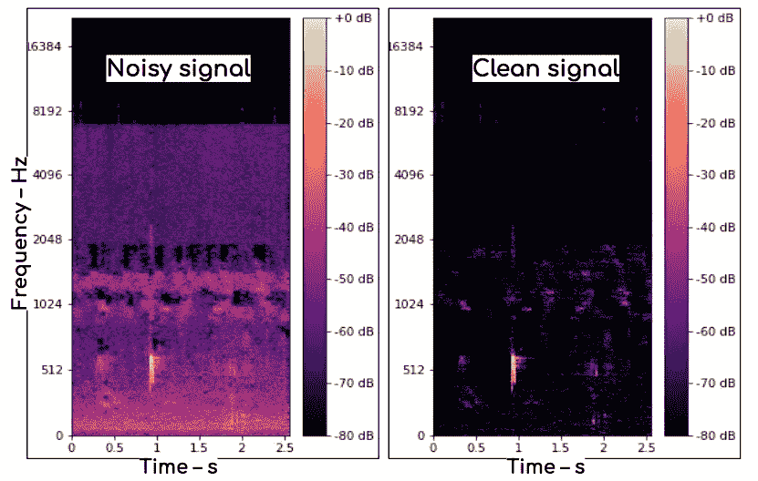

# 嘿，你！那是什么鸟？

> 原文：<https://medium.com/analytics-vidhya/hey-you-whats-that-bird-df1e0349b915?source=collection_archive---------23----------------------->


作者想象中的世界

斯基罗和布法罗·斯普林菲尔德都渴望知道这个问题的答案。幸运的是，这正是我的[已经和](https://aarroonn.medium.com/first-step-and-neck-deep-8b37f81adefd)[数码期货](https://digitalfutures.com/)接触过的顶点项目。该项目旨在开发一种算法，能够根据鸟鸣声识别鸟类。让我们来看看如何——对于那些喜欢看*(!)危险-死亡-疯狂-行动(！)*这里有一个链接指向我的现场演示，而不是文字。

## 在这篇文章中，你会看到:

1.)一个介绍
2。)获得的数据的描述
3。)Python 中音频数据的一些基础知识
4。)克服使用音频数据挑战的计划
5。)执行该计划的一些细节
6。)建模和结果
7。)对未来和可能应用的改进

这个项目的想法来自许多不同的来源。一个是我的挫败感，在最近的苏格兰远足中，我没能看到一只歌唱得很美的鸟。另一个是凯捷的类似项目，利用音频数据识别抹香鲸。同样，这个项目的背后是我想做一些有意义的、对社会/环境有益的事情。能够根据声音识别动物将有助于跟踪它们的活动、种群和行为，但最重要的是，可以监测人类活动对自然动物的影响。因此，这种装置可以成为指导环境决策的有力工具。

因此，该计划是训练一个关于鸟鸣录音的模型，并创建一个算法，使用该模型根据它们唱歌的音频记录来识别鸟类。幸运的是，通过 [kaggle](https://www.kaggle.com/c/birdsong-recognition/data) 可以从 [xeno-canto](https://www.xeno-canto.org/) 网站获得大量音频。使用这个集合，我能够开始探索如何在 Python 中处理音频数据。这正是下一节要讲的，所以如果你也在座位的边缘，请继续滚动。

# 熟悉数据

基本数据来自一个包含无数不同列的表格。主要类别有 1。)基本特征，例如鸟的名字、它的 e-bird 代码和音频文件的名称-这用于加载附带的. mp3 文件-2。)技术数据:录音是单声道还是立体声，采样率是多少，长度是多少，最后是 3。)关于音频的描述性信息，例如其质量、动态(速度或音调的加速/下降)、呼叫类型(警报、歌曲等)。)以及关于背景中可以听到什么物种的信息。

```
Index(['rating', 'playback_used', 'ebird_code', 'channels', 'date', 'pitch', 'duration', 'filename', 'speed', 'species', 'number_of_notes', 'title', 'secondary_labels', 'bird_seen', 'sci_name', 'location', 'latitude', 'sampling_rate', 'type', 'elevation', 'description', 'bitrate_of_mp3', 'file_type', 'volume', 'background', 'xc_id', 'url', 'country', 'author', 'primary_label', 'longitude', 'length', 'time', 'recordist', 'license'], dtype='object')
```

虽然使用其中一些功能可能会改善我们的预测——我将在本文稍后讨论这一点——但我最初想要一种只使用声音的算法。这既是因为时间限制，也是为了让算法的使用更加灵活，只需要很少的输入。由于这个原因，唯一保留的列是评级(质量)、电子鸟代码、持续时间、文件名、采样率和呼叫类型。

这个集合没有丢失值，清理只包括排列 1200 多个(！)不同的类型分成 3 类“呼叫”、“歌曲”和“杂项”，以及将采样率转换成整数格式。

# Python 中的音频

我希望你准备好了，因为这是事情变得疯狂的地方。就像狂野的零和一。

在为每条线创建路径并意识到阅读 21，000 多条录音可能并不太快之后，我将自己限制在评级至少为 3.0、不到一分钟且属于“歌曲”类型的录音上。然后，我挑选了前 5 种最大的鸟类，最终有 305 个条目。这就够了吗？在处理方面，绰绰有余。在造型方面，是的。怎么会？我保证我们会做到的。

一个名为 [librosa](https://librosa.org/doc/latest/index.html) 的便捷库被用来读取音频数据，并进行进一步的操作(他们的[高级案例网站](https://librosa.org/doc/latest/advanced.html)是一座金矿！).数据作为振幅值的 numpy.array 添加到我们的原始表中；我们已经可以用它做一些有趣的事情了，比如让它可视化:

```
plt.figure()
librosa.display.waveplot(y = audio, sr = sample_rate)
plt.xlabel('time - s')
plt.ylabel('amplitude')
plt.show()
```


可视化音频数据

或者甚至使用 IPython 库来播放它:

```
from IPython.display import Audio
Audio(audio_path)
```

然而，很明显，我们不能使用当前格式的音频。主要原因是:
1。)很嘈杂:各种背景元素可能会混淆我们的模型
2。)不同的录音有不同的长度:我们的模型需要相同的特征长度，这就需要相同长度的音频
3。)它有时是沉默的:拍摄中的沉默不仅会缺乏相关信息，而且很可能在不同物种之间是相同的，并可能会混淆我们的模型
因此，我们的特征工程将包括解决这些问题。让我们看看实现这一点的管道。

# 管道铺设


作者想象中的管道

如图所示，管道由五个阶段组成。我们应该简要考虑一下它们各自的功能:

1.  带通滤波器:
    由于鸟类主要在 800 到 8000 赫兹之间交流，我们可以应用一个带通滤波器去除任何超出这个区间的频率。来自该地区之外的信息将与我们的模型不相关，并可能使其混淆。这些信号可能包括由于录音设备设置不当而产生的风吹声甚至嗡嗡声。
2.  噪声过滤器:
    很可能是这个项目中最复杂的部分。由于这些录音是在自然环境中制作的，人们只希望它们会包含背景噪音——事实也确实如此。由于这可能包括其他鸟类的啁啾声，因此我们能够分离信号的前部和背景成分非常重要。
3.  事件识别和裁剪:
    即使经过过滤，我们的音频也可能包含低水平的噪声。此外，实际鸣叫之间的沉默可能会扰乱我们的模型，因为它在不同物种的记录中非常相似。出于这个原因，我们必须能够检测和分离那些包含有意义信息的部分。为此，裁剪函数使用阈值来确定事件的截止点。
4.  模型:
    一旦我们按照自己的喜好格式化了数据，我们将需要一个经过训练的模型，能够根据它们的鸣叫来识别鸟类。尝试了一些不同的类型，但最合适的似乎是支持向量机(稍后将详细介绍)。
5.  预测算法:
    最后，一旦前面的都准备好了，我们需要一个算法，可以接收音频数据并识别与之相关的鸟类。好玩。

# 详细信息

与普遍的看法相反，当使用法语时，它意味着事情变得严重了。因此，是时候看看上面管道的一些更有趣的功能了——对于那些真正感兴趣的人来说，在这篇文章的底部有一个到整个工作簿的链接……或者管它呢，这里也有。

## 静噪滤波器

正如前面提到的，该项目的最复杂的部分之一是创建一个噪声过滤器，将前面和背景音频彼此分开。幸运的是，librosa 的文档中包含了一篇关于如何做到这一点的[惊人文章](https://librosa.org/doc/latest/auto_examples/plot_vocal_separation.html#sphx-glr-auto-examples-plot-vocal-separation-py)——经过一些调整，这个方法就实现了。尽管如此，浏览一下这个函数的主要特性还是很有用的。

```
ft_mag, ft_phase = librosa.magphase(librosa.stft(audio))
```

首先，我们使用[傅立叶变换](https://en.wikipedia.org/wiki/Fourier_transform) `librosa.stft`和`magphase`函数提取频谱图特征。对于那些不熟悉它的人来说，频谱图基本上是可视化音频信号的设备。我们将音频映射到时间和频率的坐标系统上，并显示局部能量水平(这些区域有多大声)。当然，Librosa 有必要的工具来证明这一点。

```
fig, ax = plt.subplots()
img = librosa.display.specshow(librosa.amplitude_to_db(ft_mag, ref =
                                                       np.max),
                               y_axis = 'mel', x_axis = 'time', ax =
                               ax, sr = sample_rate)
fig.colorbar(img, ax = ax, format = '%+2.0f dB')plt.show()
```


啁啾声谱图:光斑越亮，啁啾声越大

继续我们的噪声滤波器:

```
ft_filter = np.minimum(ft_mag, librosa.decompose.nn_filter(ft_mag,
                                                          aggregate,
                                                          metric,
                                                          width))
```

我们使用我们的声谱图特征来创建过滤器。该过滤器主要查看图像并聚合其点，然后根据预定义的相似性度量在给定的音频宽度(以秒为单位定义)内执行最近邻比较。这将分离信号中突出但稀疏的元素。

```
mask_bg = librosa.util.softmask(ft_filter,
                                margin_bg * (ft_mag - ft_filter),
                                power)
mask_front = librosa.util.softmask(ft_mag - ft_filter,
                                   margin_front * ft_filter,
                                   power)
```

接下来，我们创建两个软遮罩。这些可以被认为是“覆盖”音频中不想要的元素的设备。这些掩码的公式为:
M = X * *幂/(X * *幂+X_ref * *幂)
其中 X 是想要的信号，X _ ref 是不想要的噪声。我们可以看到，上面的遮罩是对称的，这是因为它们是彼此相反的。我们希望保留前置音频中那些我们希望从背景音频中去除的元素。

```
front = mask_front * ft_mag
bg = mask_bg * ft_mag
audio_front = librosa.istft(front * ft_phase)
audio_bg = librosa.istft(bg * ft_phase)
```

一旦我们有了屏蔽，我们可以将它们应用到我们的声谱图特征上，最后，我们使用傅立叶逆变换`librosa.istft`保留两个独立的音频。



应用噪声滤波器前后的信号

## 事件检测和裁剪

我们接下来想要的是一种去除音频中不包含有用信息的部分的方法。为此，应用了振幅门。它在记录中寻找高于给定阈值的部分，并将这些部分切割成统一长度的部分，将它们作为 numpy.arrays 的列表返回。最后，我们将这些部分排列成一个表(见下图)。这不仅解决了沉默的问题，也丰富了我们的数据集。事实上，我们的特性表中的条目数量从 305 个猛增至 3540 个。


单独的事件被单独裁剪并返回到表格中。

检测器同时操作两个阵列。一个由关于给定点是高于还是低于阈值的布尔值组成，另一个只是信号幅度值的数组。一旦我们发现哪些值高于阈值，我们只需保留相应的信号值。然而，有一个复杂的问题必须克服。实际上，用于事件检测的不是“原始”音频信号，而是幅度的均方根值。均方根音量对信号中的突然峰值或下降不太敏感，因此提供了一个更可靠的指标，表明是否应包含某些器件。但均方根阵列比原始阵列短，因此我们必须找出如何桥接两者的方法。

实现这一点后，我们可以为原始(`t01`)和 RMS ( `t02`)信号创建一个以秒为单位的时间值数组。

```
rms = librosa.feature.rms(y = audio)[0]

t01 = librosa.frames_to_time(np.arange(len(audio)), hop_length = 1, 
                             sr = sample_rate)
t02 = librosa.frames_to_time(np.arange(len(rms)), sr = sample_rate)
```

接下来，我们可以得到一个布尔值数组，其中均方根信号高于阈值时为`True`，低于阈值时为`False`。
因为我们想要等长的作物，我们不能只选择那些具有匹配`True`值的信号部分；然而，我们可以使用这些部分的开始作为我们的作物的起点。我们可以创建一个标记这些部分的点的列表(`list00`)，并使用这些列表从我们的时间数组`t02`中保留匹配的时间值。

```
rms_bool = np.where(librosa.amplitude_to_db(rms, ref = np.max) >=
                    threshold, True, False) list00 = []
for i in range(len(rms_bool) - 1):
    if (rms_bool[i], rms_bool[i + 1]) == (False, True):
        list00.append(i + 1)t02 = [t02[x] for x in list00]
```

然后，使用这些时间值，我们创建一个布尔数组列表，为那些高于代表信号高于阈值的点的`t02`值的时间值返回`True`。
最后，我们通过一起压缩布尔和信号数组来保留我们的裁剪样本。裁剪通过简单的切片完成，其中`sample_length`以秒为单位给出，并指定我们裁剪的信号将有多长。

```
t_bool = [np.where((t01 > x), True, False) for x in t02]

samples = [np.array(list(compress(audio, x)))[: int(sample_rate *
           sample_length) + 1] for x in t_bool]
```

最后一步，我们将这些样本放大到相同的幅度，并创建我们的模型特征(需要进行整形，因为我们使用了频谱图特征的三维阵列)。

```
feat = np.array([librosa.amplitude_to_db(x, ref = np.max) for x
                 in samples])
X = np.array([x.reshape(x.shape[0] * x.shape[1], ) for x in feat])
```

# 建模

现在我们的特征工程已经完成，我们准备建模。但是我们到底在找什么？让我们再次可视化我们的数据。


两种不同鸟类的特征

正如上面两张光谱图所示，鸟儿啁啾声有着明显不同的音频模式。捕蝇草的叫声要短得多，而燕子的叫声沿时间轴更长。类似地，捕蝇草的叫声首先在音调上上升，然后迅速下降，最大声的点在中间的某个地方。与此相反，燕子的叫声先下降，然后上升，最后声音最大。
我们希望我们的模型能够提取这些特征，并基于这些特征预测鸟类。由于数据很容易以这种图形方式解释，因此使用适合这种特征的模型才有意义。

在使用 scikit-learn 的`naive_bayes.GaussianNB`建立了 0.41 精度的基线之后——对于这样一个简单的模型来说，这还不错——我很快转向了 scikit-learn 的`svm.SVC`支持向量机。由于支持向量机往往需要很长时间才能适应，并且它们对选择适当的 C 值和 gamma 值很敏感，所以我决定进行主成分分析，看看我们的特征是否可以减少。


我们的 PCA 曲线

看着上面的图表，我认为 500 个特性对于一个简单的模型来说已经足够了。在转换数据之后——以及一些仍然非常冗长的网格搜索——最佳值似乎是`C = 10`和`gamma = 5e-07`,我们的内核设置为`rbf`。下表总结了这些结果以及其他几个模型的结果。


五种不同模型的指标

以上分数是我们五种鸟类的平均值。支持向量机在大多数情况下都处于领先地位，如果我们采用加权分数，也就是说，拥有更多数据条目的鸟类将拥有更高的权重，这种模型将在所有指标中排名第一。所以，我选择了支持向量机来对算法进行预测。

# 该算法

最终的算法非常依赖于已经引入的函数。它接收一个 numpy.array 信号值，然后执行清理和格式化任务。当识别事件时，它还保存它们相关的时间标记，因此可以在音频中定位鸟的类型。最后，它使用音频中的每个可识别事件，并对它们进行单独预测。然后它会返回时间，鸟的种类以及对预测的确信度。我使用了 40%的截止值，所以只有具有该值或更高值的鸟类才会显示出来。或者，如果没有一只鸟能以这样的置信度被识别，该算法将显示所有类型和相关的百分比。

# 一些改进

考虑到未来的步骤，我想强调两个附件，它们对于增加我们的数据池和改进我们的预测非常有用。第一个是用于事件检测的动态阈值。目前，事件检测的阈值设置为-15dB。选择这一点是因为它被用作音频处理中噪声和干净信号之间的最小标准差。然而，很有可能，一些质量较好的记录可以具有较低的阈值，因此它们可以提供更多的数据。而另一方面，质量差的记录可能包括这样幅度的噪声，该噪声将被错误地包括为鸟叫声。拥有一个动态阈值可以消除这两个问题，从而获得更高质量的数据。如果这种方法被证明是有效的，我们还可以包括低于我们原始质量标准(评分≥ 3.0)的记录，进一步丰富我们的数据集。

第二个增加是扩展过滤管道以产生背景数据。如前所述，原始表包含一列背景信息。这列出了在背景中可以听到的鸟的种类。利用这些信息并使用多层过滤器，我们的数据可以得到扩充。


双层过滤器

和以前一样，我们将第一层从背景中分离出主要的鸟叫声。然而，我们可能不会放弃背景层，但把它通过第二个过滤器。希望这第二层可以将啁啾声与背景音频和实际噪声隔离开来。然后，产生的信号可以与背景列的信息相匹配，为我们的模型提供训练材料。

# 应用程序

该项目的动机之一是创造一些对社会/环境有益的东西。使用这种算法可以有几个实际的用途。将它制作成一个应用程序，可以为人们提供当地鸟类种群的信息，并可能包括如何照顾它们的有用提示——例如在交配季节给予额外的照顾，或者在极端天气条件下提供住所和水/食物。

该项目还可以帮助研究人员监测鸟类数量。廉价的麦克风可以安装在自然环境中，实现实时数据传输。对声音的分析可以帮助记录鸟类的活动，种群或行为的变化。它可以提供关于迁徙鸟类返回的信息，例如，何时开始交配或何时蛋开始孵化。

更重要的是，它可以用来监测噪音污染或人类活动的其他影响如何影响人口。利用这些见解，政策制定者可以相应地管理某些工业活动。

如果你还在这里，我真的很感激你花时间和精力阅读这篇文章。真的非常感谢你！这里是这个项目的 jupyter 工作簿的链接。
以及使用的一些资源:

[1] Kartik Chaudhary，“理解语音识别系统的音频数据、傅立叶变换、FFT 和频谱图特征”(2020 年)
[2] Erwin Nemeth 等人，“鸟鸣和人为噪声”(2013 年)
[3] Britannica，“声音接收——鸟类的听觉”(2021 年访问)
[4] Librosa 文档，“高级示例”(2021 年访问)
[5] Cadence PCB 解决方案，“什么是信噪比，如何计算？”(2020)