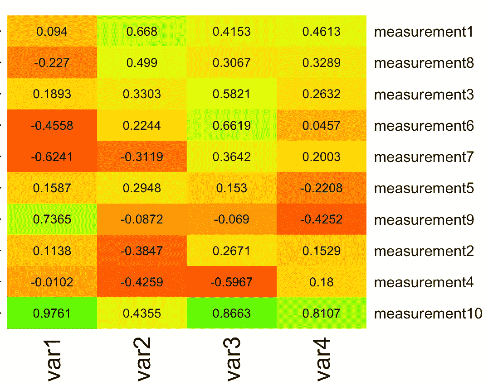
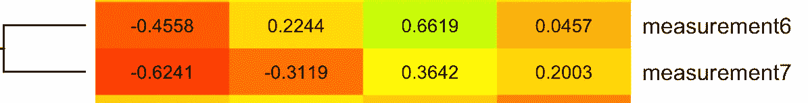
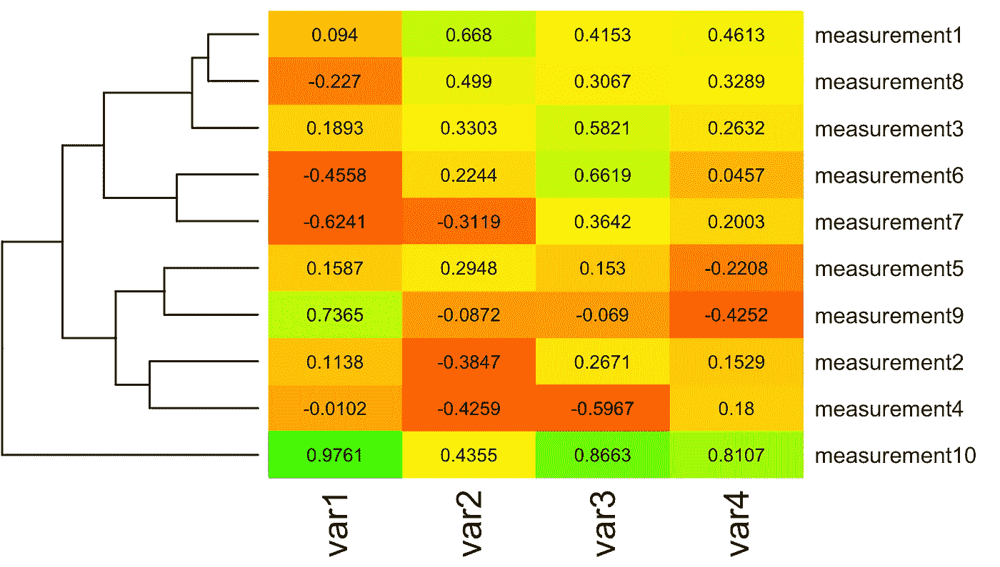
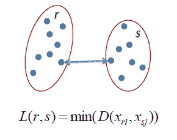
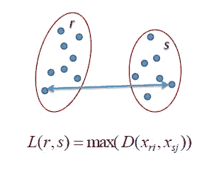
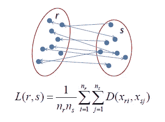

# 层次聚类:只是聚类的顺序！

> 原文：<https://medium.com/analytics-vidhya/hierarchical-clustering-its-just-the-order-of-clusters-f675f769e121?source=collection_archive---------9----------------------->

什么是层次聚类？根据定义，这是一种无监督的方法，从上到下或从下到上创建相似的组。

这种集群有两种主要类型:聚集型和分裂型。

我将首先尝试解释第一种类型的聚类，然后解释第二种类型。通过热图可以很好地理解凝聚聚类。

聚类可以通过多种方式完成，但我发现热图是最直观的。

热图可以在 seaborn 图书馆找到，它们让我们对变量之间的相关性有一个公平的理解。

在这个聚类过程中，第一步是将每个元素识别为单点聚类。

在我们的例子中，聚类将是:每个测量都是一个聚类

在第二步中，我们取两个最接近的数据点，并使它们成为一个聚类或最相似的变量。这是通过计算两点之间的距离来实现的。

有各种方法来获取数据点之间的距离，我认为这是任意的，应该根据数据的需要来选择。

现在，即使不计算距离，我们也可以凭直觉使用热图。是不是有些三围看起来颜色太像了？

我采用测量值之间的欧几里德距离来找出最相似的聚类(最小距离)。让我给你看一个例子:

测量 6 和 7 将是一个群，因为它们之间的距离最小

欧几里得距离可以计算为((变量 1 的差异)+(变量 2 的差异)+(变量 3 的差异)+(变量 4 的差异))^1/2

你一定猜到了，这是最小值，因此它形成了一个单独的集群。

用类似的方法，我们可以做出不同的集群。

在第三步中，我们将这些较小的集群组合成更大的集群，这样继续下去，直到我们得到一个大集群，如下所示:

# 距离的类型:

1.  单一链接-两个集群“r”和“s”之间的最短距离。随之而来的问题是，如果存在噪声，则不能正确地分离聚类，并且过早地合并具有接近对的组，即使这些组总体上不相似。

2.完全链接-这是两个集群“r”和“s”之间的最长距离。这将非常偏向球状星团，打破大星团

3.平均连接-两个聚类之间的距离被定义为点“r”和“s”之间的平均距离。这也偏向球状星团。

4.沃德方法:这种方法类似于平均连锁，只是它计算距离 Pi 和 Pj 的平方和

数学上写为:

sim(C1，C2)=∑(dist(Pi，Pj))/(| C1 |∫| C2 |)

# 在层次聚类中应该如何选择聚类的个数？

树状图是一种类似树的图表，记录了合并或拆分的顺序。树状图中垂直线的距离越大，这些聚类之间的距离就越大。

我们可以设置一个阈值距离，画一条水平线(一般我们尝试这样设置阈值，使其切割最高的垂直线)。