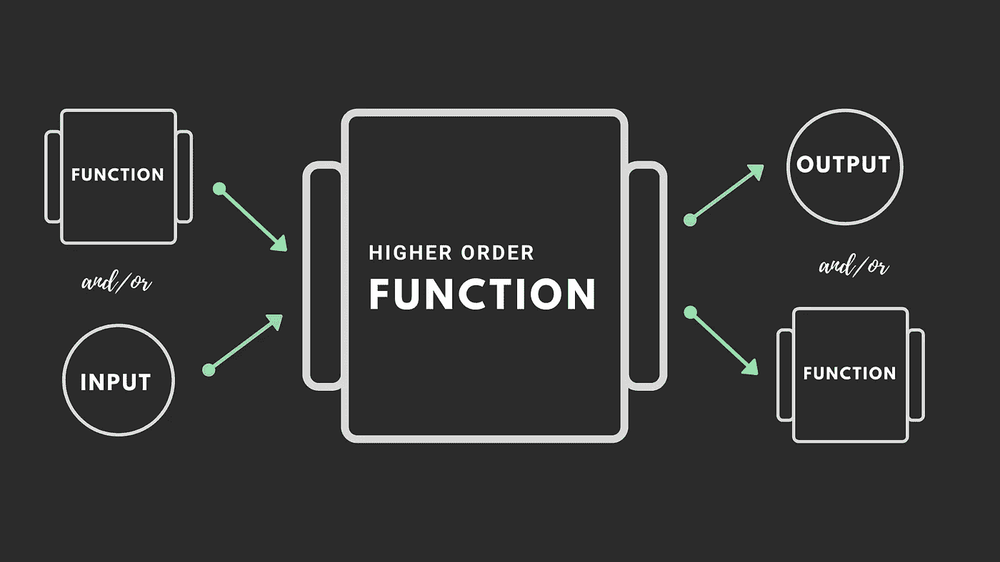
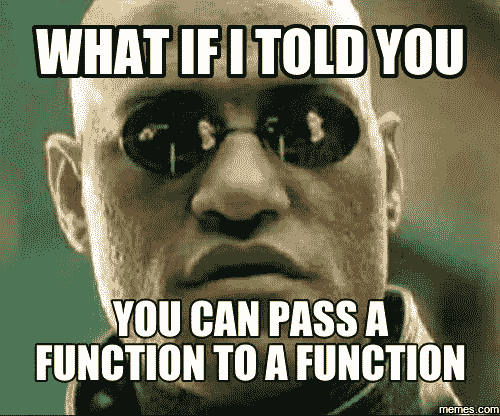
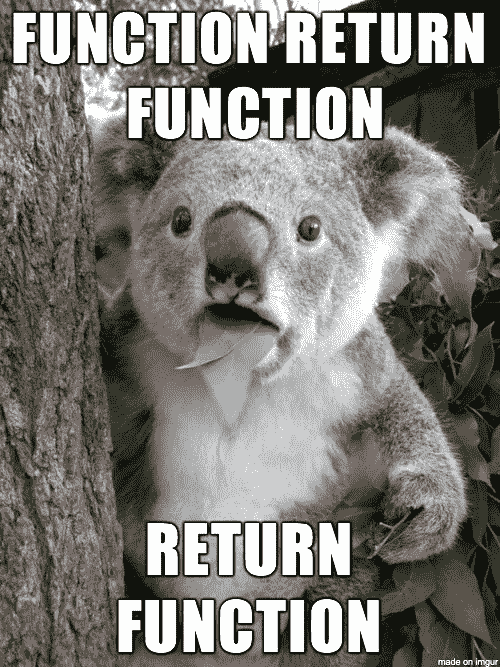

# 高阶函数— Python

> 原文：<https://medium.com/analytics-vidhya/higher-order-functions-python-716f508a8f41?source=collection_archive---------4----------------------->



如果一种编程语言将函数视为一级对象，就可以说它支持一级函数。根据定义，程序实体中的“一级对象”是可以像其他对象一样传递的对象。它具有以下特点:

*   可以有属性和方法。
*   可以赋给一个变量。
*   可以作为参数传递给函数。
*   可以作为另一个函数的结果返回。

让我们试着通过代码来理解每一个属性。

1.  **属性和方法**

您在 Python 中创建的每个方法/函数都有一组默认的属性和方法，可以使用`dir()`方法进行检查。在下面的例子中，我定义了一个 hello_world 函数来打印字符串`Hello World!`。

```
def hello_world():
   print("Hello World!")
```

当我们在 hello_world 方法上调用`dir()`函数时，我们可以看到所有的默认方法都是它的一部分。

```
print(dir(hello_world))
['__annotations__', '__call__', '__class__', '__closure__', '__code__', '__defaults__', '__delattr__', '__dict__', '__dir__', '__doc__', '__eq__', '__format__', '__ge__', '__get__', '__getattribute__', '__globals__', '__gt__', '__hash__', '__init__', '__init_subclass__', '__kwdefaults__', '__le__', '__lt__', '__module__', '__name__', '__ne__', '__new__', '__qualname__', '__reduce__', '__reduce_ex__', '__repr__', '__setattr__', '__sizeof__', '__str__', '__subclasshook__']
```

您可以调用这些与函数绑定的方法中的任何一个。例如:

```
hello_world.__name__
# 'hello_world'
```

也可以用`type`来理解我们创建的函数是 function 类的一个实例。

```
print(type(hello_world))
# <class 'function'>
```

**2。将函数分配给变量**

我们也可以给变量分配函数。

```
def hello_world_function(name):
   print("Hello " + name + "!")hello_world_variable = hello_world_function
```

这里我们将`hello_world_function`函数赋给变量`hello_world_variable`。现在`hello_world_variable`是一个函数对象，这意味着，我们可以像调用`hello_world_function`一样调用它。

```
hello_world_variable("Tharun")
# Hello Tharun!
```

该赋值并不调用函数，而是采用由`hello_world_function`引用的函数对象，并创建指向它的第二个名称。

```
hello_world_function
# <function hello at 0x0000020127C982F0>hello_world_variable
# <function hello at 0x0000020127C982F0>
```

**3。用作参数**



因为 Function 是一个对象，所以你可以像传递变量一样传递它。

让我们考虑遍历一个条目列表，并按顺序打印它们。我们可以很容易地构建一个`iterate`函数。

```
def iterate(items):
   for item in items:
      print(item)
```

这是常见的东西。如果我们想做一些不同于打印项目的事情呢？这就是高阶函数的用武之地。我们可以创建一个函数`iterate_custom`,它接受项目列表和需要应用于每个项目的函数。

```
def iterate_custom(items, function):
   for item in items:
      function(item)
```

通过这样做，我们创建了一个函数，它可以对列表做任何涉及顺序迭代的事情。这是一个更高层次的抽象，这也使得我们的代码可以重用。

**4。从函数**返回函数



这样做通常是为了有一个决定控制流的包装函数，或者决定应该调用哪个函数。例如:

```
def square(num):
   return num * numdef cube(num):
   return square(num) * numdef power_of_num(power):
   if power == 2:
      return square
   elif power == 3:
      return cubenum_powers = power_of_num(2)
# num_powers is assigned with the square methodnum_powers(5)
# 25
```

我们已经定义了非常常见的方法`square`和`cube`。第三个方法`power_of_num`是一个包装函数，它根据变量值返回前两个方法中的任意一个。在这种情况下，用变量值`2`调用`power_of_num`。`Square`方法现在将被返回并在变量`num_powers`中赋值。现在，如果我们调用`num_powers`变量，它将充当`square`方法。

```
num_powers = power_of_num(3)
# num_powers is assigned with the cube methodnum_powers(5)
# 125
```

有问题吗？在这里随意评论。

如果你喜欢这篇文章，请点击👏所以其他人会在媒体上看到它。