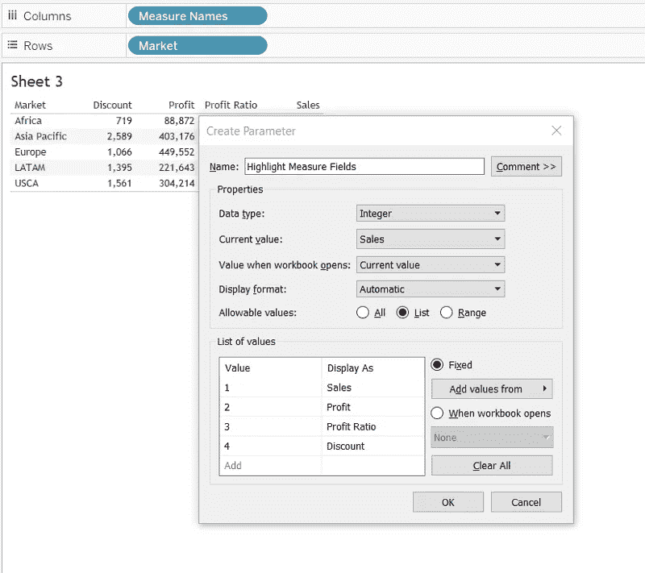

# 突出显示 Tableau 中多个度量列中的一个

> 原文：<https://medium.com/analytics-vidhya/highlighting-a-measure-column-from-many-in-tableau-a824771c6585?source=collection_archive---------0----------------------->

突出显示一个测量列(由作者拍摄)

最近，我被要求使用 Tableau 突出显示文本表中几个度量列中的一个度量。并且用户应该能够选择需要突出显示的度量。我在网上随便搜索了一下，发现了一个需要稍加修改的解决方案。因此，在这里我将详细说明我对文本表格和高亮表格所采取的步骤。

为此，我们将使用 Tableau 附带的超级商店数据集。

首先，决定您想要突出显示的度量。这里，我们将使用市场作为维度，销售额、利润、折扣和利润率作为衡量标准。我们将创建**四个**计算字段——销售列、利润列、利润率列和折扣列。每个计算字段将仅包含 0 <参考图 1 >。

图 1(作者图片)

现在将这四个计算字段放在列工具栏中。你会在每个轴上看到 0。将销售额、利润、利润率和折扣措施放入各栏的标签卡<refer fig="">。</refer>

图 2(作者图片)

通过标签标记卡将文本对齐到中心，并从轴上删除 0。您可以通过右键单击并选择编辑轴来完成此操作。在子菜单“刻度”中，选择“无”作为主要刻度。还要编辑轴名。做一点清理工作，比如移除网格线、零线、不需要的边界线和条带。

在每个度量的标记卡中，从下拉列表中选择文本，而不是自动。这一步可能会帮助我们摆脱中线。根据我对这条中心线的经验，我的建议是尝试各种清理，如上所述。这个或那个步骤肯定会起作用。

现在，创建一个参数。将其命名为“突出显示测量字段”。这将允许用户选择需要突出显示的测量<refer fig="">。</refer>

图 3(作者图片)

为每个测量再创建四个计算字段，以管理颜色并突出显示在参数<refer fig="">中选择的测量。</refer>

图 4(作者图片)

在这里，我将它们命名为销售颜色、利润颜色、利润率颜色和折扣颜色。将它们放在每个测量的色标卡上。现在真正的调整开始了<refer fig="">。</refer>

图 5(作者图片)

**设置颜色**

数据集有 5 个市场(维度字段)。然而在图 5 中，你会注意到我已经将步进颜色设置为 6，并且开始字段 ***不包含最低值*** 。我们稍后将讨论其原因，但首先我将进一步详细说明所采取的步骤。作为参考，这里使用的绿色的 HTML 代码是#006b00。

我决定做的是取这个指标的最高值和最低值之差，然后这个差除以 5，因为有五个市场。结果从最低数字中扣除，然后作为起始数字。

然后，人们会怀疑是否有必要经历这么多麻烦。是的，原因是，当一个度量被突出显示时，其余的度量应该具有不包括在突出显示的度量中的颜色(在本例中为浅灰色)。

**2 关注点**

到现在为止，你的脑海中一定已经开始浮现出一些问题。我将在这里介绍 2。

1.这种方法可能只适用于静态数据集，而不适用于动态数据集。一种可能的解决方案是将开始设置为将形成对客户端的警告的数字。不要拘泥于这种方式，调整数字，直到你得到想要的结果。此外，如果你有其他建议，请在评论区提出，这样任何人都可以从你的建议中受益。

2.另一个问题是，当文本不突出显示时，浅灰色会使文本难以阅读。所以，换成高亮表格的线条。为此，只需在所有标记卡的下拉列表中从文本更改为方形。参考标题上方的图片。你也可以在这里查看一个例子[。](https://public.tableau.com/app/profile/priya.yogendra/viz/HighlightoneMeasurecolumn/Dashboard?publish=yes)

至此，我完成了这个主题解决方案的改进版本，希望 Tableau 能够很快提供一种方法来动态地改变编辑颜色对话框中的起始值。