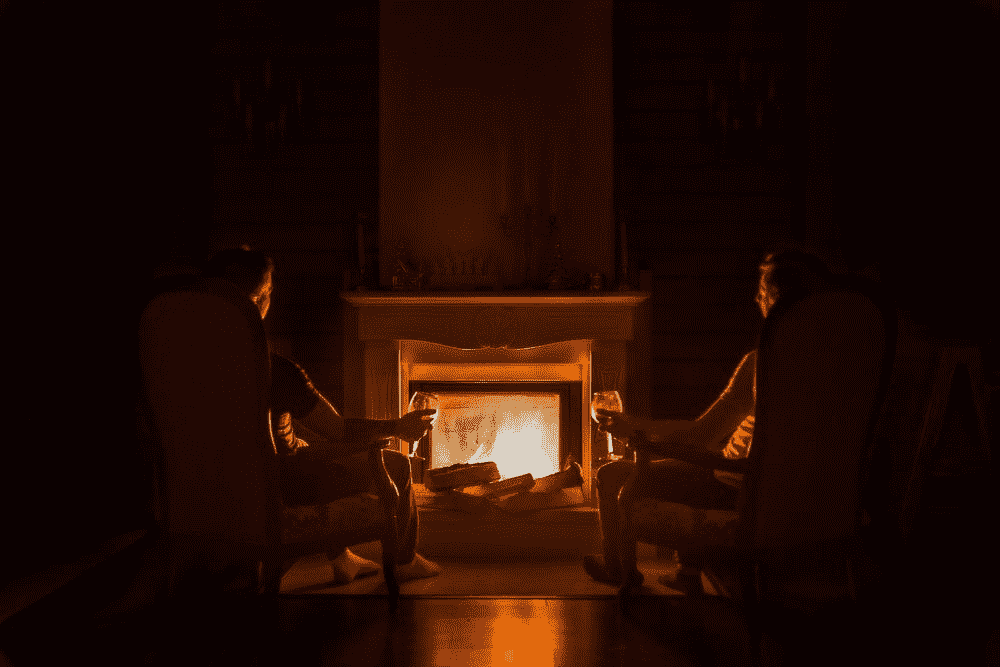
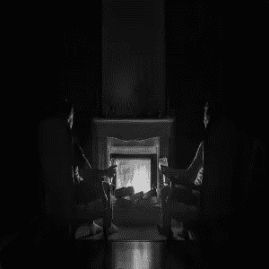
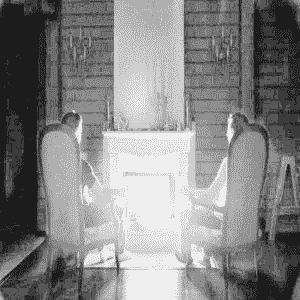
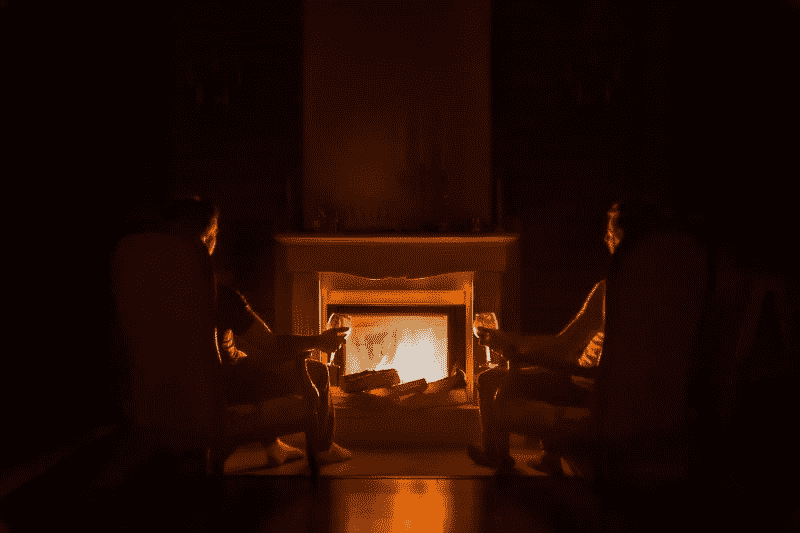
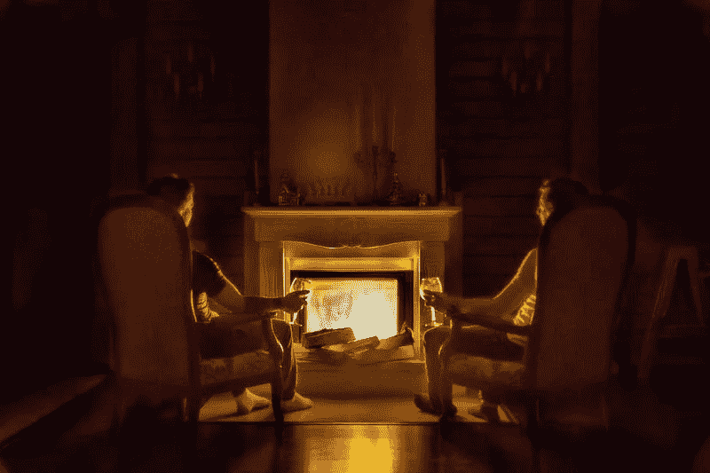

# 直方图均衡

> 原文：<https://medium.com/analytics-vidhya/histogram-equalization-4552f2ac1e8d?source=collection_archive---------10----------------------->

在上一个教程中，我们学习了图像处理中的直方图及其工作原理，这一次我们将升级并看看它在特征提取技术中的实现，以及这种简单的技术如何提升你的游戏！

考虑下面的图像，该图像具有不规则的光照条件，这使得难以检测图像中的对象。因此，您可以应用一种称为直方图均衡化的简单技术来改善检测结果或改善此图像中的照明。



让我们看看如何在 python 中做到这一点！让我们从导入这些包开始。如果您没有在下面的代码块
中安装任何软件包，只需进入终端并键入 *pip install package-name。*

```
import cv2import argparseimport numpy as npimport matplotlib.pyplot as plt
```

幸运的是，OpenCV 为我们提供了默认的直方图均衡方法，你所要做的就是:

1.  加载图像
2.  将其转换为灰度
3.  应用*cv2 . equalize hist(gray _ scale _ image)*

让我们看看它的作用！

```
ap = argparse.ArgumentParser()
ap.add_argument('-i', '--image', required=True, help='image to be prcoessed')
args = vars(ap.parse_args())image = cv2.imread(args['image'])
gray = cv2.cvtColor(image, cv2.COLOR_BGR2GRAY)equalized_image = cv2.equalizeHist(gray)cv2.imshow("original gray", gray)
cv2.imshow("Equalized image", equalized_image)
cv2.waitKey(0)
cv2.destroyAllWindows()
```

结果是这样的:



原始图像与均衡图像

现在，正如你所看到的，虽然我们可以看到背景中的物体，如右边看起来像“A”的物体，或者你现在可以清楚看到的椅子，或者壁炉顶部的物体，但一些噪声也被放大了！这是因为整个图像上的图像照明一次均衡，这过度放大了图像噪声，因此，为了解决这个问题，我们可以使用自适应直方图均衡，即逐块应用直方图均衡，也可以说逐窗口应用直方图均衡。

现在这被称为 CLAHE(对比度受限的自适应直方图均衡化)。

这是如何工作的:

自适应直方图均衡化不是计算图像中的一个而是几个直方图，每个直方图属于图像的不同部分，并且使用这些直方图来重新分布该图像的照明条件。现在，这种方法提高了局部对比度，改善了边缘清晰度。

然而，仅应用 AHE 实际上会过度放大图像中相对均匀区域的噪声。

现在，正常的直方图均衡化在整个图像中使用单个变换函数，但是自适应直方图均衡化实际上在图像的每个局部邻域中使用不同类型的变换函数。
该变换函数与邻域像素值的*累积分布函数(CDF)* 成正比。
现在，仅应用 AHE，实际上会过度放大相对同质区域中的噪声，因此为了解决这个问题，CLAHE 出现了:
在 CLAHE 中，给定像素值附近的对比度放大由变换函数的斜率给出。
现在这个变换函数与邻域累积分布函数(CDF)的斜率成正比。CLAHE 通过在计算 CDF 之前将直方图削波到预定值来限制噪声的放大。这限制了 CDF 的斜率，从而限制了变换函数的斜率，进而限制了噪声的过度放大。

一般来说，这个限幅值在 3-5 之间。

让我们看看实际情况！

```
ap = argparse.ArgumentParser()
ap.add_argument('-i', '--image', required=True, help='image to be processed')
ap.add_argument('-c', '--clip', default=2.0, help='clip size for CLAHE')
ap.add_argument('-t', '--tile', default=8, help='tile size for CLAHE')args = vars(ap.parse_args())
```

这里，剪辑是我们上面讨论过的剪辑限制，平铺是邻域大小，大小为 8 意味着我们将在(8×8)邻域中划分该图像。

```
image = cv2.imread(args['image'])

(b, g, r) = cv2.split(image)
gray = cv2.cvtColor(image, cv2.COLOR_BGR2GRAY)clahe = cv2.createCLAHE(
    clipLimit=args['clip'], tileGridSize=(args['tile'], args['tile']))
equalized_imageb = clahe.apply(b)
equalized_imageg = clahe.apply(g)
equalized_imager = clahe.apply(r)merged = cv2.merge([equalized_imageb, equalized_imageg, equalized_imager])cv2.imshow(‘Original Image’, image)
cv2.imshow(‘Equalized Image’, merged)
cv2.waitKey(0)
cv2.destroyAllWindows()
```

现在让我们看看结果，



原始与均衡(CLAHE)

现在，在这两幅图像中，您可以看到，在均衡图像中，对比度实际上得到显著增强，这种方法通常会产生优势，同时执行某些计算机视觉任务。

你可以在这里找到完整的代码。

下次见，我们将讨论直方图匹配和颜色检测。

参考资料:

[PyimageSearch.com](https://www.pyimagesearch.com/)T10[维基百科](https://en.wikipedia.org/wiki/Adaptive_histogram_equalization)