# hive——如何在 Windows 10 中通过 5 个步骤进行安装

> 原文：<https://medium.com/analytics-vidhya/hive-how-to-install-in-5-steps-in-windows-10-cf56579bfb69?source=collection_archive---------0----------------------->

在 Windows 10 中安装 Hive 的简单指南。


图片取自谷歌图片

# 1.先决条件

1.  硬件要求
    * RAM —最小值。8GB，如果您的系统中有 SSD，那么 4GB RAM 也可以。
    * CPU —最小值。四核，至少 1.80GHz
2.  [JRE 1.8](https://www.java.com/en/download/windows_offline.jsp)—JRE 的离线安装程序
3.  [Java 开发套件— 1.8](https://www.oracle.com/java/technologies/javase/javase-jdk8-downloads.html#license-lightbox)
4.  我将使用 64 位 windows 操作系统，请检查并下载您的系统 x86 或 x64 支持的所有软件版本。
5.  [Hadoop](https://archive.apache.org/dist/hadoop/core/hadoop-2.9.2/)
    *我使用的是 Hadoop-2.9.2，你也可以使用任何其他稳定版本的 Hadoop。
    *如果没有 Hadoop，可以参考 [Hadoop:如何在 Windows 10 中 5 步安装](/analytics-vidhya/hadoop-how-to-install-in-5-steps-in-windows-10-61b0e67342f8)安装。
6.  [MySQL 查询浏览器](https://dev.mysql.com/downloads/mysql/)
7.  [下载 Hive zip](https://downloads.apache.org/hive/hive-3.1.2/)
    *我用的是 Hive-3.1.2，你也可以用 Hive 的任何其他稳定版本。

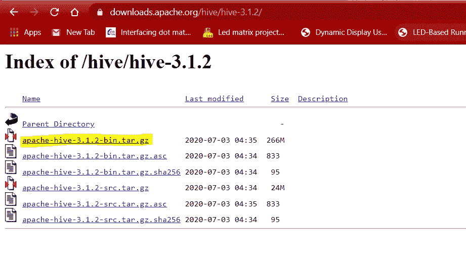

图 1:-下载配置单元-3.1.2

# 2.解压缩并安装配置单元

下载完配置单元后，我们需要解压缩 apache-hive-3.1.2-bin.tar.gz 文件。

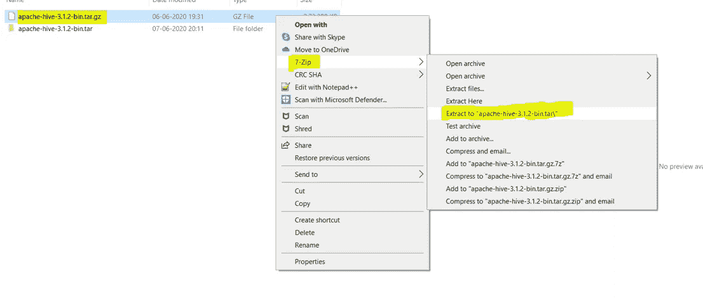

图 2:-提取配置单元步骤-1

一旦提取，我们会得到一个新的文件 apache-hive-3.1.2-bin.tar
现在，我们再次需要提取这个焦油文件。

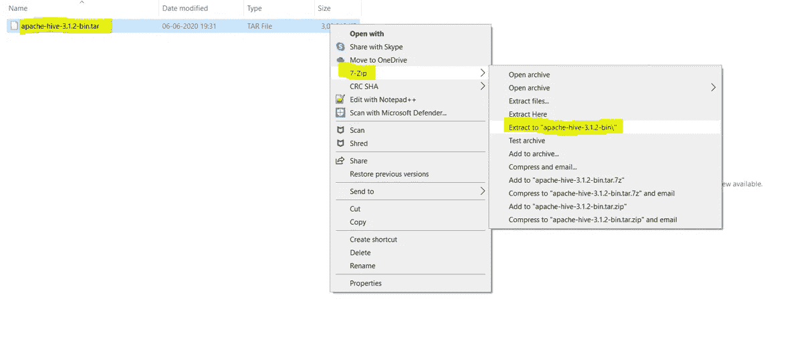

图 3:-提取配置单元步骤-2

*   现在，我们可以组织我们的配置单元安装，我们可以创建一个文件夹，并在其中移动最终提取的文件。比如说

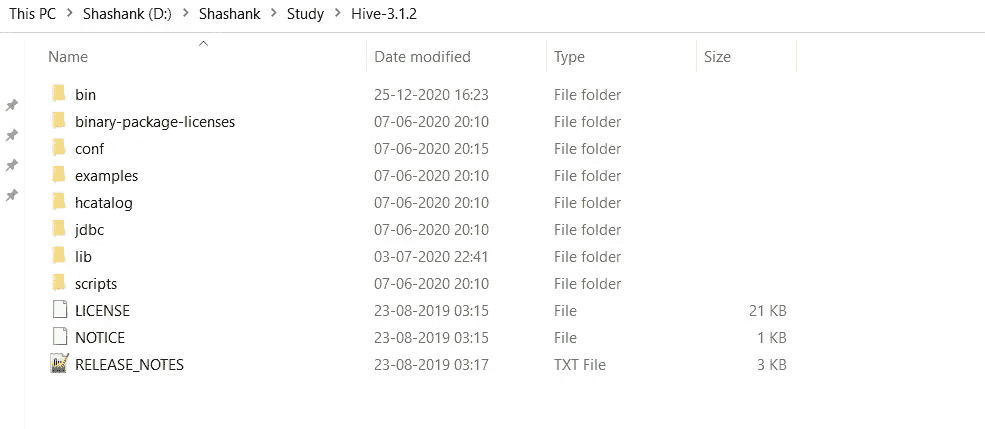

图 4:-配置单元目录

*   请注意，创建文件夹时，不要在文件夹名称之间添加空格。(这可能会导致以后出现问题)
*   我已经把我的蜂箱放在 D:驱动器中，你也可以使用 C:或任何其他驱动器。

# 3.设置环境变量

设置工作环境的另一个重要步骤是设置系统环境变量。

要编辑环境变量，进入控制面板>系统>点击“高级系统设置”链接
或者，我们可以右键单击该电脑图标，点击属性，然后点击“高级系统设置”链接
或者，最简单的方法是在搜索栏中搜索环境变量，这样就可以了…😉

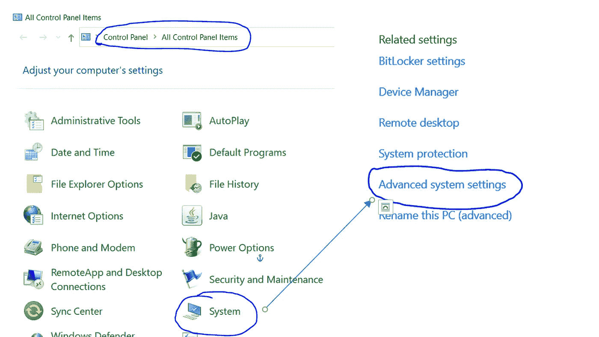

图 5:-环境变量的路径

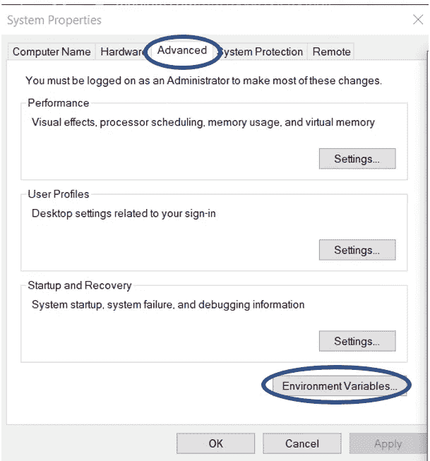

图 6:-高级系统设置屏幕

**3.1 设置 HIVE_HOME**

*   打开环境变量，点击“用户变量”中的“新建”

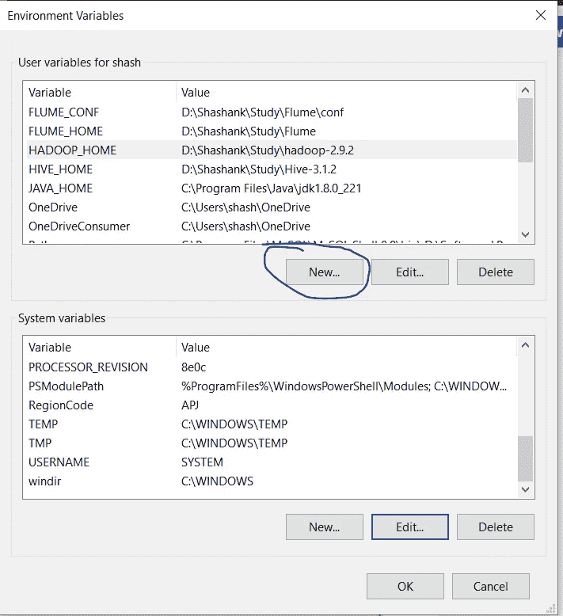

图 7:-添加环境变量

*   点击“新建”,我们进入下面的屏幕。

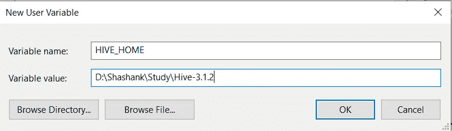

图 8:-添加 HIVE_HOME

*   现在如图所示，在变量名中添加 HIVE_HOME，在变量值中添加 HIVE 的路径。
*   单击 OK，我们就完成了 HIVE_HOME 设置的一半。

**3.2 设置路径变量**

*   设置环境变量的最后一步是在系统变量中设置路径。

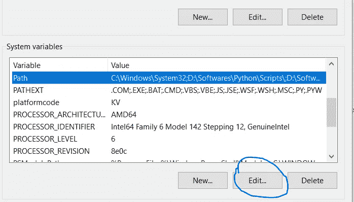

图 9:-设置路径变量

*   在系统变量中选择路径变量并点击“编辑”。

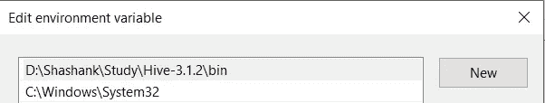

图 10:-添加路径

*   现在我们需要将这些路径添加到路径变量:-
    * %HIVE_HOME%\bin
*   单击确定和确定。&我们已经完成了环境变量的设置。

**3.4 验证路径**

*   现在我们需要验证我们所做的是正确的和反映的。
*   打开一个**新的**命令窗口
*   运行以下命令

```
echo %HIVE_HOME%
```

# 4.编辑配置单元

一旦我们配置了环境变量，下一步就是配置配置单元。它有 7 个部分

**4.1 更换箱子**

配置配置单元的第一步是[下载](https://github.com/HadiFadl/Hive-cmd)并替换 bin 文件夹。
*到这个 [GitHub Repo](https://github.com/HadiFadl/Hive-cmd) 下载 bin 文件夹作为 zip。
*解压 zip 并将 bin 文件夹下的所有文件替换到%HIVE_HOME%\bin

> ***注意:-如果你正在使用不同版本的 HIVE，那么请搜索其各自的 bin 文件夹并下载。***

**4.2 创建文件 Hive-site.xml**

现在我们需要在 Hive 中创建 Hive-site.xml 文件来配置它:-
(我们可以在 Hive->conf->Hive-default . XML . template 中找到这些文件)

我们需要复制 hive-default.xml.template 文件，将其粘贴到相同的位置，并将其重命名为 hive-site.xml。这将作为我们的 hive 主配置文件。

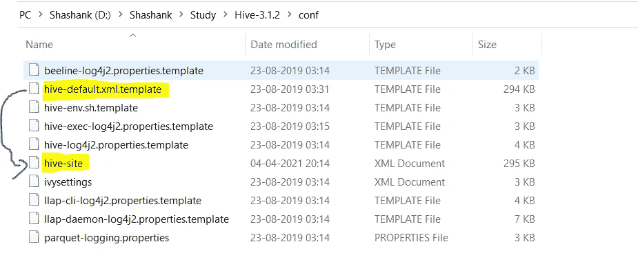

图 11:-创建 Hive-site.xml

**4.3 编辑配置文件**

**4.3.1 编辑属性**

现在打开新创建的 Hive-site.xml，我们需要编辑以下属性

```
<property>
    <name>hive.metastore.uris</name>
    <value>thrift://<Your IP Address>:9083</value>

 <property>
    <name>hive.downloaded.resources.dir</name>
    <value><Your drive Folder>/${hive.session.id}_resources</value>

<property>
    <name>hive.exec.scratchdir</name>
    <value>/tmp/mydir</value>
```

用系统的 IP 地址替换`<Your IP Address>`的值，用 Hive 文件夹路径替换`<Your drive Folder>`。

**4.3.2 删除特殊字符**

这是一个简短的步骤，我们需要删除 hive-site.xml 文件中所有的`&#8`字符。

**4.3.3 添加更多属性**

现在，我们需要在 hive-site.xml 文件中添加以下属性。

```
<property>
    <name>hive.querylog.location</name>
    <value>$HIVE_HOME/iotmp</value>
    <description>Location of Hive run time structured log   file</description>
 </property><property>
    <name>hive.exec.local.scratchdir</name>
    <value>$HIVE_HOME/iotmp</value>
    <description>Local scratch space for Hive jobs</description>
</property><property>
    <name>hive.downloaded.resources.dir</name>
    <value>$HIVE_HOME/iotmp</value>
    <description>Temporary local directory for added resources in the remote file system.</description>
  </property>
```

伟大的..！！！我们几乎完成了 Hive 部分，要将 MySQL 数据库配置为 Hive 的 Metastore，我们需要遵循以下步骤:-

**4.4 在 MySQL 中创建 Hive 用户**

配置 Hive 的下一个重要步骤是为 MySQL 创建用户。
这些用户用于将 Hive 连接到 MySQL 数据库，以便从中读取和写入数据。

> 注意:-如果在安装 SQOOP 时已经创建了配置单元用户，则可以跳过此步骤。

*   首先，我们需要打开 MySQL 工作台并打开工作区(默认或任何特定的，如果你想)。我们现在将只使用默认的工作空间。

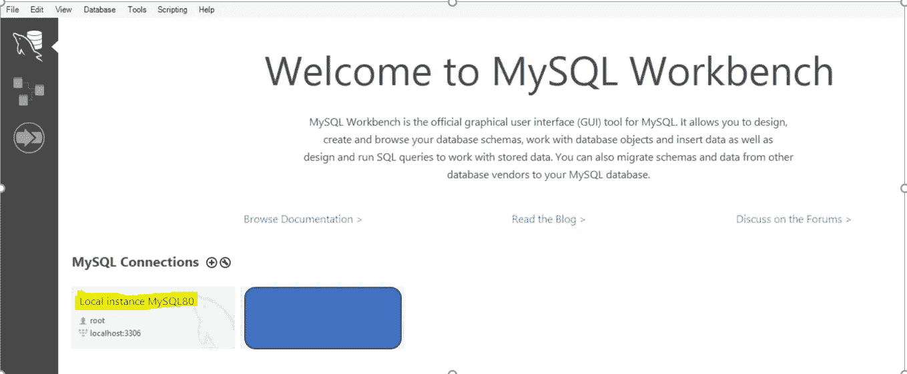

图 12:-打开 MySQL 工作台

*   现在打开工作区的`Administration`选项，选择`Management.`下的`Users and privileges`选项


图 13:-打开用户和权限

*   现在选择`Add Account`选项，创建一个新用户，用`Login Name`作为`hive`，用`Limit to Host Mapping`作为你选择的`localhost`和`Password`。

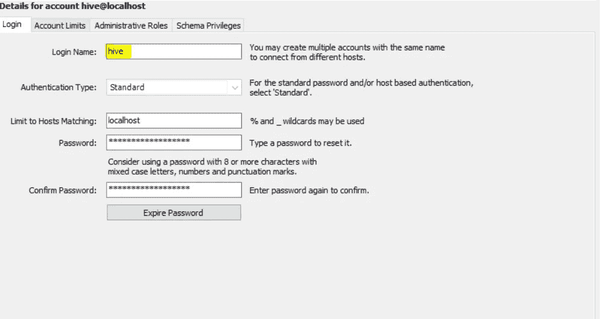

图 14:-创建配置单元用户

*   现在我们必须在`Administrative Roles`下为该用户定义角色，并选择`DBManager`、`DBDesigner`和`BackupAdmin`角色

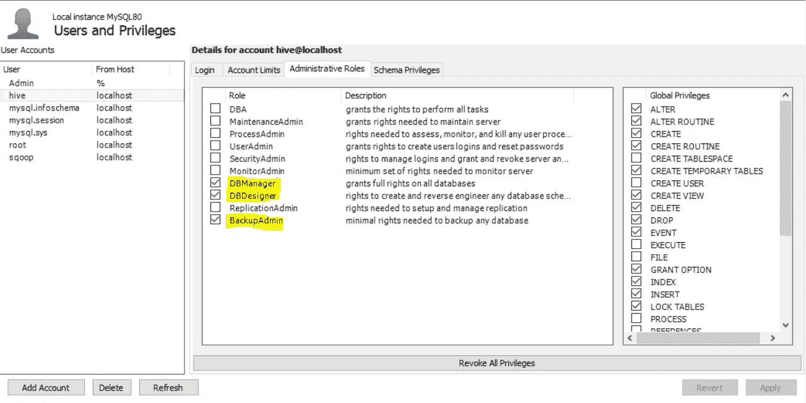

图 15:-分配角色

*   现在我们需要通过使用`Add Entry`选项并选择我们需要访问的`schemas`来授予用户`schema privileges`。

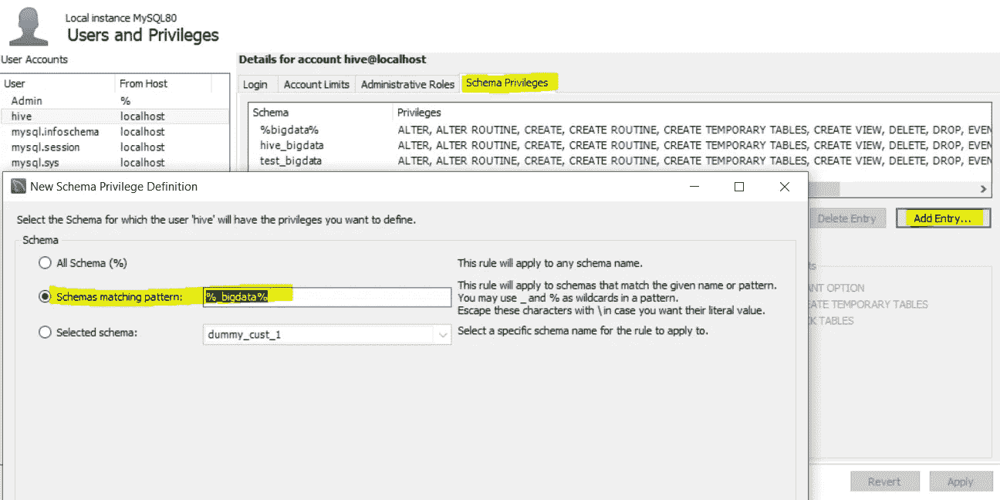

图 16:-模式特权

> *我使用* `*schema matching pattern*` *作为我所有 bigdata 相关模式的* `*%_bigdata%*` *。您也可以使用其他两个选项。*

*   点击`OK`后，我们需要选择该模式的所有权限。

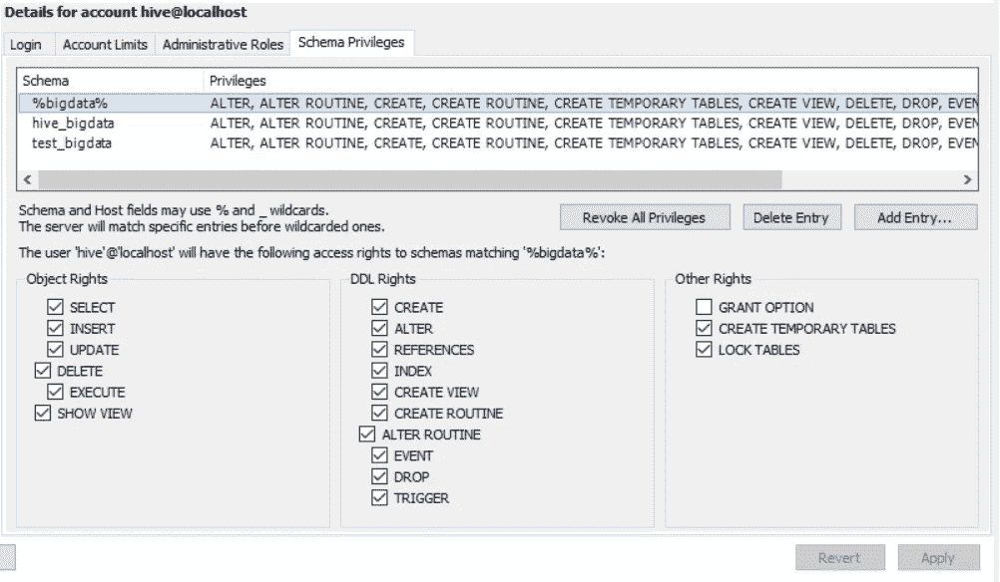

图 17:-选择模式中的所有特权

*   单击 Apply，我们就完成了创建配置单元用户的工作。

**4.5 授予用户权限**

一旦我们创建了用户`hive`,下一步就是将先前选择的模式中所有表的所有特权授予这个用户。

*   打开 MySQL cmd 窗口。我们可以使用窗口的搜索栏打开它。


图 18:- MySQL cmd

*   打开后，它会询问您的`root`用户密码(在设置 MySQL 时创建)。
*   现在我们需要在 cmd 窗口中运行下面的命令。

```
grant all privileges on test_bigdata.* to 'hive'@'localhost';
```

其中,`test_bigdata`是您的模式名,`hive@localhost`是用户名@主机名。

**4.6 创建 Metastore**

现在我们需要在 MySQL 中为 Hive 创建自己的 metastore..

首先，我们需要在 MySQL 中为 metastore 创建一个数据库，或者我们可以使用上一步`test_bigdata`中使用的数据库。

现在导航到下面的路径

`hive -> scripts -> metastore -> upgrade -> mysql`并在你的数据库中执行 MySQL 中的文件`hive-schema-3.1.0.mysql`。

> 注意:-如果使用不同的数据库，在`upgrade`文件夹中选择相同的文件夹并执行`hive-schema`文件。

**4.7 添加更多属性(Metastore 相关属性)**

最后，我们需要再次打开我们的`hive-site.xml`文件，并对其进行一些更改，这些与 Hive metastore 相关，这就是为什么没有在开始时添加它们，以便区分不同的属性集。

```
<property>
    <name>javax.jdo.option.ConnectionUserName</name>
    <value>hive</value>
    <description>Username to use against metastore database</description>
  </property>

<property>
    <name>javax.jdo.option.ConnectionURL</name>
    <value>jdbc:mysql://localhost:3306/<Your Database>?createDatabaseIfNotExist=true</value>
    <description>
      JDBC connect string for a JDBC metastore.
      To use SSL to encrypt/authenticate the connection, provide database-specific SSL flag in the connection URL.
      For example, jdbc:postgresql://myhost/db?ssl=true for postgres database.
    </description>
  </property>

  <property>
    <name>hive.metastore.warehouse.dir</name>
    <value>hdfs://localhost:9000/user/hive/warehouse</value>
    <description>location of default database for the warehouse</description>
  </property>

  <property>
    <name>javax.jdo.option.ConnectionPassword</name>
    <value><Hive Password></value>
    <description>password to use against metastore database</description>
  </property>

  <property>
 <name>datanucleus.schema.autoCreateSchema</name>
 <value>true</value>
</property>
<property>
 <name>datanucleus.schema.autoCreateTables</name>
 <value>True</value>
 </property>

 <property>
    <name>datanucleus.schema.validateTables</name>
    <value>true</value>
    <description>validates existing schema against code. turn this on if you want to verify existing schema</description>
  </property>
```

将 *<配置单元密码>* 的值替换为我们在 MySQL 用户创建中创建的配置单元用户密码。并且<您的数据库>与我们在 MySQL 中用于 metastore 的数据库。

# 5.开始配置单元

**5.1 启动 Hadoop**

现在我们需要启动一个新的命令提示符，记住以管理员身份运行它，以避免权限问题，并执行下面的命令

```
***start-all.cmd***
```


图 19:-启动所有命令

所有 4 个守护进程都应该启动并运行。

**5.2 启动 Hive Metastore**

打开 cmd 窗口，运行以下命令启动配置单元 metastore。

```
hive --service metastore
```

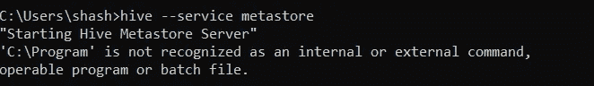

图 20:-启动配置单元 Metastore

**5.3 启动配置单元**

现在打开一个新的 cmd 窗口并运行下面的命令来启动 Hive

```
hive
```

# 6.常见问题

**6.1 无法在配置单元中导出或导入数据**

启动 Hive 后，我们面临的第一个常见问题是无法导入或导出

Sol:-我们需要编辑下面的属性，并将其设为 false

```
<property>                      <name>hive.metastore.event.db.notification.api.auth</name>     <value>false</value>    
<description>
      Should metastore do authorization against database notification related APIs such as get_next_notification.
      If set to true, then only the superusers in proxy settings have the permission
    </description>
  </property>
```

**6.2 加入不工作**

如果在运行连接查询时遇到问题，我们需要在运行连接查询之前运行以下命令:-

```
set hive.auto.convert.join=false;
set hive.auto.convert.join.noconditionaltask=false; 
```

因为没有这些配置单元，尝试一个失败的映射端连接，对于普通连接，将这些参数设置为 false。

# 7.恭喜..！！！！🎉

恭喜你！我们已经成功安装了 Hive。我们中的一些人可能会遇到一些问题……不要担心，这很可能是由于一些小失误或不兼容的软件。如果您遇到任何此类问题，请再次仔细访问所有步骤，并验证软件版本是否正确。如果你仍然不能让 Hive 正常运行，请在评论区描述你的问题。

你可以在这里了解我更多。。

快乐学习…！！！🙂