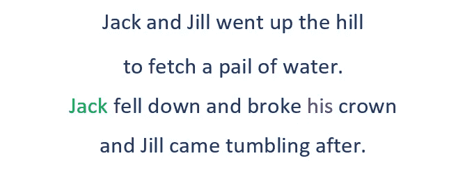
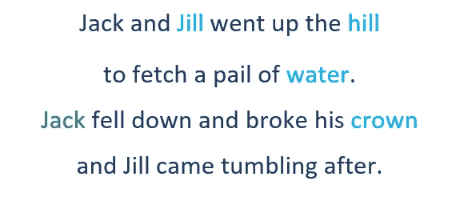
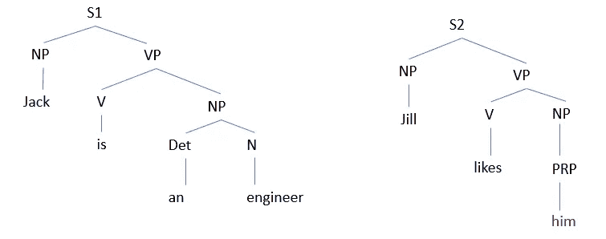
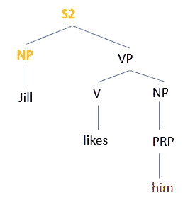
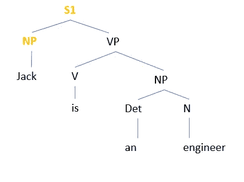
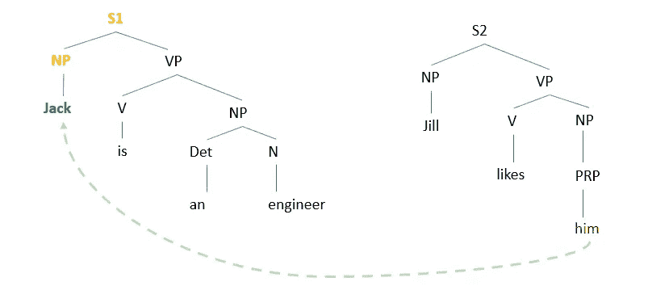

# 霍布斯算法——代词消解

> 原文：<https://medium.com/analytics-vidhya/hobbs-algorithm-pronoun-resolution-7620aa1af538?source=collection_archive---------0----------------------->

霍布斯算法是用于**代词解析**的技术之一。但是什么是代词消解，❓，让我们用一个例子来理解它。

你们可能都熟悉这首童谣。仔细阅读课文。

现在，问题是:代词**‘他的’**指的是谁？？为了回答这个问题，我们作为一个人很容易联想到“他的”这个词指的是杰克，而不是吉尔、希尔或王冠。但是你认为这个任务对计算机来说也容易吗，❔

这个问题的答案是'**不'。**猜猜为什么😐？

# 因为计算机缺乏常识。

> 定位与文本中标识的任何实体共指的所有表达式的任务被称为**共指消解**，当文本中的两个或更多表达式涉及同一个人或对象时，就会发生这种情况。因此，为了推断出对文本的正确理解，必须解决代词和其他指代表达。

因此，为了完成这项任务，计算机需要借助不同的技术，其中之一就是霍布斯算法。

**霍布斯算法**是代词消解的几种方法之一。该算法主要基于句子的句法分析树。为了让这个想法更清楚，让我们考虑一下前面杰克和吉尔的例子，并理解我们人类如何试图解决代词**‘他的’。**

如图所示，解决代词“his”的可能候选词是 Jack、Jill、hill、water 和 crown。

但是为什么我们甚至没有想到把**皇冠**作为一个可能的解决方案呢？可能是因为名词“皇冠”在代词“his”之后。这是霍布斯算法中的第一个假设，其中对参照对象的**搜索**总是被**限制在目标的左侧**，因此冠部被消除。

那么吉尔、水或山是可能的参照物吗？

但是我们知道‘他的’可能不是指吉尔，因为吉尔是个女孩。一般来说**有生命的物体**要么用**男性代词**指代，比如——他，他的；或者**女性代词**像——她、她等。和**无生命物体**取**中性**性别**喜欢..这个属性被称为**性别协议**它排除了吉尔、希尔和水的可能性。**

代词只能回溯几个句子，而更靠近所指短语的实体比那些更远的实体更重要……这最终给我们留下了唯一可能的解决方案，即杰克。这个属性被称为**新近属性。**

现在在了解了人类如何处理文本和解析代词之后，让我们看看如何在缺乏常识的机器中嵌入智能(使用**霍布斯算法** ) ，来执行代词解析的任务。

**考虑两句:**

句子 1(S1):杰克是一名工程师。

第二句(S2):吉尔喜欢他。

该算法在解析代词时利用了**句法约束**。Hobbs 算法的输入是要与直到并包括当前句子的句子句法分析一起解析的代词。

这里，我们有两个句子的**句法分析树**，如图所示。

该算法从目标代词开始，沿着解析树向上走到根节点‘S’。对于找到的每个名词短语或“S”节点，它首先从左到右搜索目标左侧节点的子节点的。因此，在我们的例子中，算法从句子 2 的解析树开始，向上攀升到根节点 S2。然后，它进行广度优先搜索以找到名词短语(NP)。在这里，算法为名词‘Jill’找到它的第一个名词短语。

但是由于**绑定理论的句法限制，它并没有探索那个分支。**

> 约束理论认为:反身代词可以指代它所在的最直接从句的主语，而非反身代词不能指代这个主语..诸如他自己、她自己、他们自己等词。被认为是反射性的。

我们用一个例子来理解这个。

*   约翰给自己买了一辆新车。

这里，他自己指的是约翰。而如果句子是

*   约翰给他买了一辆新车。

那么代词 him 指的不是约翰。因为对这个句子的一种可能的解释可能是约翰给他买了一辆新车，而他可能是约翰送给他一辆车的人。

所以根据约束理论的约束，我们例子中的‘他’不会指吉尔。此外，由于**性别一致性约束**即使探索了分支，Jill 也不会成为代词‘他’的公认指称对象。

因此，算法现在开始在前一个句子的语法树中搜索。

对于找到的每个名词短语，它首先从左到右**搜索节点的子节点**。这是因为语法规则或者更普遍的说法是**霍布斯距离属性**。

> 霍布斯的距离属性表明，处于主语位置的实体比处于宾语位置的实体更有可能替代代词。

因此，在句子中的**主语杰克**，杰克是一名工程师，是在宾语工程师之前被探索的**，最后杰克是代词他的解析指称对象。**

这就是霍布斯算法如何帮助代词解决的过程，这是自然语言理解和自然语言生成的关键子任务之一。

或者，您也可以观看视频以便更好地理解:[https://youtu.be/HeERR5ZCptw](https://youtu.be/HeERR5ZCptw)

我希望你学得愉快。如果您发现此内容有用，请感谢作者的努力。此外，如果您有任何建议或问题，请随时留下您的评论。