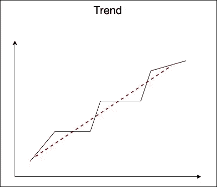
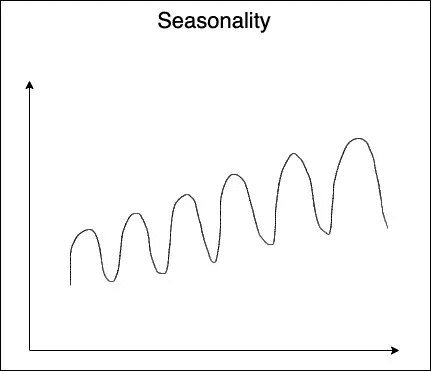

# 霍尔特-温特斯预测基础

> 原文：<https://medium.com/analytics-vidhya/holt-winters-forecasting-13c2e60d983f?source=collection_archive---------3----------------------->

昨天是一个寒冷的冬夜，我在 Brooklyn99 上大吃大喝，那时我想我可以写一篇关于 Holt-Winters 指数平滑的简短文章(明白这个蹩脚的笑话吗？)

Holt-Winters 指数平滑(HWES)的工作原理是平滑单变量时间序列分析的值，以使用它们来预测未来值。这个想法是分配指数递减的权重，给予最近的事件更多的重要性。所以，当我们回到过去，我们会看到重量减少。

注意:如果你正在寻找如何用 Python 编写 Holt-Winters 代码，请点击这里查看这个由两部分组成的博客的第二部分:

[https://etqadkhan 23 . medium . com/python-code-on-Holt-winters-forecasting-3843808 a 9873](https://etqadkhan23.medium.com/python-code-on-holt-winters-forecasting-3843808a9873)

接下来，我们将回顾一些有助于我们更好地理解 HWES 的关键术语。

1.  **关卡**

如果我们必须定义水平，我们可以称之为在一段时间内可能发生的价值的显著增加。随着每一次显著增加，水平也增加。

**2。趋势**

如果水平以特定的模式变化，你可以说时间序列遵循一个趋势。趋势可以是线性的、平方的、对数的、指数的。趋势是一个向量，因为它有大小和方向。

**3。季节性**

时间序列的季节性是指某些模式周期性重复。一个例子是，全年的气温将遵循季节性趋势，在某些月份气温较高，而在其他几个月气温较低，并且在不同的年份表现出相同的模式。季节性有两种类型，即加法和乘法。

**4。平稳性**

平稳时间序列具有均值和方差等随时间变化的常数性质。数据的平稳性是 HWES 应用的一个重要特性。

用于预测的霍尔特-温特斯指数平滑方程在推导时由下式组成:

为了启动这个方程，我们需要几个初始值，即 l0，B0 和 s0。

为了计算表示级别的 l0，我们对指数 m、2m、3m 等处的值进行平均，其中 m 是周期长度。举一个 m= 6 个月的例子，

***L_0 =均值(T0 + T6 + T12 +…)。)***

为了计算定义趋势的 B0，我们测量了跨时间步发生的趋势变化率，我们用时间步的数量对其进行平均。以 m= 3 个月为例，

***B _ 0 = 1/6[(T6-T0)/6+(T7-T1)/6…】***

对于季节性，我们取每个 m 指数后的值之间的比率，然后用相应的水平除以它，

***S _ 0 =【T0/L0，T1/L1，T2/L2…*](乘法)**

***S_0 = [(T0-L0)，(T1-L1)，(T2-L2)……..](加法)***

为了进行预测，我们还需要为分别用于单、双和三 es 的 HWES 方程中的α、β和γ赋值。

*α、β和γ* 是加权系数，在优化之前，这些系数将被分配一些初始权重，优化可以使它们达到误差项最小时所达到的偏好值。 *α、β和γ* 的初始值如下:

***α被赋值为 1/2m***

***β被赋值 1/20m***

***γ被赋值 1/20*(1-α)***

现在，一旦设定了这些值，我们就可以确定 L_i、B_i 和 S_i，然后可以根据上式预测 F_(i+k)。

此外，当我们这样做时，我们应该理解单指数平滑、双指数平滑和三指数平滑之间的区别。虽然单 HWES 可以处理有层次的时间序列数据，但双 HWES 也可以考虑有趋势的数据，而三 HWES 甚至可以处理季节性。下表以更清晰的方式解释了同样的事情，

虽然我们已经介绍了 Holt-Winters 指数平滑算法的基本思想，但是我们应该记住两件重要的事情，

1.  霍尔特-温特斯预测不能很好地处理不规则模式的时间序列数据
2.  HWES 是一种单变量预测技术，适用于平稳的时间序列数据

谢谢你过来看了这本书。我将尝试记录一个更 python 友好的方法，在这里我们编写一些代码。我希望这有助于建立一个关于算法的基本直觉。干杯！

更新:HWES 的 Python 代码演练可从以下网址获得:

[https://etqadkhan 23 . medium . com/python-code-on-Holt-winters-forecasting-3843808 a 9873](https://etqadkhan23.medium.com/python-code-on-holt-winters-forecasting-3843808a9873)