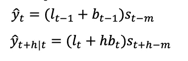

# 霍尔特-温特斯预测

> 原文：<https://medium.com/analytics-vidhya/holt-winters-forecasting-66bb1798fdc7?source=collection_archive---------4----------------------->

时间序列预测系列。

霍尔特-温特斯预测是一种建模和预测一系列值在一段时间内(时间序列)的行为的方法。Holt-Winters 是最流行的时间序列预测技术之一。

它已有几十年的历史，但在许多应用中仍然无处不在，包括监控，用于异常检测和容量规划等目的。


霍尔特-温特斯是时间序列行为的模型。预测总是需要模型，Holt-Winters 是一种对时间序列的三个方面进行建模的方法:典型值(平均值)、随时间变化的斜率(趋势)和周期性重复模式(季节性)。Holt-Winters 使用指数平滑对过去的大量值进行编码，并使用它们来预测现在和未来的“典型”值。如果你不熟悉指数平滑。

## 霍尔特-温特斯法

这种方法有两种不同的变体，如季节性成分。

当季节变化在整个系列中大致不变时，最好使用加法方法，而当季节变化与系列水平成比例变化时，最好使用乘法方法

## 有三个组成部分。

*   趋势
*   季节性
*   水平

**加性季节性**


`l = level, b = trend, s = seasonality, m = seasonal time period, h = forecast time period(how many time periods)`

**倍增的季节性**



`l = level, b = trend, s = seasonality, m = seasonal time period, h = forecast time period(how many time periods)`

## **霍尔特-温特斯—重要概念**

## **平滑**

*   简单移动平均线
*   加权移动平均
*   指数加权移动平均或指数平滑

## **简单移动平均线**


SMA 的示例

```
Where, K=2
SMA = (15+20)/(2) = 17.5
SMA = (20+25)/(2) = 22.5
.
.
```

类似地，

```
Where if, K=3
SMA = (15+20+25)/(3) = 20
SMA = (20+25+30)/(3) = 25
.
.
```

## **加权移动平均**


```
Adding weightage to the Kth Variable.
WMA for K=2
WMA = (20*2+15*1)/(3) = 18.33
WMA = (16*2+20*1)/(3) = 17.33
.
.WMA for K=3
WMA = (16*3+20*2+15*1)/(6) = 17.16
WMA = (13*3+16*2+20*1)/(6) = 15.16
.
.
```


## **指数平滑**

*   长期平均抑制了波动，不仅去除了噪音，还去除了趋势和季节性
*   短期内的移动平均线保持趋势和季节性，但是确定一个最佳的周期数是很棘手的，即使使用像 MAE 这样的指标。
*   如果在太少的时间内平均，不规则性继续存在，如果在长时间内平均，阻尼再次成为问题。
*   指数平滑保留所有较旧的期间，同时给予较新的期间较大的权重(因此不是移动平均)。

静态模型:指数平滑


```
**ŷ**t+1 = Predicted value for time period t+1
**ŷ**t   = Predicted value for previous period
α    = any value between 0 and 1 (0 ≤ α ≤ 1)
(yt-**ŷ**t) = adjustment for the error made in predicting the previous periods's value
```

*   用于在每个周期更新组件的三个权重平滑参数。

对于加法平滑组件


倍增的季节性


现在，让我们跳过数学，理解霍尔特·温特是如何工作的

## **手动霍尔特-温特。**


```
Here is the R code:
x <- seq(1,20,1)for (i in x) {
    x[i] = 0
    if ((i-2)%%5==0){
    x[i]=1
    }
  }
plot.ts(x,ylab="Value", main="Plot of simple time series")
points(x)
```

模式是显而易见的:该图重复值[0，1，0，0，0]。

如果我们相对于这 5 个点的平均值来计算*的值，会是什么样子？(0+1+0+0+0)/5 的平均值是 0.2，我们将在图上画一条水平线:*


回想一下霍尔特-温特斯有一个趋势部分。如果我们将其参数设置为零，Holt-Winters 将忽略趋势(斜率)，因此模型将会简化。现在，它只是一堆相对于平均值的值。在我们的图中，相对于 0.2 的值是[-0.2，0.8，-0.2，-0.2，-0.2]。如果我们在没有趋势的情况下做 Holt-Winters，那就是我们要建立的模型类型。

下面是 R 中的 HoltWinters 函数给出的内容，还有一些我手动添加的蓝色注释:


用趋势预测只是对它的一种增强。你不需要用一个固定的平均值作为基础，你只需要加入直线的斜率。这是一个有趋势的模型:


示例系列每五个点重复一次，即季节为 5 个周期。

**正确的季节性对霍尔特-温特斯预测至关重要**

为了说明这一点，让我们看看当您使用 6 个期间的季节时会发生什么，比 5 个期间的实际季节多一个期间:


图表中的红线预测变得不太准确，变成了垃圾。为了得到好的结果，你需要给模型好的参数。这是霍尔特-温特斯预测的第二个挑战。

选择季节性是一个困难的问题。通用预测很难，因为它必须准备好用于任何数据集，这些数据集可能具有值、趋势和季节性的任意组合。它甚至可能没有这些组件

预测的准确性是计算预测值和实际值之间的差异。下图中的蓝色箭头表示预测值与实际值的差距。


要量化整体准确性，您可以通过取平均值或平方和将这些差异合并成一个值。

结果是，如果预测较好，则值较小，如果预测较差，则值较大。这为您提供了一个比较预测结果的好方法。

我们的预测代码尝试了许多不同参数的组合，并选择了产生最低组合误差分数的组合。

为了说明这一点，这里有一些对同一时间序列的预测，尝试不同的频率


由于数据和预测之间的差异很小，所以具有正确季节性(每个季节 5 个周期)的数据很容易从视觉上识别出来。这是一个直观的例子，展示了我们通过优化进行的预测。它还优化了其他参数，如趋势。

# **结论**

霍尔特-温特斯预测尽管简单，却惊人地强大。它可以处理许多复杂的季节性模式，只需找到中心值，然后添加斜率和季节性的影响。诀窍是给它正确的参数。这个解决方案易于构建和理解，这对我们的目的很有价值。

# 参考

*   [https://www.otexts.org/fpp/7/5](https://www.otexts.org/fpp/7/5)
*   [https://grisha . org/blog/2016/01/29/三重指数平滑预测/](https://grisha.org/blog/2016/01/29/triple-exponential-smoothing-forecasting/)
*   [http://www . ITL . NIST . gov/div 898/handbook/PMC/section 4/PMC 435 . htm](http://www.itl.nist.gov/div898/handbook/pmc/section4/pmc435.htm)