# 家庭信用违约风险(第一部分) :业务理解、数据清理和 EDA

> 原文：<https://medium.com/analytics-vidhya/home-credit-default-risk-part-1-business-understanding-data-cleaning-and-eda-1203913e979c?source=collection_archive---------0----------------------->

> "及时归还贷款会使第二次借款变得更容易."

**注意:**这是一个由 3 部分组成的端到端机器学习案例研究，用于“家庭信贷违约风险”Kaggle 竞赛。对于本系列的第二部分，包括“特征工程和建模-I”，点击[这里](/@dhruvnarayanan20/home-credit-default-risk-part-2-feature-engineering-and-modelling-i-be9385ad77fd)。本系列的第 3 部分包括“建模-II 和模型部署”，点击[此处](/@dhruvnarayanan20/home-credit-default-risk-part-3-modelling-ii-and-model-deployment-3b3f92e1926c)。

我们都知道，自从通过物物交换系统引入货币以来，贷款已经成为绝大多数人生活中非常重要的一部分。申请贷款的人背后有不同的动机:有人可能想买房、买车或两轮车，甚至想创业，或者申请个人贷款。“缺钱”是人们为什么申请贷款的一个很大的假设，然而多项研究表明事实并非如此。即使是富人也更喜欢贷款，而不是花流动现金，以确保他们有足够的储备资金以备不时之需。另一个巨大的激励是一些贷款带来的税收优惠。

请注意，贷款对贷方和借方同样重要。任何贷款金融机构的收入本身就是贷款的高利率和投资者账户上相对较低的利率之间的差额。一个显而易见的事实是，贷款人只有在特定的贷款被偿还，而不是拖欠时才获利。当借款人超过一定天数没有偿还贷款时，贷款机构认为该贷款已被注销。这基本上意味着，即使银行尽最大努力进行贷款回收，它也不会再指望贷款得到偿还，这些现在被称为“不良资产”(NPAs)。例如:在住房贷款的情况下，一个常见的假设是，拖欠超过 720 天的贷款被注销，它们不被视为活跃投资组合规模的一部分。

因此，在这一系列博客中，我们将尝试构建一个机器学习解决方案，在给定我们数据集中的一组特征或列的情况下，预测申请人偿还贷款的概率:我们将涵盖从理解业务问题到执行“探索性数据分析”的旅程，然后是预处理、特征工程、建模和部署到本地机器。我知道，我知道，有很多东西，考虑到来自多个表的数据集的大小和复杂性，这将需要一段时间。所以请坚持到最后。；)

# 目录

1.  商业问题
2.  数据源
3.  数据集架构
4.  业务目标和约束
5.  问题定式化
6.  性能指标
7.  探索性数据分析
8.  结束注释
9.  参考

# 1.商业问题

显然，这对许多银行和金融机构来说是一个大问题，这也是这些机构在发放贷款时极其挑剔的原因:绝大多数贷款申请都被拒绝。这主要是因为申请人的信用记录不足或不存在，他们因此被迫向不可信的贷款人寻求资金需求，并有被利用的风险，主要是不合理的高利率。

为了解决这个问题，“家庭信贷”使用大量数据(包括电信数据和交易数据)来预测申请人的贷款偿还能力。如果申请人被认为适合偿还贷款，他的申请将被接受，否则将被拒绝。这将确保有能力偿还贷款的申请人的申请不会被拒绝。

因此，为了处理这类问题，我们正试图提出一种制度，通过这种制度，贷款机构可以提出一种方法来评估借款人的贷款偿还能力，并最终使这成为一个对所有人都有利的双赢局面。

# **2。数据源**

【https://www.kaggle.com/c/home-credit-default-risk】来源:

**

*当涉及到获取金融数据集时，一个巨大的问题是在公共平台上共享它们所带来的安全问题。然而，为了激励机器学习实践者提出创新技术来建立预测模型，我们所有人都应该真正感谢“家庭信用”，因为收集这种差异的数据不是一件容易的事情。“住房信贷”在这方面创造了奇迹，为我们提供了一个全面而干净的数据集。*

## ***问:什么是“住宅信贷”？他们是做什么的？***

*“家庭信贷”集团是一家有 24 年历史的贷款机构(成立于 1997 年)，向其客户提供消费贷款，在 9 个国家开展业务。它们于 2012 年进入印度市场，已为该国超过 1000 万消费者提供服务。为了激励 ML 工程师构建高效的模型，他们为同样的任务设计了一个 Kaggle 竞赛。他们的座右铭是通过让不值得的客户(他们指的是信用记录很少或没有信用记录的客户)在线上和线下都能轻松、安全地借款，从而赋予他们权利。*

# *3.数据集架构*

*请注意，与我们共享的数据集非常全面，包含了大量关于借款人的信息。数据被分隔在多个彼此相关的文本文件中，例如在关系数据库的情况下。数据集包含广泛的特征，例如贷款类型、性别、职业以及申请人的收入，他/她是否拥有汽车或房地产等等。它还包括申请人过去的信用记录。*

*我们有一个名为“SK_ID_CURR”的列，它作为我们进行默认预测的输入，我们手头的问题是一个“二元分类问题”，因为给定申请人的“SK_ID_CURR”(当前 ID)，我们的任务是预测 1(如果我们认为我们的申请人是违约者)和 0(如果我们认为我们的申请人不是违约者)。*

> *负类(0)表示非违约者，而正类(1)表示数据集中的违约者。*

*我们的数据集模式如下所示:*

**

*从上面我们可以看到，我们总共有 8 个数据集，借助于 Home Credit Group 本身提供的以下数据描述，可以更好地理解这些数据集:*

*(我们可以从以下来源获得完整数据:[https://www.kaggle.com/c/home-credit-default-risk/data](https://www.kaggle.com/c/home-credit-default-risk/data)*

> ***应用 _ {训练|测试}。csv***

*   *这是主表，分为两个文件用于训练(带目标)(即。提供的预测)和测试(无目标)。*
*   *所有应用程序的静态数据。在我们的数据样本中，一行代表一笔贷款。*

> ***bureau.csv***

*   *由其他金融机构提供并向信用局报告的所有客户以前的信用记录(对于在我们的样本中有贷款的客户)。*
*   *对于我们样本中的每一笔贷款，客户在申请日期之前在信用局拥有的信用数就是贷款的行数。*

> ***bureau_balance.csv***

*   *信用局以前信用的每月余额。*
*   *该表中每个月向征信机构报告的每笔先前信用的历史都有一行，即该表有(#样本中的贷款数* #相对先前信用数* #我们有一些先前信用的可观察历史的月份数)行。*

> ***POS_CASH_balance.csv***

*   *申请人以前的 POS(销售点)和家庭信贷的现金贷款的每月余额快照。*
*   *对于与我们样本中的贷款相关的家庭信贷(消费信贷和现金贷款)中的每个先前信贷的每个月的历史，该表有一行，即该表有(#样本中的贷款数* #相对先前信贷数* #我们对先前信贷有一些历史观察的月份数)行。*

> ***信用卡余额 csv***

*   *申请人以前拥有的家庭信用信用卡的每月余额快照。*
*   *对于与我们样本中的贷款相关的家庭信贷(消费信贷和现金贷款)中的每个先前信贷的每个月的历史，该表有一行，即该表有(#样本中的贷款数* #相对先前的信用卡数* #我们有一些先前信用卡的可观察历史的月份数)行。*

> ***previous_application.csv***

*   *在我们的样本中有贷款的客户的所有以前的家庭信用贷款申请。*
*   *在我们的数据示例中，与贷款相关的每个先前的应用程序都有一行。*

> ***分期付款 _ 付款. csv***

*   *与我们样本中的贷款相关的住房信贷中以前支付的信贷的还款历史。*
*   *每一笔已支付的款项都有一行，每一笔未支付的款项也有一行。*
*   *在我们的示例中，一行相当于一次分期付款的一次支付，或者一次分期付款对应于一次与贷款相关的先前住房信贷的一次支付。*

*请注意，除了这 8 个数据集之外，我们还有另一个名为“home credit _ columns _ description . CSV”的数据集，它包含各种数据文件中出现的列的描述。*

# *4.业务目标和约束*

*现在，既然我们已经理解了数据集和手头的任务，我们需要能够识别相关的业务目标和手头问题的约束。在我们前进之前，这是极其重要的，因为这将决定我们需要开发什么样的解决方案。*

## ***目标***

*我们目前的目标或任务是根据申请人提供的数据确定潜在的违约者。当然，我们可以在现有功能的基础上创建新功能。*

## *限制*

***(i)可解释性很重要:***

*   *这意味着我们应该能够生成申请人有能力或没有能力偿还贷款的概率估计，而不是将申请人严格分类为其中之一。然而，模型的可解释性并不像癌症诊断这样的医学应用那样重要。*
*   *如果申请人能力的概率是 0.5，而在另一种情况下是 0.9，我们可以很好地得出结论，当值为 0.9(并归类为 1)时，我们比值为 0.5(然后归类为 1)时更有把握。*

***(ii)没有严格的延迟限制:***

*   *这不完全是低延迟要求，因为在低延迟要求问题中，例如对于互联网公司，低延迟指的是几毫秒。*
*   *我们的算法可能需要一段时间来运行，以确保预测还款能力的高准确性。银行/金融机构不需要在很短的时间内交付结果。*

***(三)误分类成本高:***

*   *这是一个需要考虑的非常重要的真实世界指标，因为我们的错误分类成本可能非常高。*
*   *如果没有能力偿还贷款的贷款申请人被归类为有能力，他/她获得贷款，而在他/她不能偿还贷款的情况下，银行或金融机构会拖欠贷款，并可能遭受损失，甚至可能不得不注销。*
*   *同样，如果一个有能力的申请人被归类为无能力，他/她的申请会被拒绝，银行会失去一个客户，这将影响他们的利润。*

# *5.问题定式化*

**

*我们可以将机器学习问题公式化，它将遵循我们已经定义的目标和约束。*

*   *我们拥有的数据集既有特征又有类标签(目标)，我们必须预测相应的类标签(0 或 1)。这基本意味着这是一个监督学习的二分类问题。*
*   *当我们执行探索性数据分析时，我们将能够看到我们的数据集高度不平衡，这意味着我们在决定将要使用的性能指标时，必须考虑这种不平衡。*

# *6.性能指标*

*由于数据集是高度不平衡的(与类 1 值相比，类 0 值要多得多)，请注意，我们不能简单地使用准确性作为衡量标准来确定模型性能。当数据不平衡时，我们可以使用的一些指标是对数损失、F1 值、AUC 等。*

*   ***ROC_AUC 得分:**在这场特殊的 Kaggle 比赛中，请注意 ROC_AUC 得分是主办方选择优化的绩效指标。ROC 曲线对类别不平衡不敏感，并且 ROC 曲线是可视化二元分类器性能的最常用方法(绘制特定阈值的*真阳性率*和*假阳性率*值)。ROC_AUC 分数是用一个数字概括模型性能的最佳方式之一。该分数越高，模型性能越好。这将是我们在本案例研究中的主要绩效指标。*

*   ***混淆矩阵:**混淆矩阵可在二进制和多类分类场景中构建，是一种非常好的可视化表示，可用于了解模型对特定类别做出的所有预测的概况。它准确地显示了正确的分类以及模型产生的错误分类。二元类混淆矩阵如下所示:*

*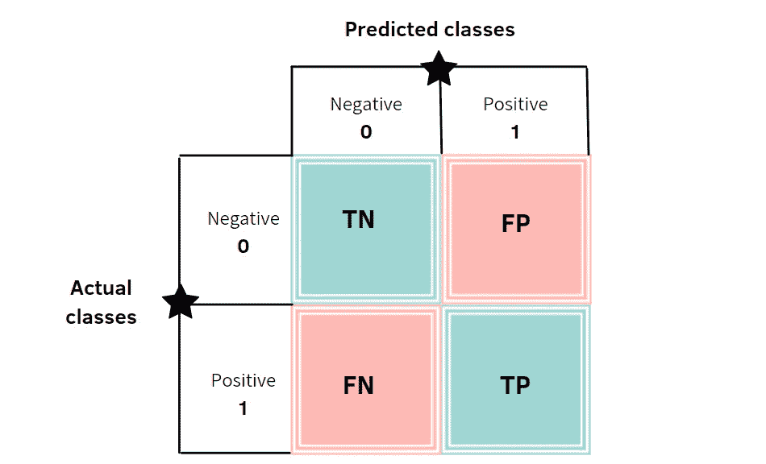*

*我们希望最大化属于蓝色单元的数据点的数量，最小化属于红色单元的数据点的数量。*

**现在，在混淆矩阵的帮助下，我们还可以查看更多的性能指标，这些指标现在更容易可视化。**

*   ***精度得分:**精度得分定义为真阳性(由模型预测)与实际阳性总数的比率。实际阳性总数是 TP 和 FP 之和(即。上面混淆矩阵图中的 2)列。*

**

*   ***召回分数:**召回分数定义为模型的真阳性和实际阳性的比率。实际阳性总数为 TP 和 FN 之和(即。上面混淆矩阵图中的第 2 行。*

*我们还需要记住另一个重要的事实，我们希望在预测中尽量减少假阴性的数量，这意味着那些实际上违约的人，我们预测他们不会违约。这是一种商业需要，因为对于银行来说，犯这种错误的成本可能非常高:-拖欠的可能性将增加。另一方面，假阳性的数量意义要小得多:即使模型预测非违约者是违约者，它也不会给银行带来巨大的业务损失，因为申请人可以重新申请，并可以在人为干预后获得贷款。*

> *我们只是想尽量减少人为干扰:这是无法完全避免的。*

# *7.探索性数据分析*

*维基百科对“探索性数据分析”的定义如下:*

> *在统计学中，**探索性数据分析**是一种分析数据集以总结其主要特征的方法，通常使用统计图表和其他数据可视化方法。*

*请注意,“探索性数据分析”是机器学习管道中最重要和最关键的部分之一:如果不理解数据，我们就无法理解数据，在需要时预处理数据，制定策略来处理缺失值和异常值，从而影响我们的模型预测。尽管特征工程是机器学习模型的核心，但 EDA 被低估了，其重要性被绝大多数人削弱了。*

## *A.导入必要的库/包:*

*在我们读取文件并在其上进行分析之前，我们需要首先加载所有必要的库。这是按如下方式完成的:*

## *B.导入每个数据集并获取基本统计数据:*

*在我们导入每个数据集之前，请注意我们在导入后获得的数据框会消耗大量内存，这使我的系统崩溃，尤其是当我正在执行要素工程并将所有数据集合并到单个数据集时。*

*因此，下面是一个函数，我们将使用它来减少获得的数据帧的内存使用(来源:[https://www.kaggle.com/rinnqd/reduce-memory-usage](https://www.kaggle.com/rinnqd/reduce-memory-usage)*

*现在总共有 8 个数据集，我们逐一导入，看看每个表中的行数和列数。这是按如下方式完成的:*

*   ****训练数据集:****

**

*application_train.csv 概述*

*   ****测试数据集:****

*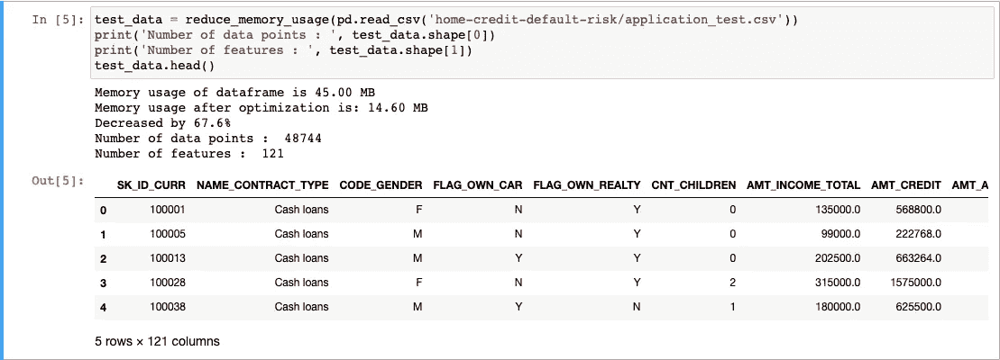*

*应用程序 _ 测试. csv 概述*

*由此，我们可以看到在我们的训练数据集中总共有 3，07，511 行和 122 个特征(或列)，包括类标签(目标)列。类似地，在我们的测试数据集中总共有 48，744 行和 121 列:来自 Train 的所有特征都出现在测试中，除了‘Target’列。*

*   ****局数据集:****

**

*bureau.csv 概述*

*   ****局平衡数据集:****

**

*bureau_balance.csv 概述*

*   ****以前的应用数据集:****

*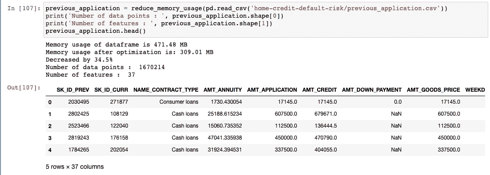*

*previous_application.csv 概述*

*   ****POS 现金余额数据集:****

**

*POS_CASH_balance.csv 概述*

*   ****分期付款数据集:****

**

*分期付款概述 _payments.csv*

*   ****信用卡余额数据集:****

*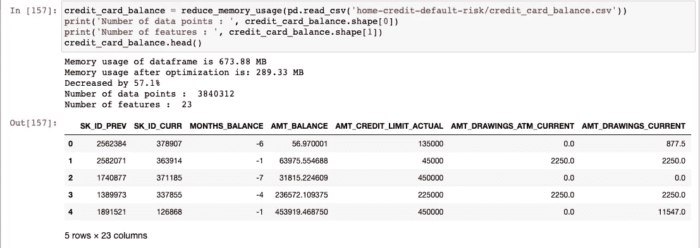*

*信用卡余额概述. csv*

*由此，我们将能够体会到数据有多全面，以及它如何包含数百个原始特征。主要的训练和测试数据集是*‘application _ train . CSV’*和*‘application _ test . CSV’*，其中包含了目前已经申请贷款的客户的申请人信息。正如我们在数据集模式中看到的，列' SK_ID_CURR '在其他数据集表中充当外键。我们将使用这个列来执行与其他表的任何连接。*

## ***C .应用程序训练数据集上的 EDA:***

***(a)对目标列的单变量分析***

*我们首先看到分类标签的分布(即目标列),我们首先为其定义了一个代码来获取圆环图。*

*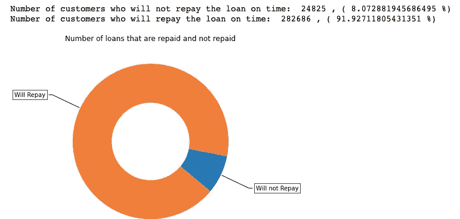*

*目标变量分割概述*

*我们之前说过我们的数据集是高度不平衡的，现在我们有了证据。请注意，在训练数据集中出现的所有行中，只有 8.07%的记录是违约者(类标签 1)，其余 91.92%的记录对应于非违约者(类标签 0)。这就是为什么我们选择 ROC_AUC 分数这样的指标，它不会受到这种数据不平衡的影响。*

*接下来，我们将定义几个函数来构建堆积条形图:*

***(b)对‘姓名 _ 合同 _ 类型’、‘性别’、‘标志 _ 自有 _ 汽车’和‘标志 _ 自有 _ 不动产’的单变量分析***

*现在，我们可以将所需的参数传递给上面定义的“univariate_barplots”函数，以获得分类列的维度和任何相关性的拆分，无论是否向申请人提供。*

*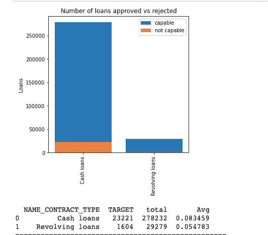**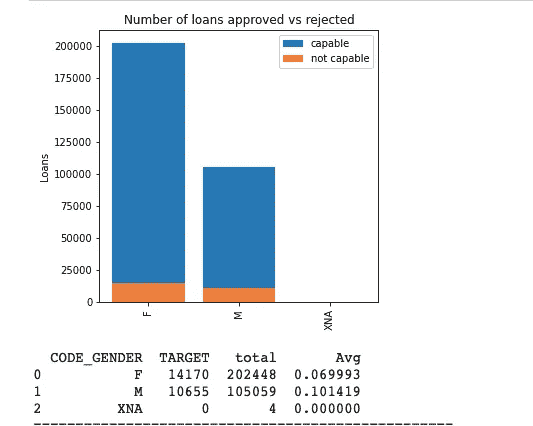*

*左:基于“姓名 _ 合同 _ 类型”的目标变量分解，右:基于“性别”的目标变量分解*

*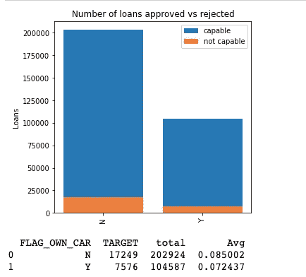**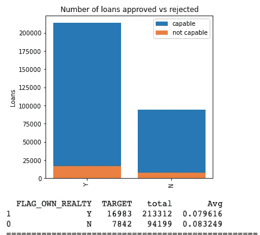

左:基于“Flag_Own_Car”的目标变量拆分，右:基于“Flag_Own_Realty”的目标变量拆分* 

****观察:****

*   *由此我们可以观察到，大部分人都是采取现金贷款，而不是循环贷款，如信用卡。*
*   **有趣的是，与男性相比，女性获得的贷款数量要多得多*:女性共获得 20.2 万+的贷款，而男性仅获得 10.5 万+的贷款。然而，与此同时，男性偿还贷款的能力略高于女性。在 10%的情况下，男性能够偿还贷款，而女性只能偿还 7%的贷款。有 4 个条目的性别='XNA '。由于这不能为我们提供太多的信息，我们可以稍后删除这些条目。*
*   *大多数申请贷款的人都没有汽车。但是，根据这些信息，客户的贷款偿还状况没有太大差异(分别为 8.5%和 7.2%)。我们可以得出结论，这个功能不是很有用。*
*   *大多数申请贷款的人都拥有一套公寓/房子，这有点令人惊讶。然而，同样，根据这些信息，客户的贷款偿还状况没有太大差异(分别为 7.9%和 8.3%)。我们可以得出结论，这个功能不是很有用。*

***(c .)对“子女人数”、“姓名类型套房”、“姓名收入类型”和“姓名家庭状况”的单变量分析***

****

*左:根据“Cnt_Children”拆分“Target”变量，右:根据“Name_Type_Suite”拆分目标变量*

***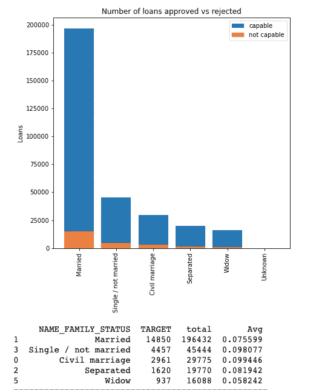*

*左:根据“姓名 _ 收入 _ 类型”拆分目标变量，右:根据“姓名 _ 家庭 _ 状况”拆分目标变量。*

****观察:****

*   *没有孩子的申请人获得的贷款数量要高得多。然而，同样，根据这些信息，客户的贷款偿还状态并没有太大的不同。我们可以得出结论，这个功能不是很有用。*
*   *对于陪同客户贷款的各种类型的人来说，在大多数情况下，客户是在没有陪同的情况下来到银行的，其中大约。92%的情况下，银行认为客户有能力偿还贷款，而其余 8%的情况下，客户没有能力偿还贷款。无论是能力还是非能力，“无人陪伴”作为一个阶层在这种情况下是多数阶层。*
*   *有工作的人贷款最多，而商业合伙人、养老金领取者和国家公务员贷款相对较少。我们几乎没有关于失业人员、学生、商人和休产假的女性的数据。这里一个有趣的观察是，无论学生和商人申请了什么贷款，他们都被认为有能力偿还。*
*   *申请人的家庭状况存在差异，但如果忽略大多数阶层(已婚)，差异就不大。已婚人士申请贷款的数量最多，被认为没有还款能力的人数也最多。*

***(d)对数字特征的单变量分析:信用额度、商品价格、客户年龄(天数)***

****

*左:金额 _ 信用分布图，右:金额 _ 商品 _ 价格分布图*

****

*左:申请时客户的年龄组，右:申请时客户(被认为有能力)的年龄组*

**

*申请时客户的年龄(视为无能力)*

****观察:****

*   *我们可以从上面观察到，大多数贷款的信贷额低于 100 万卢比。*
*   *大多数贷款是给价格低于卢比的商品。100 万卢比。*
*   *大多数申请贷款的人年龄在(35-40)岁之间，其次是(40-45)岁的人，而 65 岁的申请人数量很少。同样，对于被认为有能力偿还贷款的人来说，年龄在(35-40)岁和(40-45)岁的人被认为最有能力。年龄在(25-30)岁和(30-35)岁的人很有可能被认为没有能力偿还贷款。*

***(e)单变量分析:外部 _ 源 _1、外部 _ 源 _2 和外部 _ 源 _3***

**

*“外部 _ 源 _1”的 PDF 绘图*

**

*“外部 _ 源 _2”的 PDF 绘图*

**

*“外部 _ 源 _3”的 PDF 绘图*

****观察:****

*   *请注意,“Ext_Source_1”是来自外部数据源-1 的归一化分数，当我们检查该字段的空值数量(此处未显示)时，我们看到“Ext_Source_1”列中近 56%的条目是空值，因此我们将只查看其余的值。请注意，我们可以用整个数值列的平均值或中值或众数来替换这些值，但由于这是大量的空值，因此我们不会对该字段采用这种方法。 ***这是我们到目前为止看到的第一个在两个职业之间存在显著差异的特性，正如我们从 PDF 图中看到的。因此，“Ext_Source_1”将是一个重要的特性。****
*   *“Ext_Source_2”是来自外部数据源-2 的归一化分数，一旦我们检查该列中的空值，我们将看到该列中只有 0.2%的条目对应于空值。一旦我们对该字段中的非空值进行分析，我们再次能够看到数据被合理地分开。 ***因此，‘Ext _ Source _ 2’也将是我们的类分离的一个重要特征。****
*   *“Ext_Source_3”是来自外部数据源-3 的归一化分数，一旦我们检查该列中的空值，我们发现该列中大约 19%的条目对应于空值，并且我们对剩余的条目进行分析。 ***当我们查看“Ext_Source_3”的 PDF 时，我们再次看到数据被合理地分开，这意味着这也将是一个重要的特性。****

***(f)双变量分析:“名称 _ 合同 _ 类型”与“金额 _ 信用”***

*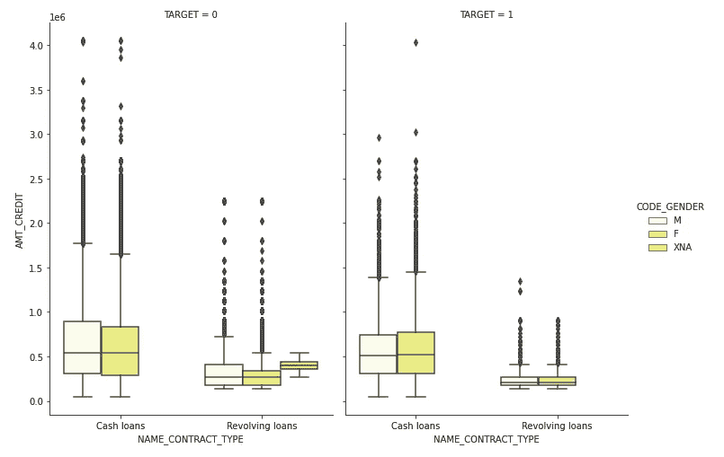*

*双变量分析:“名称 _ 合同 _ 类型”与“金额 _ 信用”*

*   ***观察:** *这表明有现金贷款的男性&女性根据其信用额度，被认为有还贷能力的几率更高。**

***(g)双变量分析:“姓名 _ 收入 _ 类型”与“金额 _ 信用”***

**

*双变量分析:“姓名收入类型”与“金额信贷”*

*   ***观察:** *这表明，在各种收入类型中具有较高信贷金额值的申请人被视为有能力偿还贷款的可能性较高，尤其是在“失业”、“学生”和“商人”的情况下。**

## *D.修复“应用程序系列”数据集中的空值和异常值*

*我们用相应列中出现频率最高的值来填充空值和很少出现的值。这是在以下函数的帮助下对应用程序训练和测试数据集进行的:*

## *E.“局”和“局平衡”数据集上的 EDA*

***(a)对分类特征的单变量分析***

***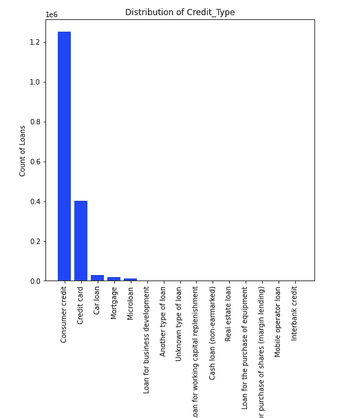*

*左:对“信贷 _ 活动”特征的单变量分析，右:对“信贷 _ 类型”特征的单变量分析*

****观察:****

*   *局数据中的大多数应用程序都是关闭的，随后是活动状态。很少有贷款被“出售”或被认为是“坏账”。*
*   *消费信贷和信用卡是信用局最主要的注册信用类型。*

***(b)双变量分析:“信用 _ 活动”与“天数 _ 信用”***

*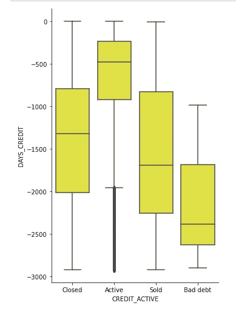*

*双变量分析:“信用 _ 活动”与“天数 _ 信用”*

***观察:***

*   *当信用状态为活动时，表示对应的‘天数 _ 信用’即。施用前的天数，中值约为。500 天。*

***(c)单变量分析:“信用 _ 活动”与“天数 _ 信用”***

*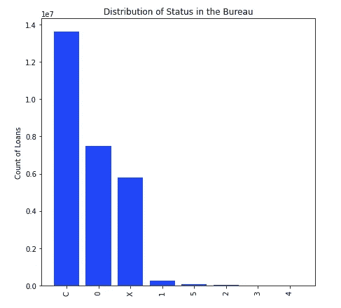*

*单变量分析:来自“bureau_balance.csv”的“Credit_Active”与“Days_Credit”*

***观察:***

*   *大多数贷款在信用局关闭，随后是 DPD 为 0 的客户，然后是身份不明的申请人。*我们可以得出结论，数据中很少有年金违约者。**

## *F.“以前的应用”数据集上的 EDA:*

*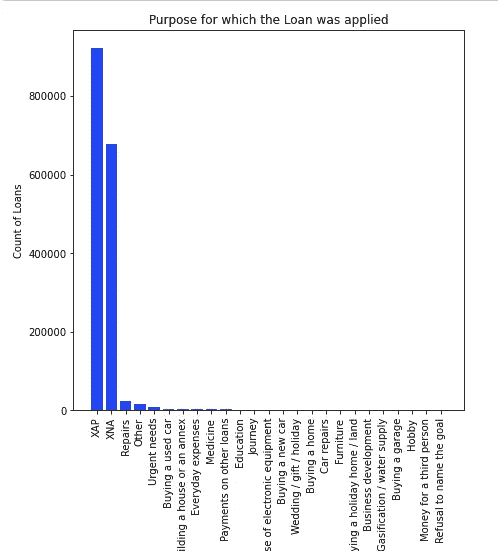**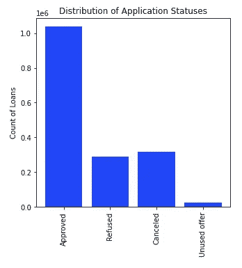

左图:显示贷款申请目的的条形图，右图:贷款申请状态的分布* ***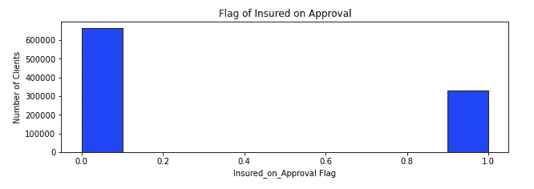

左:显示客户类型分布的条形图，右:前一个应用程序中保险应用程序的分布* 

***观察:***

*   *大多数贷款申请的目的地是 XAP，其次是 XNA。但是，columns_description.csv 中没有提供这些术语的定义。这可能意味着申请人不同意贷款申请的目的，尽管我们不能确定。*
*   *客户之前的大部分申请都被批准了。其次是申请被取消和拒绝。很少有申请获得批准，但申请人没有使用贷款。*
*   *“姓名客户类型”列定义了客户在申请之前的申请时是老客户还是新客户。从这里我们可以看到，以前申请的大部分申请人都是复读生，第一次申请的人很少。*
*   *从“Nflag_Insured_on_Approval”一栏中，我们可以看到，与未申请保险的客户数量相比，在之前的申请中申请保险的客户数量要少得多。*

## *G.修复“以前的应用程序”数据集中的空值和异常值:*

*除了这些值不能为负数之外，我们无法找到金额和现金相关特征的异常值。除了这些，我们将尝试处理其余的功能。*

## ***H. EDA 对“POS 现金余额”数据集:***

*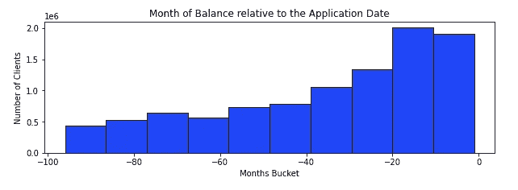**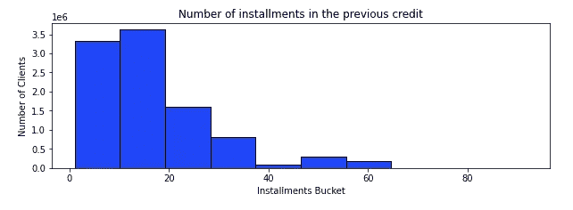*

*左:对“月余额”的单变量分析，右:对“分期付款”的单变量分析*

***观察:***

*   *大量客户的月余额在申请日之前的 10 到 20 个月之间。其次是月余额少于 10 个月的客户。*
*   *大多数客户以前信用证的分期付款次数在 10 到 20 次之间。其次是分期付款少于 10 个月的客户。*

## ***I .分期付款数据集上的 EDA:***

*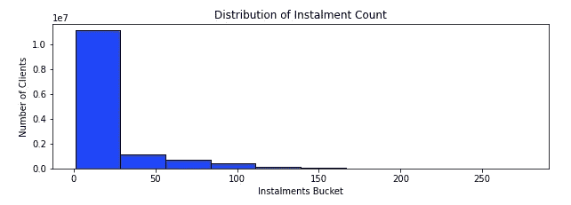**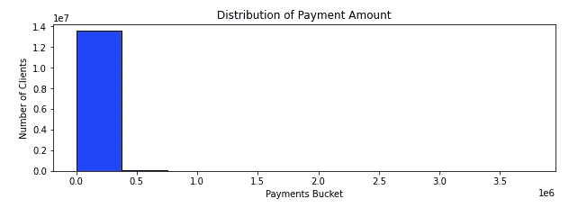*

*左:对“数量 _ 分期付款 _ 数量”的单变量分析，右:对“金额 _ 付款”的单变量分析*

***观察:***

*   *大多数客户在 25 个月前完成分期付款。*
*   *大多数客户在同一分期付款中支付了不到 50 万卢比。*

## ***J. EDA 对“信用卡余额”数据集:***

*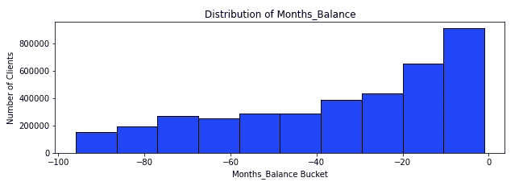***

*左:关于“信用卡余额”数据集的条形图，右:关于“信用卡分期付款到期累计”的箱线图*

***观察:***

*   *大多数客户在申请日之前有 0-10 个月的余额。*
*   *正如我们从箱线图和“Cnt _ installation _ maturity _ Cum ”(之前信用的已付分期付款次数)的详细特征描述中看到的，最小值为 0，而最大值为 120。75%的谎言总值小于 32。*

# *8.结束注释*

*请注意，上面进行的探索性数据分析只是我的 [Github](https://github.com/dhruv1394/Home-Credit-Default-Risk) 资源库中更深入和彻底的探索性数据分析的一个子集，因为否则，这篇博客将会比现在长得多。请随意检查一下。*

1.  *请注意，我们已经在任何我们认为必要的地方执行了数据清理(处理异常值和空值)。该数据清理已在*“应用程序训练”*数据集上进行，同样的数据清理、特征工程以及建模也将在*“应用程序测试”*数据集上进行。*
2.  *执行特征工程后，需要将表*“应用程序训练”*和*“应用程序测试”*合并到其他数据集，以使数据有意义。*
3.  *正如我们在上面的“探索性数据分析”中所看到的，有一些特征可能证明对分类确实有益。例如:*职业类型、组织类型*等。当涉及分类特征时，以及 *Ext_Source_1、Ext_Source_2 和 Ext_Source_3* 当涉及数字特征时。当我们在模型中进行特性选择时，这些特性应该出现在顶部的某个地方。*

*同样，因为我们知道数据集是不平衡的，所以在本博客系列的下一部分构建模型时，我们会尝试处理同样的问题。*

> *如有任何意见或更正，请通过我的 [Linkedin](https://www.linkedin.com/in/dhruv-narayanan/) 个人资料(更容易回复)与我联系，或在下面发表评论。完整的代码可以在我的 Github 资源库中找到，链接如下:*
> 
> *[https://github.com/dhruv1394/Home-Credit-Default-Risk](https://github.com/dhruv1394/Home-Credit-Default-Risk)*

# *9.参考*

*   *[https://www.kaggle.com/rinnqd/reduce-memory-usage](https://www.kaggle.com/rinnqd/reduce-memory-usage)*
*   *[https://www.kaggle.com/jsaguiar/lightgbm-7th-place-solution](https://www.kaggle.com/jsaguiar/lightgbm-7th-place-solution)*
*   *[https://www . LinkedIn . com/pulse/winning-9-place-ka ggles-big-competition-yet-home-Levinson/](https://www.linkedin.com/pulse/winning-9th-place-kaggles-biggest-competition-yet-home-levinson/)*
*   *[https://www . ka ggle . com/c/home-credit-default-risk/discussion/64593](https://www.kaggle.com/c/home-credit-default-risk/discussion/64593)*
*   *[https://www . ka ggle . com/c/home-credit-default-risk/discussion/64821](https://www.kaggle.com/c/home-credit-default-risk/discussion/64821)*
*   *[https://www.appliedaicourse.com/](https://www.appliedaicourse.com/)*