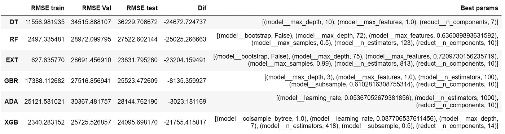

# 房价预测:

> 原文：<https://medium.com/analytics-vidhya/house-price-prediction-ea1185212ca7?source=collection_archive---------14----------------------->

执行一些实验，使用基于树的模型来预测房价和贝叶斯优化超参数调整


布莱克·惠勒在 [Unsplash](https://unsplash.com/s/photos/homes?utm_source=unsplash&utm_medium=referral&utm_content=creditCopyText) 上拍摄的照片

本文的目的是使用 Kaggle challenge: [房价预测](https://www.kaggle.com/c/house-prices-advanced-regression-techniques/overview/evaluation)的数据集比较三个实验的结果。在每个实验中，我们将使用相同的 6 个基于树的模型，但是使用不同的数据简化方法。进行这些实验的主要原因是为了评估当我们使用不同的特征子集时回归器性能的变化。

对于每个实验，我们将使用贝叶斯优化来执行超参数调整，与网格搜索不同，它不会对所有指定的参数值执行穷举搜索，而是使用从指定分布中采样的固定数量的参数设置。这种方法是众所周知的选择下一个超参数组合的基础上的信息，从以前的。

为了简单起见，在继续展示每个实验结果的图表之前，我们将只看到一步一步的代码摘录。不过详细的代码可以在 [**GitHub**](https://github.com/Michelpayan/House_price_prediction) **中找到。**

**1。第一步:**导入相应的库后，通过替换或删除它们来处理丢失的值。

```
#According to the description of this dataset, replace NAN from these columns with 'None'. 
with_NA_type=['Alley','BsmtQual','BsmtCond','BsmtExposure','BsmtFinType1','BsmtFinType2','FireplaceQu','GarageType','GarageFinish','GarageQual','GarageCond','PoolQC','Fence','MiscFeature']for i in with_NA_type:
    train.loc[:,i]=train.loc[:,i].fillna('None')#Replace NAN of this column with median
train["LotFrontage"] = train.groupby("Neighborhood")["LotFrontage"].transform(lambda x: x.fillna(x.median()))#Since there are a few NAN in these columns we can drop them
train=train.dropna(subset=["Electrical", "MasVnrArea", "MasVnrType"])train.loc[:,['GarageArea','GarageYrBlt']]=train[['GarageArea','GarageYrBlt']].fillna(0).values
```

**2。第二步:**在处理完缺失值后，数据集被分割成训练集和测试集。然后，scikit-learn 中的函数 [ColumnTransformer](https://scikit-learn.org/stable/modules/generated/sklearn.compose.ColumnTransformer.html) 将被用于将一些转换器(取决于实验)应用于具有分类值和数值的列。

```
train_x=train.iloc[:,:-1]
train_y=pd.DataFrame(train['SalePrice'])numerical_ix = train_x.select_dtypes(include=['int64', 'float64']).columns
categorical_ix = train_x.select_dtypes(include=['object', 'bool']).columnsX_train, X_test, y_train, y_test = train_test_split(train_x, train_y, test_size=0.2, random_state=0)#Transformers used in the first experiment:
t1 = [('cat', OneHotEncoder(handle_unknown = "ignore"), categorical_ix), 
     ('num', StandardScaler(), numerical_ix)]col_transform1 = ColumnTransformer(transformers=t1)
```

**3。第三步:**使用 scikit-optimize 的 [BayesSearchCV](https://scikit-optimize.github.io/stable/modules/generated/skopt.BayesSearchCV.html) 来调整每个模型的超参数。在此之前，您将看到我如何定义函数“select_model ”,该函数返回将用作 BayesSearchCV 的估计器对象的管道，如下例所示:

```
#The following function called "select_model" is going to retun the pipeline used in each estimation.def select_model(model_name,col_transform,selector=False,dim_red=False):
    '''
    model_name: Call the regressor
    col_transform: Specify the ColumnTransformer method
    selector: If True, introduce SelectFromModel into the pipeline.
    dim_red: If True, introduce TruncatedSVD into the pipeline
    '''

    if (selector==True & dim_red==True):
        param_list=[('prep', col_transform),
                       ("select", SelectFromModel(model_name,max_features=1,threshold=-np.inf)),
                    ('reduct',TruncatedSVD()),
                       ('model',model_name)]
     elif selector==True:
        param_list=[('prep', col_transform),
                       ('select', SelectFromModel(model_name,max_features=1,threshold=-np.inf)),
                       ('model',model_name)]

    elif dim_red==True:
        param_list=[('prep', col_transform),
                       ('reduct',TruncatedSVD()),
                       ('model',model_name)]

    else:
        param_list=[('prep', col_transform),
                       ('model',model_name)]

    pipe = Pipeline(steps=param_list)
    return pipe#Hyperparameter tuning with BayesSearchCV:params={"model__max_depth":Integer(10,800),
       "model__max_features":Real(0.5,1),
       "reduct__n_components":Integer(2,40)}result_dt = BayesSearchCV(estimator=select_model(DecisionTreeRegressor(),col_transform1,dim_red=True),search_spaces=params,cv=3,n_iter=300,
scoring='neg_root_mean_squared_error',iid=False,
return_train_score=True)result_dt.fit(X_train,y_train.values.ravel())
```

现在让我们继续详细解释每个实验及其结果。

# 第一次实验

第一个实验包括应用线性降维方法。执行降维的目的是减少输入特征的数量，以提高模型的性能。

由于我们的数据集包含许多将被热编码的分类值，我们需要使用适合稀疏数据的降维技术，因此我们将使用截断奇异值分解(SVD)。因此，正如我们对回归变量的参数执行超参数调优一样，我们也将测量组件的最佳数量。

对于该实验和随后的实验，采样的参数设置的数量(迭代次数)将是 300。每次迭代的 RMSE 如下所示。换句话说，您可以看到为验证集和训练集的每次迭代或超参数组合给出的 RMSE，红色垂直线表示具有最佳超参数集的迭代。


每次迭代的 RMSE(图由作者创建)

通过查看下表，我们可以看到测试集的 RMSE 最低的模型是 EXT Trees Regressor(EXT ),但是，通过比较训练集、验证集和测试集的 RMSE，该模型存在较高的方差。我们可以说，自适应增强(ADA)的性能不如 EXT，但它是受过拟合影响较小的一种。

```
cv_result=[result_dt,result_rf,result_extra,result_gbr,result_ada,result_xgb]
models=["DT","RF","EXT","GBR","ADA","XGB"]results_1 = pd.DataFrame()for i,j in zip(cv_result,models):
    results_1.loc[j,'RMSE train']=mean_squared_error(y_train,i.predict(X_train),squared=False)
    results_1.loc[j,'RMSE Val']=(i.best_score_)*(-1)
    results_1.loc[j,'RMSE test']=mean_squared_error(y_test,i.predict(X_test),squared=False)#Difference between RMSE of the training set and the test set to see how far they are from one of another
results_1['Dif']=results_1['RMSE train']-results_1['RMSE test']
results_1['Best params']=0
results_1['Best params'] = results_1['Best params'].astype(object)
#Best hyperparameters selected by the Bayesian Search
for i,j in zip(cv_result,models):
    results_1.at[j,'Best params']=list(i.best_params_.items())
results_1
```



第一次实验的结果表

# 第二次实验

对于第二个实验，我们将根据每个模型的属性 feature_importances_ 在整个数据集中选择最重要的特征，而不是使用降维。也就是说，我们将使用 scikit learn: Select From Model 中提供的方法选择最重要的特性。关于这项技术和其他技术的更多细节，请参考文章[特征选择:我们应该如何执行？](/@michell.payano.perez/feature-selection-1dde6a486760)


每次迭代的 RMSE(图由作者创建)

在这种情况下，其他模型中表现最好的是梯度增强(GBR)和极端梯度增强(XGB)。有趣的是，由于训练集的 RMSE 大于测试集的 RMSE，ADA 是欠拟合的，但验证集却不是这样。

```
cv_result=[result_dt,result_rf,result_extra,result_gbr,result_ada,result_xgb]
models=["DT","RF","EXT","GBR","ADA","XGB"]results_2 = pd.DataFrame()for i,j in zip(cv_result,models):
    results_2.loc[j,'RMSE train']=mean_squared_error(y_train,i.predict(X_train),squared=False)
    results_2.loc[j,'RMSE Val']=(i.best_score_)*(-1)
    results_2.loc[j,'RMSE test']=mean_squared_error(y_test,i.predict(X_test),squared=False)
#Difference between RMSE of the training set and the test set to see how far they are from one of another
results_2['Dif']=results_2['RMSE train']-results_2['RMSE test']
results_2['Best params']=0
results_2['Best params'] = results_2['Best params'].astype(object)
#Best hyperparameters selected by the Bayesian Search
for i,j in zip(cv_result,models):
    results_2.at[j,'Best params']=list(i.best_params_.items())
results_2
```


第二次实验的结果表

# 第三个实验

最后但并非最不重要的是，第三个实验包括应用特征选择，然后降维。换句话说，我们将分别使用第二个和第一个实验中提到的方法，以便一起评估这些技术的影响。

重要的是要注意，因为在这个实验中，特征选择是在降维之前执行的，所以 n_features 必须大于 n_components。然而，每当这不成立时，RMSE 将等于 100，000。这可以通过给 BayesSearchCV 的“error_score”参数赋值来实现。


每次迭代的 RMSE(图由作者创建)

作为这个实验的结果，过度拟合较少的模型是 ADA 和 XGB，尽管 GBR 的性能是所有模型中最好的。然而，这种性能是以较高的方差为代价的。

```
cv_result=[result_dt,result_rf,result_extra,result_gbr,result_ada,result_xgb]
models=["DT","RF","EXT","GBR","ADA","XGB"]results_3 = pd.DataFrame()for i,j in zip(cv_result,models):
    results_3.loc[j,'RMSE train']=mean_squared_error(y_train,i.predict(X_train),squared=False)
    results_3.loc[j,'RMSE Val']=(i.best_score_)*(-1)
    results_3.loc[j,'RMSE test']=mean_squared_error(y_test,i.predict(X_test),squared=False)
#Difference between RMSE of the training set and the test set to see how far they are from one of another
results_3['Dif']=results_3['RMSE train']-results_3['RMSE test']
results_3['Best params']=0
results_3['Best params'] = results_3['Best params'].astype(object)
#Best hyperparameters selected by the Bayesian Search
for i,j in zip(cv_result,models):
    results_3.at[j,'Best params']=list(i.best_params_.items())
results_3
```


第三次实验的结果表

通过比较所有这些模型，我们可以说，来自第三个实验的极端梯度增强在具有最低测试 RMSE 的那些模型和那些似乎过拟合较少的模型中表现最好。我希望这篇文章能激发您探索项目的更多方法/技术，并记得在这里找到完整的代码[以供参考。](https://github.com/Michelpayan/House_price_prediction)