# 从零开始用线性回归预测房价

> 原文：<https://medium.com/analytics-vidhya/house-price-prediction-using-linear-regression-from-scratch-b2b48fd73689?source=collection_archive---------5----------------------->

*今天，让我们从零开始，尝试用线性回归算法解决经典的房价预测问题。*

想了解更多关于*线性回归*的信息，别忘了看看我之前的博客——[***关于线性回归***](/analytics-vidhya/everything-you-need-to-know-about-linear-regression-750a69a0ea50) 你需要知道的一切

我们将需要 [***房价—高级回归技术***](https://www.kaggle.com/c/house-prices-advanced-regression-techniques/data)*数据集来完成这项工作。*

**

*图片来源:Ritu Yadav (GitHub)*

**一定要看看下面 GitHub 要点中的数据描述:**

**通过 Kaggle 临时令牌导入 Kaggle 数据集(在 Google Colab 上):**

> *关于 Google Colab 的更多信息— [**机器学习入门指南**](/analytics-vidhya/a-beginners-guide-for-getting-started-with-machine-learning-7ba2cd5796ae)*

```
***from** **google.colab** **import** files 
*"""upload your Kaggle temporary token downloaded from your Kaggle account onto your local device"""* files.upload() **Out:** Saving kaggle.json to kaggle.json
{'kaggle.json': b'{"username":"xxx","key":"yyy"}'}*
```

**下载您的数据集:**

```
*!mkdir -p ~/.kaggle
!cp kaggle.json ~/.kaggle/
!chmod 600 ~/.kaggle/kaggle.json!kaggle competitions download -c house-prices-advanced-regression-techniques*
```

*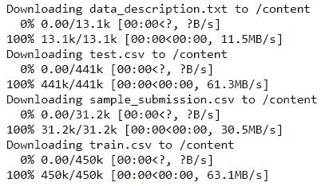*

**检查您的文件是否已下载:**

```
*!ls*
```

*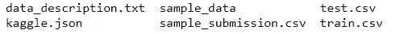*

**导入库:**

```
***import** **pandas** **as** **pd** 
**import** **numpy** **as** **np** 
**from** **sklearn.preprocessing** **import** MinMaxScaler, LabelEncoder*
```

**读取数据集:**

```
*data = pd.read_csv("train.csv")
data*
```

*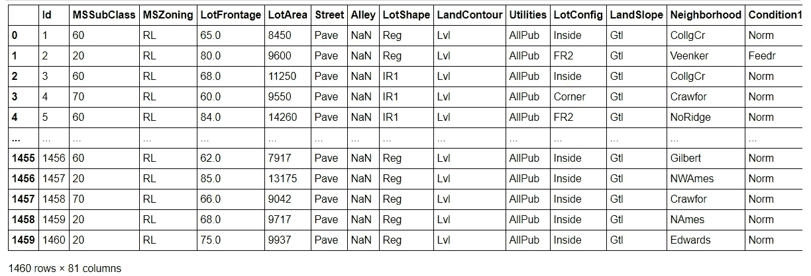*

```
*data.describe()*
```

*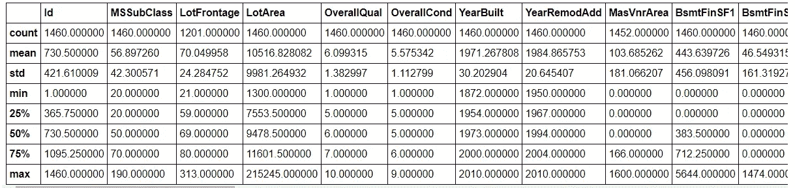*

**混洗数据:**

```
*data = data.sample(frac=1).reset_index(drop=**True**)
data*
```

*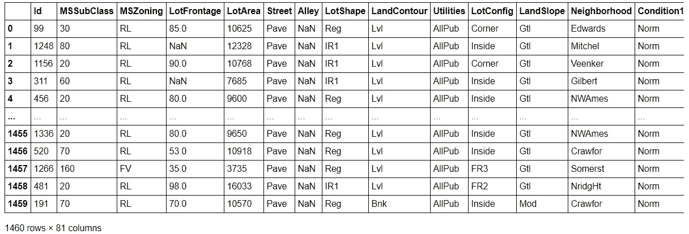*

**检查 NaN 值:**

```
*data.isna().sum()*
```

*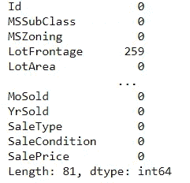*

**逐个检查 NaN 值计数:**

```
*print(data['Alley'].isna().sum())
print(data['FireplaceQu'].isna().sum())
print(data['PoolQC'].isna().sum())
print(data['Fence'].isna().sum())
print(data['MiscFeature'].isna().sum())**Out:** 1369 
690 
1453 
1179 
1406data.shape**Out:**
(1460, 81)*
```

**您也可以选择删除具有多余 NaN 值的列或估算它们:**

```
**#data.drop(['Alley', 'FireplaceQu', 'PoolQC', 'Fence', 'MiscFeature'], axis = 1, inplace=True)* 
*#data.drop(['LotFrontage'], axis=1, inplace=True)**
```

**删除 Id，因为它没有任何意义:**

```
*data.drop(['Id'], axis=1, inplace=**True**)
data.shape**Out:**
(1460, 80)*
```

**输入缺失值:**

```
**# Imputing Missing Values*
**from** **sklearn.base** **import** TransformerMixin
**class** **DataFrameImputer**(TransformerMixin):

    **def** __init__(self):
        *"""Columns of dtype object are imputed with the most frequent value in column. Columns of other types are imputed with mean of column."""*
    **def** fit(self, X, y=**None**):
        self.fill = pd.Series([X[c].value_counts().index[0]
            **if** X[c].dtype == np.dtype('O') **else** X[c].mean() **for** c **in** 
            X],index=X.columns)
        **return** self
    **def** transform(self, X, y=**None**):
        **return** X.fillna(self.fill)X = pd.DataFrame(data) 
data = DataFrameImputer().fit_transform(X)data.isna().sum()*
```

*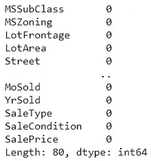*

**编码分类变量的标签:**

```
*LE = LabelEncoder()
CateList = data.select_dtypes(include="object").columns
print(CateList)*
```

*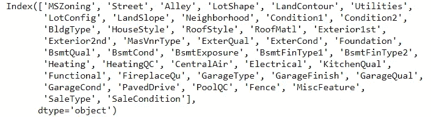*

```
*data.head()*
```

*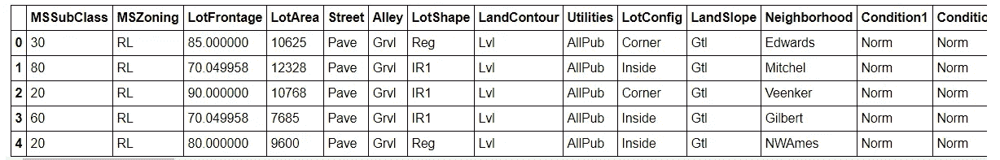*

```
***for** i **in** CateList:
    data[i] = LE.fit_transform(data[i])
data.head()*
```

*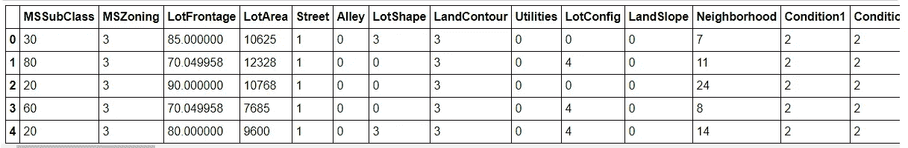*

**使用最小最大缩放器或标准缩放器缩放数值:**

```
**#from sklearn.preprocessing import StandardScaler*
df = data.iloc[:,:-1]
mm = MinMaxScaler()
df[:]= mm.fit_transform(df[:])df.head()*
```

*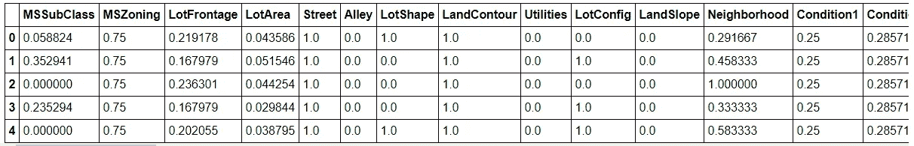*

```
*X = df.values
y = data['SalePrice'].valuesX_shape = X.shape
X_type  = type(X)
y_shape = y.shape
y_type  = type(y)print(f'X: Type-**{**X_type**}**, Shape-**{**X_shape**}**') 
print(f'y: Type-**{**y_type**}**, Shape-**{**y_shape**}**')**Out:** X: Type-<class 'numpy.ndarray'>, Shape-(1460, 79) 
y: Type-<class 'numpy.ndarray'>, Shape-(1460,)*
```

**将我们的数据分为训练和测试数据:**

```
***from** **sklearn.model_selection** **import** train_test_split
X_train, X_test, y_train, y_test = train_test_split(X, y, test_size=0.25, random_state=123)print(X_train.shape, X_test.shape)
print(y_train.shape, y_test.shape)**Out:** (1095, 79) (365, 79)
(1095,) (365,)*
```

**编写我们的预测函数，返回我们的* ***假设:****

```
***def** predict(X, weights):
    y_pred = np.dot(X, weights)
    **assert** (y_pred.shape==(X.shape[0],1))
    **return** y_pred*
```

**定义在给定训练示例中返回损失\成本函数值的均方误差函数:**

> ***损失函数:**当你只考虑单个训练例子时。*
> 
> ***成本函数:**当你考虑整批/小批时。*

```
***def** mean_squared_error(y_true, y_pred): 
    loss = (1/(2*y_true.shape[0])*np.sum(y_true-y_pred)**2)
    **return** loss*
```

**定义我们的梯度(梯度矩阵初始化为 0):**

```
***def** gradient(X, y_true, y_pred):
    grad = np.zeros((len(X[1]),1))
    diff = y_pred-y_true
    **for** i **in** range(len(X[1])):
      grad[i][0] = (2/X.shape[0])*np.sum(np.dot(X[:,i],(diff)))
    **return** grad*
```

**定义我们的梯度下降函数(将我们的权重初始化为随机数——也可以初始化为 0):**

```
***def** gradient_descent(X, y, learning_rate=0.01, max_iterations=100):

    weights = np.random.rand(len(X[1]),1)
    losses  = []

    y_true = y.reshape(-1,1)
    **for** i **in** range(max_iterations):
        y_pred = predict(X,weights)
        losses.append(mean_squared_error(y_true,y_pred))
        grad = gradient(X,y_true,y_pred)

        **for** i **in** range(len(X[1])):
          weights[i][0] = weights[i][0] - learning_rate*grad[i][0]

    **return** weights, losses*
```

**让我们看看我们的模型根据我们的训练数据学习到的最佳权重:**

```
*optimal_weights, losses = gradient_descent(X_train, y_train, 0.001, 200)*
```

> *调整您的超参数——Alpha(学习率)和最大迭代次数，查看其对准确性的影响)*

```
*print("Root mean-squared error:", losses[-1]**(1/2))**Out:** Root mean-squared error: 5116.780901005974*
```

**检查你的梯度下降是否有效(如果损失在减少):**

```
***for** i **in** range(len(losses)):
  print(losses[i]**(1/2))*
```

*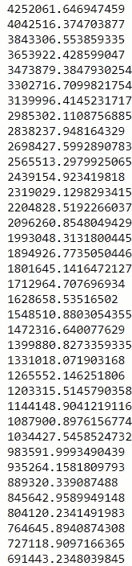*

*………*

*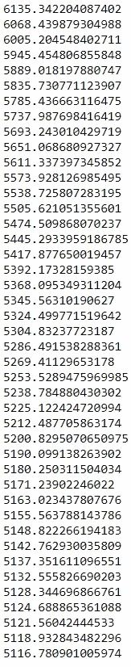*

> *正如你所看到的，我们的损失在每一次迭代中不断减少，这意味着我们的梯度下降运行良好！*

**在我们的训练数据上看到我们的预测:**

```
*train_pred = predict(X_train, optimal_weights)
train_pred**Out:**
array([[191931.99404727],
       [172596.37961212],
       [211588.65076176],
       ...,
       [204967.81704443],
       [166346.22710897],
       [192415.28850303]])*#actual values* y_train**Out:** array([196000, 147500, 253293, ..., 235000, 167500, 250000])*
```

**在测试集上推断我们训练好的模型:**

```
*test_pred = predict(X_test, optimal_weights)
test_pred**Out:** array([[162556.88304305],
       [195496.11789844],
       [180261.96458508],
       ...,
       [163731.79340151],
       [201160.3300839 ],
       [175285.52648482]])*
```

**绘制我们的损失曲线:**

```
***import** **matplotlib.pyplot** **as** **plt**
plt.plot([i **for** i **in** range(len(losses))], losses)
plt.title("Loss curve")
plt.xlabel("Iteration num")
plt.ylabel("Loss")
plt.show()*
```

*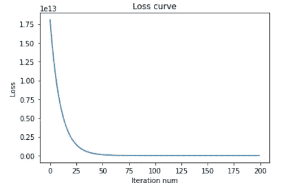*

**你可以用 Sklearn 内置的函数来比较同一个问题:**

```
***from** **sklearn.linear_model** **import** LinearRegressionmodel = LinearRegression().fit(X_train, y_train)
pred = model.predict(X_train)
r2_score(y_train, pred)**Out:** 0.8540160463212708pred2 = model.predict(X_test)
r2_score(y_test, pred2)**Out:** 0.8431209747429238*
```

**您可以根据不同的回归指标评估您的模型，如 MSE、RMSE、MAE、R2 分数等。**

> *想了解更多，请查看我之前的博客— [**关于线性回归你需要知道的一切**](/analytics-vidhya/everything-you-need-to-know-about-linear-regression-750a69a0ea50)*

****要获得完整的代码，请查看我的 GitHub 库—****

*[](https://github.com/tanvipenumudy/Winter-Internship-Internity/blob/main/Day%2007/Day-7%20Notebook%20%28Linear%20Regression%29.ipynb) [## tanvipenumudy/Winter-实习-实习

### 存储库跟踪每天分配的工作-tanvipenumudy/Winter-实习-实习

github.com](https://github.com/tanvipenumudy/Winter-Internship-Internity/blob/main/Day%2007/Day-7%20Notebook%20%28Linear%20Regression%29.ipynb) 

> 如果你喜欢这篇文章，别忘了鼓掌并跟随:*