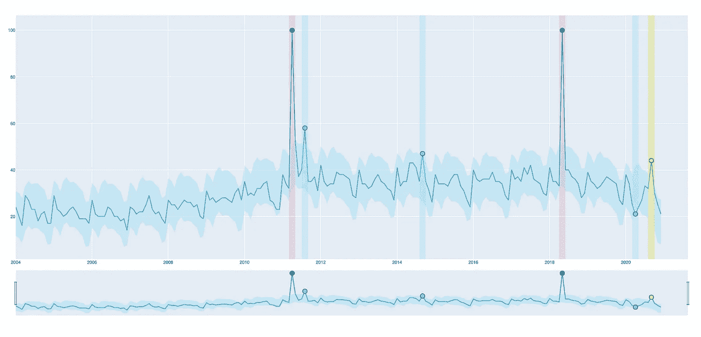

# 休斯顿，我们有一个问题——异常检测方法

> 原文：<https://medium.com/analytics-vidhya/houston-we-have-a-problem-anomaly-detection-methods-2d6e2ebc12c0?source=collection_archive---------11----------------------->



来自 [Oddity](https://github.com/Lleyton-Ariton/oddity) demo 的截图

在我的*休斯顿的[上一篇](https://lleyton-ariton.medium.com/houston-we-have-a-problem-time-series-anomaly-detection-4ab48c10dd01)文章中，我们有一个问题*异常检测系列是对时间序列异常检测领域的简单介绍。在本文中，我们将详细阐述一些用于实际解决时间序列异常检测问题的常用方法和算法。最后，我们将看到如何使用 Oddity——我开发的一个小工具——对我们自己的时间序列数据进行简单的异常检测。

本系列的下一篇(也是最后一篇)文章将深入探讨古怪背后的数学原理及其工作原理。

# 异常检测方法

异常检测方法有很大的范围，因为它是一个如此大而重要的领域。以下可以说是一些最常见的模型/技术:

## **状态空间模型**

ARIMA、萨里马科斯、萨里玛、霍尔特-温特斯等。

这些模型是通常用于时间序列预测的统计模型，然而，它们也可以用于异常检测。通过对照模型的预测(对于该时间序列)检查时间序列中的点，任何与预测的显著差异都可以表明该点是异常的。

## **深度学习(有监督的)**

RNNs(递归神经网络)等。

递归神经网络是一种为时间序列数据定制的神经网络，因此可以应用于异常检测的主题。通常，rnn 会尝试学习序列中的顺序相关性，并使用它来预测未来的时间步长。如果与预测有较大偏差，则该点可能是异常的。这通常是一种比较流行的方法。

## **深度学习(无监督)**

AEs、VAEs 等。

不同形式的自动编码器已经被用于异常检测。有趣的是，传统上用于空间应用的 CNN(卷积神经网络)也被用于无监督的时间序列异常检测，并取得了良好的成功水平( [*DeepAnT*](https://ieeexplore.ieee.org/document/8581424) )。

## **分解**

STL 分解等。

分解是一种统计技术，其中一组时间序列数据被分解成其组成部分:趋势、季节性和残差。给定时间序列的趋势和季节性被识别，然后从序列中减去。这就只剩下一个*“残差”*，它是任何不完全完美地遵循趋势和季节性的东西。通常情况下，时间序列数据并不完美，通常会有一定程度的残差。但是，如果某个点的残差非常高，这可能表明它严重偏离了典型趋势和季节行为，从而使其异常。更多信息参见 [*ritvikmath*](https://www.youtube.com/watch?v=1NXryMoU7Ho) 。

## **其他无监督方法**

隔离林、集群等。

有些简单的无监督机器学习算法的其他方法也是异常检测的流行选择。例如，隔离森林和 DBSCAN 可以很好地识别数据中的异常值。值得注意的是，单独的聚类通常不是特别适合时间序列异常检测。

# 奇异

Oddity 是我开发的一个小型开源工具，它使用加性高斯过程和时间序列分解来帮助识别时间序列数据中的异常。我们将首先介绍一些基本信息，以及如何开始。

## 安装异常

首先，最重要的是，主要的古怪引擎是用 Rust 编写的。Rust 拥有令人难以置信的速度，这使得 Oddity 能够在几秒钟内完成数千次的快速计算。因此，我们需要安装 Rust 编译器:

[](https://www.rust-lang.org/tools/install) [## 安装铁锈

### 关于 Rust 安装的注意事项如果您刚刚开始使用 Rust，并且想要更详细的演示，请参见…

www.rust-lang.org](https://www.rust-lang.org/tools/install) 

接下来，我们将需要 setuptools-rust 库，它将允许 Oddity 在我们的系统上编译。它可以通过 pip 与以下设备一起安装:

```
pip install setuptools-rust
```

最后，我们也可以通过 pip 安装 Oddity 本身:

```
pip install oddity
```

## 测试数据

一旦我们安装了 Oddity，我们将需要一些数据。我们将使用以下时间序列数据作为示例:


[信用](https://trends.google.com/trends/explore?date=all&geo=US&q=ice%20cream)

这是 2004 年谷歌搜索“冰激凌”的趋势数据。它是我们异常检测实验的完美候选，因为它包含带有一些上下文异常的季节性和趋势性组件。你可以自己从[这个链接](https://trends.google.com/trends/explore?date=all&geo=US&q=ice%20cream)下载这些数据。

## 使用古怪

现在我们有了一些数据，我们将继续使用 Oddity 进行异常检测的完整示例。

Oddity 可以导入为:

```
import odditylib as od
```

导入助手库:

```
import numpy as np
import pandas as pd
```

读取数据:

```
# Reading our CSV data
df = pd.read_csv('ICECREAM-DATA-PATH')#  Selecting only the raw values per time step
timeseries = df['ice cream: (United States)']# Oddity requires an extra dimension per time step
timeseries = timeseries.values.reshape(-1, 1)
```

安装奇怪的探测器:

```
detector = od.Oddity()  # Creating a default Oddity detectordetector.fit(timeseries)  # Fitting the detector on our data
```

作为一个浅显的描述，异常检测器是对给定时间序列的趋势和季节分量的高斯过程回归拟合的总和。我们可以访问拟合度、*μ、*和协方差矩阵、 *cov:*

```
mu, cov = detector.mu, detector.cov
```

拟合， *mu* ，用于对时间序列的行为进行一般建模。独自谋划的穆会是这个样子:


我们已经可以看到，Oddity 已经能够自动捕捉季节和趋势成分。**如果需要，可以完全定制异常探测器参数。**为了获得一些可视化效果，我们将绘制原始时间序列数据的异常拟合。


这已经明显偏离了预期的正常行为。但是，我们需要以间隔的形式增加一些余地。

在这种情况下，我们将使用拟合误差来计算间隔。我们将异常视为距离误差平均值 3 个标准偏差的任何东西。这可以通过以下方式实现:

```
error = timeseries - detector.mu  # Calulating errormean, std = error.mean(), error.std()interval = mean + (3.0 * std)  # Calculating the interval# Creating the bounds
upper_bound = detector.mu + interval
lower_bound = detector.mu - interval
```

当然，这可以根据特定用例所需的敏感度或需求进行更改。

间隔可以用以下公式绘制:

```
import matplotlib.pyplot as plt plt.figure(figsize=(16, 10))  # For aesthetic purposesplt.plot(timeseries, label='Original')
plt.plot(detector.mu, label='Oddity fit')error = timeseries - detector.mu
mean, std = error.mean(), error.std()interval = mean + (3.0 * std)upper_bound = timeseries + interval
lower_bound = timeseries - intervalplt.fill_between(
    range(len(timeseries)),
    upper_bound,
    lower_bound,
    alpha=0.2
)plt.legend()
plt.show()
```


最后，我们可以检查哪些数据点超出了界限——这些就是异常。

```
anomalies = list(
    filter(lambda value: 
           value[1] > upper_bound[[value[0]]] or 
           value[1] < lower_bound[value[0]], enumerate(timeseries))
)
```

最后，我们可以将异常添加到图中:

```
for anomaly in anomalies:
    date, value = anomaly

    plt.plot(date, value, 'ro')
```


从表面上看，我们已经成功地识别了这个时间序列数据中的主要异常。

# 结论

Oddity 是一个完全可定制的工具，用于使用加性高斯过程检测时间序列数据中的异常。虽然它仍然是相当粗略的，但在许多情况下肯定是有用的。

# 额外资源

古怪的 GitHub 知识库:

[](https://github.com/Lleyton-Ariton/oddity) [## 莱顿-阿里顿/古怪

### Oddity 是一个用于 Python 的时间序列异常检测工具，在 Rust 中实现。古怪能够学习趋势…

github.com](https://github.com/Lleyton-Ariton/oddity) 

使用 Oddity 和 [*streamlit*](https://streamlit.io/) 的工作演示:

[](https://github.com/Lleyton-Ariton/oddity-demo) [## 莱顿-阿里顿/古怪-演示

### Web 应用程序展示了使用 Oddity 引擎进行时间序列异常检测的演示

github.com](https://github.com/Lleyton-Ariton/oddity-demo) 

纯 Rust 发动机:

[](https://github.com/Lleyton-Ariton/oddity-engine) [## 莱顿阿里顿/古怪引擎

### Oddity 使用的异常检测和工具引擎。该引擎被用作与 PyO3 绑定的 Python，因此…

github.com](https://github.com/Lleyton-Ariton/oddity-engine) 

# 进一步阅读

*   [第一篇](/analytics-vidhya/houston-we-have-a-problem-time-series-anomaly-detection-4ab48c10dd01)在*休斯顿，我们有一个问题*系列
*   一个很棒的关于时间序列和数据科学的 YouTube 频道
*   我的其他一些时间序列相关的文章: [ARIMA](/analytics-vidhya/a-thorough-introduction-to-arima-models-987a24e9ff71) ，[霍尔特-温特斯](/analytics-vidhya/a-thorough-introduction-to-holt-winters-forecasting-c21810b8c0e6)