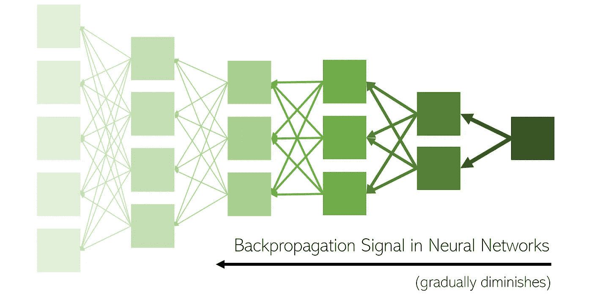
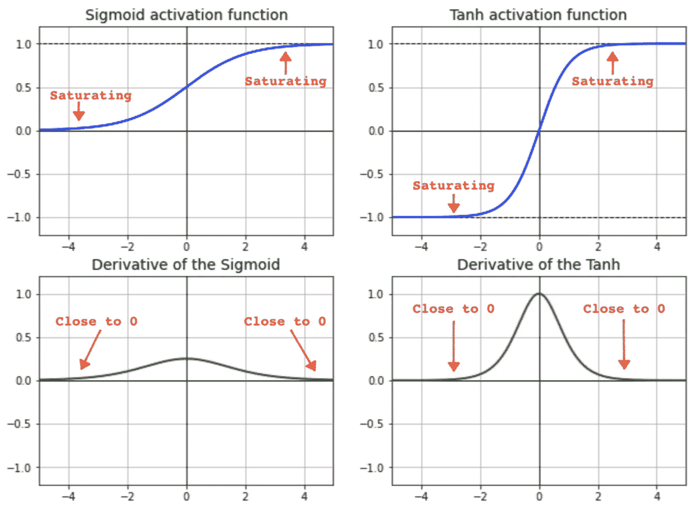
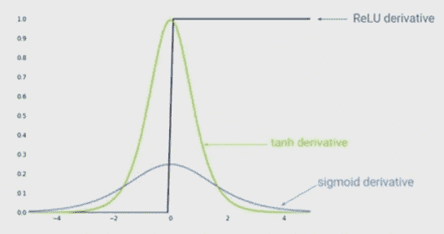

# 用于解决消失梯度的批量标准化和 ReLU

> 原文：<https://medium.com/analytics-vidhya/how-batch-normalization-and-relu-solve-vanishing-gradients-3f1a8ace1c88?source=collection_archive---------1----------------------->

理解深度神经网络训练中的高级概念的逻辑和顺序路线图。

# 议程

我们将把我们的讨论分成 4 个相互依赖的逻辑部分。为了获得最佳阅读体验，请按顺序阅读:

1.什么是消失渐变？为什么会有问题？为什么会这样？
2。什么是批量正常化？它是如何帮助渐变消失的？
3。ReLU 如何帮助消失渐变？
4。内部协变量移位的批量标准化

# 消失梯度

## 1.1 什么是消失渐变？

首先，让我们理解消失是什么意思:

> 消失意味着它趋向于 0，但永远不会真正成为 0。

> 消失梯度是指在深度神经网络中，**反向传播误差信号(梯度)通常作为与最后一层**的距离的函数呈指数下降。

换句话说，来自网络末端的有用梯度信息未能到达网络的起点。

[信号源](https://towardsdatascience.com/batch-normalization-the-greatest-breakthrough-in-deep-learning-77e64909d81d)

## 1.2 为什么是问题？

❓The:这一阶段的关键问题是:如果网络的初始层梯度很小，为什么会有问题？

要理解这一点，回忆一下"*渐变"的作用是什么？*嗯，梯度是对输入的微小变化导致输出变量发生多大变化的衡量。然后这个梯度被用于更新/学习模型参数——权重和偏差。以下是通常遵循的参数更新规则:

回到手头的问题——如果上面等式中的导数项太小，即几乎为零，会发生什么？我们可以看到，一个非常小的导数只会以极小的量更新或改变 Wx 的值，因此(新的)Wx*几乎等于(旧的)Wx。换句话说，模型权重没有改变。权重不变意味着没有学习。无论使用反向传播算法运行多少个时期，初始层的权重都将继续保持不变(或者仅发生可忽略不计的变化)。这就是渐变消失的问题！

接下来，我们继续理解为什么消失梯度会发生的数学推理。

## 1.3 为什么会发生渐变消失？

❓The 在这一阶段的关键问题是:为什么网络的初始起始层获得非常小的梯度？为什么当我们回到神经网络中时，梯度值会减少或消失？

在隐藏层单元中使用 Sigmoid 或 Tanh 激活函数时，通常会出现消失渐变。查看下面的函数图，我们可以看到，当输入变得非常小或非常大时， **sigmoid 函数在 0 和 1 处饱和，而 tanh 函数在-1 和 1 处饱和。在这两种情况下，它们的导数都非常接近于 0。**让我们称函数的这些范围/区域为***饱和区域***或***坏区域***。

**因此，如果您的输入位于任何饱和区域，那么它几乎没有梯度通过网络传播回来。**

# 2.批量标准化

顾名思义，批处理规范化是某种类型的**规范化技术**，我们将它应用于输入(当前)批处理数据。忽略严格的数学细节，批量标准化可以简单地视为网络中的附加层，在将数据输入隐藏单元激活函数之前，对数据进行标准化(使用平均值和标准偏差)。

但是标准化输入如何防止渐变消失呢？现在是时候把这些点连接起来了！

## 2.1 消失梯度的批量标准化

❓The 在这个阶段的关键问题是:标准化的输入如何确保网络的初始层不会收到一个非常小的梯度？

批量标准化使输入标准化，并确保|x|位于“*良好范围*”(标记为绿色区域)内，并且不会到达 sigmoid 函数的外部边缘。**如果输入在好的范围内，那么激活不会饱和，因此导数也保持在好的范围内**，即-导数值不会太小。因此，批量标准化可防止梯度变得太小，并确保听到梯度信号。

图 2:s 形激活函数的“有效范围”([来源](https://towardsdatascience.com/the-vanishing-gradient-problem-69bf08b15484))

现在，虽然梯度已经被防止变得*太小*，但是梯度仍然*小*，因为它们总是位于[0，1]之间。具体来说，**sigmoid 的导数范围仅从[0，0.25]开始，tanh 的导数范围仅从[0，1]开始。这可能意味着什么？**

为了得到答案，回想一下训练深度神经网络的步骤:

*   反向传播通过从最终层到初始层逐层移动来寻找网络的导数。
*   使用反向传播的任何层的梯度更新由从末端到当前层的层上累积的多个相乘的梯度(由于链规则)组成。
*   离网络的起点越远，这些梯度相乘得到的梯度更新就越多。
*   梯度值通常在范围[0，1]内。(如上所述)
*   因此，**如果我们将一组小于 1 的项相乘，项越多，梯度值越趋向于零。**
*   对于神经网络的初始层，这个问题被放大并且更加严重，因为许多这些小梯度已经在途中(从结束到开始)被相乘。

**因此，在使用 sigmoid 和 tanh 时，单独的批处理规范化无法解决渐变消失的问题。**

# 3.消失渐变的 ReLU

我们在上一节看到，批量归一化+ sigmoid 或 tanh 不足以解决消失梯度问题。我们需要使用一个*更好的*激活函数——ReLU！

> 是什么让 ReLU 更好的解决了消失渐变？
> 
> a)它不会饱和
> 
> b)它具有恒定且更大的梯度(与 sigmoid 和 tanh 相比)

下面是 sigmoid、tanh 和 ReLU 的梯度比较。

不同激活函数的梯度

当输入> 0 时，ReLU 具有梯度 1，否则为零。因此，**在反向投影方程中将一组 ReLU 导数相乘具有 1 或 0 的良好特性。**没有渐变的“消失”或“递减”。梯度要么按原样传播到底层，要么在传播过程中正好变成 0。

# 4.内部协变量移位的批量标准化

批处理规范化起作用还有另一个原因。最初的批处理规范化论文声称批处理规范化在提高深度神经网络性能方面如此有效是因为一种叫做 ***【内部协变量移位】*** 的现象。

根据这一理论，深度神经网络中隐藏层的输入的**分布随着模型参数在反向投影**期间的更新而无规律地变化。

由于一层的输出充当下一层的输入，并且权重也通过反向传播不断更新，这意味着每一层的输入数据分布也在不断变化。
使用批量标准化，我们通过固定每层的平均值和方差来限制这种变化的输入数据分布的范围。换句话说，每个图层的输入现在都不允许移动太多-受平均值和方差的限制。**这削弱了层间的耦合。**

# 参考

 [## 在深度神经网络中 ReLU 比 sigmoid 函数有什么优势？

### begingroup$使用 ReLu 的主要原因是因为它简单、快速，而且从经验上看，它似乎工作得很好…

stats.stackexchange.com](https://stats.stackexchange.com/questions/126238/what-are-the-advantages-of-relu-over-sigmoid-function-in-deep-neural-networks)  [## 用于视觉识别的 CS231n 卷积神经网络

### 目录:引入神经网络而不诉诸大脑类比是可能的。在…一节中

cs231n.github.io](https://cs231n.github.io/neural-networks-1/#actfun)  [## 什么是神经网络中的“垂死 ReLU”问题？

### begingroup$ ReLU 神经元输出为零，并且对所有负输入的导数为零。所以，如果你的体重…

datascience.stackexchange.com](https://datascience.stackexchange.com/questions/5706/what-is-the-dying-relu-problem-in-neural-networks)  [## 批量规范化:深度学习的最大突破

### 它是如何工作的——又是如何如此有效的？

towardsdatascience.com](https://towardsdatascience.com/batch-normalization-the-greatest-breakthrough-in-deep-learning-77e64909d81d)  [## 什么是消失梯度问题？

### 回答(9 个中的第 1 个):消失梯度问题是在用…训练某些人工神经网络时发现的一个困难

www.quora.com](https://www.quora.com/What-is-the-vanishing-gradient-problem)  [## 消失 _ grad _ 示例

### sigmoid 函数将输入“压缩”到 0 和 1 之间。不幸的是，这意味着对于具有 sigmoid 的输入…

cs224d.stanford.edu](https://cs224d.stanford.edu/notebooks/vanishing_grad_example.html)