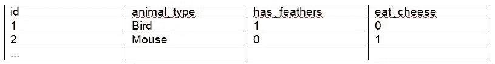
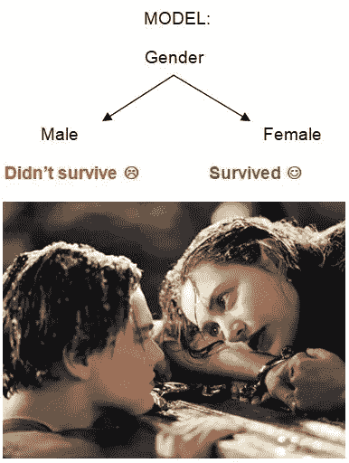

# 泰坦尼克号如何帮助你发展业务？

> 原文：<https://medium.com/analytics-vidhya/how-can-the-titanic-help-you-to-grow-your-business-af8d99f14aee?source=collection_archive---------27----------------------->

# **简介**

我最近决定参加由谷歌主办的数据科学平台 Kaggle 上的一些机器学习挑战。

这个平台上最著名的项目之一是通过使用机器学习模型来预测哪些乘客将在泰坦尼克号沉船中幸存下来；这是一个令人兴奋的项目，也是一个在具体问题上实践数据科学的好机会，我鼓励你们都去尝试一下。

我考进了前 9%，成绩相当不错，在这个过程中学到了很多东西，当我和朋友、家人或招聘人员谈论这件事时，他们的反应都大同小异:

我们来回答为什么:

# 泰坦尼克号的挑战

挑战在于*将*乘客分为两类:“幸存”和“未幸存”。为了做到这一点，我们可以使用年龄、性别、票价等变量，并将它们输入到一个模型中，为我们完成这项工作。

魔法，对吧？嗯，是也不是。

你们中的一些人可能想知道如何通过机器学习来实现这一点:我将跳过细节并保持简单，因为这篇文章是为每个人(即技术和非技术人员)写的，但如果你感兴趣，我将我的解决方案上传到了 [Github](https://github.com/NassimOuannoughi/Kaggle-Titanic) 。

但是等等，机器学习实际上是什么？因为这是一个热门话题，所以有很多误解，所以让我们花一点时间来解释核心概念。

# 定义机器学习

根据维基百科:

> 机器学习(ML)是对通过经验自动改进的计算机算法的研究。

很好，我们有了一个定义。但是它与传统编程的最大区别是什么？为什么每个人都在使用它？

为了使事情变得简单，假设您想编写一个应用程序，它根据一些特征来猜测数据库中存在哪种动物。

您的输入包括:

*   你的特点:它有没有羽毛，它喜不喜欢奶酪，你摸它不摸它它会咬你吗…
*   你的目标:动物的种类

您希望将这些输入数据提供给一个程序，该程序将返回一个输出，在我们的例子中是动物类型(鸟、老鼠、猫……)。

传统编程(TP)和机器学习(ML)之间的根本区别如下:

TP 将程序应用于输入数据并产生输出数据，而 ML 基于输入和输出数据制作程序(模型),然后将其结论推广到新的未知数据。

TP 让程序员预定义了一组指令，在我们的例子中是一系列的“if else then”，比如“如果吃奶酪，那么动物就是老鼠”。

而 ML 通过观察数据来学习:“哦，我的”，计算机惊讶地喊道，“数据库中近 99%的老鼠喜欢吃奶酪，[我将宣布，从今天起，任何喜欢吃奶酪的动物都将被归类为老鼠](https://www.khanacademy.org/test-prep/praxis-math/praxis-math-lessons/gtp--praxis-math--lessons--statistics-and-probability/a/gtp--praxis-math--article--correlation-and-causation--lesson)！”。

这两种范式各有其特点和缺陷，具体问题需要其中之一。在我们的案例中有一些限制:

*   TP 要求程序员对动物有深入的了解，或者得到专家的帮助。此外，代码可能会很长，很难维护:你可能需要对许多特征编写许多条件，以做出准确的预测，尽管我们努力破坏生物多样性，但地球上仍有许多物种([大约 160 万已被确认](https://www.nationalgeographic.com/newsletters/animals/article/how-many-species-have-not-found-december-26#:~:text=A%20study%20in%202011%20predicted,maybe%201.6%20million%20of%20them.))。
*   ML 需要大量的*干净的——有代表性的——高质量的*数据才能表现良好。数据集越大，训练模型的时间就越长，成本就越高([和我们排放的二氧化碳越多](https://academic.oup.com/jla/article/doi/10.1093/jla/laz005/5578488))。

在回到泰坦尼克号的案例之前，我想提一下，最大似然算法可以这样分类:

*   监督算法，通过使用标记数据进行学习。我们上面的动物例子是监督学习的一个例子。
*   非监督算法，通过使用未标记的数据进行学习。例如，它们在遗传学中被用来将 DNA 模式聚类。来，看看这个很酷的项目:[https://www.c4xdiscovery.com/technology/taxonomy3.html](https://www.c4xdiscovery.com/technology/taxonomy3.html)
*   半监督算法，通过使用标记和未标记的数据来学习。例如，facebook 等公司可以根据出现在照片上的用户对照片进行分组，并建议标记某人，如果这个人以前已经被标记过。
*   强化算法，它通过操纵其环境来学习，以便从 A 点到 B 点，通常通过奖励系统。例如，你可以通过设置奖励来教一个程序学习如何打败超级马里奥关卡(即从 A 点到 B 点),比如:

1.  向屏幕右侧移动= +5 点
2.  向左移动= -5 点
3.  掉进洞里= -10 分
4.  不动= -1 点/ 5 秒

这是一个幼稚的奖励系统，但是你明白了。

我们可以根据我们正在处理的问题的类型对算法进行进一步的分类:我们是要将我们的数据分类成组，还是要预测一个值？([比如房子的价格](https://github.com/NassimOuannoughi/Kaggle-predict-house-prices))

现在我们对什么是机器学习有了更清晰的认识，让我们回到我们的船上:

# 让我们解决泰坦尼克号的问题

让我们再一次把这个问题公式化。我们有一个由乘客信息组成的数据库，如:年龄，性别，票价等。哪些是我们的特征，以及一个目标变量:乘客是否幸存？

## 传统编程

如果我们使用传统的编程来解决这个问题，人们可能会想到臭名昭著的“妇女和儿童优先！”并写下:

如果乘客性别为女性:幸存=是

否则:幸存=否

事实上，船上 74%的妇女和 52%的儿童得救了，但只有 20%的男子([来源](https://en.wikipedia.org/wiki/Women_and_children_first))，这实际上是一个很好的基线模型，在 Kaggle 上的准确率为 76.56%。

## 机器学习

正如你所猜测的，这是一个使用标签数据的分类问题！我们想知道乘客是否幸存，换句话说，我们想把他们分为幸存者和非幸存者。我们可以用标记的数据来训练我们的模型，以便做出我们的预测。

有许多算法可以解决这个问题，其中之一是决策树算法:它吸收输入数据，并根据其观察结果生成一个带有与决策相关的分支的树。

一个决策树可以很深很复杂，有很多层次和条件，也可以很简单，只有一两个层次。以下是决策树的一个示例:

# 如何使用机器学习来发展你的业务

如何使用机器学习来发展你的业务

哦，我忘了说:通过使用随机森林模型，我将基线分数从 76.56%提高到了 78.95%。但是 2.4%看起来没那么令人印象深刻吧？

这就是事情变得有趣的地方。

假设你在一个数学比较容易，现实也不复杂的假想世界里有一个假想的公司，你想为你的产品做广告。

你有 100，000 美元可以花在邮寄活动上，向 100，000 个潜在客户发送产品样品。

1.  如果他们对你的产品感兴趣并真的购买了，你将从每个顾客身上平均获得 10 美元。
2.  如果他们不感兴趣，你只是失去你的钱。

正如您所注意到的，您需要获得 10，000 个客户才能收回您的初始投资。到目前为止，您依靠一个简单的程序来选择将您的样本发送给谁:您使用 SQL 通过使用条件“从性别为女性的数据库中选择潜在客户”从您的数据库中提取 100，000 人，这允许您从 100，000 人中转换 12，000 个潜在客户—您的转换率为 12%。

你的平均收入为:(12.000 * 10 美元)-100.000 =每次邮件活动 20.000 美元

有一天，你决定雇佣一位才华横溢的数据科学家，姑且称他为 Nassim，几周后他提出了一种选择潜在客户的新方法:他使用 ML 模型，假装他能让你的转化率增加 3%。一开始你并没有被打动，但是算一算，你会意识到这意味着平均收入为:

(15.000 * $10) — 100.000 = $50.000 !(这是感叹号，不是阶乘)

您对这一结果感到满意，允许他继续进行，并有点惊讶地得知，营销活动的转化率是 14%，而不是之前提到的 15%，有时您从培训数据中获得的结果与实际情况略有不同。

好吧，反正你很高兴，因为你的邮寄活动的回报翻了一番，所以你决定给纳西姆加薪:)

# 结论

这篇文章是对机器学习的简短介绍，为了使事情简单，我有意避免了诸如深度学习、NLP 或计算机视觉等主题。

既然我们已经学到了很多，就让它沉淀下来，在另一篇文章中再见吧！

此外，这是我的第一篇文章，所以如果你有任何建议来帮助我提高我的写作，我会很高兴地阅读它们。

最后，如果你想了解更多，看看这篇文章:

[https://www . analyticsvidhya . com/blog/2019/07/ultimate-list-popular-machine-learning-use-cases/](https://www.analyticsvidhya.com/blog/2019/07/ultimate-list-popular-machine-learning-use-cases/)

**纳西姆·万努吉**