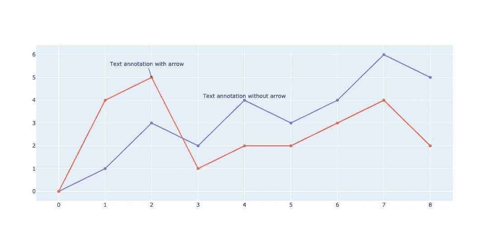
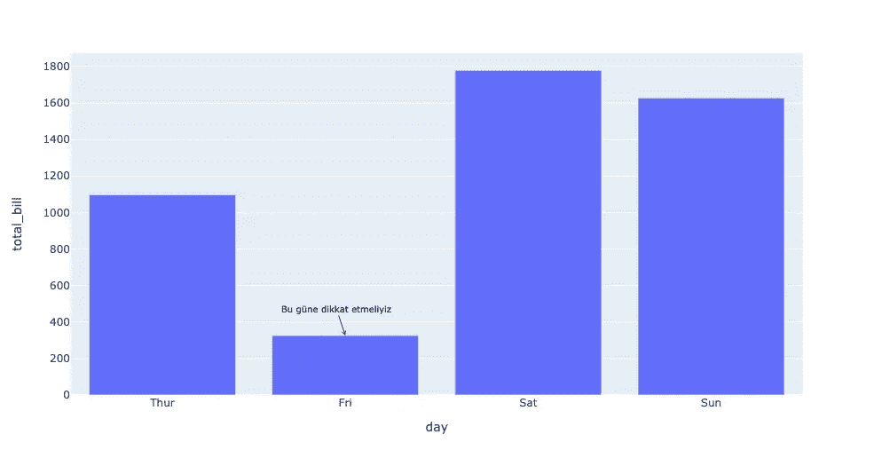

# 如何在 Plotly 中使用注释？

> 原文：<https://medium.com/analytics-vidhya/how-can-use-annotations-in-plotly-de6ab8b7d580?source=collection_archive---------0----------------------->

大家好！在本文中，我们将尝试涵盖，什么是 Plotly 注释？我希望它会有帮助。请不要在这篇文章中用我的英语🥲来评价我，我将使用 seaborn 的 tips 数据集。让我们试着掩盖。

# 什么是注释？

我们可以说文本是我们在图表上创建的注释。



[图片来自 Plotly 官方网站](https://plotly.com/python/text-and-annotations/#text-annotations)

## 注释变量

每个注释变量将是一个 python 字典。每个字典都应该包含这些关键字:

*   x-> x 轴的哪个点
*   y-> y 轴的哪个点
*   文本->注释文本的字符串
*   showarrow ->是否要显示批注指针的箭头(必须为布尔值)
*   箭头->箭头的样式是什么
*   字体->批注的字体样式

## 我们如何使用？

我们可以使用两种类型的注释。

*   图. update _ layout(annotations =[annotation 1，annotation2，…])
*   图.添加注释(注释)

## 使用 add_annotation 函数添加注释

首先，我必须导入创建图表、操作数据集和导入数据集所需的包。

```
import pandas as pd
import seaborn as sns
import plotly.express as px
```

我正在按日列对数据集进行分组，并创建条形图。x 轴表示日，y 轴表示总账单。

```
df = sns.load_dataset('tips')
grouped = df.groupby('day', as_index=False).sum()
fig = px.bar(data_frame=grouped, x='day', y='total_bill')
```

现在我将为注释对象创建字典。

```
annotation = {
    # x -> location for x
    'x': grouped.loc[grouped['total_bill'] == grouped['total_bill'].min()]['day'][1],
    # y -> location for y
    'y': grouped['total_bill'].min(),
    'text': 'Bu güne dikkat etmeliyiz',  # text
    'showarrow': True,  # would you want to see arrow
    'arrowhead': 3,  # which type for arrowhead
    'font': {'size': 10, 'color': 'black'}  # font style
}
```

我将使用 add_annotation 函数将字典添加到我们的绘图中。请不要忘记，在那个函数中，我们一次只能添加一个注释。

```
fig.add_annotation(annotation)
fig.show()
```



如果你和我做了同样的事情，你可以看到这个情节

## 添加带有更新布局的注释

我将再次分组数据帧并创建图形。

```
df = sns.load_dataset('tips')
grouped = df.groupby('day', as_index=False).sum()
fig = px.bar(data_frame=grouped, x='day', y='total_bill')
```

我正在为注释创建字典。但是，在这一节中，我们将使用不同类型的 x 轴和 y 轴。

```
annotation = {
    'xref': 'paper',  # we'll reference the paper which we draw plot
    'yref': 'paper',  # we'll reference the paper which we draw plot
    'x': 0.36,  # If we consider the x-axis as 100%, we will place it on the x-axis with how many %
    'y': 0.2,  # If we consider the y-axis as 100%, we will place it on the y-axis with how many %
    'text': 'Bu güne dikkat etmeliyiz',
    'showarrow': True,
    'arrowhead': 3,
    'font': {'size': 10, 'color': 'black'}
}
```

在这个例子中，我们把在上面画图的纸作为 x 轴和 y 轴的参考。与前一个不同，在本词典中，我们为每个轴设置了百分比。但是如果我们没有添加 xref 和 yref，我们仍然可以使用旧样式为每个轴设置数据点。我们可以用 update_layout 添加多个注释。

```
fig.update_layout({'annotations': [annotation]})
fig.show()
```


希望有所帮助。你可以从[这里](https://github.com/mebaysan/VeriBilimi/blob/master/Python/3-)KesifciVeriAnaliziVeVeriGorsellestirme/Plotly-Dash-Examples/Plotly-Annotations/Plotly-Annotations.ipynb)获取代码。亲切的问候！