# COVID19 如何毁了大学生的心理健康

> 原文：<https://medium.com/analytics-vidhya/how-covid19-ruined-college-students-mental-health-2cff51f4f3d5?source=collection_archive---------21----------------------->

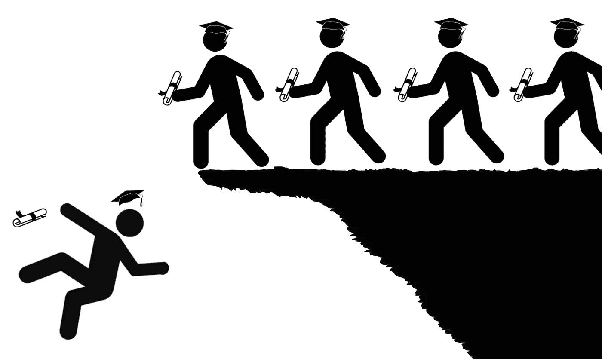

*本案例研究由* [*阿里·劳森*](https://www.linkedin.com/in/alijahlawson/)*[*本杰明·卡姆德姆·塔洛姆*](https://www.linkedin.com/in/benjaminkamdemtalom/)*[*丽莎·帕特森*](https://www.linkedin.com/in/lisa-paterson-3266a2135) *，以及* [*安雅·阿里*](https://www.linkedin.com/in/anya-ali-35ab02161/) *创建。这个非营利项目不隶属于任何特定的大学或组织。***

**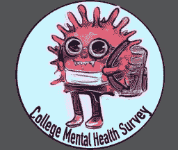**

**大学生是美国最大的群体之一，他们受到了疫情的破坏。许多学生被迫离开校园宿舍，面临财务和职业的不确定性，正在思考如何在完全不正常的情况下过正常的生活。**

**由于大学生独特的人口特征，我们怀疑他们在 COVID19 期间的经历也同样独特。我们创建了一项调查，通过多种因素衡量学生的心理健康质量。学生们回答了 21 个关于他们心理健康不同方面的问题，以及这些因素在疫情早期是如何变化的。我们用统计软件 R Studio 分析了调查结果。**

**下面是我们的发现**

1.  **学生的心理健康质量下降了 12%**
2.  **无聊、孤独、孤立和缺乏动力是最糟糕的**
3.  ****非白人学生的心理健康下降*比白人学生*多****
4.  ****非白人学生滥用药物*比白人学生***少**
5.  ****失业可能影响心理健康****
6.  ****孤独感&与最严重的心理健康问题相关****

**就业、缺乏社会交往和种族背景等因素影响了不同程度的心理健康下降。在大多数情况下，没有一个特定的因素导致重大的精神痛苦。相反，有各种各样的环境和社会经济因素导致了心理健康的恶化。**

# **人口统计数据**

**在总共 332 份回复中，只有 6 份因重要回复为空白而被删除。这留给我们 326 个回答来分析。**

**大多数回答者来自东南部的大学，其中包括德克萨斯大学达拉斯分校、田纳西大学诺克斯维尔分校和玛丽维尔学院。96%的应答者在 18-24 岁年龄组，其中大多数人表示他们的种族是白人(64%)。我们承认白人/非白人应答者数量的差异可能会对我们的分析产生影响。**

**以下是按年级分列的数据:**

**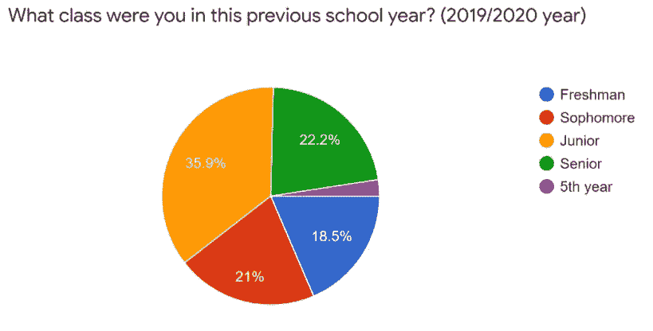**

****44%的应答者被诊断有精神健康问题，但只有 17%的人积极地去看治疗师/咨询师。这表明最需要心理保健的学生没有得到这种保健。****

**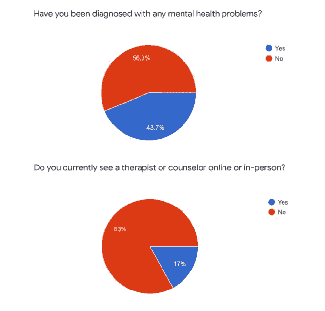**

****我们还发现，超过三分之一的学生因为与艾滋病相关的情况而失去了工作。虽然一些学生可以依靠父母支付他们的费用，但其他学生可能没有这种选择。这可能会给这些年轻人带来巨大的经济压力。****

**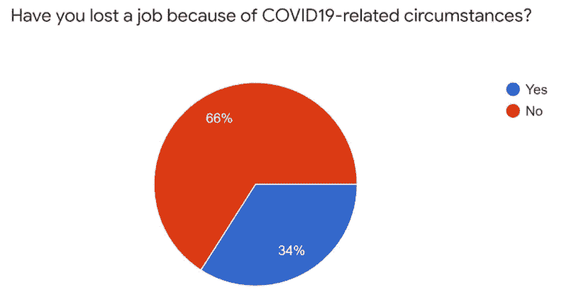**

****超过 95%的学生受访者表示，他们的大学转向了在线课程，但只有一半的学生认为他们的大学在这一转变过程中为他们提供了额外的学术支持。****

**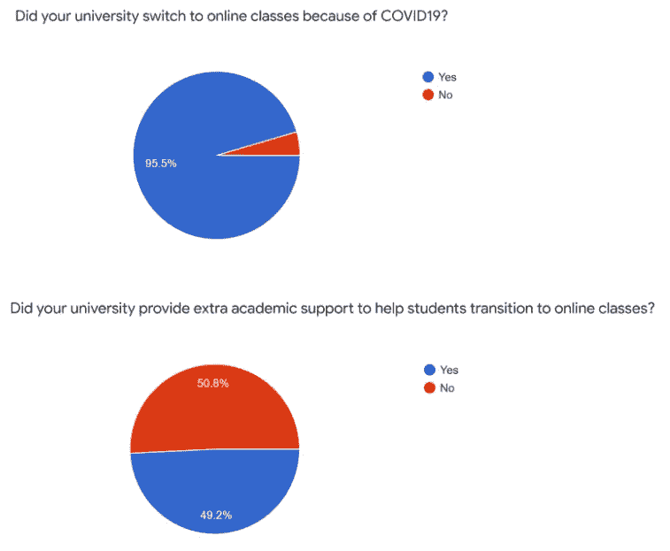**

# **我们的发现:**

# **1.学生心理健康质量的中位数下降了-12%**

**这并不令人惊讶，因为 COVID19 对大多数美国人来说压力极大。**

**这是一个显示心理健康百分比变化的钟形曲线:**

**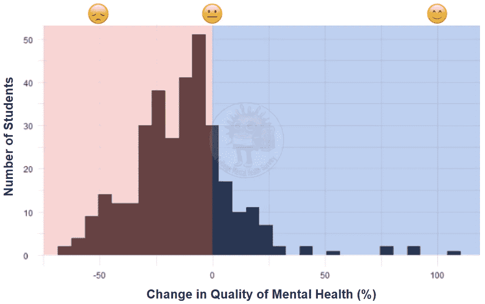**

**心理健康状况恶化的学生位于图表的红色(左侧)，心理健康状况改善的学生位于图表的蓝色(右侧)。变化接近于零的学生处于中间**

# ****2。无聊、孤独、孤立和缺乏动力是最糟糕的****

**在疫情早期，食欲、恐惧和抑郁的变化也明显恶化。**

**“突然爆发的自信”和“一次尝试多个目标”的情况也有所减少。考虑到许多学生在动机上挣扎，这是有道理的。在这项调查的背景下，这两个因素被认为是不好的因素，因为它们通常被用来衡量情绪波动或情绪波动。**

**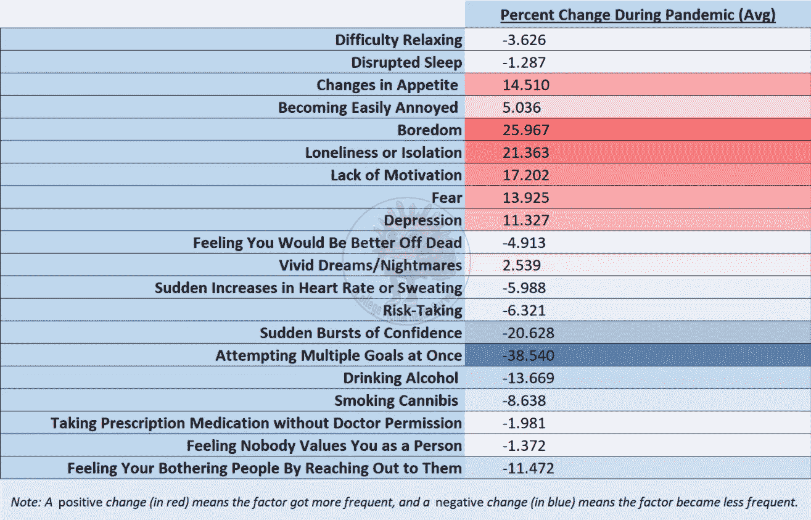**

# ****3。非白人学生的心理健康比白人学生下降更多****

**我们发现——就像我们国家的许多其他差异一样——白人和非白人应答者之间的心理健康变化存在显著差异。**

**非白人受访者的心理健康质量中值下降了 **-13.4%** ，而白人受访者的中值下降了 **-11.8%** 。**

**这种中位数变化的差异与精神健康的任何变化无关，也不足以用于预测性线性模型。然而，在我们的样本人群中有一个差异，我们觉得值得分享。**

# **4.非白人学生滥用药物**比白人学生少****

**看看所有的学生应答者，在疫情期间，药物滥用在*变得不那么频繁了。这是令人惊讶的，因为其他研究表明在疫情期间药物滥用普遍增加。这种现象可能是参加我们调查的学生群体所独有的。***

**然而，当考虑到学生种族时，我们得到了一个非常不同的故事:**

**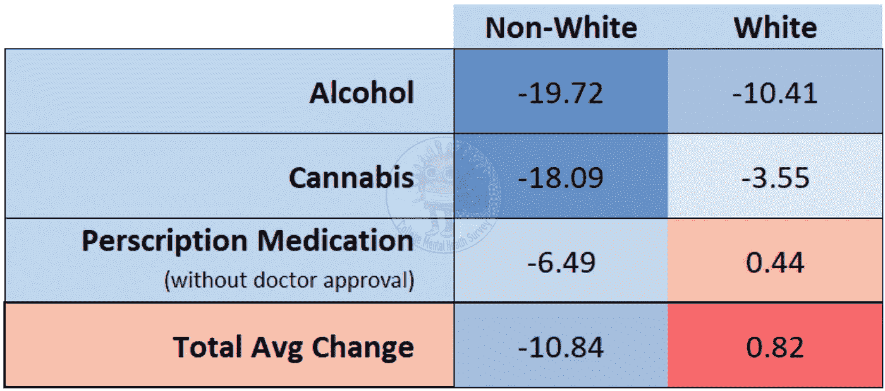**

****非白人学生的药物滥用下降了 10.84%*，而白人学生的药物滥用略有上升*。******

***这种趋势甚至强到足以用于预测性线性模型，并具有轻微的正相关性。***

***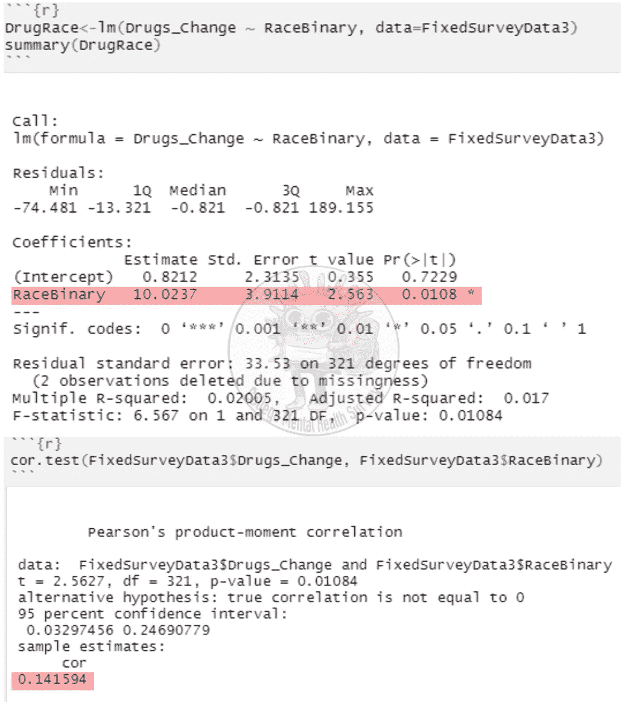***

***我们的模型预测物质滥用的种族和两个因素的相关性测试的变化***

***虽然需要进行更多的研究，但我们的数据有一个明显的趋势。这些发现与我们社会对种族和毒品问题的许多假设相矛盾。值得注意的是，它打破了非白人青年更可能有药物滥用问题的刻板印象。***

***白人学生中处方药滥用的轻微增加表明了更大的全国趋势。近年来，阿片类药物/处方滥用导致的死亡不成比例地影响了美国白人。不幸的是，我们的研究结果显示，这种趋势可能也会影响受过大学教育的年轻人。***

# ***5.失去工作可能会影响心理健康下降***

***当然，这似乎是常识。当我们比较因 COVID19 而失业的学生和没有失业的学生的心理健康状况时，我们发现了一个明显的差异:***

***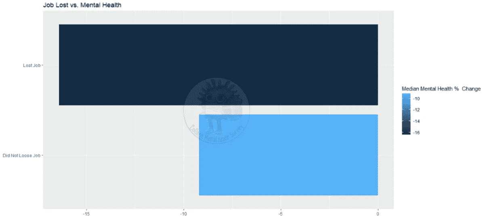***

*****与没有失业的学生相比，最近失业的学生应答者的心理健康质量的中位数变化低 7.2%。*****

***虽然这种差异很显著，但相关性*并没有强到足以*在线性模型中用作预测因子(P 值为 0.908)。***

# **6.孤独和隔离与最严重的心理健康问题相关**

**我们发现多种迹象表明，在 COVID19 疫情期间，社会孤立是学生中的一个主要问题。以下是一些例子:**

*   **那些“感觉没有人重视他们的存在”的学生有 46%的可能有自杀想法(我们通过询问回应者“感觉你死了会更好”的频率来衡量)。**
*   **看到抑郁增加的学生有 45.9%的可能看到孤独增加。**
*   **在疫情经历更多无聊的学生有 61.2%的机会变得更加孤独。**
*   **孤独感增加的学生有 70%的可能性增加所有其他心理健康问题。**

**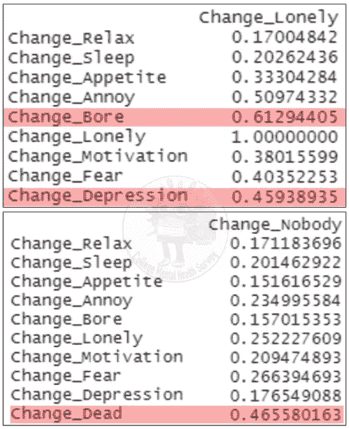**

**所有这些因素都指向一件事:孤独和孤立是大学生在 COVID19 期间面临的最大问题之一。在线课程、隔离和公共活动的缺乏可能是孤独增加的原因。**

# **结论**

**在美国，大学对 18 岁以上学生的幸福有着最大的直接影响。出于更多的原因，学院和大学应该努力将他们的心理健康服务扩展到更多的学生。这将是最有效的配合扩大校园社区发展项目。**

**大学管理部门采取积极主动的方法来解决心理健康问题是非常重要的。大多数学院和大学都提供基本的心理健康服务。然而，这些服务只能解决问题*在*它们变得不可管理之后。这些机构永远不会取代指定的精神卫生保健提供者，但大学处于一个绝佳的位置，可以在这些问题升级为全面的精神痛苦之前抓住它们。**

**高校*必须*营造一种心理健康意识的校园文化。教授和教员需要接受培训，了解如何识别有心理健康问题的学生。他们还需要引导有需要的学生去适当的校园支持服务。我们鼓励大学建立一条开放的沟通渠道，让学生们表达他们对心理健康的担忧。**

**最重要的是，就业状况、社区参与和种族等因素对学生的心理健康有重大影响。改善学生福祉是对他们全面成功的直接投资。**

***我们的项目 Instagram 账号可以在* [*这里找到*](https://www.instagram.com/collegementalhealthsurvey/)**

***我们的标志是由* [*萨拉·穆斯塔法*](https://www.instagram.com/smoustart/) 制作的**