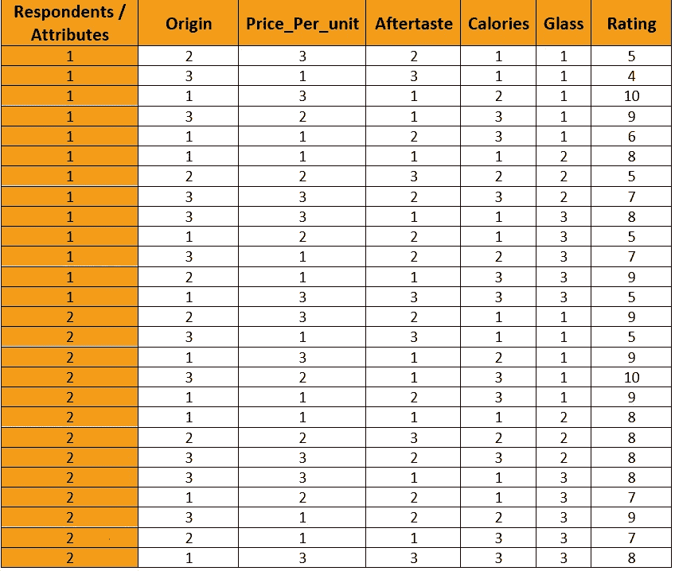
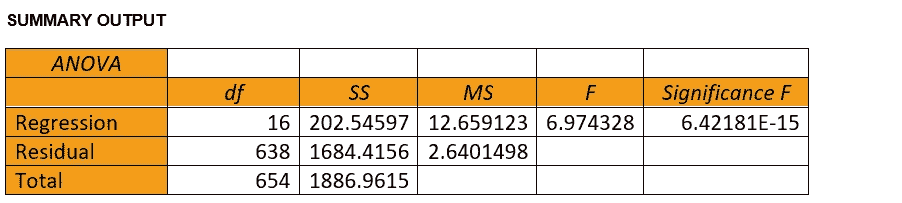

# 数据分析如何支持销售和营销发展对消费者偏好的商业洞察力？

> 原文：<https://medium.com/analytics-vidhya/how-data-analytics-supports-sales-and-marketing-develop-business-insights-into-consumer-preferences-925c9e283f3a?source=collection_archive---------2----------------------->

图片来源—[https://www . clean png . com/png-social-media-consumer-digital-marketing-CpG-site-5035067/](https://www.cleanpng.com/png-social-media-consumer-digital-marketing-cpg-site-5035067/)

今天我写的是消费者偏好及其相关模型。

在我详细解释之前，让我问大家一些问题。

你想开发和推出一种新产品/服务，还是参与产品/服务的改进，但在此之前，你想找出消费者更看重产品的哪一个属性，以便找到正确的线索？

这篇文章将详细解释如何实现这一点？

我们先深入主题图。

1.简要介绍消费者偏好和使用的方法。

2.案例研究讨论

3.基于 Excel 的开发模型设计

4.分析和解释

消费者偏好是什么意思？

消费者偏好是需求的潜在基础。

它指的是个体消费者的一套偏好和价值观，对这些偏好和价值观的识别和确定是提高企业投资回报率的关键。

它还被称为根据产品/服务的感知效用，喜欢或偏爱某样东西的倾向。消费者通常根据这些产品/服务的效用等级对其进行分级或评级。

消费者总是对最大化消费者剩余感兴趣，消费者剩余无非是(价值—价格)，其中当消费者的感知价值大于他们为产品支付的价格时，消费者是满意的，即(价值—价格)总是> 0。另一方面，当营销者或销售者最大化利润时，他们会受益，也就是说，对他们来说(价格-成本)总是> 0。

因此，关键是以最低成本和合适价格提供最高价值。

因此，我们如何为消费者确定最高价值和合适的价格是一个大问题？

在这种情况下，消费者的偏好起着很大的作用。

一种称为“联合分析”的方法被用来衡量相同的。让我用简单的术语解释一下什么是联合分析:

联合的字面意思是“联合在一起”。

但在营销中的口头禅是，“特色**欺骗**被认为**联合**谎言”。

因此，在这里，产品/服务特征和它们的标签被一起考虑，以得出一个模型来评价消费者的偏好。

我们可以将其定义为一种先进的市场研究定量方法，以准确理解客户和市场如何评价服务或产品的不同要素。

让我详细说明一下我们如何进行这项工作？

流程图描绘了一个清晰的视图。

作者图片

首先，第一步是决定产品或服务，并确定消费者想要什么？

其次是将消费者想要的东西分解成多种属性或特征的组合。

然后根据将要创建的组合，确定这些特性/属性的级别。

第三是创建组合并将其分享给用户/消费者，以在选定的范围内对这些组合进行评级。

第四是收集这些评级数据，并检查质量。收集的数据应该模糊不清或不一致。

第五，考虑这些评级组合进行分析和解释。

第六步是按照重要性顺序列出最终偏好。

在遵循这一流程的同时，我们有几个要点需要注意。

让我们逐一讨论。

1.首先，在选择属性时，我们必须选择所有属性相互独立的方式，即它们之间不应该存在相关性。

2.考虑具有不同程度或级别的属性是获得最大信息的好主意。例如—属性，三级颜色(红、绿、黄)

3.在确定级别时，您应该确保选择互斥的级别(意味着事件不能同时发生)。例如，级别“黄色”不应扩展为浅黄、深黄、黄绿色等，因为它们或多或少是相同的，只有很少的变化和重叠。

4.选择的级别也应该是明确的。例如，如果我们在乎选择受欢迎、非常受欢迎、不太受欢迎，这并没有传达正确的信息，因为对我来说受欢迎的可能对其他人来说不受欢迎。

然后，我们需要研究属性和级别的理想数量。

5.最少 3 个，最多 5 个属性。更多的属性增加了复杂性。

6.每个属性内最少 3 个级别，最多 5 个级别是理想的。更多级别会增加复杂性，导致数据收集过程中的质量下降。

7.然后，我们应该选择平衡数量的属性和级别，即，理想情况下，每个属性应该具有相似数量的级别。

现在开始设计考虑。

假设我们有 3 个属性，每个属性有 3 个级别，那么创建的可能组合总数可以是= 27。

这里我们有两种选择，或者我们可以使用全因子设计，其中所有上述 27 种组合可以呈现给每个用户/消费者用于评级，或者我们可以使用因子设计的子集，其中我们将子集呈现给用户/消费者用于评级。子集是以这样的方式随机选择的，即它们具有 0 到几乎为零的相关性，并且每个回答者应该得到相同数量的子集。

我在这里使用的是全因子设计的子集和 1 到 10 的评分标准。

这样做是因为一个回答者很难

特别是对每个组合进行评级，在这种情况下，区分一个组合与另一个组合的能力变得不稳定，他/她开始遵循他/她自己的启发式规则，而不是经过适当思考的评级。因此，这可能会影响您正在收集的数据的质量。

但是在选择子集时要注意的一件重要事情是，所选择的子集应该具有正交设计。

这意味着所选择的变量不应该相互关联，它们应该具有 0 到几乎为零的多重共线性。

此外，我将向您展示我们如何实现这种方法来找出消费者的偏好。

让我们考虑一个啤酒制造公司的例子来理解实现。

假设该公司现在计划将业务扩展到葡萄酒制造领域，但事先想根据某些属性了解消费者的偏好。

1.  定义的产品

作者图片

2.确定的属性和级别

作者图片

3.对产品进行评级的唯一受访者

作者图片

4.可用的设计选择

作者图片

5.描述受访者概况及其评级的表格(从 1 到 10)

作者图片

6.用数字表示的属性和级别(因为计算可以很容易地在数值上发生)

作者图片

7.在计算相关性和线性回归时，需要数字形式的数据。

作者图片

这张幻灯片向您展示了我们所考虑的属性之间的计算相关性

8.无相关性的正交设计。

在 Excel 中，您可以启用“数据”选项卡下的“数据分析”来计算属性的相关性。

这里有一个截图，可以清楚地告诉你如何进行同样的计算。

我将向您展示从哪里可以启用“数据分析”。

转到文件->选项->加载项->单击管理 Excel-加载项并启用“数据分析”，如下图所示。

作者图片

下面的截图向你展示了如何在 excel 中计算相关性。

作者图片

作者图片

9.下一步是在 excel 中计算线性回归。

您可以使用“数据”选项卡下的“数据分析”来计算回归。

下面的截屏捕捉到了这一点。

作者图片

作者图片

这里无论哪里的 *P 值都是* #NUM！，这意味着系数是 0。

1.使用线性回归结果作为我们的输入，通过一系列步骤计算最终偏好评级:

让我给你详细演示每一步。

第一步

作者图片

第二步

作者图片

第三步

作者图片

第四步

作者图片

第五步/最终陈述

作者图片

这清楚地描绘了我们的消费者对价格非常敏感，然后是原产地，然后是回味，玻璃，最后是热量。这被证明是代表客户偏好的一种很好的方式，这将有助于营销人员在将新产品投放市场时制定相应的策略，以获得最大的投资回报。

我以此结束我的第一部分。

在第二部分，我将向你展示我们如何使用 R 语言进行类似的计算。

我希望这能给这个话题增加一些价值