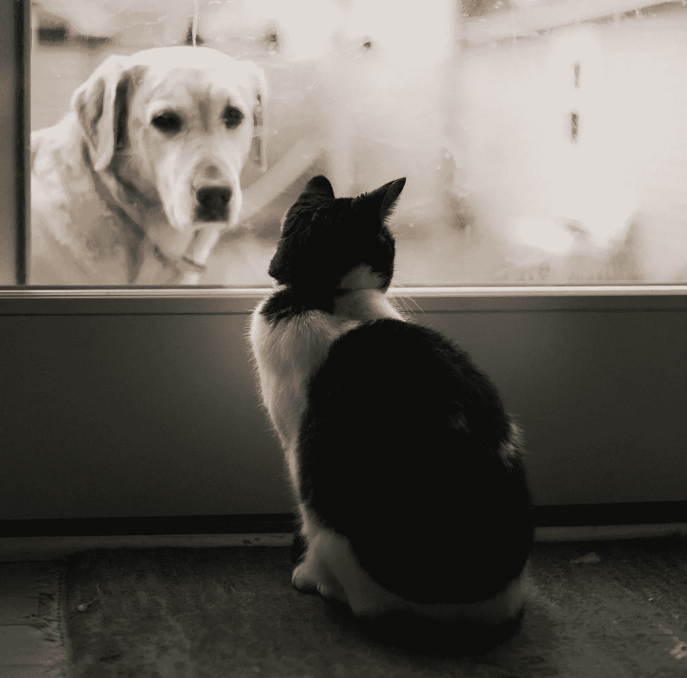

# 深度学习如何区分猫和狗的声音

> 原文：<https://medium.com/analytics-vidhya/how-deep-learning-distinguishes-a-cats-sound-to-a-dog-s-one-63262ce16040?source=collection_archive---------4----------------------->

## 通过 Librosa 进行音频提取和分类的初学者友好指南

图片作者:[亚历克西斯·克洛伊](https://unsplash.com/@alexischloe)来自 [Unsplash](https://unsplash.com/photos/dD75iU5UAU4)

在为初学者提供了一个全面的指导后，卷积神经网络在细胞图像的图像分类中区分被疟疾感染的细胞和健康细胞，如链接中所示…