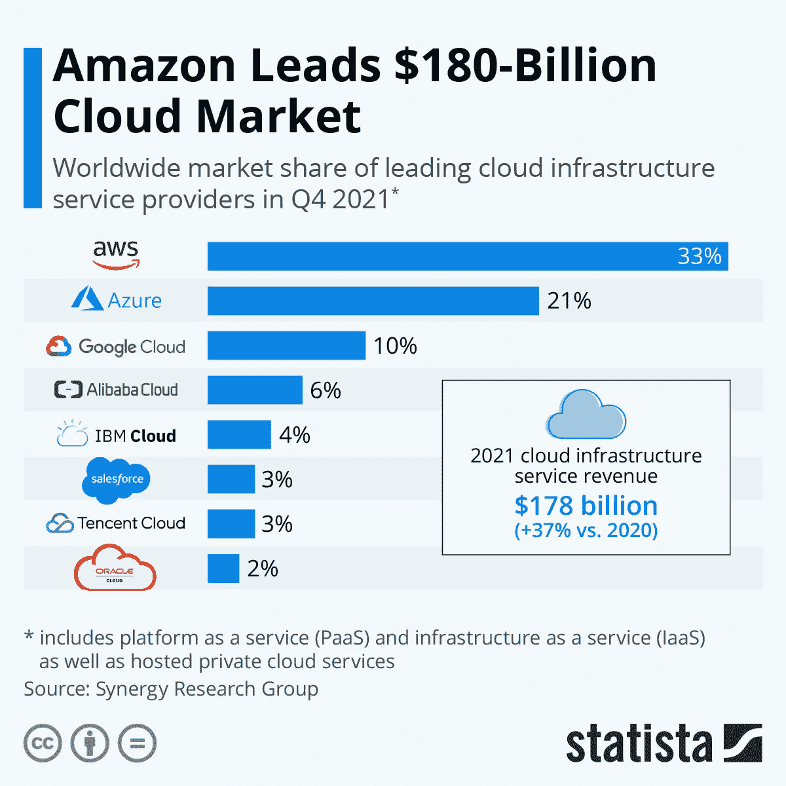

# 2022 年我如何 ace Google Cloud 协理云工程师？

> 原文：<https://medium.com/analytics-vidhya/how-did-i-ace-google-cloud-associate-cloud-engineer-in-2022-e2d1737970ce?source=collection_archive---------1----------------------->

自 2021 年 3 月以来，赚钱云一直是我的首要技能，但当时我不知道应该从哪里开始，应该选择哪一个(AWS 或 Azure 或 GCP ),我使用的是 Heroku cloud 来部署一些应用程序，因为它是免费的，只有一个平台即服务。所以我的知识非常有限。但随着时间的推移，我的好奇心不断增加，并快进到 2021 年 12 月，我的组织要求我继续参加云认证，这被证明是我详细了解云的黄金机会。

所以从那里开始，我的学习云之旅真正开始了！在我写这篇博客的时候，我已经通过了云工程师助理考试，所以我想让我们分享一下我准备考试的经验，一步到位！。

## 主题

*   我为什么选择谷歌云？
*   我是怎么准备的？
*   考试怎么样？
*   我的建议

## 我为什么选择谷歌云？

这是我们在学习云之前最有可能想到的问题，我应该选择哪一个？(AWS 或 Azure 或 GCP)。这三家公司都很好，但 AWS 在相当长一段时间内拥有最高的市场份额，其次是 Azure 和 GCP。

source-statista.com

我选择谷歌云的两个原因是，
1。我的组织特别要求我学习谷歌云。
2。我对机器学习有浓厚的兴趣。

source-cloud.google.com

甚至在学习 GCP 之前，我就在做一些机器学习，因为它让我很感兴趣，所以当我研究 GCP 时，我知道它提供了其他云中最好的机器学习服务之一，并有一个名为 Vertex AI 的专用人工智能平台，作为一个托管平台，它包含了实施基于 ML 的解决方案所需的所有工具，即从数据摄取到模型部署。

source-cloud.google.com

所以这让我更加好奇去了解 GCP 而不是其他两个。
但是，如果你只是一个初学者，那么就选择其中一种云，因为它们都非常好，而且当前的趋势是**多云平台**也就是说，企业现在选择多个云平台来部署他们的应用程序，所以一旦你对单个云变得很好，那么你就可以轻松地切换到其他云！

## 我是怎么准备的？

这是至关重要的部分，因为你和 GCP 相处的时间越长，你就越擅长这个。记住这一点，我会告诉你我是如何在两个月内准备考试的，并且我会把我曾经学习过的所有资源一个一个地联系起来。

1.  最初，我在 Udemy 上注册了一门名为“ [**GCP 云工程师助理**](https://www.udemy.com/course/google-cloud-certification-associate-cloud-engineer/) ”的课程，由 Ranga Karanam 主讲(28 分钟)，这是一门非常好的课程，涵盖了 GCP 及其基础的所有重要方面，因此这是一个非常好的开始。
2.  完成这个课程后，我转到 Youtube，观看了几个由 [**谷歌云**](https://www.youtube.com/user/googlecloudplatform) 本身制作的播放列表，这些视频很短，但包含了许多关于 GCP 提供的各种服务的信息。
3.  在浏览 Youtube 时，我发现了一个名为 [**牛逼 GCP**](https://www.youtube.com/c/AwesomeGCP) 的频道，由 [**萨蒂什·VJ**](https://sathishvj.medium.com/)所有。他制作了关于助理和专业认证的播放列表，在那里他讨论了练习题，并详细解释了所有的问题和答案，一定要看看。
4.  仅仅学习理论对于考试来说是不够的，所以你需要做一些实践，所以我会首先推荐两个选项，在 GCP 上创建一个 [**免费等级账户**](https://console.cloud.google.com/) 并练习。第二，注册 qwiklabqwiklab[**并提交他们提供的实验室。你可以免费订阅一个月，这样你就可以从 qwiklab 提供的多种学习途径中进行选择。**](https://qwiklabs.com/)
5.  GK 拥有的另一个名为 [**云倡导者**](https://www.youtube.com/c/CloudAdvocate) 的频道也涵盖了重要的主题，并展示了实际的实现，这也是一个非常好的观看。
6.  如果你喜欢大量阅读，那么我会强烈建议你阅读一本由 Sullivan Dan 所著的书籍“ [**官方谷歌云认证助理云工程师学习指南**](https://oiipdf.com/official-google-cloud-certified-associate-cloud-engineer-study-guide) ”,这是一本非常好的书，其中包含了对考试中所有问题的详细解释。
7.  最后，我参加了谷歌云自己在 Coursera 上提供的名为“ [**的课程，为谷歌云助理云工程师考试**](https://www.coursera.org/learn/preparing-cloud-associate-cloud-engineer-exam) 做准备，这是从考试角度来看涵盖重要方面的最后准备。
8.  Youtube 上还有另一个频道叫做 Priyanka Vergadia 的 [**云女孩**](https://www.youtube.com/c/priyankavergadia) ，我也推荐它作为考试前的快速复习。
9.  在你参加考试之前，我强烈建议你参加 Google Cloud 自己提供的[**官方练习测试，这将让你熟悉你可能会遇到的问题。**](https://docs.google.com/forms/d/e/1FAIpQLSfexWKtXT2OSFJ-obA4iT3GmzgiOCGvjrT9OfxilWC1yPtmfQ/viewform)

就是这样！这些都是我用来学习和清理考试的资源，如果我错过了什么，你也可以让我知道！。现在让我们进入下一个关键话题。

## 考试怎么样？

好的，假设你已经为考试做好了充分的准备，现在让我们来关注考试本身。这里有一些关于考试你需要知道的事情。

但在我们继续之前，请不要认为这是一个准水平的考试，所以它会很容易，你必须学习和理解概念，以清除它。

GCP 王牌希望你能很好地掌握 GCP 的基本原理，所以这更关乎你知识的广度和深度。
谷歌提供了 [**考试指南**](https://cloud.google.com/certification/guides/cloud-engineer/) ，里面提到了你在考试前应该知道的所有话题，所以去看看吧。

以下是我的应试经验中的一些重要话题。

1.  IAM(身份、角色、策略、最小特权原则)
2.  管理账单和账单账户、成本估算和定价计算器
3.  经济高效的实施和 Google 推荐的实践
4.  负载平衡器的类型(TCP、UDP、HTTP/S、SSL 代理、网络负载)
5.  云 KMS(密钥管理系统)
6.  网络和安全(虚拟专用计算机、子网、防火墙、云防护、身份识别代理、服务账户)
7.  不同类型的磁盘(持久磁盘、SSD 及其类型)
8.  应用引擎(标准、灵活、版本、流量分流)和云运行
9.  部署经理和市场
10.  日志记录、监控、调试和跟踪
11.  无服务器和云功能
12.  虚拟机和 SSH 密钥的自动修复和运行状况检查
13.  不同类型的数据库(云 SQL、Spanner、大表、Firestore 和大查询)
14.  Google Kubernetes 引擎(节点池、pod、部署、副本集、服务)(**别忘了学习这个**)
15.  云 SDK 和 gcloud 命令
16.  数据流、数据处理、数据工作室、发布/订阅

这些是我在考试时发现的一些重要话题。
我强烈建议学习 gcloud 命令，因为这是唯一一个不仅询问使用服务，还知道如何使用 gcloud 命令及其参数/标志的考试，例如 Kubernetes 的 kubectl，Big Query 的 bq 和 Big Table 的 cbt。

source-cloud.google.com

为了理解命令结构，参考这个 [**备忘单**](https://cloud.google.com/sdk/docs/cheatsheet#understanding_commands) 并运行那些命令，这样你会对它有更好的了解。

现在来看考试结构，

*   可以通过远程监考的方式参加，也可以去离你最近的考试中心参加。
*   考试费用是 125 美元。
*   考试将由 50 个 MCQ 形式的问题组成，但有些问题可能有 1 个或 2 个正确答案，它将在问题本身旁边说明。
*   考试持续时间为 120 分钟，即 2 小时，这意味着您大约有超过 2 分钟的时间来回答每个问题。
*   但是谷歌没有指定每个主题的标记结构或标记分布，我们所知道的是不会对问题进行负面标记，所以不要错过任何问题尝试所有问题。
*   谷歌也不会告诉你得了多少分，或者你能得到的最高分是多少，你所能得到的只是你是否清除了它。
*   通过率也没有透露，但据我所知，应该在 80%左右。
*   一旦你通过了考试，你不会马上得到证书，但谷歌会花大约 8-10 天的时间来审核你的考试，并通过你的挂号信把证书发给你。
*   这里是 [**报名**](https://webassessor.com/googlecloud) 考试的链接

话虽如此，让我们进入最后一部分吧！

## 我的建议

如果你真的下定决心要参加考试，那么一定要尽早去报名，因为除非你这么做，否则你不会有效地学习，或者觉得你没有准备好，也许会开始拖延。

请不要简单地跑在那些垃圾堆后面，因为很容易记住所有的答案，但获得认证的主要原因是首先获得这些技能，否则做这些就没有意义。

保持冷静，慢慢来。不要急于获得认证，享受你的学习时间。不要忘记做**动手练习**，因为回答问题会变得更容易。

**额外提示** :-我建议你的一个策略是首先消除错误的选项，这将减少选择错误选项的机会，可能会出现两个选项非常接近的情况，这两个选项看起来都是正确的，在这种情况下，请将问题读 2-3 遍，找出两个选项之间的区别，并选择合适的选项。
在提交测试之前，请确保您再次检查了所有选择的选项。

这些都是我身边的人说的，总的来说，我学习云的旅程非常丰富，我很高兴写这篇文章，因为它将帮助你通过这次考试，所以我祝你在学习谷歌云和通过考试的旅程中一切顺利！

此外，如果您对此有任何疑问或疑问，请随时通过 [**Linkedin**](https://www.linkedin.com/in/prathmesh-patil-b151051a3) 联系我。