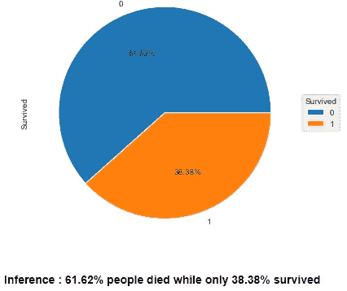
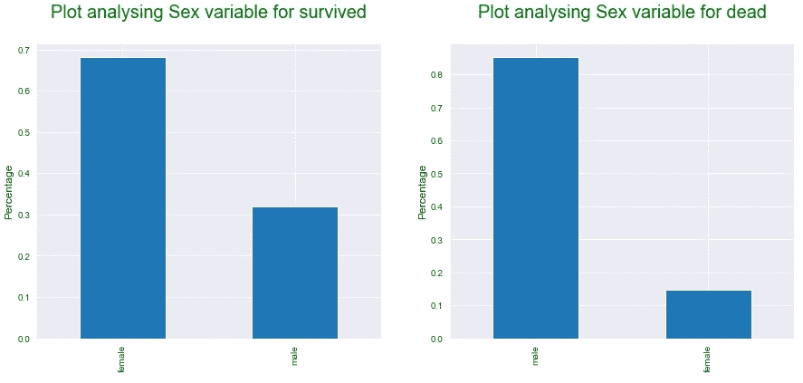
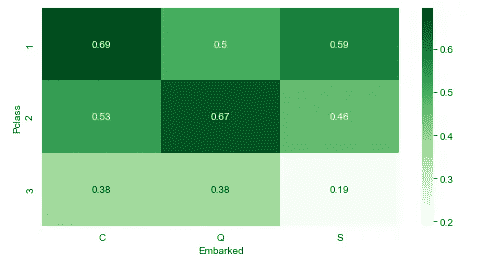

# 我是如何分析泰坦尼克号数据集的！

> 原文：<https://medium.com/analytics-vidhya/how-did-i-analyse-the-titanic-data-set-b0bd5168f818?source=collection_archive---------10----------------------->

皇家邮轮泰坦尼克号

我们都知道泰坦尼克号的故事。1912 年 4 月 15 日，这艘载有数百名乘客的“不沉之船”是如何遭遇可怕结局的。但即使在 100 年后，这一事件仍然是分析和研究的主题。

我相信阅读这篇文章的每个人都看过电影《泰坦尼克号》。这是我的最爱之一；尤其是詹姆斯·霍纳的背景音乐和席琳·迪翁的歌曲《我心永恒》。

所以我决定下载数据集，并通过使用 seaborn 的一些有趣而丰富多彩的情节对其进行分析。

我们开始吧..

我为分析导入了以下库:

1.  numpy 作为 np
2.  熊猫当 pd
3.  matplotlib.pyplot as plt
4.  seaborn 作为 sns

我称这个数据集为“df”。因此，此后我们将在 df 上执行所有操作。

一些栏目缩略语的含义。

乘客等级:1、2、3 级

SibSp:兄弟姐妹和配偶

帕奇:父母和孩子

已登船:南安普敦(南)、瑟堡(中)、皇后镇(北)

泰坦尼克号数据集的前五行

基本分析显示有 11 列和 891 行。所有列的数据类型都保持不变，但有一些值丢失。

**缺失值处理**

空值

年龄、客舱和登机栏有空值或缺失值。我们一个一个来治疗吧。

对于年龄栏，用平均值/中值/众数代替空值是不合适的。所以我们让它们保持原样。对于装载列，我们用模式值“S”替换缺失值。Cabin 列具有最高百分比的空值，因此我们删除该列。

**离群值**

异常值分析

我们看到 Fare 列和 SibSp 列有异常值。但是我们不会删除它们，因为它们可能是真正的值。

**单因素分析**

显示存活百分比的饼图

在这里我们可以看到，在泰坦尼克号上的所有乘客中，只有 38.38%的乘客幸存下来。事故如此严重。

Pclass 列的条形图和 Sex 列的饼图

从上面的图表中我们可以看出，最多的乘客属于三等舱，男性乘客比女性乘客多。

已装载列的条形图

在南安普敦登船的乘客最多。

**分段单变量分析**

我们基于幸存的列将数据帧 df 分成两部分。sur_df 包含旅途中幸存乘客的数据，而 de_df 包含未能幸存乘客的数据。

Pclass 变量的分段分析

正如我们所看到的，大部分幸存的人来自一班，而大部分无法幸存的人来自三班。

性别变量的分段分析

我们可以观察到大多数雌性动物在旅程中幸存下来。这肯定主要是因为，我们在电影中也看到，妇女和儿童被优先考虑登上安全船只。

装载变量的分段分析

我们可以看到，在幸存者中，超过 60%的乘客是在南汉普顿上船的。在那些无法生还的乘客中，超过 75%的乘客在南汉普顿上船，最少的乘客在皇后镇上船。

**双变量分析**

数字分类变量分析

幸存的乘客有更多的家庭成员，如父母，孩子。

分析 SibSp 和 Pclass 变量的带状图

这里我做了一个带状图，用来分析 SibSp 和 Pclass 变量。它清楚地表明，属于 3 类的乘客有更多的家庭成员，如兄弟姐妹和配偶。

显示每个班级幸存人数百分比的条形图

在泰坦尼克号航行中幸存的乘客中，莫斯特属于一等舱。

显示按性别分列的幸存者百分比的条形图

大部分乘客是幸存的女性乘客。

为了便于分析，我们为 age 列创建了 bin，并创建了 Age_group 列。

幸存乘客的年龄组列

我们可以清楚地看到，幸存最多的乘客年龄在 30-40 岁之间。

幸存乘客登船栏

即使在南安普敦上船的乘客人数最多，在瑟堡上船的乘客幸存的百分比也更多。

小提琴情节登船乘客类明智的

大多数三班的人在皇后镇上船。

年龄 w . r . t . p .类的群体图

三班的大多数乘客年龄在 20 到 35 岁之间。

**多元分析**

年龄与阶级和性别的 FacetGrid 图

我们可以看到最大的乘客年龄在 25 岁到 40 岁之间。

性别和阶级变量的热图

幸存的乘客中最多的是一等舱的女性，最少的是三等舱的男性。

年龄组和性别列的热图

只有一名 60 多岁的女性乘客幸存下来。50-60 岁的女性乘客幸存的最多。

Pclass 和 Age_group 的热图

大多数 30 岁以下和 30-40 岁的头等舱乘客幸存了下来。

登船和性爱专栏的热图

在瑟堡上船的大多数女性乘客幸存了下来。

年龄组和上船列的热图

在瑟堡上船的大部分乘客幸存了下来。

Pclass 和装载柱的热图

在瑟堡上船的一等舱乘客和在皇后镇上船的二等舱乘客中有最多的人幸存下来。

# **重要推论**

1.  61.62%的人无法挺过泰坦尼克号之旅。只有 38.38%的人活了下来。
2.  幸存的乘客中，最多的是头等舱的女性乘客。
3.  **在没有生还的乘客中，最多的是三等男乘客。**
4.  **30 岁以下和 30-40 岁之间的头等舱乘客存活率更高。**
5.  有趣的是，即使在南安普敦登船的乘客人数最多，但在瑟堡登船的乘客生还的比例更高。
6.  许多二等公民在皇后镇登船，幸存了下来。

这就完成了对 Titanic 数据集的分析。希望你喜欢研究我试图包括的各种丰富多彩的情节。

请让我知道你对这个分析的意见，并建议我是否可以做得更好。