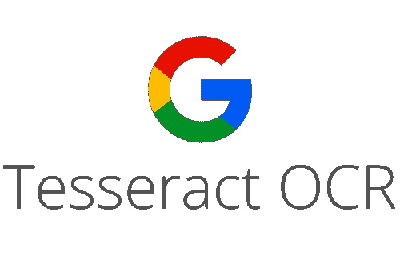
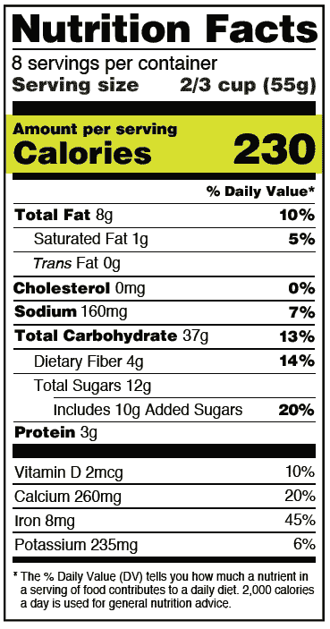
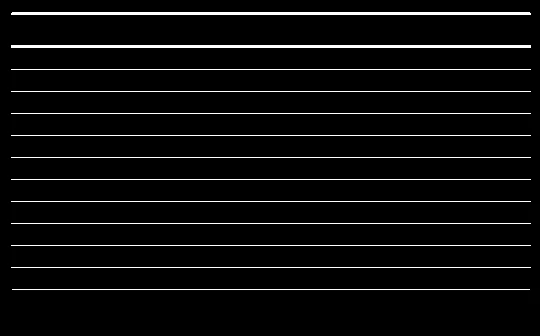
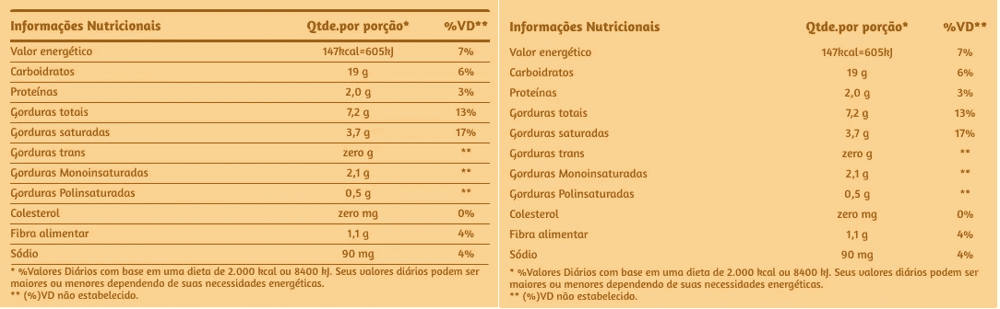
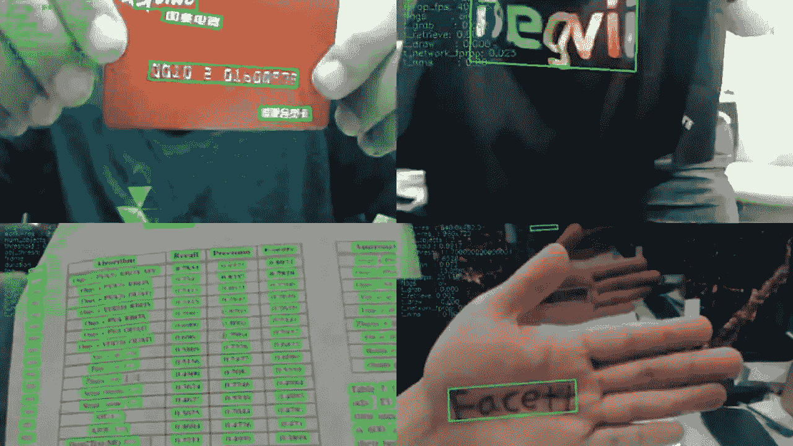
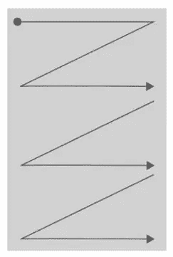
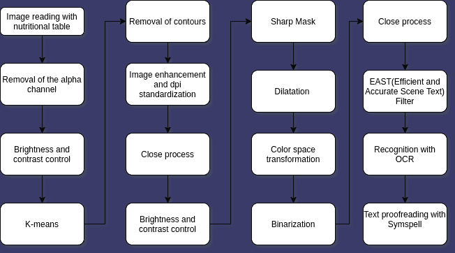
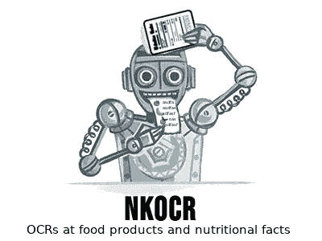

# 机器是如何读取营养成分的？

> 原文：<https://medium.com/analytics-vidhya/how-did-the-machine-read-nutritional-facts-271a53893194?source=collection_archive---------11----------------------->

如何用光学字符识别、宇宙魔方和大量的计算机视觉来阅读营养表！

奥比·奥尼耶德在 [Unsplash](https://unsplash.com?utm_source=medium&utm_medium=referral) 上拍摄的照片

前一段时间，我沉浸在一个项目中，该项目致力于形成一个食品数据的数据湖，收集从一般产品到大量食品的营养信息，然而在某一点上，人们意识到大多数营养信息是插入在图像中而不是文本中，这使得很难用 Scrapy 框架和 Python 进行 web 报废。

这个问题开启了学习一些已经在技术领域存在了很长时间的东西的机会，并获得了与大卫·h·谢泼德的打击乐。这项技术被称为光学字符识别(OCR)。事实上，下面的视频非常酷，可以感受一下 OCR 的早期:

所以**的挑战是，从图像中，有可能以文本形式从营养表中获得数据。**

# 目录:

*   宇宙魔方 e 宇宙魔方；
*   表格理论；
*   东；
*   符号拼写；
*   流程图和实现。

# 宇宙魔方 e

在搜索 OCR 的时候，我发现了一个目前正在使用的工具，它以高效率而闻名。这个工具是宇宙魔方。在搜索 OCR 时，我偶然发现了一个目前正在使用的领先工具，它以高效率而闻名。这个工具是宇宙魔方。

谷歌[宇宙魔方 OCR](https://en.wikipedia.org/wiki/Tesseract_(software)) 软件的标志。字体:维基百科。

Tesseract 是 Apache 2.0 许可下的开源引擎，目前由 Google 所有，旨在应用光学字符识别。它的最初实现发生在由惠普开发的 C 语言上。要了解更多细节，请随意查看 GitHub 上的[库，或者参考下面的文章，这篇文章在这个主题上也非常完整:](https://github.com/tesseract-ocr/tesseract)

 [## 用于低资源语言的光学字符识别(OCR ),带 Tesseract 版本。

medium.com](/@isurianuradha96/training-sinhala-language-with-tesseract-4-1-version-3cd96ce84b6a) 

然而，随着 Python 语言的使用越来越多，社区开始着手这项事业，并开发了一个名为 Pytesseract 的包装器，涵盖了属于原始项目的所有特性。Pytesseract 也是一个开源项目，在 GitHub 上[可用，或者在](https://github.com/madmaze/pytesseract) [Python 包索引(PyPI)](https://pypi.org/project/pytesseract/) 上随时可用。

这个引擎和包对于项目的开发是必不可少的，以至于它们成为了一个需求(包含在项目存储库中)。

# 表格理论

新营养标签上的卡路里。字体:FDA。

正如项目开始时提到的，挑战集中在读取营养表，与受控环境不同，当谈到营养表时，除了将单词与数值分开的**水平线**和**垂直线**之外，我们有许多单词有时是不连贯的，所以问题是:**如何让机器更容易读取它们？也就是说，我们的任务是删除这些行和列，只留下单词和值，这样我们就不会把机器的注意力“转移”到它不需要知道的东西上。**

为了解决这个问题，做了两件事。

第一种是使用水平和垂直核来识别这些线的位置，生成二值化图像。为此，我们使用了 [OpenCV](https://docs.opencv.org/master/d6/d00/tutorial_py_root.html) ，一个完整且非常流行的 Python 图像库。下面是找到的线条的结果。

二值化线条的图像。字体:作者。

**但是一旦你确定了这些线条，你如何从图像中删除它们呢？**

## *K-表示*

答案不亚于 K-means，这是一种无监督的机器学习算法，通常用于聚类，其操作不需要外部输入，只需要确定 K-means 的数量，即您的问题所需的聚类数量。

但是 K-means 到底是怎么回事呢？和台词的问题有什么关系？

正如其简介中所述，k-means 用于分组，因此我们没有删除行，而是对图像执行了**颜色聚类**和**根据图像的主要颜色覆盖**(而不是删除)行，通常当涉及营养表时，主要颜色分别是背景、行、字母，有时是细节。

也是因为这个原因，臭名昭著的肘方法没有被用来定义 Ks 的数量，因为我们有一个已知数量的集群需要的情况。

该过程的结果如下图所示，用于覆盖检测到的线的函数*先验*。使用 k-means 的代码可以在 [sklearn](https://scikit-learn.org/stable/modules/generated/sklearn.cluster.KMeans.html) 库或者[项目库](https://github.com/Lucs1590/Nkocr/blob/ada84793405fbd43af05a0ac8d0be77a228f21bc/src/auxiliary.py#L131)中找到详细的内容。

转换前后的表。字体:作者。

用于移除图像线条的函数。字体:作者。

# EAST —高效准确的场景文本检测器

在这个阶段，我们仍然没有机器阅读，但我们使用了 [EAST](https://arxiv.org/abs/1704.03155) ，这是一个场景文本检测器，也是开源的，代码[可在 GitHub](https://github.com/argman/EAST) 上获得，在这个项目中，使用它的目的是使机器工作更容易，消除干扰，专注于图像文本。

正如我所说的，东方只找到有文字的地方，但不阅读它，这个过程我们可以比作一个文盲，他知道那里有文字，但不知道写的是什么。其结果可以在下图中看到:

EAST:一个高效准确的场景文本检测器。字体:YouTube。

互联网上有一些很好的教程和出版物，教授如何使用这种技术，我可以提到其中的一些:

 [## OpenCV 文本检测(EAST 文本检测器)- PyImageSearch

### 在本教程中，您将学习如何使用 OpenCV 使用东方文本检测器检测自然场景图像中的文本…

www.pyimagesearch.com](https://www.pyimagesearch.com/2018/08/20/opencv-text-detection-east-text-detector/) 

在使用一系列形态过滤器应用 EAST 后，我们接着以 Western 方式阅读单词，即从上到下和从左到右，使其更接近人类阅读的方式，如下图所示。

阅读取向。字体:作者。

在这个阶段，我们可以同化的不再是一个文盲，而是一个正在学习阅读和理解一些事情的孩子。**但是“这个孩子”的阅读怎么纠正或提高呢？**

# 符号拼写

SymSpell 是对称删除拼写校正算法的替代算法，并且已经发现 SymSpell 在执行该任务时比[快 1000 倍，使用加载到存储器中的字典，并且支持多种语言。它的库在 GitHub 上，可以通过下面的链接访问。](https://wolfgarbe.medium.com/1000x-faster-spelling-correction-algorithm-2012-8701fcd87a5f)

 [## wolfgarbe/符号拼写

### 拼写纠正和模糊搜索:一百万倍，通过对称删除拼写纠正算法…

github.com](https://github.com/wolfgarbe/SymSpell) 

继续我们的同化，在这种情况下，我们可以说 SymSpell 就像我们阅读的老师，它通过处理单词之间的相似距离来进行纠正。

# 流程图实现

下图总结了使用营养表读取图像，直到文本得到纠正并可供使用的整个过程。

过滤器的流程图。字体:作者。

此外，这个项目的整个实现既可以在 [Python 包索引(PyPI)](https://pypi.org/project/nkocr/) 中获得，也可以在仅仅 3 行代码中使用，如下例所示。

Nkocr 使用示例。字体:作者。

值得一提的是，这个项目是**开源社区**的一部分，并且有新的实现参与，**包括你的！**请随意提出拉动式请求和问题。

 [## Lucs1590/Nkocr

### 这是一个对食品和营养表进行特定 ocr 的模块。作为这个项目的先决条件，我们…

github.com](https://github.com/Lucs1590/Nkocr) 

项目的徽标。字体:作者。

非常感谢你的阅读，希望它为你的生活增添了一些东西。如需更多信息，请随时联系我！

# 参考

 [## 宇宙魔方-ocr/宇宙魔方

### 这个包包含一个 OCR 引擎- libtesseract 和一个命令行程序- tesseract。宇宙魔方 4 增加了一个新的…

github.com](https://github.com/tesseract-ocr/tesseract)  [## sk learn . cluster . k means-sci kit-learn 0 . 24 . 1 文档

### k-均值聚类。了解更多信息。参数 n_clustersint，default=8 要形成的簇的数量以及…

scikit-learn.org](https://scikit-learn.org/stable/modules/generated/sklearn.cluster.KMeans.html)  [## 1000 倍的拼写纠正算法(2012)

### 更新 1:改进的 SymSpell 实现现在快了 100 万倍。更新 2:带复合感知的 SymSpellCompound

wolfgarbe.medium.com](https://wolfgarbe.medium.com/1000x-faster-spelling-correction-algorithm-2012-8701fcd87a5f)  [## OpenCV: OpenCV-Python 教程

### 编辑描述

docs.opencv.org](https://docs.opencv.org/master/d6/d00/tutorial_py_root.html)  [## 快速拼写校正算法实现的快速概述

### 拼写检查和自动更正就像魔术一样。它们是日常应用的核心——我们的电话、办公室…

medium.com](/@agusnavce/a-quick-overview-of-the-implementation-of-a-fast-spelling-correction-algorithm-39a483a81ddc)