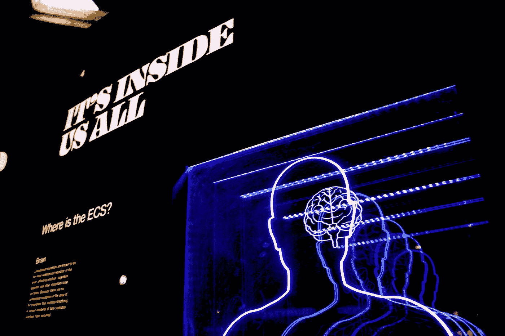

# 我们是如何结束神经网络的:简史

> 原文：<https://medium.com/analytics-vidhya/how-did-we-end-up-with-neural-networks-a-brief-history-606140662bc7?source=collection_archive---------16----------------------->

Bret Kavanaugh 在 [Unsplash](https://unsplash.com?utm_source=medium&utm_medium=referral) 上拍摄的照片

你可能听说过神经网络，你甚至可能用过它们。但是这个机器学习模型是怎么来的呢？有一系列的发明和渐进的步骤导致了我们今天的模型。

## 1847

Louis Augustin Cauchy 概述了一个叫做*梯度下降*的过程来寻找一个多变量函数的最小值。

## 1949

心理学家唐纳德·赫布认为，神经连接在使用时会得到加强，新信息会永久性地改变大脑的细胞结构。他的赫比安网络(Hebbian Network)的想法(T7)将继续应用于人工神经网络。

## 1954

Farley 和 Clark 用计算机器模拟了一个 Hebbian 神经网络。

## 1956

弗兰克·罗森布拉特提出了**感知器**，这是一种使用人工神经元来识别模式的算法。它可以获取输入数据，并确定它是属于一个集合还是另一个集合——这个过程被称为**二元分类**。感知器采用二进制输入 xi(值 0 或 1)和相关权重 wi，然后如下确定输出:

它受到了严重的限制，只能学习线性分离模式，这是一个最好用几何学解释的概念。如果可以在平面上的两组点之间画一条直线，则这两组点是线性可分的。

线性可分的点集

## 1960

航空工程师亨利·j·凯利(Henry J. Kelly)在为美国国家航空航天局(NASA)太空计划工作期间，在他的论文*“最佳飞行路径的梯度理论”*中，在最优化领域取得了进展。这些对于神经网络和 NASA 的太空计划来说都是必不可少的。

## 1961

Arthur E. Bryson 研究了如何将梯度下降算法数字化用于计算机。

## 1969

马文·明斯基和西蒙·派珀特出版了*《感知机》*。在对感知器及其相关主张的分析中，明斯基和帕尔特用数学证明展示了它的一些基本局限性。最著名的是，他们表明，虽然感知器能够学习更简单的布尔函数，但它不能学习异或函数。XOR 函数接受两个布尔输入(真值或假值),当且仅当一个输入为真而另一个为假时输出真。下图说明了为什么感知器不能学习它 XOR 函数的输出不能线性分离。

## 1975

Paul Werbos 发表了**反向传播**算法。这加快了神经网络的学习过程，通过网络的层传播误差，并相应地调整神经元间的权重。

## 1986

三人小组(Rumelhart、Hinton 和 Williams)在神经网络中引入了隐藏层，它不同于输入和输出层，但会影响输出层。

## 2014

IBM 发布了其*真北*处理器，旨在模拟人脑。它有能力实时模拟数百万个神经元和突触。

乔·拉克姆