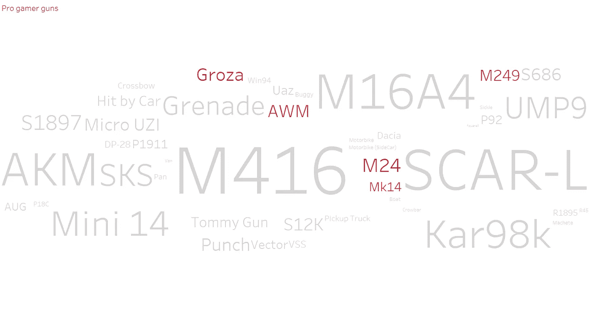

# 业余选手和职业选手玩 PUBG 有什么不同？

> 原文：<https://medium.com/analytics-vidhya/how-do-amateurs-and-pro-players-play-pubg-differently-5a9984fdd188?source=collection_archive---------14----------------------->

在游戏中，你可能认为经验丰富的玩家会比经验不足的玩家玩得更好。这是正确的，但此外，除了游戏体验，还有一些模式可以用来**区分业余玩家和职业玩家**。它们是我在名为 PUBG 的游戏的数据可视化项目中，使用 python 和 tableau 发现的行为。在这种背景下，我将职业选手定义为在回合中排名第一的选手，其余为业余选手。

来源:[https://akm-img-a-in . tosshub . com/sites/btmt/images/stories/pubg _ game _ 660 _ 301020110305 . jpg](https://akm-img-a-in.tosshub.com/sites/btmt/images/stories/pubg_game_660_301020110305.jpg)

PUBG 或 Playerunknown's battlegrounds 是一款在电脑上进行的在线多人皇家战役游戏。在这个游戏中，多达一百名玩家在一个岛上跳伞，在那里他们将找到武器和设备与他人战斗，并保护自己不被杀死。可用的安全区域的大小将会减少，对幸存的玩家久而久之强行遭遇战。最后幸存的玩家将赢得这一轮。团队可以由一个人、两个人或四个人组成。我将使用的数据是来自 kaggle 的“ [PUBG Match 死亡和统计](https://www.kaggle.com/skihikingkevin/pubg-match-deaths)”的数据。

来源:[https://images 2 . minute media cdn . com/image/upload/c _ fill、w_912、h_516、f_auto、q_auto、g _ auto/shape/cover/sport/5 C1 BC 5d 8 a7 ba 462 fc 7000001 . JPEG](https://images2.minutemediacdn.com/image/upload/c_fill,w_912,h_516,f_auto,q_auto,g_auto/shape/cover/sport/5c1bc5d8a7ba462fc7000001.jpeg)

# 长距离步行和骑行

从 PUBG 的数据中可以发现的玩家的第一个行为是对**距离步行和骑行**的洞察。在正常的游戏中，玩家可以选择步行或乘坐任何他们想要的交通工具。

来源:[https://cdn 1 . dote sports . com/WP-content/uploads/2019/02/22181944/截图-2019-02-22-at-6 . 19 . 19-pm . png](https://cdn1.dotesports.com/wp-content/uploads/2019/02/22181944/Screenshot-2019-02-22-at-6.19.19-PM.png)

来源:[https://i0 . WP . com/mundowin . com/WP-content/uploads/2019/06/PUBG-Xbox-one-X-issues . jpg？w=832 & ssl=1](https://i0.wp.com/mundowin.com/wp-content/uploads/2019/06/PUBG-xbox-one-X-issues.jpg?w=832&ssl=1)

这可能看起来不影响游戏的结果，但是在视觉化之后，就可以看到模式。该图显示，在所有游戏模式中，一个人、两个人或四个人，获得更高等级的人将有更高的乘坐百分比，对于排名第一的人来说，该百分比高达大约百分之四十。

# 枪支使用

可以发现的第二个行为是业余选手和职业选手使用枪支的行为。从这两张图来看，大部分用过的枪都差不多，分别是 SCAR-L、一六和 M416。但是红色突出显示的那把**空投枪**，在职业选手中比在业余选手中使用得更多。

举例来说，空投枪是当空投从天空落到随机地点时玩家可以获得的枪，有时他们需要为之战斗，因为空投中的装备和武器比正常的装备和武器更能让玩家受益。

来源:[https://steam user images-a . akamaihd . net/ugc/873000751334779344/d 12 e 44 c 0 DD 82 f 0 ECC 8514 AC 181d 58431 b 728 b5 aa/](https://steamuserimages-a.akamaihd.net/ugc/873000751334779344/D12E44C0DD82F0ECC8514AC181D58431B728B5AA/)

进一步观察**的数字**，柱状图显示业余选手的空投枪使用率不到 1%，而职业选手的使用率大多超过 1%。

为了更清楚，这个红色部分饼图显示了所有空投枪在所有枪中所占的百分比。显而易见，职业玩家比业余玩家使用更多的空投枪。

# 杀人地点

玩家的行为也可以从他们的杀位看出来。由于数据提供了人们杀害他人的地点的 x 和 y 坐标，我使用这些数据在真实的 Erangel 地图上绘制地图，并使用**热图来显示人们杀害他人最多的地方**。在埃兰格尔地图中，自相残杀最多的地区是位于岛中央的**波钦基**、位于南部的**峰**和靠近 **亚斯纳亚波利亚纳**的 **北部的**丘陵地区。****

在米拉马尔地图中，人们互相残杀的区域是佩卡多上方的**和洛斯莱昂斯**东北方向的**密集区。**

深入挖掘数据，我想知道业余选手和职业选手在他们杀的位置上是否有不同的杀人行为。这张地图对比了业余选手和职业选手的**击杀** **地点。如你所见，他们的杀戮区域非常相似。**

> 这些是我对 PUBG 玩家行为的数据可视化，希望你喜欢。你可以点击[这里](https://github.com/amypim/PUBG/blob/main/python%20code.py)来看我这个项目的 python 代码。我将进一步改进我的工作，使可视化更好，希望我能有机会在这里展示它:)