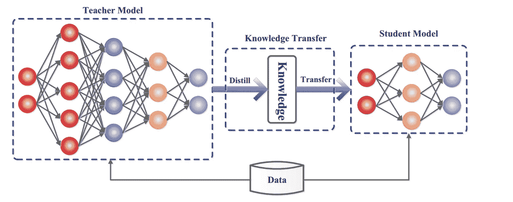

# 我如何减少我的机器学习模型的内存占用！

> 原文：<https://medium.com/analytics-vidhya/how-do-i-reduce-memory-footprint-of-my-machine-learning-model-8af8f4258974?source=collection_archive---------3----------------------->

嵌入式平台上的 DNN 推理

深度神经网络(DNNs)在许多计算机视觉任务中是成功的。明显的废话！然而，最精确的 DNNs 需要数百万个参数和操作，这使得它们是能量、计算和存储器密集型的。[戈尔]

VGG-16 需要 150 亿次运算来对单幅图像进行图像分类。

YOLOv3 执行 390 亿次运算来处理一幅图像。

要在小型嵌入式计算机上部署这样的 dnn，需要进行更多的优化。因此，追求深度学习的低功耗改进以实现高效推理是值得的，也是一个不断增长的研究领域[Alyamkin]。

与 image net 竞赛类似，现在有许多人正在努力寻找能够同时实现计算机视觉高精度和高能效的最佳视觉解决方案。[LPIRC-WEB]

# 挑战

假设你想在边缘设备上进行准确快速的图像识别。这需要几个步骤。

1.  首先，需要建立和训练神经网络模型来识别和分类图像。
2.  然后，模型应该尽可能准确和快速地运行。
3.  大多数神经网络都是在浮点模型上训练的，通常需要转换为定点才能在边缘设备上高效运行
4.  控制功耗

令人着迷的是，已经做了这么多让我们处于这样一个位置的工作，我们将有人工智能模型在你的微波炉里运行等等。在资源受限环境中部署 ML 模型的最新解决方案可分为以下几大类[GOEL]

1.  **参数量化和修剪**:通过减少用于存储 DNN 模型参数的位数，降低内存和计算成本。
2.  **压缩卷积滤波器和矩阵分解**:将较大的 DNN 层分解成较小的层，以减少内存需求和冗余矩阵运算的数量。
3.  **网络架构搜索**:自动构建不同层组合的 DNN，寻找达到期望性能的 DNN 架构。
4.  **知识蒸馏:**训练一个紧凑的 DNN，模仿一个计算量更大的 DNN 的输出、特征和激活。

让我们更深入地了解其中的每一项

# **参数量化和修剪**

XNOR —拉斯特加里

我们举一个例子，50 个卷积层的 ResNet-50 模型在处理一个图像时需要超过 95MB 的内存来存储和超过 38 亿次浮点数乘法。但在丢弃一些冗余权值后，网络仍然照常工作，但节省了 75%以上的参数和 50%的计算时间。使用的技术范围从对参数值应用 k 均值标量量化到权重共享，然后对量化的权重和码本应用霍夫曼编码[YUCHENG]

将此发挥到极致的是每个权重的 1 位表示，即二进制权重神经网络。主要思想是在模型训练期间直接学习**二进制权重或激活。**

那是带 b 的二进制。

有几个作品直接用二进制权重训练 CNN，例如，BinaryConnect [Courbariaux]，BinaryNet 和 XNOR [Rastegari]。

二进制权重，即被限制为仅两个可能值(例如-1 或 1)的权重，通过用简单的累加代替许多乘法-累加操作，将会给专用 DL 硬件带来很大的好处，因为乘法器是神经网络的数字实现中最需要空间和功率的组件。与其他丢弃方案一样，作者表明 BinaryConnect 充当正则化子，并且他们在置换不变 MNIST、CIFAR-10 和 SVHN 上使用 BinaryConnect 获得了接近最新水平的结果。

# **压缩卷积滤波器**

这些方法基于关键的观察，即学习卷积滤波器的权重通常是平滑和低频的，我们首先用离散余弦变换(DCT)将滤波器权重转换到频域，并使用低成本哈希函数将频率参数随机分组到哈希桶中。被分配相同散列桶的所有参数共享用标准反向传播学习的单个值。

# **网络架构搜索**

在尝试 Keras 或 Torch 等深度学习框架时，首先要做的是指定网络架构。你会同意这很大程度上是武断的，至少感觉是如此。我们把它也自动化怎么样？我们肯定会失业，但这难道不令人兴奋吗？

神经架构搜索(NAS)，自动化架构工程的过程，因此是自动化机器学习的合乎逻辑的下一步。到目前为止，NAS 方法在一些任务上已经优于手动设计的架构，例如图像分类(Zoph 等人，2018；Real 等，2019)、物体检测(Zoph 等，2018)或语义分割(陈等，2018)。NAS 可以被视为 AutoML 的子领域(Hutter 等人，2019 年)，与超参数优化(福雷尔和 Hutter，2019 年)和元学习(Vanschoren，2019 年)有显著重叠。[埃尔斯肯]

NAS 的早期版本在架构搜索阶段从头开始训练每个候选的神经架构，导致计算量激增。ENAS 建议使用参数共享策略来加速架构搜索过程。

任调查

人们已经尝试了许多不同的方法，从强化学习到进化算法，来构建这些 NAS 解决方案。[彭真任]

你肯定听说过 Auto-Pytorch？还没有！去看看这个吧，显然是以后了。

# **知识蒸馏**

[郭建平等人](https://arxiv.org/pdf/2006.05525.pdf)

在知识提炼中，一个小的学生模型一般由一个大的老师模型来监督。其主要思想是学生模型模仿教师模型，以获得有竞争力的甚至更好的表现。

当我们谈论知识提炼时，我们想到的一个问题是，当学习参数的空间有限时，我们如何压缩模型，很难看到我们如何改变模型的形式，但保持相同的知识。但是为了解决这个问题，上帝自己——Geoffery hint on 非常简洁地说，需要对知识本身有一个更抽象的看法，一个把它从任何特定的实例化中解放出来的看法，也就是说，它应该被看作是从输入向量到输出向量的习得性映射。

**软目标作为正则化子**

将教师模型的概括能力转移到学生模型的一个明显的方法是使用由教师模型产生的类概率作为训练小模型的“软目标”。对于这个转移阶段，我们可以使用相同的训练集或单独的“转移”集。当教师模型是较简单模型的大集合时，我们可以使用它们各自预测分布的算术或几何平均值作为软目标。当软目标具有高熵时，它们在每个训练案例中提供比硬目标多得多的信息，并且在训练案例之间的梯度中提供少得多的变化，因此学生模型通常可以在比原始笨重模型少得多的数据上训练，并且使用高得多的学习率。[辛顿]

他们关于使用软目标而不是硬目标的一个主要主张是，软目标可以携带许多有用的信息，而这些信息不可能用单个硬目标进行编码。

# 结论

哦，天哪，这原来是一篇相当长的文章。但有趣的是，各种不同的方法是如何被追求并导致一种非常理想的状态，在这种状态下，我们最终不仅节省了我们有限的资源，而且反过来能够在可以进一步加速人工智能系统的增长和传播的情况下部署我们的模型。

让我知道你对此的想法[这里](https://www.linkedin.com/in/abhijeet-pokhriyal-18a7649a/)

# 来源

https://arxiv.org/pdf/2003.11066.pdf(

[Alyamkin](Alyamkin，s .，Ardi，m .，Brighton，a .，Berg，A. C .，Chen，b .，Chen，y .，… Zhuo，S. (2019)。低功耗计算机视觉:现状、挑战、机遇。IEEE 电路与系统新兴和精选专题期刊，1–1。doi:10.1109/jetcas . 1911899)

[LP IRC-WEB](【https://rebootingcomputing.ieee.org/lpirc/2019】T4)

【禹城】([https://arxiv.org/pdf/1710.09282.pdf](https://arxiv.org/pdf/1710.09282.pdf))

[Courbariaux]([https://arxiv.org/pdf/1511.00363.pdf](https://arxiv.org/pdf/1511.00363.pdf)

[拉斯特加里]([https://arxiv.org/pdf/1603.05279.pdf](https://arxiv.org/pdf/1603.05279.pdf))

https://arxiv.org/pdf/1808.05377.pdf

【https://arxiv.org/pdf/2006.02903.pdf 任】()

【辛顿】([https://arxiv.org/pdf/1503.02531.pdf](https://arxiv.org/pdf/1503.02531.pdf))