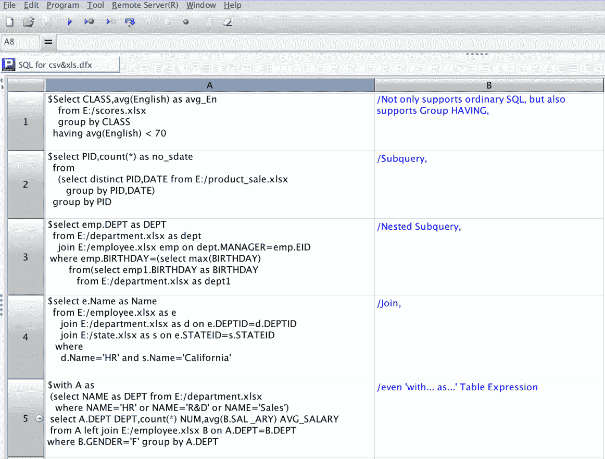
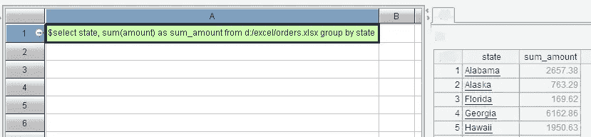
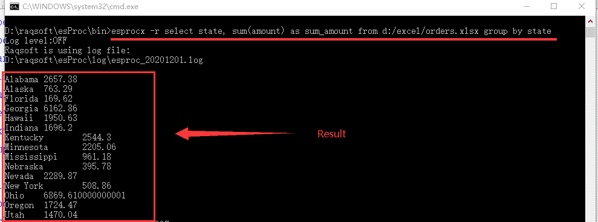
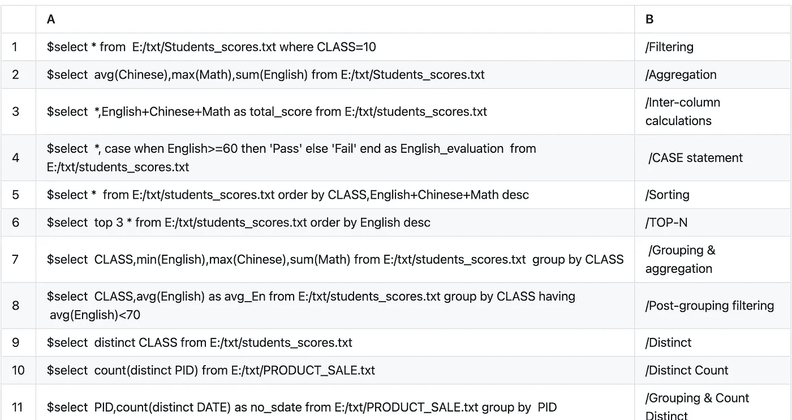
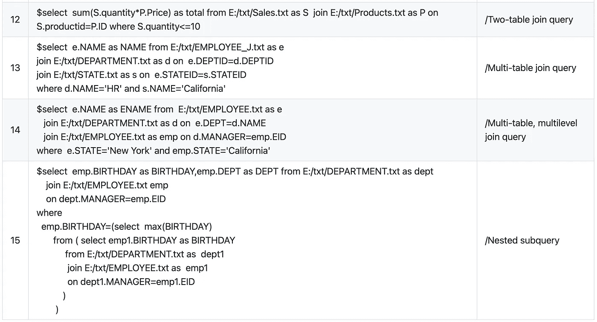

# 如何在 CSV 文件中运行 SQL 查询？

> 原文：<https://medium.com/analytics-vidhya/how-do-i-run-a-sql-query-in-a-csv-file-c0f37cd520d?source=collection_archive---------13----------------------->

如果您的查询非常简单，请使用 csvsql 或 q 命令行工具，它们允许在 CSVs(和任何其他表格文本文件)上直接执行类似 sql 的查询。如果您想要执行更复杂的查询，甚至想要直接查询 excel 文件，请尝试 esProc。

# 如何使用

# 在 esProc 中执行 SQL

您可以轻松地将 SQL 查询结果导出到新的 Excel 文件或文本文件中。

# 在命令行执行 SQL

对于 Windows:

`esprocx -r select state, sum(amount) as sum_amount from d:/excel/orders.xlsx group by state`

对于 Linux:

`esprocx -r select state, sum(amount) as sum_amount from d:/excel/orders.xlsx group by state`

# 例子

esProc 支援 SQL92 标准中的大部分语法。

对于更复杂的场景，请参考[如何在 esProc 中使用 SQL](http://c.raqsoft.com/article/1603680137640)