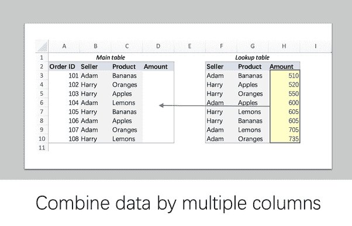
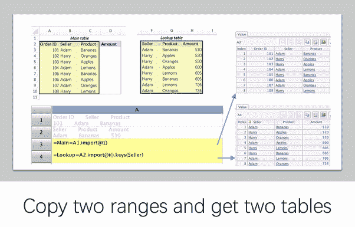
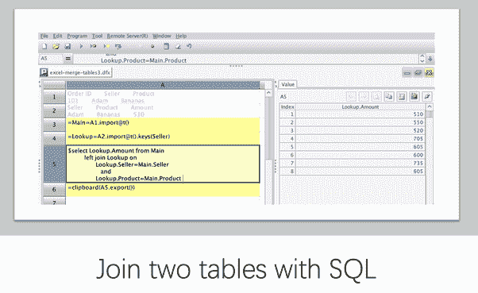
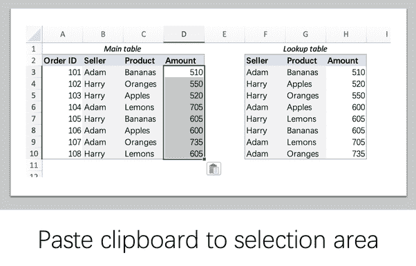

# 如何在 Excel 中使用 SQL 进行数据分析？

> 原文：<https://medium.com/analytics-vidhya/how-do-i-use-sql-with-excel-for-an-analysis-of-data-9306e36446?source=collection_archive---------8----------------------->

例如，假设您有下面两个要合并成一个的表。因为查找表中缺少*订单 ID* 列，所以匹配订单的唯一方法是通过*卖家*和*产品*:

如果你是一个经验丰富的 Excel 专业人士，你可以依靠 vlookup 和指数匹配公式。在大量 Excel 实践经验的帮助下，你知道如何完成工作，但是有时候遇到的任务还是会很困难。如果使用 esProc，用 SQL 简单编码就能轻松完成。

使用 esProc 进行处理的一般程序如下:

*   首先，将 excel 中的数据复制到 esProc 中。使用 import 函数将数据转换为 esProc 内部表。
*   在 esProc 中执行 SQL 并将结果返回到剪贴板。
*   最后，将剪贴板粘贴到相关区域。

具体流程如下:

esProc 支援 SQL92 标准中的大部分语法。更多**复杂场景**请参考[如何在 esProc 中使用 SQL](http://c.raqsoft.com/article/1603680137640)并了解更多关于 [esProc 和 SPL](http://www.raqsoft.com/p/script-over-csv-xls)