# 神经网络在深度学习中究竟是如何工作的？

> 原文：<https://medium.com/analytics-vidhya/how-do-neural-networks-really-work-in-the-deep-learning-72f0e8c4c419?source=collection_archive---------5----------------------->

# **深度学习介绍:**

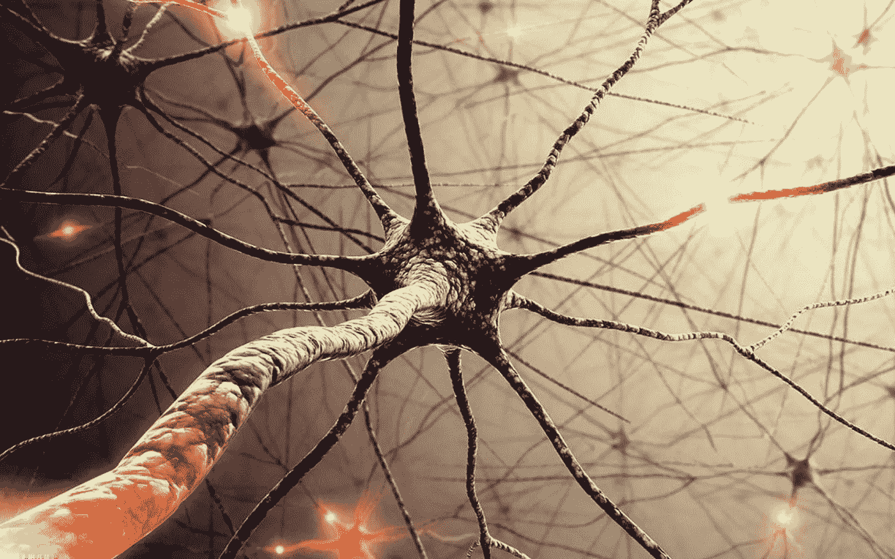

作为人工智能的一个子集，深度学习位于各种创新的核心:自动驾驶汽车、自然语言处理、图像识别等等。

AI vs ML vs DL

深度学习是机器学习的子集之一，它使用深度学习算法，根据输入数据隐式地得出重要的结论。

通常，深度学习是无监督或半监督的。深度学习基于[表征学习](https://en.wikipedia.org/wiki/Feature_learning#:~:text=In%20machine%20learning%2C%20feature%20learning,or%20classification%20from%20raw%20data.)。它不是使用特定于任务的算法，而是从有代表性的例子中学习。例如，如果您想要建立一个按物种识别猫的模型，您需要准备一个包含大量不同猫图像的数据库。

深度学习的主要架构有:

*   卷积神经网络
*   递归神经网络
*   生成对抗网络
*   递归神经网络

我们将在本文后面更详细地讨论它们。

# 机器学习和深度学习的区别

机器学习试图从加载到系统中的大量预处理数据中提取新知识。程序员需要为机器制定规则，机器根据这些规则进行学习。有时，人类可能会介入来纠正它的错误。

然而，深度学习有点不同:

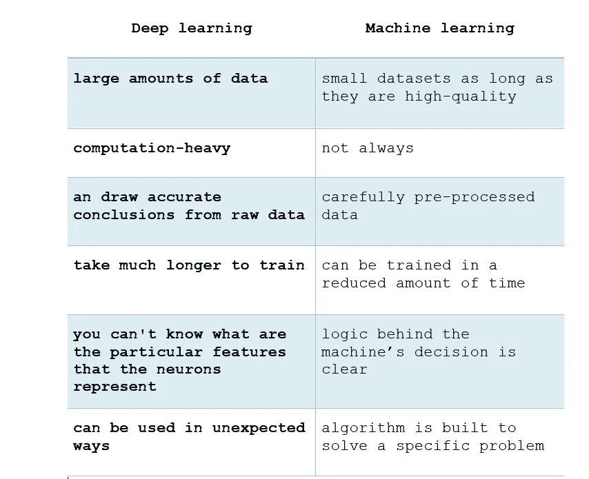

ML vs DL

# 什么是人工神经网络？

“人工神经网络”和“深度学习”经常互换使用，这并不真正正确。不是所有的神经网络都是“深度的”，意思是“有很多隐藏层”，也不是所有的深度学习架构都是神经网络。例如，也有[深度信念网络](https://en.wikipedia.org/wiki/Deep_belief_network#:~:text=In%20machine%20learning%2C%20a%20deep,between%20units%20within%20each%20layer.)。

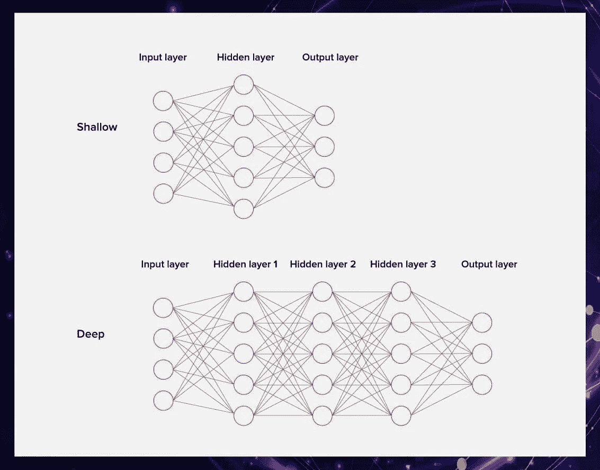

然而，由于神经网络是目前最热门的算法，事实上，它对于解决复杂的任务非常有用，我们将在这篇文章中讨论它们。

# 人工神经网络的定义

人工神经网络代表在计算机上模拟的人脑结构。它由组织成层的神经元和突触组成。

人工神经网络可以将数百万个神经元连接到一个系统中，这使得它在分析甚至记忆各种信息方面非常成功。

这里有一个视频，适合那些想更深入地了解人工神经网络如何工作的技术细节的人。

# 神经网络的组件

> 有不同类型的神经网络，但它们总是由相同的组件组成:**神经元、突触、权重、偏差和功能。**

# 神经元

神经元或节点是神经网络的基本单位，它接收信息，执行简单的计算，并进一步传递信息。

网络中的所有神经元分为三组:

*   从外界接收信息的输入神经元；
*   处理信息的隐藏神经元；
*   产生结论的输出神经元。

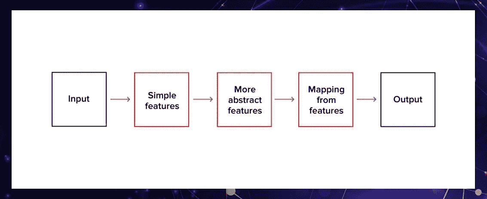

在具有许多神经元和神经元之间的连接的大型神经网络中，神经元被组织成层。有一个接收信息的输入层、许多隐藏层和提供有价值结果的输出层。每个神经元对输入信息进行转换。

神经元只处理[0，1]或[-1，1]范围内的数字。为了将数据转化为神经元可以处理的东西，我们需要标准化。

等等，但是神经元是怎么交流的呢？通过突触。

# 突触和重量

突触像电缆一样连接着神经元。每个突触都有重量。权重也增加了输入信息的变化。权重较大的神经元的结果将在下一个神经元中占主导地位，而来自权重较小的神经元的信息将不会被忽略。可以说，权重矩阵控制着整个神经系统。

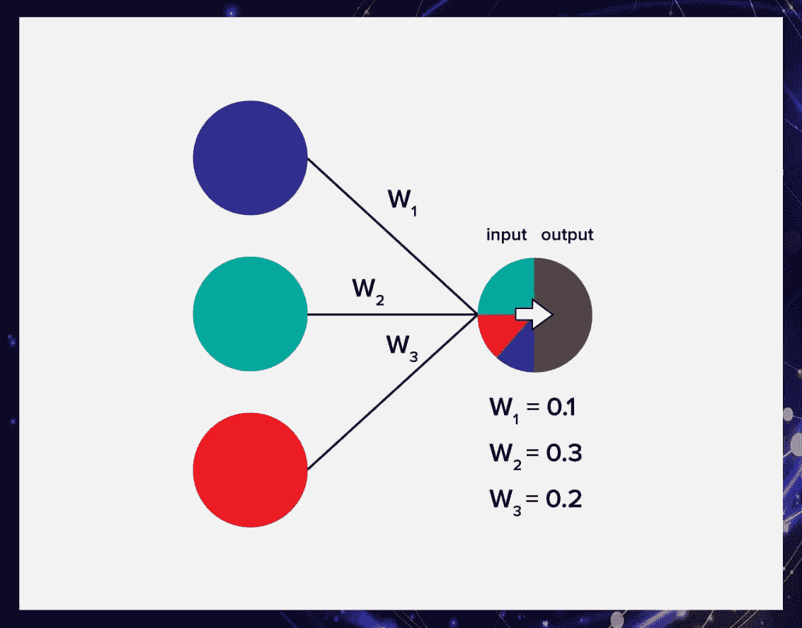

怎么知道哪个神经元的权重最大？在初始化过程中(第一次启动神经网络)，权重是随机分配的，但随后你必须优化它们。

# 偏见

偏置神经元允许存储更多的权重变化。偏差为模型权重添加了更丰富的输入空间表示。

在神经网络的情况下，一个偏置神经元被添加到每一层。它通过使激活功能在图表上向左或向右移动而发挥重要作用。

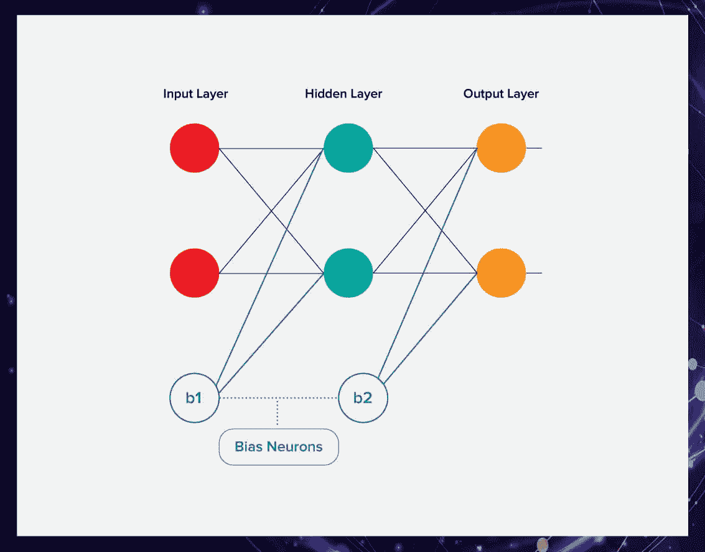

的确，人工神经网络可以在没有偏向神经元的情况下工作。然而，它们几乎总是被添加进来，并作为整体模型中不可或缺的一部分。

# 人工神经网络如何工作

每个神经元处理输入数据以提取特征。让我们想象一下，我们有三个特征和三个神经元，每个都与所有这些特征相连。

每个神经元都有自己的权重，用于对特征进行加权。在训练网络的过程中，你需要为每个神经元选择这样的权重，使得整个网络提供的输出是真实的。

为了执行转换并获得输出，每个神经元都有一个激活功能。这种函数组合执行一种由普通函数 F 描述的变换——这描述了神经网络魔力背后的公式。

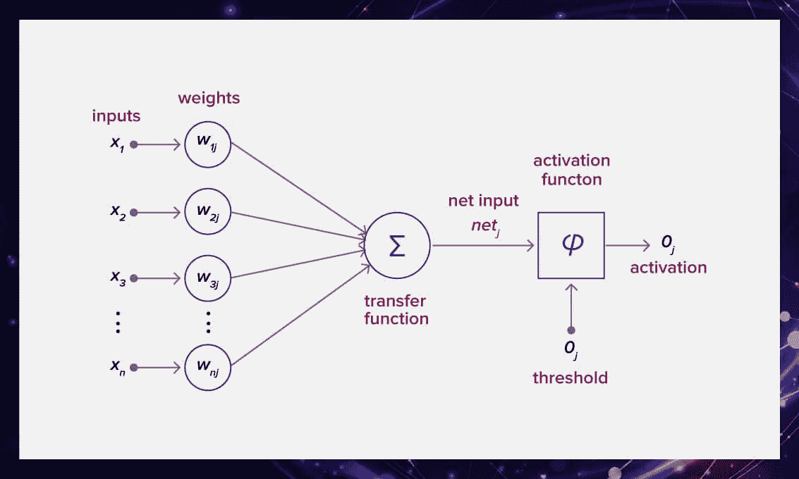

有很多激活功能。最常见的有[线性、sigmoid 和双曲线正切](/wwblog/transformation-in-neural-networks-cdf74cbd8da8)。他们的主要区别是他们使用的价值观的范围。

# 你如何训练一个算法？

神经网络像任何其他算法一样被训练。你想得到一些结果，并提供信息给网络学习。例如，我们希望我们的神经网络能够区分猫和狗的照片，并提供大量的例子。

Delta 是数据和神经网络输出之间的差值。我们使用微积分魔法，反复优化网络的权重，直到 delta 为零。一旦 delta 为零或接近于零，我们的模型就能够正确地预测我们的示例数据。

## 循环

这是一种计数器，每当神经网络通过一个训练集时，它就会增加。换句话说，这是神经网络完成的训练集的总数。

## 世

每次我们遍历整个训练集时，历元都会增加。纪元越多，模型的训练越好。

## 一批

批量大小等于一次向前/向后传递中训练样本的数量。批量越大，需要的内存空间就越大。

迭代和纪元的区别是什么？

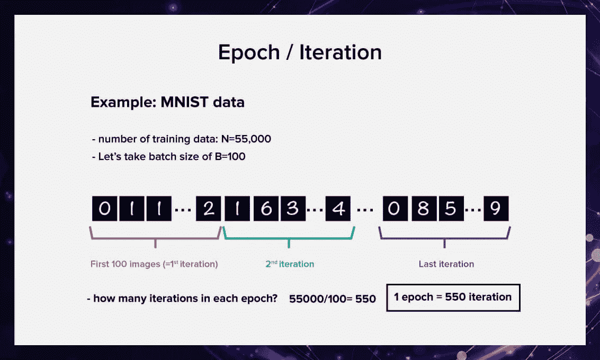

*   一个历元是所有训练样本的一个正向传递和一个反向传递；
*   迭代次数是指通过的次数，每次通过都使用[批次大小]数量的示例。明确一下，一次传球等于一次向前传球+一次向后传球(我们不把向前传球和向后传球算作两次不同的传球)。

# 那么错误呢？

误差是反映预期输出和接收输出之间差异的偏差。在每个时期之后，误差应该变得更小。如果这没有发生，那么你做错了。

误差可以用不同的方法计算，但我们只考虑两种主要方法:反正切和均方误差。

使用哪种方法没有限制，您可以自由选择哪种方法可以获得最佳结果。但是每种方法计算误差的方式不同:

*   使用 Arctan，误差几乎总是更大。

> arctan 2(i1 a1)+…+arctan 2(in an)narct an 2(i1 a1)+…+arctan 2(in an)n

*   MSE 更平衡，使用更频繁。

> (i1 a1)2+(I2 a2)2+…+(in an)2n(i1 a1)2+(I2 a2)2+…+(in an)2n

# 存在哪种神经网络？

存在如此多不同的神经网络，以至于不可能一一提及。如果你想了解更多关于这一品种的信息，请访问神经网络动物园，在那里你可以看到它们都被图形化了。

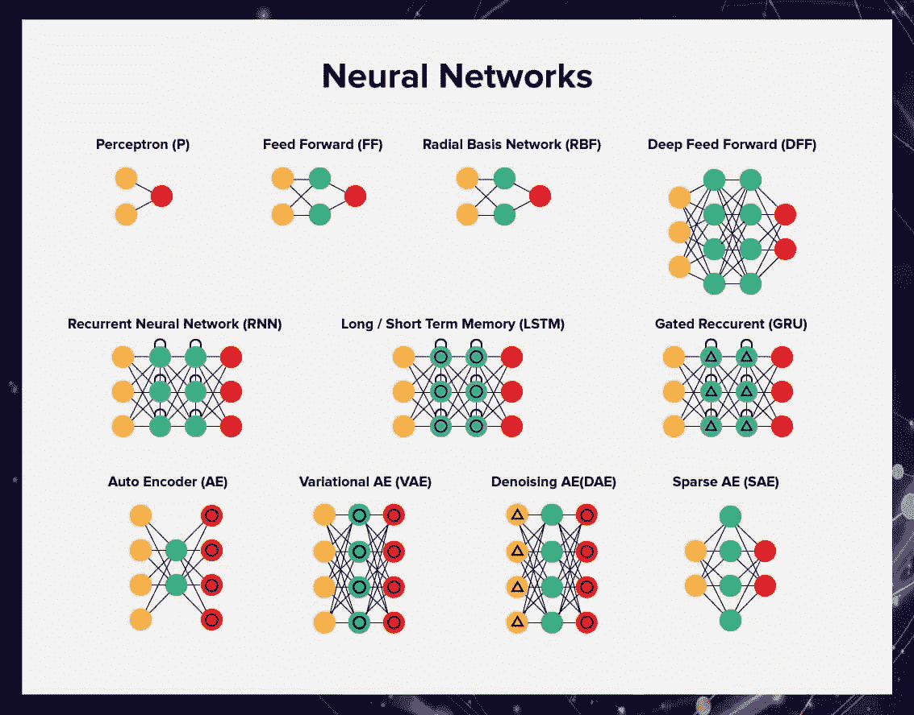

# 前馈神经网络

这是最简单的神经网络算法。前馈网络没有任何记忆。也就是说，在前馈网络中没有回头路。在许多任务中，这种方法不太适用。例如，当我们处理文本时，单词形成了一定的序列，我们希望机器能够理解它。

当您处理的数据不是顺序的或时间相关的时，前馈神经网络可以应用于监督学习。如果您不知道输出应该如何构造，但希望构建一个相对快速简单的神经网络，也可以使用它。

# 递归神经网络

递归神经网络可以处理文本、视频或图像集，每次都变得更加精确，因为它记住了上一次迭代的结果，并可以使用这些信息做出更好的决策。

递归神经网络广泛应用于自然语言处理和语音识别。

# 卷积神经网络

卷积神经网络是当今深度机器学习的标准，用于解决大多数问题。卷积神经网络可以是前馈的，也可以是递归的。

让我们看看它们是如何工作的。想象一下我们有一张阿尔伯特·爱因斯坦的照片。我们可以给输入图像中的所有像素分配一个神经元。

但是这里有一个很大的问题:如果你把每个神经元连接到所有像素，那么，首先，你会得到很多权重。因此，这将是一个计算量非常大的操作，需要很长时间。那么，权重会非常多，这种方法对过拟合会非常不稳定。它将在训练样本上很好地预测一切，但在其他图像上效果很差。

因此，程序员想出了一种不同的架构，其中每个神经元只连接到图像中的一个小方块。所有这些神经元将具有相同的权重，这种设计被称为图像卷积。我们可以说，我们已经改变了画面，用一个简化过程的过滤器走过了画面。重量更轻，计数更快，不容易过度拟合。

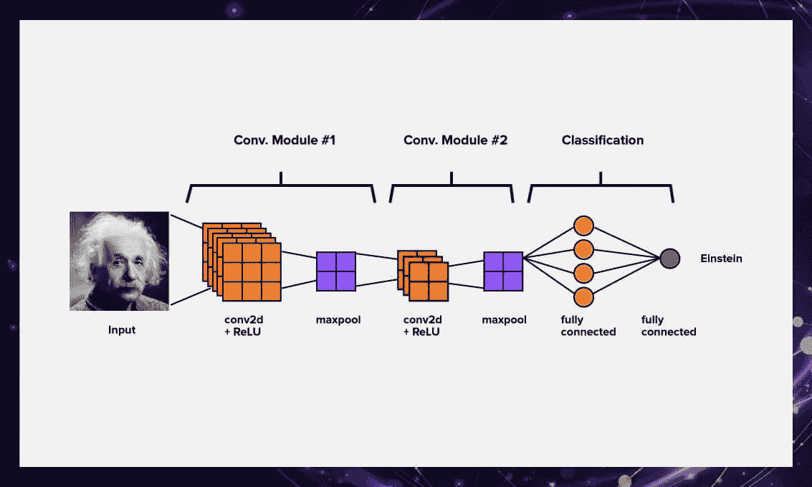

想要了解卷积神经网络如何工作的精彩解释，请观看 Luis Serrano 的视频。

# 生成对抗性神经网络

生成对抗网络是一种无监督的机器学习算法，它是两个神经网络的组合，其中一个(网络 G)生成模式，另一个(网络 A)试图区分真实样本和虚假样本。由于网络有相反的目标——创造样本和拒绝样本——它们开始了一场对抗性的游戏，结果证明非常有效。

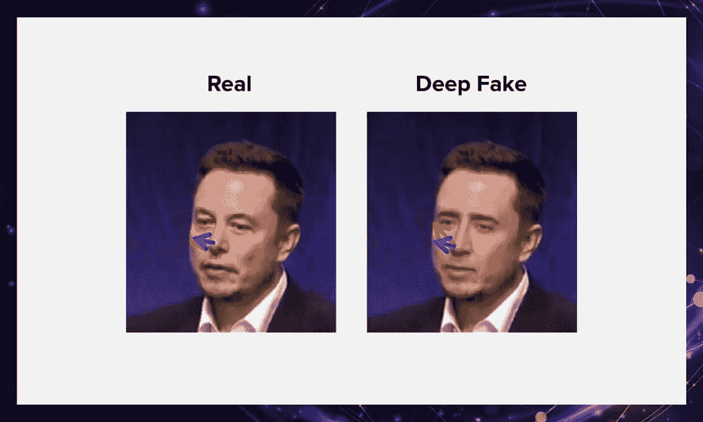

例如，GANs 被用于生成被人眼感知为自然图像或深度假像的照片(真实的人在视频中说和做他们在现实生活中从未做过的事情)。

# NNs 解决什么样的问题？

神经网络用于解决需要类似于人脑的分析计算的复杂问题。神经网络最常见的用途是:

*   **分类。** NNs 通过隐式分析数据的参数将数据分类。例如，神经网络可以分析银行客户的参数，如年龄、偿付能力、信用记录，并决定是否贷款给他们。
*   **预言。**算法有预测能力。例如，它可以根据股票市场的情况预测股票的上涨或下跌。
*   **认可。**这是目前神经网络最广泛的应用。例如，安全系统可以使用面部识别，只让授权的人进入大楼。

# 摘要

深度学习和神经网络是扩展人类智能和技能的有用技术。神经网络只是深度学习架构的一种类型。然而，它们已经变得广为人知，因为神经网络可以有效地解决各种各样的任务，并且比其他算法更好地处理它们。

如果你想了解更多关于机器学习的知识，请继续阅读我的博客:

1.  **音频数据扩充:**[https://vijay-anandan . medium . com/lets-augment-a-Audio-Data-part-1-5a b5 f 6a 87 BAE](https://vijay-anandan.medium.com/lets-augment-a-audio-data-part-1-5ab5f6a87bae)
2.  **语音数据的情感分析:**[https://vijay-anandan . medium . com/personance-Analysis-of-Voice-Data-64533 a 952617](https://vijay-anandan.medium.com/sentiment-analysis-of-voice-data-64533a952617)
3.  **对极度不平衡的数据集进行重采样:**[https://vijay-anandan . medium . com/how-to-re-sample-an-unbalanced-datasets-8e 413 dabb 21](https://vijay-anandan.medium.com/how-to-resample-an-imbalanced-datasets-8e413dabbc21)

**领英:**[https://www.linkedin.com/in/vijay-anadan/](https://www.linkedin.com/in/vijay-anadan/)